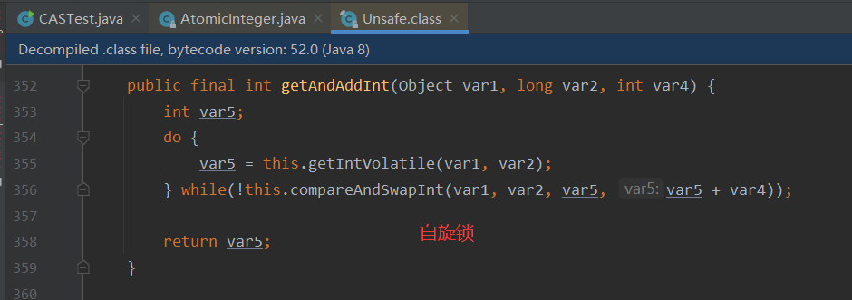

### 1、什么是JUC


三个包。

### 2、线程和进程

#### 2.1 进程和线程

进程：一个程序，比如QQ.exe。一个进程可以包含多个线程，至少包含一个。

Java默认有两个线程：main线程和gc线程。

Java不能开启线程，实际是调用native方法

```java
public synchronized void start() {
        /**
         * This method is not invoked for the main method thread or "system"
         * group threads created/set up by the VM. Any new functionality added
         * to this method in the future may have to also be added to the VM.
         *
         * A zero status value corresponds to state "NEW".
         */
        if (threadStatus != 0)
            throw new IllegalThreadStateException();

        /* Notify the group that this thread is about to be started
         * so that it can be added to the group's list of threads
         * and the group's unstarted count can be decremented. */
        group.add(this);

        boolean started = false;
        try {
            start0();
            started = true;
        } finally {
            try {
                if (!started) {
                    group.threadStartFailed(this);
                }
            } catch (Throwable ignore) {
                /* do nothing. If start0 threw a Throwable then
                  it will be passed up the call stack */
            }
        }
    }

	// native方法，C/C++
    private native void start0();
```

#### 2.2 并发和并行

并发：多个线程操作同一个资源。**目的就是为了充分利用CPU的资源**

- 单核，模拟出来多个线程，交替运行，因为cpu速度很快，看起来是同时运行。

并行：多个线程同时运行

- 多核，多个线程同时运行。

#### 2.3 线程的状态

```java
	public enum State {
        // 新生
        NEW,

        // 运行
        RUNNABLE,

        // 阻塞
        BLOCKED,

        // 等待，如果不被唤醒，就一直等待
        WAITING,

        // 超时等待，设置的时间到了就自动唤醒
        TIMED_WAITING,

        // 终止
        TERMINATED;
    }
```

#### 2.4 wait/sleep的区别

**（1）来自不同的类**

wait => Object

sleep => Thread

**（2）关于锁的释放**

wait释放锁，sleep抱着锁睡觉，所以是不会释放锁的。

**（3）使用的范围是不同的**

wait必须使用在同步代码块中，sleep可以使用在任何地方。

**（4）是否需要捕获异常**

sleep必须要捕获异常，wait不需要。

### 3、Lock锁

#### 3.1 synchronized

```java
public class BuyTicket {
    public static void main(String[] args) {
        Ticket ticket = new Ticket();

        new Thread(() -> { for (int i = 1; i < 40; i++) { ticket.sale(); } }, "A").start();
        new Thread(() -> { for (int i = 1; i < 40; i++) { ticket.sale(); } }, "B").start();
        new Thread(() -> { for (int i = 1; i < 40; i++) { ticket.sale(); } }, "C").start();
    }
}

class Ticket {
    private int num = 50;

    public synchronized void sale() {
        if (num > 0) {
            System.out.println(Thread.currentThread().getName() + "卖出了第" + (num--) + "张票，还剩" + num + "张票");
        }
    }
}
```

使用synchronized关键字解决多线程买票的问题。

#### 3.2 Lock接口

根据jdk文档：https://www.matools.com/api/java8


ReentrantLock是比较常用的锁。


创建ReentrantLock的时候，如果不传入参数，则默认是非公平锁。

**非公平锁**：可以插队。

**公平锁**：不能插队，先来先执行。

```java
import java.util.concurrent.locks.Lock;
import java.util.concurrent.locks.ReentrantLock;

public class BuyTicket2 {
    public static void main(String[] args) {
        Ticket2 ticket = new Ticket2();

        new Thread(() -> { for (int i = 1; i < 40; i++) { ticket.sale(); } }, "A").start();
        new Thread(() -> { for (int i = 1; i < 40; i++) { ticket.sale(); } }, "B").start();
        new Thread(() -> { for (int i = 1; i < 40; i++) { ticket.sale(); } }, "C").start();
    }
}

class Ticket2 {
    private int num = 50;

    // 1、创建锁对象
    Lock lock = new ReentrantLock();

    public void sale() {
        // 2、加锁
        lock.lock();
        try {
            if (num > 0) {
                System.out.println(Thread.currentThread().getName() + "卖出了第" + (num--) + "张票，还剩" + num + "张票");
            }
        } catch (Exception e) {
            e.printStackTrace();
        } finally {
            // 3、释放锁
            lock.unlock();
        }
    }
}
```

#### 3.3 synchronized和Lock锁的区别

（1）synchronized是Java的关键字，而Lock是Java类。

（2）synchronized无法判断和获取锁的状态，Lock可以判断是否获取到了锁。

（3）synchronized会自动释放锁，Lock需要手动释放，不然会发生死锁。

（4）synchronized 线程1（获取到锁；阻塞），线程2（会一直等待下去），Lock可以使用tryLock方法尝试获取锁，获取不到就不等了。

（5）synchronized可重入、不可中断、非公平锁；Lock可重入，可以判断锁，可以设置非公平锁或者公平锁。

（6）synchronized适合锁少量的同步代码，Lock适合锁大量的同步代码。

### 4、生产者消费者问题

#### 4.1 synchronized版

```java
public class PCSynchronized {
    public static void main(String[] args) {
        PC pc = new PC();
        new Thread(() -> {
            for (int i = 0; i < 10; i++) {
                try {
                    pc.increment();
                } catch (InterruptedException e) {
                    e.printStackTrace();
                }
            }
        }, "A").start();

        new Thread(() -> {
            for (int i = 0; i < 10; i++) {
                try {
                    pc.decrement();
                } catch (InterruptedException e) {
                    e.printStackTrace();
                }
            }
        }, "B").start();
    }
}

class PC {
    private int num = 0;

    // 生产者生产
    public synchronized void increment() throws InterruptedException {
        if (num != 0) {
            this.wait();
        }

        num++;
        System.out.println(Thread.currentThread().getName() + "=>" + num);
        this.notifyAll();
    }

    // 消费者消费
    public synchronized void decrement() throws InterruptedException {
        if (num == 0) {
            this.wait();
        }

        num--;
        System.out.println(Thread.currentThread().getName() + "=>" + num);
        this.notifyAll();
    }
}
```

如果增加一个线程当生产者，增加一个线程当消费者，此时就有两个生产者两个消费者，那么上面的代码就会出问题。

```java
A=>1
B=>0
A=>1
B=>0
A=>1
B=>0
A=>1
B=>0
A=>1
B=>0
A=>1
B=>0
A=>1
B=>0
C=>1
A=>2
C=>3
B=>2
B=>1
B=>0
C=>1
A=>2
C=>3
D=>2
D=>1
D=>0
C=>1
A=>2
C=>3
D=>2
D=>1
D=>0
C=>1
D=>0
C=>1
D=>0
C=>1
D=>0
C=>1
D=>0
```

根据官方文档，Object->wait方法


存在**虚假唤醒**的可能。**wait会释放锁**。在上面的代码中，A、C线程为生产者，B、D线程为消费者。num值为1时，A线程进入方法执行加1操作，然后唤醒对象的所有线程，此时B、C、D都被唤醒。可能发现下面这种情况：那就是C进入方法，发现num值为1，调用wait方法进行等待，释放锁，A线程又进入方法，发现num不为0，也进行等待。B、D线程消费完后，唤醒所有线程，A、C被唤醒，都执行num++操作，那么num的值就会不正确。

所以把if判断改为while判断就可以解决问题。

```java
public class PCSynchronized {
    public static void main(String[] args) {
        PC pc = new PC();
        new Thread(() -> {
            for (int i = 0; i < 10; i++) {
                try {
                    pc.increment();
                } catch (InterruptedException e) {
                    e.printStackTrace();
                }
            }
        }, "A").start();

        new Thread(() -> {
            for (int i = 0; i < 10; i++) {
                try {
                    pc.decrement();
                } catch (InterruptedException e) {
                    e.printStackTrace();
                }
            }
        }, "B").start();

        // 两个线程生产，两个线程消费
        new Thread(() -> {
            for (int i = 0; i < 10; i++) {
                try {
                    pc.increment();
                } catch (InterruptedException e) {
                    e.printStackTrace();
                }
            }
        }, "C").start();

        new Thread(() -> {
            for (int i = 0; i < 10; i++) {
                try {
                    pc.decrement();
                } catch (InterruptedException e) {
                    e.printStackTrace();
                }
            }
        }, "D").start();
    }
}

class PC {
    private int num = 0;

    // 生产者生产
    public synchronized void increment() throws InterruptedException {
        while (num != 0) {
            // 会释放锁
            this.wait();
        }

        num++;
        System.out.println(Thread.currentThread().getName() + "=>" + num);
        this.notifyAll();
    }

    // 消费者消费
    public synchronized void decrement() throws InterruptedException {
        while (num == 0) {
            this.wait();
        }

        num--;
        System.out.println(Thread.currentThread().getName() + "=>" + num);
        this.notifyAll();
    }
}
```

#### 4.2 Lock版


```java
import java.util.concurrent.locks.Condition;
import java.util.concurrent.locks.Lock;
import java.util.concurrent.locks.ReentrantLock;

public class PCLock {
    public static void main(String[] args) {
        PC2 pc = new PC2();

        new Thread(() -> {
            for (int i = 0; i < 10; i++) {
                try {
                    pc.increment();
                } catch (InterruptedException e) {
                    e.printStackTrace();
                }
            }
        }, "A").start();

        new Thread(() -> {
            for (int i = 0; i < 10; i++) {
                try {
                    pc.decrement();
                } catch (InterruptedException e) {
                    e.printStackTrace();
                }
            }
        }, "B").start();

        // 两个线程生产，两个线程消费
        new Thread(() -> {
            for (int i = 0; i < 10; i++) {
                try {
                    pc.increment();
                } catch (InterruptedException e) {
                    e.printStackTrace();
                }
            }
        }, "C").start();

        new Thread(() -> {
            for (int i = 0; i < 10; i++) {
                try {
                    pc.decrement();
                } catch (InterruptedException e) {
                    e.printStackTrace();
                }
            }
        }, "D").start();
    }
}

class PC2 {
    private int num = 0;
    Lock lock = new ReentrantLock();
    Condition condition = lock.newCondition();

    public void increment() throws InterruptedException {
        lock.lock();
        try {
            while (num != 0) {
                // 等待
                condition.await();
            }
            num++;
            System.out.println(Thread.currentThread().getName() + "=>" + num);
            // 唤醒
            condition.signalAll();
        } catch (InterruptedException e) {
            e.printStackTrace();
        } finally {
            lock.unlock();
        }
    }

    public void decrement() throws InterruptedException {
        lock.lock();
        try {
            while (num == 0) {
                // 等待
                condition.await();
            }
            num--;
            System.out.println(Thread.currentThread().getName() + "=>" + num);
            // 唤醒
            condition.signalAll();
        } catch (InterruptedException e) {
            e.printStackTrace();
        } finally {
            lock.unlock();
        }
    }
}
```


#### 4.3 Condition精准的通知和唤醒线程

```java
/**
 * Condition精准唤醒线程
 */
public class TestCondition {
    public static void main(String[] args) {
        Order order = new Order();
        new Thread(() -> {
            for (int i = 0; i < 10; i++) {
                order.A();
            }
        }, "A").start();
        new Thread(() -> {
            for (int i = 0; i < 10; i++) {
                order.B();
            }
        }, "B").start();
        new Thread(() -> {
            for (int i = 0; i < 10; i++) {
                order.C();
            }
        }, "C").start();
    }
}

class Order {
    private int num = 1;
    private Lock lock = new ReentrantLock();
    private Condition condition1 = lock.newCondition();
    private Condition condition2 = lock.newCondition();
    private Condition condition3 = lock.newCondition();

    public void A() {
        lock.lock();
        try {
            while (num != 1) {
                condition1.await();
            }

            System.out.println(Thread.currentThread().getName());
            num = 2;
            // 唤醒B线程
            condition2.signal();
        } catch (Exception e) {
            e.printStackTrace();
        } finally {
            lock.unlock();
        }
    }

    public void B() {
        lock.lock();
        try {
            while (num != 2) {
                condition2.await();
            }

            System.out.println(Thread.currentThread().getName());
            num = 3;
            // 唤醒C线程
            condition3.signal();
        } catch (Exception e) {
            e.printStackTrace();
        } finally {
            lock.unlock();
        }
    }

    public void C() {
        lock.lock();
        try {
            while (num != 3) {
                condition3.await();
            }

            System.out.println(Thread.currentThread().getName());
            num = 1;
            // 唤醒A线程
            condition1.signal();
        } catch (Exception e) {
            e.printStackTrace();
        } finally {
            lock.unlock();
        }
    }
}
```

不同的线程使用不同的Condition对象，需要唤醒某个线程的时候，使用该线程的Condition.signal()方法。

### 5、八锁现象

```java
/**
 *
 * 1、先调用发短信的方法，sleep 1s再调用打电话的方法，输出：发短信 打电话
 * 2、发短信的方法里sleep 4s，两个线程先后调用方法，输出：发短信 打电话
 *
 * 总结：synchronized锁的是类的对象，两个线程使用的同一个类对象实例，共用一把锁，
 * A线程先调用sendSms方法拿到锁，即使sleep 4s，也会先执行再释放锁，然后轮到B线程执行
 */
public class Test1 {
    public static void main(String[] args) {
        Phone phone = new Phone();

        new Thread(() -> {
            phone.sendSms();
        }, "A").start();

        try {
            TimeUnit.SECONDS.sleep(1);
        } catch (InterruptedException e) {
            e.printStackTrace();
        }

        new Thread(() -> {
            phone.call();
        }, "B").start();
    }
}

class Phone {
    public synchronized void sendSms() {
        try {
            TimeUnit.SECONDS.sleep(4);
        } catch (InterruptedException e) {
            e.printStackTrace();
        }
        System.out.println("发短信");
    }

    public synchronized void call() {
        System.out.println("打电话");
    }
}
```

```java
/**
 * 增加一个普通方法hello
 * 1、先调用发短信的方法，sleep 1s再调用hello的方法，输出：hello 发短信
 * 2、用Phone2两个不同的实例对象，两个线程先后调用方法，输出：打电话 发短信
 *
 * 总结：1、不是同步方法，不受锁的影响，不需要排队。
 *      2、不同的实例对象，锁之间互不影响
 */
public class Test2 {
    public static void main(String[] args) {
        Phone2 phone1 = new Phone2();
        Phone2 phone2 = new Phone2();

        new Thread(() -> {
            phone1.sendSms();
        }, "A").start();

        try {
            TimeUnit.SECONDS.sleep(1);
        } catch (InterruptedException e) {
            e.printStackTrace();
        }

        new Thread(() -> {
            phone2.call();
        }, "B").start();
    }
}

class Phone2 {
    public synchronized void sendSms() {
        try {
            TimeUnit.SECONDS.sleep(4);
        } catch (InterruptedException e) {
            e.printStackTrace();
        }
        System.out.println("发短信");
    }

    public synchronized void call() {
        System.out.println("打电话");
    }

    // 这里不是同步方法，没有锁，不受锁的影响
    public void hello() {
        System.out.println("hello");
    }
}
```

```java
/**
 * 1、两个静态方法，一个实例对象，输出：发短信 打电话
 * 2、两个静态方法，两个实例对象，输出：发短信 打电话
 *
 * 总结：静态方法，在类没有实例化的时候就已经存在，所以锁的是类模板即class对象，
 * 对于类来说这是唯一的，即使是不同的实例对象
 */
public class Test3 {
    public static void main(String[] args) {
        Phone3 phone1 = new Phone3();
        Phone3 phone2 = new Phone3();

        new Thread(() -> {
            phone1.sendSms();
        }, "A").start();

        try {
            TimeUnit.SECONDS.sleep(1);
        } catch (InterruptedException e) {
            e.printStackTrace();
        }

        new Thread(() -> {
            phone2.call();
        }, "B").start();
    }
}

class Phone3 {
    public static synchronized void sendSms() {
        try {
            TimeUnit.SECONDS.sleep(4);
        } catch (InterruptedException e) {
            e.printStackTrace();
        }
        System.out.println("发短信");
    }

    public static synchronized void call() {
        System.out.println("打电话");
    }
}
```

```java
/**
 * 1、一个静态同步方法，一个普通同步方法，一个实例对象，输出：打电话 发短信
 * 2、一个静态同步方法，一个普通同步方法，两个实例对象，输出：打电话 发短信
 *
 * 总结：静态同步方法锁的是class对象，普通同步方法锁的是实例对象
 */
public class Test4 {
    public static void main(String[] args) {
        Phone4 phone1 = new Phone4();
        Phone4 phone2 = new Phone4();

        new Thread(() -> {
            phone1.sendSms();
        }, "A").start();

        try {
            TimeUnit.SECONDS.sleep(1);
        } catch (InterruptedException e) {
            e.printStackTrace();
        }

        new Thread(() -> {
            phone2.call();
        }, "B").start();
    }
}

class Phone4 {
    public static synchronized void sendSms() {
        try {
            TimeUnit.SECONDS.sleep(4);
        } catch (InterruptedException e) {
            e.printStackTrace();
        }
        System.out.println("发短信");
    }

    public synchronized void call() {
        System.out.println("打电话");
    }
}
```

**总结**

普通同步方法：new 具体的一个对象

静态同步方法：class 唯一的类模板

### 6、不安全的集合类

#### 6.1 不安全的List

```java
public class TestList {
    public static void main(String[] args) {
        /**
         * ArrayList并发不安全，报错java.util.ConcurrentModificationException
         *
         * 解决方法：
         * 1、使用Vector类
         * 2、使用Collections.synchronizedList
         * 3、使用COW
         */
        // List<String> list = new ArrayList<>();
        // List<String> list = new Vector<>();
        // List<String> list = Collections.synchronizedList(new ArrayList<>());
        List<String> list = new CopyOnWriteArrayList<>();

        for (int i = 1; i <= 10; i++) {
            new Thread(() -> {
                list.add(UUID.randomUUID().toString().substring(0, 5));
                System.out.println(list);
            }, String.valueOf(i)).start();
        }
    }
}
```

对于ArrayList的add方法，源码如下

```java

    /**
     * Appends the specified element to the end of this list.
     *
     * @param e element to be appended to this list
     * @return <tt>true</tt> (as specified by {@link Collection#add})
     */
    public boolean add(E e) {
        ensureCapacityInternal(size + 1);  // Increments modCount!!
        elementData[size++] = e;
        return true;
    }
```

Vector类的add方法源码如下，使用synchronized来保证线程安全。

```java

    /**
     * Appends the specified element to the end of this Vector.
     *
     * @param e element to be appended to this Vector
     * @return {@code true} (as specified by {@link Collection#add})
     * @since 1.2
     */
    public synchronized boolean add(E e) {
        modCount++;
        ensureCapacityHelper(elementCount + 1);
        elementData[elementCount++] = e;
        return true;
    }
```


CopyOnWriteArrayList类的add方法如下，使用Lock保证线程安全。

```java

    /**
     * Appends the specified element to the end of this list.
     *
     * @param e element to be appended to this list
     * @return {@code true} (as specified by {@link Collection#add})
     */
    public boolean add(E e) {
        final ReentrantLock lock = this.lock;
        lock.lock();
        try {
            Object[] elements = getArray();
            int len = elements.length;
            Object[] newElements = Arrays.copyOf(elements, len + 1);
            newElements[len] = e;
            setArray(newElements);
            return true;
        } finally {
            lock.unlock();
        }
    }
```

#### 6.2 不安全的Set

```java
public class TestSet {
    public static void main(String[] args) {
        /**
         * HashSet线程不安全：java.util.ConcurrentModificationException
         * 解决方法：
         * 1、Collections.synchronizedSet
         * 2、CopyOnWriteArraySet
         */
        // Set<String> set = new HashSet<>();
        // Set<String> set = Collections.synchronizedSet(new HashSet<>());
        Set<String> set = new CopyOnWriteArraySet<>();
        for (int i = 1; i <= 30; i++) {
            new Thread(() -> {
                set.add(UUID.randomUUID().toString().substring(0, 5));
                System.out.println(set);
            }, String.valueOf(i)).start();
        }
    }
}
```

​	HashSet底层使用的是HashMap

```java

    /**
     * Constructs a new, empty set; the backing <tt>HashMap</tt> instance has
     * default initial capacity (16) and load factor (0.75).
     */
    public HashSet() {
        map = new HashMap<>();
    }
```

HashSet的元素其实就是HashMap的键，所以HashSet的值不能重复并且允许有一个值为null，无序的。

```java

    /**
     * Adds the specified element to this set if it is not already present.
     * More formally, adds the specified element <tt>e</tt> to this set if
     * this set contains no element <tt>e2</tt> such that
     * <tt>(e==null&nbsp;?&nbsp;e2==null&nbsp;:&nbsp;e.equals(e2))</tt>.
     * If this set already contains the element, the call leaves the set
     * unchanged and returns <tt>false</tt>.
     *
     * @param e element to be added to this set
     * @return <tt>true</tt> if this set did not already contain the specified
     * element
     */
    public boolean add(E e) {
        return map.put(e, PRESENT)==null;
    }

	// Dummy value to associate with an Object in the backing Map
    private static final Object PRESENT = new Object();
```

#### 6.3 不安全的Map


```java
public class TestMap {
    public static void main(String[] args) {
        /**
         * HashMap线程不安全：java.util.ConcurrentModificationException
         * 解决方法：
         * 1、Collections.synchronizedMap
         * 2、ConcurrentHashMap
         */
        Map<String, String> map = new HashMap<>();
        // Map<String, String> map = Collections.synchronizedMap(new HashMap<>());
        // Map<String, String> map = new ConcurrentHashMap<>();

        for (int i = 1; i <= 30; i++) {
            new Thread(() -> {
                map.put(Thread.currentThread().getName(), UUID.randomUUID().toString().substring(0, 5));
                System.out.println(map);
            }, String.valueOf(i)).start();
        }
    }
}
```

HashMap不带参的构造方法，默认是16的初始容量和0.75的加载因子。

```java

    /**
     * Constructs an empty <tt>HashMap</tt> with the default initial capacity
     * (16) and the default load factor (0.75).
     */
    public HashMap() {
        this.loadFactor = DEFAULT_LOAD_FACTOR; // all other fields defaulted
    }
```

### 7、Callable


（1）可以有返回值

（2）可以抛出异常

（3）call方法


```java
public class TestCallable implements Callable<Boolean> {
    @Override
    public Boolean call() throws Exception {
        System.out.println("我是" + Thread.currentThread().getName());
        return true;
    }

    public static void main(String[] args) throws ExecutionException, InterruptedException {
        TestCallable thread = new TestCallable();
        FutureTask task = new FutureTask(thread);
        // 调用两次，只打印一次，说明结果会被缓存
        new Thread(task, "A").start();
        new Thread(task, "B").start();
        // get方法可能会产生阻塞。把它放到最后，或者使用异步通信的方式
        Boolean res = (Boolean) task.get();
        System.out.println(res);
    }
}
```

### 8、常用的辅助类

#### 8.1 CountDownLatch


```java
public class TestCountDownLatch {
    public static void main(String[] args) {
        CountDownLatch countDownLatch = new CountDownLatch(10);

        for (int i = 1; i <= 10; i++) {
            new Thread(() -> {
                System.out.println(Thread.currentThread().getName() + " go out");
                // 数值减1
                countDownLatch.countDown();
            }, String.valueOf(i)).start();
        }

        try {
            // 相当于门栓一样，线程执行完都先到这里集合，
            // 只有等计时器的值为0的时候，才把门栓打开，所有线程才能往下走
            countDownLatch.await();
        } catch (InterruptedException e) {
            e.printStackTrace();
        }

        System.out.println("Close door");
    }
}
```

`countDownLatch.countDown()`计数减1

`countDownLatch.await()`等待计数器归零，然后继续往下走

每次有线程调用countDown()数量减1，假设计数器变为0，countDownLatch.await();就会被唤醒，继续执行。

#### 8.2 CyclicBarrier


```java
public class TestCyclicBarrier {
    public static void main(String[] args) {
        CyclicBarrier cyclicBarrier = new CyclicBarrier(7, () -> {
            System.out.println("召唤神龙成功");
        });

        for (int i = 1; i <= 7; i++) {
            // 在lambda里面是拿不到i的值的，因为相当于new了一个新的对象
            final int temp = i;
            new Thread(() -> {
                System.out.println(Thread.currentThread().getName() + "集齐了第" + temp + "颗龙珠");
                try {
                    cyclicBarrier.await();
                } catch (InterruptedException e) {
                    e.printStackTrace();
                } catch (BrokenBarrierException e) {
                    e.printStackTrace();
                }
            }, String.valueOf(i)).start();
        }
    }
}
```

#### 8.3 Semaphore


```java
public class TestSemaphore {
    public static void main(String[] args) {
        // 构造参数为线程数量，还可以选择是否公平
        // 用来限流
        Semaphore semaphore = new Semaphore(3);

        for (int i = 1; i <= 6; i++) {
            new Thread(() -> {
                try {
                    // 获取许可证
                    semaphore.acquire();
                    System.out.println(Thread.currentThread().getName() + "抢到车位");
                    TimeUnit.SECONDS.sleep(2);
                    System.out.println(Thread.currentThread().getName() + "离开车位");
                } catch (InterruptedException e) {
                    e.printStackTrace();
                } finally {
                    // 释放许可证
                    semaphore.release();
                }

            }, String.valueOf(i)).start();
        }
    }
}
```

`semaphore.acquire();`获得许可证，如果没有许可证可以获取，则等待其他线程释放许可证。

`semaphore.release();`释放，会将当前的信号量+1，然后唤醒等待的线程。

### 9、读写锁ReadWriteLock


多个线程可以同时读，但同一时刻只能有一个线程执行写操作。

```java
import java.util.HashMap;
import java.util.Map;
import java.util.concurrent.locks.ReadWriteLock;
import java.util.concurrent.locks.ReentrantReadWriteLock;

/**
 * 读写锁 ReadWriteLock，相比于Lock，可以提供更细粒度的锁
 * 独占锁（写锁）一次只能被一个线程占有
 * 共享锁（读锁）可以同时被多个线程占有
 * 读-读 可以共享
 * 读-写 不能共享
 * 写-写 不能共享
 */
public class TestReadWriteLock {
    public static void main(String[] args) {
        MyCache myCache = new MyCache();
        MyCacheLock myCacheLock = new MyCacheLock();

        for (int i = 1; i <= 5; i++) {
            final int temp = i;
            new Thread(() -> {
                myCacheLock.write(temp + "", temp);
            }, String.valueOf(i)).start();
        }

        for (int i = 1; i <= 5; i++) {
            final int temp = i;
            new Thread(() -> {
                myCacheLock.read(temp + "");
            }, String.valueOf(i)).start();
        }
    }
}

/**
 * 2写入2
 * 4写入4
 * 1写入1
 * 1写入完成
 * 4写入完成
 * 3写入3
 * 5写入5
 * 5写入完成
 * 2写入完成
 * 3写入完成
 * 1读取1
 * 2读取2
 * 2读取完成
 * 1读取完成
 * 3读取3
 * 5读取5
 * 4读取4
 * 3读取完成
 * 4读取完成
 * 5读取完成
 */
class MyCache {
    private volatile Map<String, Object> map = new HashMap<>();

    public void write(String key, Object value) {
        System.out.println(Thread.currentThread().getName() + "写入" + value);
        map.put(key, value);
        System.out.println(Thread.currentThread().getName() + "写入完成");
    }

    public void read(String key) {
        System.out.println(Thread.currentThread().getName() + "读取" + key);
        Object value = map.get(key);
        System.out.println(Thread.currentThread().getName() + "读取完成");
    }
}

/**
 * 1写入1
 * 1写入完成
 * 2写入2
 * 2写入完成
 * 3写入3
 * 3写入完成
 * 4写入4
 * 4写入完成
 * 5写入5
 * 5写入完成
 * 2读取2
 * 2读取完成
 * 4读取4
 * 3读取3
 * 3读取完成
 * 1读取1
 * 5读取5
 * 1读取完成
 * 4读取完成
 * 5读取完成
 */
class MyCacheLock {
    private volatile Map<String, Object> map = new HashMap<>();
    // 读写锁：更细粒度的控制
    private ReadWriteLock readWriteLock = new ReentrantReadWriteLock();

    public void write(String key, Object value) {
        // 写锁，一次只有一个线程能够进来写
        readWriteLock.writeLock().lock();
        try {
            System.out.println(Thread.currentThread().getName() + "写入" + value);
            map.put(key, value);
            System.out.println(Thread.currentThread().getName() + "写入完成");
        } catch (Exception e) {
            e.printStackTrace();
        } finally {
            readWriteLock.writeLock().unlock();
        }
    }

    public void read(String key) {
        // 读锁，可以多个线程一起读
        readWriteLock.readLock().lock();
        try {
            System.out.println(Thread.currentThread().getName() + "读取" + key);
            Object value = map.get(key);
            System.out.println(Thread.currentThread().getName() + "读取完成");
        } catch (Exception e) {
            e.printStackTrace();
        } finally {
            readWriteLock.readLock().unlock();
        }
    }
}
```

### 10、阻塞队列BlockingQueue


什么情况下使用阻塞队列：多线程并发处理，线程池。

四组api：抛出异常、不抛出异常、阻塞等待、超时等待。

| 方式       | 抛出异常  | 有返回值，不抛出异常 | 阻塞等待 | 超时等待     |
| :--------- | :-------: | :------------------: | -------- | ------------ |
| 添加       |   add()   |       offer()        | put()    | offer( , , ) |
| 移除       | remove()  |        poll()        | take()   | poll( , )    |
| 判断队列首 | element() |        peek()        | -        | -            |

```java
	/**
     * 抛出异常
     */
	public static void test1() {
        // 初始化一个容量为3的阻塞队列
        BlockingQueue<Integer> blockingQueue = new ArrayBlockingQueue<>(3);

        System.out.println(blockingQueue.add(1));
        System.out.println(blockingQueue.add(2));
        System.out.println(blockingQueue.add(3));

        // java.lang.IllegalStateException: Queue full
        // blockingQueue.add(4);

        System.out.println(blockingQueue.remove());
        System.out.println(blockingQueue.remove());
        System.out.println(blockingQueue.remove());

        // java.util.NoSuchElementException
        // blockingQueue.remove();
    }
```

```java
	/**
     * 不抛出异常
     */
	public static void test2() {
        // 初始化一个容量为3的阻塞队列
        BlockingQueue<Integer> blockingQueue = new ArrayBlockingQueue<>(3);

        System.out.println(blockingQueue.offer(1));
        System.out.println(blockingQueue.offer(2));
        System.out.println(blockingQueue.offer(3));
        // 返回false，不抛出异常
        System.out.println(blockingQueue.offer(4));

        System.out.println(blockingQueue.poll());
        System.out.println(blockingQueue.poll());
        System.out.println(blockingQueue.poll());
        // 返回null，不抛出异常
        System.out.println(blockingQueue.poll());
    }
```

```java
	/**
     * 阻塞，一直等待
     */
    public static void test3() {
        // 初始化一个容量为3的阻塞队列
        BlockingQueue<Integer> blockingQueue = new ArrayBlockingQueue<>(3);

        try {
            blockingQueue.put(1);
            blockingQueue.put(2);
            blockingQueue.put(3);
            // 阻塞，一直等，直到队列有位置为止
            // blockingQueue.put(4);

            // take() 检索并删除此队列的头
            System.out.println(blockingQueue.take());
            System.out.println(blockingQueue.take());
            System.out.println(blockingQueue.take());
            // 阻塞，一直等，直到队列头存在为止
            // System.out.println(blockingQueue.take());
        } catch (InterruptedException e) {
            e.printStackTrace();
        }
    }	
```

```java
	/**
     * 阻塞，超时等待
     */
    public static void test4() {
        // 初始化一个容量为3的阻塞队列
        BlockingQueue<Integer> blockingQueue = new ArrayBlockingQueue<>(3);

        try {
            System.out.println(blockingQueue.offer(1));
            System.out.println(blockingQueue.offer(2));
            System.out.println(blockingQueue.offer(3));
            // 等待2s后如果还没有位置就返回fasle，不等了
            System.out.println(blockingQueue.offer(4, 2, TimeUnit.SECONDS));

            System.out.println(blockingQueue.poll());
            System.out.println(blockingQueue.poll());
            System.out.println(blockingQueue.poll());
            // 等待2s后队列头还不存在，则返回null
            System.out.println(blockingQueue.poll(2, TimeUnit.SECONDS));
        } catch (InterruptedException e) {
            e.printStackTrace();
        }
    }
```

> SynchronousQueue 同步队列


```java
/**
 * 同步队列 SynchronousQueue不存储元素
 * put一个元素进去后，必须等另一个线程take出来，才能再put进去
 */
public class TestSynchronousQueue {
    public static void main(String[] args) {
        BlockingQueue<Integer> queue = new SynchronousQueue<>();

        new Thread(() -> {
            try {
                System.out.println(Thread.currentThread().getName() + " put 1");
                queue.put(1);

                System.out.println(Thread.currentThread().getName() + " put 2");
                queue.put(2);

                System.out.println(Thread.currentThread().getName() + " put 3");
                queue.put(3);
            } catch (InterruptedException e) {
                e.printStackTrace();
            }
        }, "A").start();

        new Thread(() -> {
            try {
                TimeUnit.SECONDS.sleep(3);
                System.out.println(Thread.currentThread().getName() + "=>" + queue.take());

                TimeUnit.SECONDS.sleep(3);
                System.out.println(Thread.currentThread().getName() + "=>" + queue.take());

                TimeUnit.SECONDS.sleep(3);
                System.out.println(Thread.currentThread().getName() + "=>" + queue.take());
            } catch (InterruptedException e) {
                e.printStackTrace();
            }

        }, "B").start();
    }
}
```

### 11、线程池

线程池：三大方法、七大参数、四种拒绝策略。

#### 11.1 池化技术

线程池的好处：

（1）降低资源的消耗。

（2）提高响应的速度。

（3）更方便管理。

**线程复用、可以控制最大并发数、管理线程。**

#### 11.2 三大方法


```java
import java.util.concurrent.ExecutorService;
import java.util.concurrent.Executors;

public class TestExecutors {
    public static void main(String[] args) {
        // 单个线程的线程池
        // ExecutorService threadPool = Executors.newSingleThreadExecutor();
        // 指定数量的线程池
        // ExecutorService threadPool = Executors.newFixedThreadPool(5);
        // 可伸缩的线程池
        ExecutorService threadPool = Executors.newCachedThreadPool();

        try {
            for (int i = 0; i < 10; i++) {
                threadPool.execute(() -> {
                    System.out.println(Thread.currentThread().getName() + " ok");
                });
            }
        } catch (Exception e) {
            e.printStackTrace();
        } finally {
            threadPool.shutdown();
        }
    }
}
```

#### 11.3 七大参数

```java
public static ExecutorService newSingleThreadExecutor() {
    return new FinalizableDelegatedExecutorService
        (new ThreadPoolExecutor(1, 1,
                                0L, TimeUnit.MILLISECONDS,
                                new LinkedBlockingQueue<Runnable>()));
}

public static ExecutorService newFixedThreadPool(int nThreads) {
    return new ThreadPoolExecutor(nThreads, nThreads,
                                  0L, TimeUnit.MILLISECONDS,
                                  new LinkedBlockingQueue<Runnable>());
}

public static ExecutorService newCachedThreadPool() {
    return new ThreadPoolExecutor(0, Integer.MAX_VALUE,
                                  60L, TimeUnit.SECONDS,
                                  new SynchronousQueue<Runnable>());
}

public ThreadPoolExecutor(int corePoolSize, 
                          int maximumPoolSize, 
                          long keepAliveTime,
                          TimeUnit unit,
                          BlockingQueue<Runnable> workQueue) {
    this(corePoolSize, maximumPoolSize, keepAliveTime, unit, workQueue,
         Executors.defaultThreadFactory(), defaultHandler);
}

public ThreadPoolExecutor(int corePoolSize,  // 核心线程池大小
                          int maximumPoolSize,  // 最大核心线程池大小
                          long keepAliveTime,  // 线程存活时间，超时没调用就会释放
                          TimeUnit unit,  // 超时单位
                          BlockingQueue<Runnable> workQueue,  // 阻塞队列
                          ThreadFactory threadFactory,  // 线程工厂，创建线程
                          RejectedExecutionHandler handler) { // 拒绝策略
    if (corePoolSize < 0 ||
        maximumPoolSize <= 0 ||
        maximumPoolSize < corePoolSize ||
        keepAliveTime < 0)
        throw new IllegalArgumentException();
    if (workQueue == null || threadFactory == null || handler == null)
        throw new NullPointerException();
    this.corePoolSize = corePoolSize;
    this.maximumPoolSize = maximumPoolSize;
    this.workQueue = workQueue;
    this.keepAliveTime = unit.toNanos(keepAliveTime);
    this.threadFactory = threadFactory;
    this.handler = handler;
}
```


> 手动创建一个线程池，模拟银行办理业务的场景

```java
import java.util.concurrent.*;

/**
 * 线程池超过最大承载，对于四种拒绝策略：
 * （1）ThreadPoolExecutor.AbortPolicy()：抛出异常 java.util.concurrent.RejectedExecutionException
 * （2）ThreadPoolExecutor.DiscardPolicy()：阻塞队列满了，直接把多余的任务丢弃，不会抛异常
 * （3）ThreadPoolExecutor.DiscardOldestPolicy()：阻塞队列满了，尝试和最早的任务竞争，不会抛异常
 * （4）ThreadPoolExecutor.CallerRunsPolicy()：阻塞队列满了，多余的任务交给调用线程去执行，这里是main线程。main is ok
 */
public class PoolTest {
    public static void main(String[] args) {
        ExecutorService pool = new ThreadPoolExecutor(2,
                                                      5,
                                                      3,
                                                      TimeUnit.SECONDS,
                                                      new LinkedBlockingQueue<>(3),
                                                      Executors.defaultThreadFactory(),
                                                      new ThreadPoolExecutor.AbortPolicy());

        try {
            // 最大承载queue.size + maximumPoolSize
            // 超过最大承载，四种不同的拒绝策略有不同的处理
            for (int i = 1; i <= 20; i++) {
                pool.execute(() -> {
                    System.out.println(Thread.currentThread().getName() + " is ok");
                });
            }
        } catch (Exception e) {
            e.printStackTrace();
        } finally {
            pool.shutdown();
        }
    }
}
```

#### 11.4 四种拒绝策略

```java
（1）ThreadPoolExecutor.AbortPolicy()：抛出异常 java.util.concurrent.RejectedExecutionException
（2）ThreadPoolExecutor.DiscardPolicy()：阻塞队列满了，直接把多余的任务丢弃，不会抛异常
（3）ThreadPoolExecutor.DiscardOldestPolicy()：阻塞队列满了，尝试和最早的任务竞争，不会抛异常
（4）ThreadPoolExecutor.CallerRunsPolicy()：阻塞队列满了，多余的任务交给调用线程去执行，这里是main线程。main is ok
```

#### 11.5 小结

线程池的最大容量如何确定？

CPU密集型和IO密集型（调优）

CPU密集型：服务器有几核，线程池的最大容量就定位多少，这样能最大程度利用资源。     `Runtime.getRuntime().availableProcessors();`获取服务器的核数

IO密集型：线程池的最大容量 > 程序中十分耗IO的线程的数量，这样就有剩余的线程去执行不耗IO的任务

```java
public class PoolTest {
    public static void main(String[] args) {
        /**
         * 线程池的最大容量怎么确定？
         * CPU密集型和IO密集型
         * CPU密集型：服务器有几核，线程池的最大容量就定位多少，这样能最大程度利用资源。
         *           Runtime.getRuntime().availableProcessors();获取服务器的核数
         * IO密集型：线程池的最大容量 > 程序中十分耗IO的线程的数量，这样就有剩余的线程去执行不耗IO的任务
         */
        ExecutorService pool = new ThreadPoolExecutor(2,
                                                      Runtime.getRuntime().availableProcessors(),
                                                      3,
                                                      TimeUnit.SECONDS,
                                                      new LinkedBlockingQueue<>(3),
                                                      Executors.defaultThreadFactory(),
                                                      new ThreadPoolExecutor.DiscardOldestPolicy());

        try {
            // 最大承载queue.size + maximumPoolSize
            // 超过最大承载，四种不同的拒绝策略有不同的处理
            for (int i = 1; i <= 20; i++) {
                pool.execute(() -> {
                    System.out.println(Thread.currentThread().getName() + " is ok");
                });
            }
        } catch (Exception e) {
            e.printStackTrace();
        } finally {
            pool.shutdown();
        }
    }
}
```

### 12、四大函数式接口

lambda表达式、链式编程、函数式接口、Stream流式计算

只有一个方法的接口，即为函数式接口。@FunctionalInterface注解修饰.

```java
@FunctionalInterface
public interface Runnable {
    public abstract void run();
}
```


> 函数型接口Function


```java
public class FunctionTest {
    public static void main(String[] args) {
        Function<String, String> function = new Function<String, String>() {
            @Override
            public String apply(String o) {
                return o;
            }
        };

        System.out.println(function.apply("Hello World!"));

        Function<String, String> function1 = str -> {return str;};

        System.out.println(function1.apply("Hello World!"));
    }
}
```

> 断定型接口Predicate


```java
public class PredicateTest {
    public static void main(String[] args) {
        Predicate<String> predicate = new Predicate<String>() {
            @Override
            public boolean test(String s) {
                return s.isEmpty();
            }
        };

        System.out.println(predicate.test(""));
        
        Predicate<String> res = str -> {return str.isEmpty();};
        System.out.println(res.test(""));
    }
}
```

> 消费型接口Consumer


```java
public class ConsumerTest {
    public static void main(String[] args) {
        Consumer<String> consumer = new Consumer<String>() {
            @Override
            public void accept(String s) {
                System.out.println(s);
            }
        };

        consumer.accept("aaa");

        consumer = str -> {System.out.println(str);};

        consumer.accept("bbb");
    }
}
```

> 供给型接口Supplier


```java
public class SupplierTest {
    public static void main(String[] args) {
        Supplier<Integer> supplier = new Supplier<Integer>() {
            @Override
            public Integer get() {
                return 1024;
            }
        };

        System.out.println(supplier.get());

        supplier = () -> {return 1024;};

        System.out.println(supplier.get());
    }
}
```

### 13、Stream流式计算


```java
/**
 * 5个用户进行筛选
 * 1、ID为偶数
 * 2、年龄大于23岁
 * 3、用户名转为大写字母
 * 4、用户名字母倒着排序
 * 5、只输出一个用户
 */
public class StreamTest {
    public static void main(String[] args) {
        User user1 = new User(1, "a", 20);
        User user2 = new User(2, "b", 21);
        User user3 = new User(3, "c", 24);
        User user4 = new User(4, "d", 25);
        User user5 = new User(5, "e", 26);
        User user6 = new User(6, "f", 27);

        ArrayList<User> list = new ArrayList<>(Arrays.asList(user1, user2, user3, user4, user5, user6));

        list.stream().
                filter(user -> user.getId() % 2 == 0).
                filter(user -> user.getAge() > 23).
                map(user -> {
                    user.setName(user.getName().toUpperCase());
                    return user;
                }).
                sorted((u1, u2) -> u2.getName().compareTo(u1.getName())).
                limit(1).
                collect(Collectors.toList()).
                forEach(System.out::println);
    }
}

class User {
    private int id;
    private String name;
    private int age;

    User(int id, String name, int age) {
        this.id = id;
        this.name = name;
        this.age = age;
    }

    public int getId() {
        return id;
    }

    public void setId(int id) {
        this.id = id;
    }

    public String getName() {
        return name;
    }

    public void setName(String name) {
        this.name = name;
    }

    public int getAge() {
        return age;
    }

    public void setAge(int age) {
        this.age = age;
    }

    @Override
    public String toString() {
        return "id = " + id + ", name = " + name + ", age = " + age;
    }
}
```

### 14、ForkJoin

ForkJoin在jdk1.7，并行执行任务，可以把一个大任务拆分为几个子任务，提高效率。


> ForkJoin的特点：工作窃取


双端队列，B执行完自己的任务后，可以去拿A的任务执行。

> ForkJoin测试

```java
public class ForkJoinTest extends RecursiveTask<Long> {

    private long start;
    private long end;

    // 临界值，如果end - start > temp，则使用forkjoin进行任务分解。
    private Long temp = 10000L;

    public ForkJoinTest(long start, long end) {
        this.start = start;
        this.end = end;
    }

    @Override
    protected Long compute() {
        if ((end - start) <= temp) {
            Long sum = 0L;
            for (long i = start; i <= end; i++) {
                sum += i;
            }

            return sum;
        }

        long mid = (end + start) / 2;
        ForkJoinTest task1 = new ForkJoinTest(start, mid);
        // 拆分任务，把任务加入线程队列
        task1.fork();
        ForkJoinTest task2 = new ForkJoinTest(mid + 1, end);
        // 拆分任务，把任务加入线程队列
        task2.fork();

        return task1.join() + task2.join();
    }
}
```

```java
import java.util.concurrent.ExecutionException;
import java.util.concurrent.ForkJoinPool;
import java.util.concurrent.ForkJoinTask;
import java.util.stream.LongStream;

public class Test {
    public static void main(String[] args) {
        // sum = 500000000500000000, 时间 = 10233
        // test1();

        // sum = 500000000500000000, 时间 = 2968
        // test2();

        // sum = 500000000500000000, 时间 = 237
        test3();
    }

    public static void test1() {
        Long sum = 0L;
        long start = System.currentTimeMillis();
        for (Long i = 1L; i <= 10_0000_0000; i++) {
            sum += i;
        }
        long end = System.currentTimeMillis();

        System.out.println("sum = " + sum + ", 时间 = " + (end - start));
    }

    public static void test2() {
        Long sum = 0L;
        long start = System.currentTimeMillis();
        ForkJoinPool forkJoinPool = new ForkJoinPool();
        ForkJoinTest task = new ForkJoinTest(0L, 10_0000_0000L);
        ForkJoinTask<Long> res = forkJoinPool.submit(task);

        try {
            sum = res.get();
        } catch (InterruptedException e) {
            e.printStackTrace();
        } catch (ExecutionException e) {
            e.printStackTrace();
        }
        long end = System.currentTimeMillis();

        System.out.println("sum = " + sum + ", 时间 = " + (end - start));
    }

    public static void test3() {
        Long sum = 0L;
        long start = System.currentTimeMillis();
        // [0L, 10_0000_0000L]
        sum = LongStream.rangeClosed(0L, 10_0000_0000L).parallel().reduce(0, Long::sum);
        long end = System.currentTimeMillis();

        System.out.println("sum = " + sum + ", 时间 = " + (end - start));
    }
}
```

### 15、JMM

JMM就是Java内存模型(java memory model)。因为在不同的硬件生产商和不同的操作系统下，内存的访问有一定的差异，所以会造成相同的代码运行在不同的系统上会出现各种问题。所以**java内存模型(JMM)屏蔽掉各种硬件和操作系统的内存访问差异，以实现让java程序在各种平台下都能达到一致的并发效果。**

Java内存模型规定**所有的变量都存储在主内存**中，包括实例变量，静态变量，但是不包括局部变量和方法参数。每个线程都有自己的工作内存，**线程的工作内存保存了该线程用到的变量和主内存的副本拷贝，线程对变量的操作都在工作内存中进行**。**线程不能直接读写主内存中的变量**。

不同的线程之间也无法访问对方工作内存中的变量。线程之间变量值的传递均需要通过主内存来完成。


每个线程的工作内存都是独立的，线程操作数据只能在工作内存中进行，然后刷回到主存。这是 Java 内存模型定义的线程基本工作方式。

整个Java内存模型实际上是围绕着三个特征建立起来的。分别是：原子性，可见性，有序性。这三个特征可谓是整个Java并发的基础。


- lock(锁定)，作用于**主内存**中的变量，把变量标识为线程独占的状态。
- read(读取)，作用于**主内存**的变量，把变量的值从主内存传输到线程的工作内存中，以便下一步的load操作使用。
- load(加载)，作用于**工作内存**的变量，把read操作主存的变量放入到工作内存的变量副本中。
- use(使用)，作用于**工作内存**的变量，把工作内存中的变量传输到执行引擎，每当虚拟机遇到一个需要使用到变量的值的字节码指令时将会执行这个操作。
- assign(赋值)，作用于**工作内存**的变量，它把一个从执行引擎中接受到的值赋值给工作内存的变量副本中，每当虚拟机遇到一个给变量赋值的字节码指令时将会执行这个操作。
- store(存储)，作用于**工作内存**的变量，它把一个从工作内存中一个变量的值传送到主内存中，以便后续的write使用。
- write(写入)：作用于**主内存**中的变量，它把store操作从工作内存中得到的变量的值放入主内存的变量中。
- unlock(解锁)：作用于**主内存**的变量，它把一个处于锁定状态的变量释放出来，释放后的变量才可以被其他线程锁定。

补充一下JMM对8种内存交互操作制定的规则：

- 不允许read、load、store、write操作之一单独出现，也就是read操作后必须load，store操作后必须write。
- 不允许线程丢弃他最近的assign操作，即工作内存中的变量数据改变了之后，必须告知主存。
- 不允许线程将没有assign的数据从工作内存同步到主内存。
- 一个新的变量必须在主内存中诞生，不允许工作内存直接使用一个未被初始化的变量。就是对变量实施use、store操作之前，必须经过load和assign操作。
- 一个变量同一时间只能有一个线程对其进行lock操作。多次lock之后，必须执行相同次数unlock才可以解锁。
- 如果对一个变量进行lock操作，会清空所有工作内存中此变量的值。在执行引擎使用这个变量前，必须重新load或assign操作初始化变量的值。
- 如果一个变量没有被lock，就不能对其进行unlock操作。也不能unlock一个被其他线程锁住的变量。
- 一个线程对一个变量进行unlock操作之前，必须先把此变量同步回主内存。

```java
import java.util.concurrent.TimeUnit;

public class VolatileTest {
    private static int num = 0;

    /**
     * 启动 main线程和 thread1线程，理想情况是main线程把num设置为 1后，thread1线程退出循环
     * 但事实却是 thread1线程一直在执行，原因是main线程修改num的值并写入主内存后，
     * thread1线程拿到的还是原来的值，并没有去刷新获取最新值
     * @param args
     */
    public static void main(String[] args) {
        new Thread(() -> {
            // 预期结果是
            while (num == 0) {

            }
        }).start();

        try {
            TimeUnit.SECONDS.sleep(2);
        } catch (InterruptedException e) {
            e.printStackTrace();
        }

        num = 1;
        // 1
        System.out.println(num);
    }
}
```

### 16、Volatile

Volatile是Java虚拟机提供的轻量级的同步机制。

- 保证可见性。
- 不保证原子性。
- 禁止指令重排。

#### 16.1 保证可见性

对于上一小节的示例代码，程序陷入死循环，原因是main线程修改了num的值并写入内存后，thread1线程并没有重新去主内存获取最新的num值，导致程序进入死循环。

其实 简单的使用`volatile`修饰变量`num`即可。

```java
private volatile static int num = 0;
```

#### 16.2 不保证原子性

原子性：不可分割，线程A在执行任务的时候，不能被打断，也不能被分割，要么都成功，要么都失败。

```java
public class VolatileTest {
    // 即使变量加上了volatile修饰，最后的结果依然不是预期的20000，因为volatile不保证原子性
    private volatile static int num = 0;

    private static void add() {
        num++;
    }

    public static void main(String[] args) {
        for (int i = 1; i <= 20; i++) {
            new Thread(() -> {
                for (int j = 1; j <= 1000; j++) {
                    add();
                }
            }).start();
        }

        // 大于2，说明出了main线程和gc线程，还有线程没有运行完成
        while (Thread.activeCount() > 2) {
            // 当前运行的线程让出cpu，cpu调用某个线程继续执行
            Thread.yield();
        }

        System.out.println(Thread.currentThread().getName() + " " + num);
    }
}
```


`javap -c`查看字节码可以知道`num++`其实本身就不是一个原子操作。


**Java提供了专门的原子类，效率比Lock和synchronized更高效。**

```java
import java.util.concurrent.atomic.AtomicInteger;

public class VolatileTest {
    // 使用原子类
    private volatile static AtomicInteger num = new AtomicInteger();

    public static void add() {
        num.getAndIncrement();
    }

    public static void main(String[] args) {
        for (int i = 1; i <= 20; i++) {
            new Thread(() -> {
                for (int j = 1; j <= 1000; j++) {
                    add();
                }
            }).start();
        }

        // 大于2，说明出了main线程和gc线程，还有线程没有运行完成
        while (Thread.activeCount() > 2) {
            // 当前运行的线程让出cpu，cpu调用某个线程继续执行
            Thread.yield();
        }

        System.out.println(Thread.currentThread().getName() + " " + num);
    }
}
```


#### 16.3 指令重排

在执行程序时，为了提高性能，编译器和处理器常常会对指令做重排序。重排序分3种类型：

（1）编译器优化的重排序。编译器在**不改变单线程程序语义**的前提下，可以重新安排语句的执行顺序。

（2）指令级并行的重排序。现代处理器采用了指令级并行技术（Instruction-Level Parallelism，ILP）来将多条指令重叠			执行。如果不存在**数据依赖性**，处理器可以改变语句对应机器指令的执行顺序。

（3）内存系统的重排序。由于处理器使用缓存和读/写缓冲区，这使得加载和存储操作看上去可能是在乱序执行。

1属于编译器重排序，2和3属于处理器重排序。从Java源代码到最终实际执行的指令序列，会分别经历下面3种重排序：


单线程模式下，指令重排并不会对最后的结果产生影响。比如

```java
int a = 1;  // 1
int b = 2;  // 2
int c = a;  // 3
```

指令重排后，顺序可能是123、213，但不可能是312，因为3依赖1。

在单线程模式下没问题，但放到多线程环境下就有可能会出问题。

**Volatile可以避免指令重排。**编译器在生成字节码时，会在指令序列中插入**内存屏障**来禁止特定类型的处理器重排序。

**具体的限制规则如下**


（1）当第二个操作是volatile写时，不管第一个操作是什么，都不能重排序。这个规则确保 volatile写之前的操作不会被编译器重排序到volatile写之后。

（2）当第一个操作是volatile读时，不管第二个操作是什么，都不能重排序。这个规则确保 volatile读之后的操作不会被编译器重排序到volatile读之前。

（3）当第一个操作是volatile写，第二个操作是volatile读时，不能重排序。

**具体插入的内存屏障如下**

在每个volatile写操作的前面插入一个StoreStore屏障。在每个volatile写操作的后面插入一个StoreLoad屏障。


在每个volatile读操作的后面插入一个LoadLoad屏障。在每个volatile读操作的后面插入一个LoadStore屏障。


### 17、单例模式

#### 17.1 饿汉式加载

不管对象是否存在，都重新初始化一个对象。在某些情况下，很浪费资源。

```java
/**
 * 单例模式：饿汉式加载
 */
public class Hungry {
    // 私有的构造方法
    private Hungry() {}

    private static Hungry hungry = new Hungry();

    public static Hungry getInstance() {
        return hungry;
    }
}
```

#### 17.2 懒汉式加载

申请对象之前，先判断是否已经申请过，如果是，直接返回，不再重新申请。但在多线程下可能会出现问题，

```java
/**
 * 单例模式：懒汉式加载
 */
public class Lazy {
    private Lazy() {
        System.out.println(Thread.currentThread().getName());
    }

    private static Lazy lazy;

    public static Lazy getInstance() {
        if (lazy == null) {
            lazy = new Lazy();
        }

        return lazy;
    }

    public static void main(String[] args) {
        for (int i = 1; i <= 10; i++) {
            new Thread(() -> {
                // 多个线程会去实例化Lazy对象
                Lazy.getInstance();
            }).start();
        }
    }
}
```

#### 17.3 DCL懒汉式加载

双重检测，同时对象使用`volatile`关键字禁止指令重排序，在多线程下保证安全。

```java
/**
 * 单例模式：DCL懒汉式 双重检测
 * 懒汉式加载在多线程环境下会出现问题
 */
public class Double {
    private Double() {
        System.out.println(Thread.currentThread().getName());
    }

    private volatile static Double aDouble;

    public static Double getInstance() {
        if (aDouble == null) {
            synchronized (Double.class) {
                if (aDouble == null) {
                    /**
                     * 不是一个原子性操作
                     * 1、分配内存空间
                     * 2、执行构造方法，初始化对象
                     * 3、把这个对象指向分配的空间
                     *
                     * 由于指令重排，可能是 123的顺序，也可能是 132的顺序，线程 A执行顺序 132，执行完 3的时候，
                     * 线程 B 对 aDouble == null进行判断发现不是null，直接返回 aDouble，然而 aDouble此时还没初始化。
                     * 所以需要使用volatile修饰 aDouble对象，禁止指令重排序
                     */
                    aDouble = new Double();
                }
            }
        }

        return aDouble;
    }

    public static void main(String[] args) {
        for (int i = 1; i <= 10; i++) {
            new Thread(() -> {
                // 只会实例化一次
                Double.getInstance();
            }).start();
        }
    }
}
```

#### 17.4 反射破坏单例模式

单例模式，构造方法都是被定义为private即私有的，不能通过new 去新建实例对象，但通过反射却可以做到。

```java
/**
 * 反射破坏单例模式
 */
public class ReflectTest {
    public static void main(String[] args) throws Exception {
        Double instance1 = Double.getInstance();
        Constructor<Double> constructor = Double.class.getDeclaredConstructor(null);

        // 修改构造方法可见
        constructor.setAccessible(true);
        Double instance2 = constructor.newInstance();
        /**
         * com.codeliu.single.Double@6e0be858
         * com.codeliu.single.Double@61bbe9ba
         * false
         * 构造出来的是两个不一样的对象
         */
        System.out.println(instance1);
        System.out.println(instance2);
        System.out.println(instance1 == instance2);
    }
}
```

`instance1`对象是通过我们自己定义的`getInstance()`获取的，`instance2`对象是通过反射获取的，可以发现这俩对象是不相等的。这样通过反射，就可以无限量的创建对象，这不符合单例模式。

一种解决方法就是在类构造器里进行判断

```java
private Double() {
    synchronized (Double.class) {
        if (aDouble != null) {
            throw new RuntimeException("不要重复创建对象");
        }
    }
}
```

但这种方法仅能解决第一个对象是通过我们自定义的方法去实例化的情况。如果全部是通过反射去实例化的，无法解决。

```java
public class ReflectTest {
    public static void main(String[] args) throws Exception {
        Constructor<Double> constructor = Double.class.getDeclaredConstructor(null);

        // 修改构造方法可见
        constructor.setAccessible(true);
        Double instance2 = constructor.newInstance();
        Double instance3 = constructor.newInstance();

        System.out.println(instance2);
        System.out.println(instance3);
    }
}
```

这种情况可以通过在类里定义一个标志位解决。进入构造方法，就改变标志位的值。但如果这个值还是可以通过反射进行修改的。。

查看反射`newInstance`方法的源码，可以知道，枚举类是不能通过反射去构造的。


使用枚举

```java
public enum SingleEnum {
    INSTANCE;

    public SingleEnum getInstance() {
        return INSTANCE;
    }
}
```

查看编译后的class文件，发现有一个无参构造方法


尝试使用反射去新建枚举对象

```java
public enum SingleEnum {
    INSTANCE;

    public SingleEnum getInstance() {
        return INSTANCE;
    }
}

class Test {
    public static void main(String[] args) throws Exception {
        SingleEnum instance1 = SingleEnum.INSTANCE;

        Constructor<SingleEnum> declaredConstructor = SingleEnum.class.getDeclaredConstructor(null);
        declaredConstructor.setAccessible(true);
        SingleEnum instance2 = declaredConstructor.newInstance();

        System.out.println(instance1);
        System.out.println(instance2);
    }
}
```

发现报错了，找不到对应的构造方法


使用jad工具（http://www.javadecompilers.com/jad）对class文件进行还原。


```java
// Decompiled by Jad v1.5.8g. Copyright 2001 Pavel Kouznetsov.
// Jad home page: http://www.kpdus.com/jad.html
// Decompiler options: packimports(3) 
// Source File Name:   SingleEnum.java

package com.codeliu.single;


public final class SingleEnum extends Enum
{

    public static SingleEnum[] values()
    {
        return (SingleEnum[])$VALUES.clone();
    }

    public static SingleEnum valueOf(String name)
    {
        return (SingleEnum)Enum.valueOf(com/codeliu/single/SingleEnum, name);
    }

    private SingleEnum(String s, int i)
    {
        super(s, i);
    }

    public SingleEnum getInstance()
    {
        return INSTANCE;
    }

    public static final SingleEnum INSTANCE;
    private static final SingleEnum $VALUES[];

    static 
    {
        INSTANCE = new SingleEnum("INSTANCE", 0);
        $VALUES = (new SingleEnum[] {
            INSTANCE
        });
    }
}
```

可以发现，其实构造方法是带两个参数的。重新修改代码测试


发现的确不能通过反射去实例化枚举对象。

### 18、CAS

CAS（compare and swap）比较并交换。比较当前工作内存中的值和主存中的值，如果这个值是期望的，则执行操作，否则一直循环。




缺点：

- 循环耗时
- 一次只能保证一个共享变量的原子性
- ABA问题

#### 18.1 ABA问题


线程2先把A的值修改为3，再修改为1，线程1拿到A的最终结果还是1，但其实A已经被修改过了。


#### 18.2 原子引用

通过加版本号解决ABA问题。乐观锁

```java
import java.util.concurrent.TimeUnit;
import java.util.concurrent.atomic.AtomicStampedReference;

public class ABATest {
    public static void main(String[] args) {
        // 初始值为1，版本号为1
        AtomicStampedReference<Integer> atomicReference = new AtomicStampedReference<>(1, 1);

        new Thread(() -> {
            int stamp = atomicReference.getStamp();

            try {
                TimeUnit.SECONDS.sleep(2);
            } catch (InterruptedException e) {
                e.printStackTrace();
            }

            System.out.println(atomicReference.compareAndSet(1, 2, stamp, stamp + 1));
            System.out.println(stamp);

            stamp = atomicReference.getStamp();
            System.out.println(atomicReference.compareAndSet(2, 1, stamp, stamp + 1));
            System.out.println(stamp);
        }).start();

        new Thread(() -> {
            int stamp = atomicReference.getStamp();
            try {
                TimeUnit.SECONDS.sleep(3);
            } catch (InterruptedException e) {
                e.printStackTrace();
            }

            System.out.println(atomicReference.compareAndSet(1, 5, stamp, stamp + 1));
            System.out.println(stamp);
        }).start();
    }
}
```

```java
true
1
true
2
false
1
```

### 19、锁

#### 19.1 公平锁和非公平锁

公平锁：线程先来先执行，不能插队。

非公平锁：可以插队。

```java
public ReentrantLock() {
    sync = new NonfairSync();
}

public ReentrantLock(boolean fair) {
    sync = fair ? new FairSync() : new NonfairSync();
}
```

#### 19.2 可重入锁

> 概念

可重入 就是说某个线程已经获得某个锁，可以再次获取锁而不会出现死锁。

而锁的操作粒度是”线程”，而不是调用，同一个线程再次进入同步代码的时候，可以使用自己已经获取到的锁，这就是可重入锁。

java里面内置锁(synchronize)和Lock(ReentrantLock)都是可重入。

> 为什么要可重入

如果线程A继续再次获得这个锁呢？比如一个方法是synchronized，递归调用自己，那么第一次已经获得了锁，第二次调用的时候还能进入吗？直观上当然需要能进入，这就要求必须是可重入的。可重入锁又叫做递归锁。

> 测试

```java
import java.util.concurrent.locks.Lock;
import java.util.concurrent.locks.ReentrantLock;

public class ReentrantTest {
    public static void main(String[] args) {
        Test test = new Test();
        new Thread(() -> {
            test.method1();
        }, "A").start();

        new Thread(() -> {
            test.method1();
        }, "B").start();
    }
}

class Test {
    Lock lock = new ReentrantLock();

    public void method1() {
        lock.lock();
        try {
            System.out.println(Thread.currentThread().getName() + " method1");
            method2();
        } catch (Exception e) {
            e.printStackTrace();
        } finally {
            lock.unlock();
        }
    }

    public void method2() {
        lock.lock();
        try {
            System.out.println(Thread.currentThread().getName() + " method2");
        } catch (Exception e) {
            e.printStackTrace();
        } finally {
            lock.unlock();
        }
    }
}
```

输出

```java
A method1
A method2
B method1
B method2
```

线程A运行完两个方法后，线程B才能运行。

> 原理

加锁时，需要判断锁是否已经被获取。如果已经被获取，则判断获取锁的线程是否是当前线程。如果是当前线程，则给获取次数加1。如果不是当前线程，则需要等待。

释放锁时，需要给锁的获取次数减1，然后判断，次数是否为0了。如果次数为0了，则需要调用锁的唤醒方法，让锁上阻塞的其他线程得到执行的机会。

#### 19.3 自旋锁（SpinLock）

> 提出背景

由于在多处理器环境中某些资源的有限性，有时需要互斥访问(mutual exclusion)，这时候就需要引入锁的概念，只有获取了锁的线程才能够对资源进行访问，由于多线程的核心是CPU的时间分片，所以同一时刻只能有一个线程获取到锁。那么就面临一个问题，那么没有获取到锁的线程应该怎么办？

通常有两种处理方式：一种是没有获取到锁的线程就一直循环等待判断该资源是否已经释放锁，这种锁叫做**自旋锁**，它不用将线程阻塞起来(NON-BLOCKING)；还有一种处理方式就是把自己阻塞起来，等待重新调度请求，这种叫做**互斥锁**。

> 概念

自旋锁的定义：当一个线程尝试去获取某一把锁的时候，如果这个锁此时已经被别人获取(占用)，那么此线程就无法获取到这把锁，该线程将会等待，间隔一段时间后会再次尝试获取。这种采用循环加锁 -> 等待的机制被称为**自旋锁(spinlock)**


参考链接：https://www.cnblogs.com/cxuanBlog/p/11679883.html

#### 19.4 死锁


```java
public class Test {
    public static void main(String[] args) {
        String lockA = "lockA";
        String lockB = "lockB";
        new Thread(new DeadLock(lockA, lockB), "t1").start();
        new Thread(new DeadLock(lockB, lockA), "t2").start();
    }
}

class DeadLock implements Runnable {
    private String lockA;
    private String lockB;

    public DeadLock(String lockA, String lockB) {
        this.lockA = lockA;
        this.lockB = lockB;
    }

    @Override
    public void run() {
        synchronized (lockA) {
            System.out.println(Thread.currentThread().getName() + " lock" + lockA + "=> get " + lockB);

            try {
                TimeUnit.SECONDS.sleep(4);
            } catch (InterruptedException e) {
                e.printStackTrace();
            }

            synchronized (lockB) {
                System.out.println(Thread.currentThread().getName() + " lock" + lockB + "=> get " + lockA);
            }
        }
    }
}
```

运行后死锁

> 定位死锁问题

（1）使用`jps -l`定位进程号


（2）使用`jstack pid`查看进程堆栈信息

```java
D:\project\idea-demo\MultiThread>jstack 388
2021-05-02 15:58:22
Full thread dump Java HotSpot(TM) 64-Bit Server VM (25.45-b02 mixed mode):

"DestroyJavaVM" #14 prio=5 os_prio=0 tid=0x000000000250e000 nid=0x4aa8 waiting on condition [0x0000000000000000]
   java.lang.Thread.State: RUNNABLE

"t2" #13 prio=5 os_prio=0 tid=0x000000001e801000 nid=0x4c94 waiting for monitor entry [0x000000001f3df000]
   java.lang.Thread.State: BLOCKED (on object monitor)
        at com.codeliu.DeadLock.run(Test.java:35)
        - waiting to lock <0x000000076bbfd320> (a java.lang.String)
        - locked <0x000000076bbfd358> (a java.lang.String)
        at java.lang.Thread.run(Unknown Source)

"t1" #12 prio=5 os_prio=0 tid=0x000000001e800800 nid=0x203c waiting for monitor entry [0x000000001f2df000]
   java.lang.Thread.State: BLOCKED (on object monitor)
        at com.codeliu.DeadLock.run(Test.java:35)
        - waiting to lock <0x000000076bbfd358> (a java.lang.String)
        - locked <0x000000076bbfd320> (a java.lang.String)
        at java.lang.Thread.run(Unknown Source)

"Service Thread" #11 daemon prio=9 os_prio=0 tid=0x000000001e744000 nid=0x27a0 runnable [0x0000000000000000]
   java.lang.Thread.State: RUNNABLE

"C1 CompilerThread3" #10 daemon prio=9 os_prio=2 tid=0x000000001e643000 nid=0x46d0 waiting on condition [0x0000000000000000]
   java.lang.Thread.State: RUNNABLE

"C2 CompilerThread2" #9 daemon prio=9 os_prio=2 tid=0x000000001e63f000 nid=0x25b8 waiting on condition [0x0000000000000000]
   java.lang.Thread.State: RUNNABLE

"C2 CompilerThread1" #8 daemon prio=9 os_prio=2 tid=0x000000001e63b000 nid=0x484c waiting on condition [0x0000000000000000]
   java.lang.Thread.State: RUNNABLE

"C2 CompilerThread0" #7 daemon prio=9 os_prio=2 tid=0x000000001e634000 nid=0x2770 waiting on condition [0x0000000000000000]
   java.lang.Thread.State: RUNNABLE

"Monitor Ctrl-Break" #6 daemon prio=5 os_prio=0 tid=0x000000001e625000 nid=0x4920 runnable [0x000000001ebde000]
   java.lang.Thread.State: RUNNABLE
        at java.net.SocketInputStream.socketRead0(Native Method)
        at java.net.SocketInputStream.socketRead(Unknown Source)
        at java.net.SocketInputStream.read(Unknown Source)
        at java.net.SocketInputStream.read(Unknown Source)
        at sun.nio.cs.StreamDecoder.readBytes(Unknown Source)
        at sun.nio.cs.StreamDecoder.implRead(Unknown Source)
        at sun.nio.cs.StreamDecoder.read(Unknown Source)
        - locked <0x000000076bd0b158> (a java.io.InputStreamReader)
        at java.io.InputStreamReader.read(Unknown Source)
        at java.io.BufferedReader.fill(Unknown Source)
        at java.io.BufferedReader.readLine(Unknown Source)
        - locked <0x000000076bd0b158> (a java.io.InputStreamReader)
        at java.io.BufferedReader.readLine(Unknown Source)
        at com.intellij.rt.execution.application.AppMainV2$1.run(AppMainV2.java:47)

"Attach Listener" #5 daemon prio=5 os_prio=2 tid=0x000000001e563000 nid=0x2c40 waiting on condition [0x0000000000000000]
   java.lang.Thread.State: RUNNABLE

"Signal Dispatcher" #4 daemon prio=9 os_prio=2 tid=0x000000001e562800 nid=0x3270 runnable [0x0000000000000000]
   java.lang.Thread.State: RUNNABLE

"Finalizer" #3 daemon prio=8 os_prio=1 tid=0x000000001c50d000 nid=0x4fe4 in Object.wait() [0x000000001e4de000]
   java.lang.Thread.State: WAITING (on object monitor)
        at java.lang.Object.wait(Native Method)
        - waiting on <0x000000076b906f58> (a java.lang.ref.ReferenceQueue$Lock)
        at java.lang.ref.ReferenceQueue.remove(Unknown Source)
        - locked <0x000000076b906f58> (a java.lang.ref.ReferenceQueue$Lock)
        at java.lang.ref.ReferenceQueue.remove(Unknown Source)
        at java.lang.ref.Finalizer$FinalizerThread.run(Unknown Source)

"Reference Handler" #2 daemon prio=10 os_prio=2 tid=0x0000000002b76800 nid=0x4c78 in Object.wait() [0x000000001e3de000]
   java.lang.Thread.State: WAITING (on object monitor)
        at java.lang.Object.wait(Native Method)
        - waiting on <0x000000076b906998> (a java.lang.ref.Reference$Lock)
        at java.lang.Object.wait(Unknown Source)
        at java.lang.ref.Reference$ReferenceHandler.run(Unknown Source)
        - locked <0x000000076b906998> (a java.lang.ref.Reference$Lock)

"VM Thread" os_prio=2 tid=0x000000001c509000 nid=0x2660 runnable

"GC task thread#0 (ParallelGC)" os_prio=0 tid=0x0000000002a97000 nid=0x2c30 runnable

"GC task thread#1 (ParallelGC)" os_prio=0 tid=0x0000000002a99000 nid=0x4cd4 runnable

"GC task thread#2 (ParallelGC)" os_prio=0 tid=0x0000000002a9a800 nid=0x482c runnable

"GC task thread#3 (ParallelGC)" os_prio=0 tid=0x0000000002a9c000 nid=0x43a4 runnable

"GC task thread#4 (ParallelGC)" os_prio=0 tid=0x0000000002a9e000 nid=0x3c20 runnable

"GC task thread#5 (ParallelGC)" os_prio=0 tid=0x0000000002a9f800 nid=0x387c runnable

"GC task thread#6 (ParallelGC)" os_prio=0 tid=0x0000000002aa3800 nid=0x38bc runnable

"GC task thread#7 (ParallelGC)" os_prio=0 tid=0x0000000002aa4800 nid=0x3364 runnable

"VM Periodic Task Thread" os_prio=2 tid=0x000000001e747000 nid=0x45c4 waiting on condition

JNI global references: 16


Found one Java-level deadlock:
=============================
"t2":
  waiting to lock monitor 0x0000000002b79c98 (object 0x000000076bbfd320, a java.lang.String),
  which is held by "t1"
"t1":
  waiting to lock monitor 0x0000000002b7c478 (object 0x000000076bbfd358, a java.lang.String),
  which is held by "t2"

Java stack information for the threads listed above:
===================================================
"t2":
        at com.codeliu.DeadLock.run(Test.java:35)
        - waiting to lock <0x000000076bbfd320> (a java.lang.String)
        - locked <0x000000076bbfd358> (a java.lang.String)
        at java.lang.Thread.run(Unknown Source)
"t1":
        at com.codeliu.DeadLock.run(Test.java:35)
        - waiting to lock <0x000000076bbfd358> (a java.lang.String)
        - locked <0x000000076bbfd320> (a java.lang.String)
        at java.lang.Thread.run(Unknown Source)

Found 1 deadlock.
```


