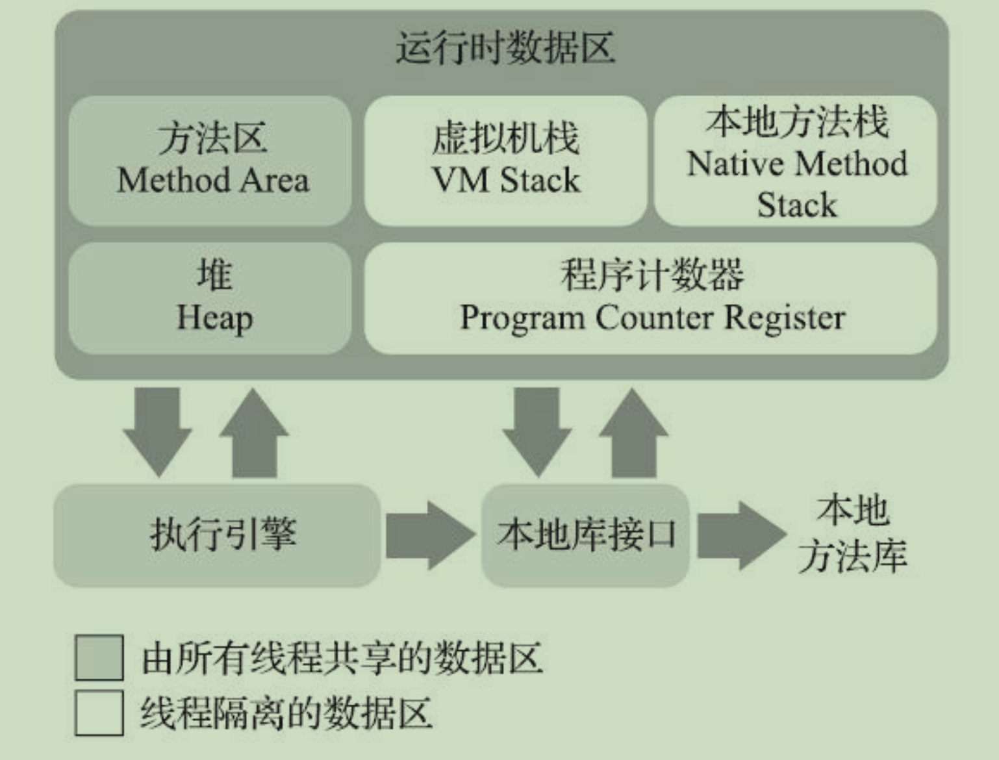
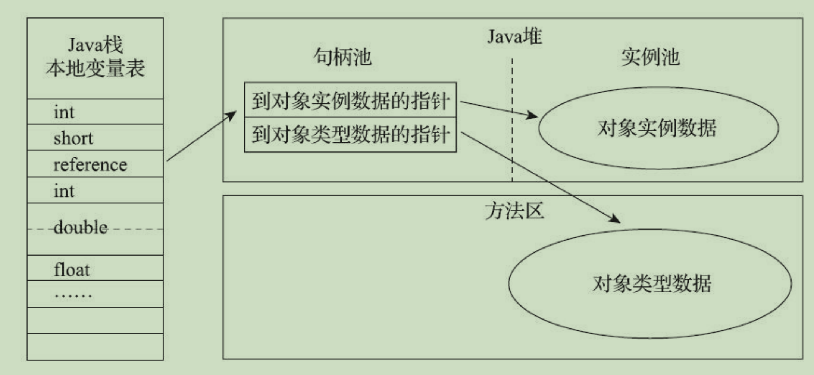
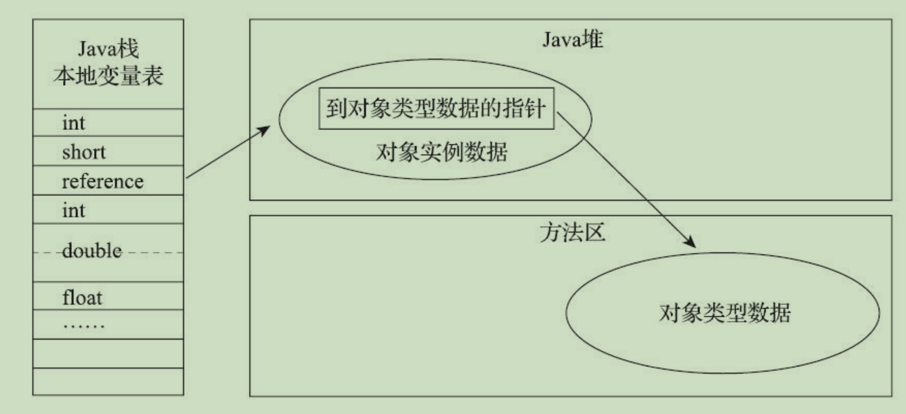

### 1、运行时数据区

其中堆和方法区是线程共享的区域，而程序计数器、虚拟机栈、本地方法栈则是线程私有的区域。

#### 1.1 程序计数器

程序计数器是一块**较小的内存空间**，它可以看作是当前线程所执行的字节码的行号指示器。

字节码解释器工作时就是通过改变这个计数器的值来选取下一条需要执行的字节码指令，它是程序控制流的指示器，分支、循环、跳转、异常处理、线程恢复等基础功能都需要依赖这个计数器来完成。 

如果线程正在执行的是一个Java方法，那么程序计数器记录的就是正在执行的虚拟机字节码指令的地址。如果正在执行的是一个native方法，这个计数器的值则为空。此区域是唯一一个没有OutOfMemoryError的区域。

#### 1.2 虚拟机栈

虚拟机栈描述的Java方法执行的线程内存模型：每个方法被执行的时候，Java虚拟机都会同步创建一个栈帧用于存储局**部变量表、操作数栈、动态链接、方法出口**等信息。每一个方法被调用直至执行完毕的过程，就对应着一个栈帧从虚拟机栈中入栈到出栈的过程。

虚拟机栈中的局部变量表存放了各种Java虚拟机基本数据类型（boolean、byte、char、short、int、float、long、double）、对象引用（reference类型，它并不等同于对象本身，可能是一个指向对象起始地址的引用指针，也可能是指向一个代表对象的句柄或者其他与此对象相关的位置）和returnAddress类型（指向了一条字节码指令的地址）。 

这些数据类型在局部变量表中以局部变量槽（slot）来表示。其中64位的long和double占两个slot，其他数据类型占一个slot。局部变量表的内存空间在编译时期完成分配，进入一个方法时，这个方法需要在栈帧中分配多大的局部变量空间是完全确定的，在方法运行期间不会改变局部变量表的大小。这里的大小是指slot的数量，虚拟机真正使用多大的空间（比如一个slot占32bit还是64bit或者其他）来实现一个slot，是由虚拟机决定的。

在这个区域，如果线程请求的栈深度大于虚拟机所允许的深度，则抛出StackOverflowError异常。如果虚拟机栈容量可以动态扩展，当栈扩展时无法申请到足够内存时将抛出OutOfMemoryError异常。

#### 1.3 本地方法栈

本地方法栈和虚拟机栈所发挥的作用是类似的。区别是虚拟机栈为虚拟机执行Java方法（也就是字节码）服务，而本地方法栈则是为虚拟机执行本地方法服务。

本地方法栈也会在栈深度溢出或者栈扩展失败时抛出StackOverflowError和OutOfMemoryError异常。

#### 1.4 堆

堆是虚拟机所管理的内存最大的一块，在虚拟机启动时创建，此区域的唯一目的就是**存放对象实例**，Java中几乎所有的对象实例都在这里分配内存。同时堆也是垃圾收集器管理的主要区域。

Java堆既可以被实现成固定大小的，也可以是可扩展的。当前主流的Java虚拟机都是按照可扩展来实现的，通过参数-Xmx和-Xms来设置。如果Java堆中没有内存来完成实例分配并且堆也无法再扩展时，Java虚拟机将抛出OutOfMemoryError异常。

#### 1.5 方法区

方法区和Java堆都是线程共享的区域，方法区主要用于存储已被虚拟机加载的类型信息、常量、静态变量、即时编译器编译后的代码缓存等数据。

JDK8使用元空间（Meta Space）代替方法区。元空间使用的是本地内存，而方法区有默认大小，容易出现内存溢出的问题，可以通过-Xx: MaxPermSize设置上限。

方法区又叫永久代，这个区域的内存回收主要是针对常量池的回收和内存的卸载，一般来说这个区域的回收效果比较令人难以满意，尤其的类型的卸载，条件比较苛刻，但这部分的内存回收又是必要的。

如果方法区无法满足新的内存分配需求时，将抛出OutOfMemoryError异常。

#### 1.6 运行时常量池

运行时常量池是方法区的一部分。Class文件中除了有类的版本、字段、方法、接口等描述信息外，还有一项信息是常量池表（Constant Pool Table），用于存放编译期生成的各种字面量与符号引用，这部分内容将在类加载后存放到方法区的运行时常量池中。 

当常量池无法再申请到内存时会抛出OutOfMemoryError异常。 

#### 1.7 直接内存

直接内存（Direct Memory）并不是虚拟机运行时数据区的一部分，也不是《Java虚拟机规范》中定义的内存区域。但是这部分内存也被频繁地使用，而且也可能导致OutOfMemoryError异常出现。

显然，本机直接内存的分配不会受到Java堆大小的限制，但是，既然是内存，则肯定还是会受到本机总内存（包括物理内存、SWAP分区或者分页文件）大小以及处理器寻址空间的限制，一般服务器管理员配置虚拟机参数时，会根据实际内存去设置-Xmx等参数信息，但经常忽略掉直接内存，使得各个内存区域总和大于物理内存限制（包括物理的和操作系统级的限制），从而导致动态扩展时出现OutOfMemoryError异常。

### 2、HotSpot虚拟机对象

对象分配、布局和访问的过程，在不同虚拟机以及不同的内存区域来说都是不一样的。所以以最常用的HotSpot虚拟机以及堆内存为例学习对象的分配、布局和访问过程。

#### 2.1 对象的创建

在语言层面，我们只需要一个new关键字就可以创建出一个Java对象，那么在虚拟机中对象（仅讨论普通Java对象，不包括数组及Class对象）的创建过程又是怎么样的呢？

（1）**类加载检查**：当Java虚拟机遇到new指令时，首先会去检查这个指令的参数能否在常量池中中定位到一个类的符号引用，并且检查这个符号引用代表的类是否已被加载、解析和初始化过。如果没有，那必须先执行相应的**类加载过程**。

（2）**分配内存**：类加载检查通过后，接下来为新生对象**分配内存**。对象所需的内存大小在类加载完成后便可完全确定。为对象分配内存其实就是从Java堆中划分一块确定大小的内存块，内存分配一般有**指针碰撞**和**空闲列表**两种方法。

- 指针碰撞：在指针的一侧是空闲的内存，另一侧是已被使用的内存。在分配的时候，只需要把指针往空闲的一侧移动一段与对象大小相等的距离。这种方法适用于内存规整的情况。
- 空闲列表：虚拟机维护一个列表，记录哪些内存块是可用的，在分配内存的时候，从列表中找到足够大的内存块划分给对象实例，然后更新列表上的记录。这种方法适用于内存不规整的情况。

内存是否规整又取决于使用什么垃圾收集算法，一般来说，使用标记-整理和复制算法后，内存都是规整的，而标记-清除算法则不规整。因此，当使用Serial、ParNew等带压缩整理过程的收集器时，系统采用的分配算法是指针碰撞，既简单又高效；而当使用CMS这种基于清除（Sweep）算法的收集器时，理论上就只能采用较为复杂的空闲列表来分配内存。

在为对象分配内存的时候，还需要考虑的一个问题就是分配内存时的并发问题。可能正在给对象A分配内存的时候，指针还没来得及移动，对象B又使用了原来的指针进行内存分配。为了解决这个问题，有两种方案：（1）为每个线程在堆中分配一小块内存，称为本地线程分配缓存（Thread Local Allocation Buffer，TLAB），当线程需要分配内存的时候，先在TLAB中进行分配。当TLAB用完了，则使用（2）CAS失败重试保证分配操作的原子性。

虚拟机是否使用TLAB，可以通过`-XX：+/-UseTLAB`参数来设定。

（3）**初始化零值**：内存分配后，虚拟机需要将分配到的内存（不包括对象头）都初始化为零值。如果使用了TLAB的话，这一项工作也可以提前至TLAB分配时顺便进行。这步操作保证了对象的实例字段在Java代码中可以不赋初始值就直接使用，使程序能访问到这些字段的数据类型所对应的零值。 

（4）**设置对象头**：Java虚拟机还要对对象进行必要的设置，例如这个对象是哪个类的实例、如何才能找到类的元数据信息、对象的哈希码（实际上对象的哈希码会延后到真正调用Object::hashCode()方法时才计算）、对象的GC分代年龄等信息。这些信息存放在对象的对象头（Object Header）之中。根据虚拟机当前运行状态的不同，如是否启用偏向锁等，对象头会有不同的设置方式。

（5）**执行init方法**：执行构造方法，按程序员的意愿对对象进行初始化。

#### 2.2 对象的内存布局

在HotSopt虚拟机里，对象在堆内存中的存储布局可以划分为三个部分：对象头（Header）、实例数据（Instance Data）和对齐填充（Padding）。

1、HotSpot虚拟机对象的对象头包括两部分信息：

（1）第一类是存储对象自身的运行时数据。如hashcode、GC分代年龄、锁状态标志、线程持有的锁、偏向线程ID、偏向时间戳等，这部分数据的长度在32位和64位的虚拟机（未开启压缩指针）中分别为32个比特和64个比特，官方称它为“Mark Word”。

（2）另一部分是类型指针。即对象指向它的类型元数据的指针，Java虚拟机通过这个指针来确定该对象是哪个类的实例。如果对象是一个Java数组，那在对象头中还必须有一块用于记录数组长度的数据，因为虚拟机可以通过普通Java对象的元数据信息确定Java对象的大小，但是如果数组的长度是不确定的，将无法通过元数据中的信息推断出数组的大小。 

2、实例数据部分是对象真正存储的有效信息。

即我们在程序里定义的各字段的内容。无论是从父类继承的还是在子类中定义的都必须记录下来。这部分的存储顺序会受到虚拟机分配策略参数（-XX：FieldsAllocationStyle参数）和字段在Java源码中定义顺序的影响。HotSpot虚拟机默认的分配顺序为longs/doubles、ints、shorts/chars、bytes/booleans、oops（OrdinaryObject Pointers，OOPs），从以上默认的分配策略中可以看到，相同宽度的字段总是被分配到一起存放，在满足这个前提条件的情况下，在父类中定义的变量会出现在子类之前。如果HotSpot虚拟机的+XX：CompactFields参数值为true（默认就为true），那子类之中较窄的变量也允许插入父类变量的空隙之中，以节省出一点点空间。 

3、对象的第三部分是对齐填充

这并不是必然存在的，也没有特别的含义，它仅仅起着占位符的作用。由于HotSpot虚拟机的自动内存管理系统要求对象起始地址必须是8字节的整数倍，换句话说就是任何对象的大小都必须是8字节的整数倍。对象头部分已经被精心设计成正好是8字节的倍数（1倍或者2倍），因此，如果对象实例数据部分没有对齐的话，就需要通过对齐填充来补全。 

#### 2.3 对象的访问定位

Java程序会通过栈上的reference数据来操作堆上的具体对象。reference类型在《Java虚拟机规范》里只规定它是一个指向对象的引用，并没有定义这个引用需要通过什么方式去定位、访问到堆中对象的具体位置。所以对象的访问方式也是由虚拟机是实现的，一般有下面两种方式：

1、句柄

如果使用句柄访问的话，Java堆中将可能会划分出一块内存来作为句柄池，reference中存储的就是对象的句柄地址，而句柄中包含了对象实例数据与类型数据各自具体的地址信息。

2、直接指针

如果使用直接指针访问的话，Java堆中对象的内存布局就必须考虑如何放置访问类型数据的相关信息，reference中存储的直接就是对象地址，如果只是访问对象本身的话，就不需要多一次间接访问的开销。

这两种对象访问方式各有优势，使用句柄来访问的最大好处就是reference中存储的是稳定句柄地址，在对象被移动（垃圾收集时移动对象是非常普遍的行为）时只会改变句柄中的实例数据指针，而reference本身不需要被修改。

使用直接指针来访问最大的好处就是速度更快，它节省了一次指针定位的时间开销，由于对象访问在Java中非常频繁，因此这类开销积少成多也是一项极为可观的执行成本。