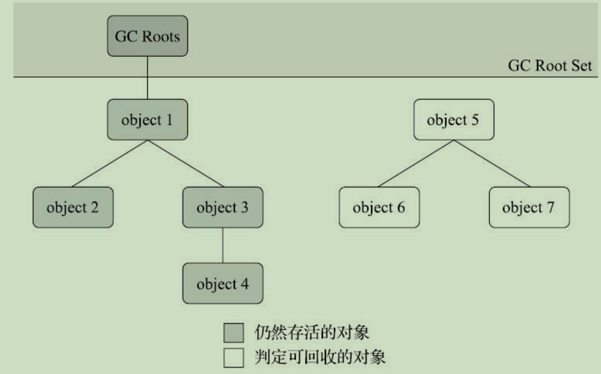

Java的内存回收基本都是由JVM提供的垃圾回收机制帮我们处理，虽然大部分情况下我们不需要自己手动去释放内存，但了解底层是怎么做的有利于我们平时开发中问题定位。

一般来说，垃圾回收需要考虑下面几个问题：

（1）哪些内存需要回收？

（2）什么时候回收？

（3）如何回收？

另外根据前面Java内存的知识，堆中主要存放实例对象，而方法区（JDK8叫元空间）则主要存放的是常量和静态变量，所以垃圾收集的区域就集中在这两块，主要是堆。

### 1、判断对象可以回收

垃圾收集器在回收对象之前，首先就需要判断对象是否可以回收，需要回收的对象就是不会再被使用的对象。关于判断对象是否可被回收，一般有两种方法：

#### 1.1 引用计数法

每个对象都有一个引用计数器，当对象被引用时，计数器值加1；引用失效时，计数器值减1。当计数器的值为0时，说明对象不再被使用。

这种方法思想很简单，但可能会存在**相互引用**的问题，所以主流的Java虚拟机都没有使用这种方法来管理内存。

#### 1.2 可达性分析

这个算法的基本思路是通过一系列“GC Root”根对象作为起点，从这些节点开始，根据引用关系往下搜索，搜索过程中走过的路径称为“引用链”。如果某个对象到“GC Root”之间没有任何引用链，则说明这个对象不可达，不能被使用。

一般来说，适合作为GC Root的对象包括下面几种

（1）在虚拟机栈（栈帧中的本地变量表）中引用的对象，譬如各个线程被调用的方法堆栈中使用到的参数、局部变量、临时变量等。 

（2）在方法区中类静态属性引用的对象，比如Java类的引用类型静态变量。

（3）在方法区中常量引用的对象，比如字符串常量池里的引用。

（4）在本地方法栈中JNI（即通常所说的Native方法）引用的对象。

（5）Java虚拟机内部的引用，如基本数据类型对应的Class对象，一些常驻的异常对象（比如 NullPointExcepiton、OutOfMemoryError）等，还有系统类加载器。

（6）所有被同步锁（synchronized关键字）持有的对象。

（7）反映Java虚拟机内部情况的JMXBean、JVMTI中注册的回调、本地代码缓存等。 

除了上面这些固定的GC Root，还有一些对象会临时性加入，共同构成GC Root集合。比如分代收集和局部回收，如果只对Java堆中某一区域发起收集（比如新生代），该区域中的对象可能被堆中其他区域对象所引用，这时候就需要将这些关联区域里的对象一起加入GC Root集合里去才能保证可达性分析的准确性。

#### 1.3 引用的类型

对于一个对象，一般情况下就是“被引用”和“未被引用”两种状态。但有时候我们想某个对象在内存充足的情况下可以保留在内存中，在内存不足的情况下再进行清除。基于此，JDK1.2版本后，Java将引用分为**强引用、软引用、弱引用和虚引用**，四种引用强度依次减弱。

（1）强引用：即程序代码中普遍存在的引用赋值，类似于`Object o = new Object()`这种引用关系。只要强引用的关系还存在，垃圾回收器永远不会回收被引用的对象。

（2）软引用：用来描述一些还有用但非必需的对象。在系统要发生内存溢出异常之前，垃圾收集器会对这些对象进行回收，如果回收之后内存仍然不够，则会抛出内存溢出异常。JDK1.2版本后提供了SoftReference类来实现软引用。

（3）弱引用：描述非必需的对象，强度比软引用弱一点。被弱引用关联的对象只能存活到下一次垃圾回收发生的时候。当垃圾收集器开始回收的时候，无论内存是否充足，都会回收掉弱引用关联的对象。JDK1.2版本后提供了WeakReference类来实现弱引用。

（4）虚引用：最弱的一种引用关系。一个对象是否有虚引用的存在，对其生存时间不会造成影响，也无法通过虚引用取得对象实例。为一个对象设置虚引用的目的就是为了能在这个对象被收集器回收时收到一个系统通知。在JDK 1.2版之后提供了PhantomReference类来实现虚引用。

#### 1.4 方法区的垃圾回收

通过前面的学习可以知道方法区中主要存放的是一些常量和静态变量。不同于堆，垃圾回收在方法区的效果是比较不显著的。

方法区的垃圾收集主要回收两部分内容：**废弃的常量和不再使用的类型**。回收废弃常量和回收Java堆中的对象非常类似，假如一个字符串“java”曾经进入常量池中，但是当前系统又没有任何一个字符串对象的值是“java”，换句话说，已经没有任何字符串对象引用常量池中的“java”常量，且虚拟机中也没有其他地方引用这个字面量。如果在这时发生内存回收，而且垃圾收集器判断确有必要的话，这个“java”常量就将会被系统清理出常量池。常量池中其他类（接口）、方法、字段的符号引用也与此类似。 

判断一个类型是否属于不再使用的类，其条件比较苛刻，需要同时满足下面三个条件：

（1）该类所有的实例都被回收，也就是Java堆中不存在该类以及派生子类的实例。

（2）加载该类的类加载器已被回收。这个条件除非是经过精心设计的可替换类加载器的场景，如OSGi、JSP的重加载等，否则通常是很难达成的。

（3）该类对应的java.lang.Class对象没有在任何地方被引用，无法在任何地方通过反射访问该类的方法。

只要类型满足了上述三个条件，则垃圾收集器可以堆类型进行回收，但这不是必然会进行回收的。关于是否要对类型进行回收，HotSpot虚拟机提供了-Xnoclassgc参数进行控制，还可以使用-verbose：class以及-XX：+TraceClass-Loading、-XX：+TraceClassUnLoading查看类加载和卸载信息，其中-verbose：class和-XX：+TraceClassLoading可以在Product版的虚拟机中使用，-XX：+TraceClassUnLoading参数需要FastDebug版[1]的虚拟机支持。

在大量使用反射、动态代理、CGLib等字节码框架，动态生成JSP以及OSGi这类频繁自定义类加载器的场景中，通常都需要Java虚拟机具备类型卸载的能力，以保证不会对方法区造成过大的内存压力。