有时候碰到服务器CPU飙升或者程序卡死之类的问题，一般都不太好定位。这类bug一般都隐藏的比较深并且还可能是偶发性的，比较棘手。

对于此类问题，一般我们都有固定的分析流程。借助于JDK自带的一些分析工具，比如jstack、jmap、jstat一类的命令行工具，除此之外，还有jconsole、mat、jvisualvm这些图形界面分析工具。

这篇文章基于JDK8，操作系统是macOS 12.0.1

### 1、一些命令行分析工具

这些命令行分析工具都在jdk/bin目录下

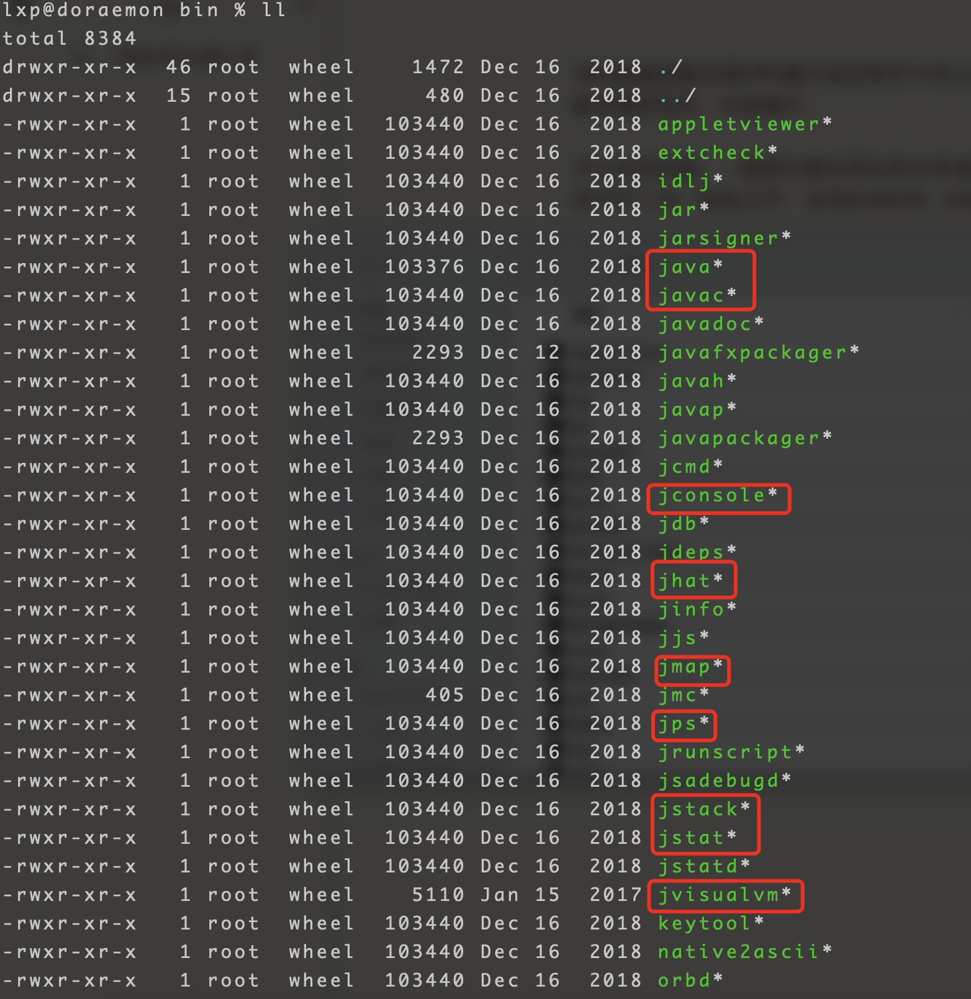

解压jdk/lib/tool.jar可以得到上述工具的class文件

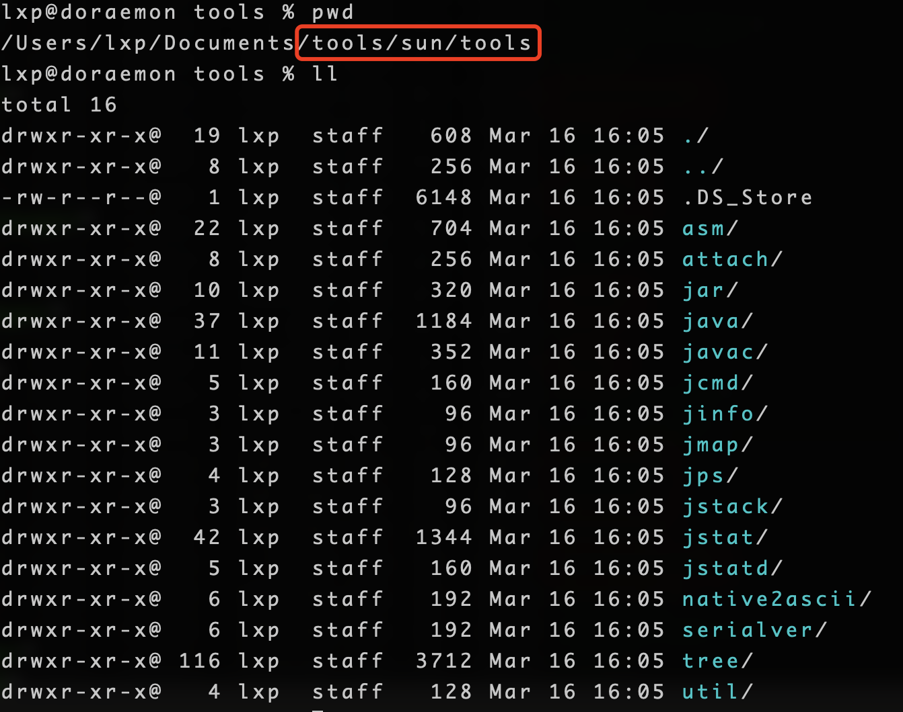

#### 1.1 jps - JVM Process Status Tool

作用：列出正在运行的虚拟机进程，并显示虚拟机执行主类名称以及这些进程的本地虚拟机唯一ID。

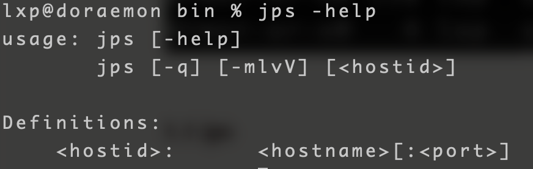

第一个参数说明：

- -q：默认携带的参数，显示进程ID。
- -m：显示进程ID，主类名称，以及传入main方法的参数。
- -l：显示进程ID，主类全名。
- -v：显示进程ID，主类名称，以及传入JVM的参数。
- -V：显示进程ID，主类名称。

[-mlvV]可以任意组合使用。

第二个参数说明：

- hostid：服务器的ip地址。不指定的情况下，默认为当前服务器。如果要查看其他机器上的JVM进程，需要在待查看机器上启动jstatd。

#### 1.2 jstat - JVM Statistics Monitoring Tool

**作用**：监视虚拟机各种运行状态信息，可以显示本地或者远程虚拟机进程中的类装载、内存、垃圾收集、JIT编译等运行数据。

**命令格式**：jstat -<option> [-t] [-h<lines>] <vmid> [<interval> [<count>]]

**参数说明**：

第一个参数：option，代表用户希望查询的虚拟机信息，主要分为3类：类装载、垃圾收集和运行期编译情况。具体选项如下：

- -class：显示有关类加载器行为的统计信息。
- -compiler：显示有关java hotspot vm即时编译器行为的统计信息。
- -gc：显示有关垃圾收集堆行为的统计信息。
- -gccapacity：显示有关各个垃圾回收代容量及其相应容量的统计信息。
- -gccause：显示有关垃圾收集统计信息（同-gcutil），以及上一次和当前垃圾收集事件的原因。
- -gcnew：显示新生代行为的统计信息。
- -gcnewcapacity：显示有关新生代大小及其相应空间的统计信息。
- -gcold：显示老年代行为的统计信息和元空间统计信息。
- -gcoldcapacity：显示有关老年代大小的统计信息。
- -gcmetacapacity：显示有关元空间大小的统计信息。
- -gcutil：显示有关垃圾收集统计信息。
- -printcompilation：显示java hotspot vm编译方法统计信息。

第二个参数：vmid。如果是本地虚拟机进程，那么vmid和本地虚拟机唯一ID是一致的。如果是远程虚拟机进程，那么vmid的格式是：protocol:lvmid[@hostname[:port]/servername]

第三个参数：interval。采样间隔，单位为s或ms，默认单位是ms，必须为整数。指定该参数，jstat命令将在每个间隔产生输出。

第四个参数：count。要显示的样本数。

```java
import java.io.IOException;

/**
 * -class:
 *  Loaded：已加载的类数量。
 *  Bytes：已加载的kb数。
 *  Unloaded：卸载的类数量。
 *  Bytes：卸载的kb数。
 *  Time：执行类加载和卸载的耗时。
 *
 * -compiler：
 *  Compiled：执行的编译任务数。
 *  Failed：编译失败的任务数。
 *  Invalid：无效的编译任务数。
 *  Time：执行编译任务所花费的时间。
 *  FailedType：失败的编译类型。
 *  FailedMethod：失败的编译类名和方法。
 */
public class Demo1_jstat {
    public static void main(String[] args) throws IOException {
        System.out.println("jstat");
        System.in.read();
    }
}
```

启动上面的demo后

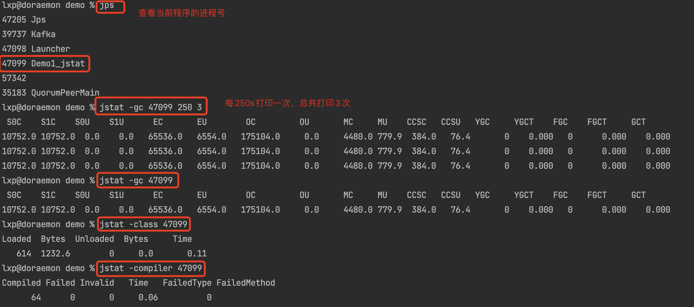

```java
import java.io.IOException;

/**
 * -gc: 垃圾收集的堆统计信息
 *  S0C：s0区的容量（kb）
 *  S1C：s1区的容量（kb）
 *  S0U：s0区的使用大小（kb）
 *  S1U：s1区的使用大学（kb）
 *  EC：eden区的容量（kb）
 *  EU：eden区的使用大小（kb）
 *  OC：老年代容量（kb）
 *  OU：老年代的使用大小（kb）
 *  MC：元空间的容量（kb）
 *  MU：元空间的使用大小（kb）
 *  CCSC：压缩的类空间容量（kb）
 *  CCSU：使用的压缩类空间大小（kb）
 *  YGC：新生代垃圾收集次数
 *  YGCT：新生代垃圾回收时间
 *  FGC：full gc收集次数
 *  FGCT：full gc垃圾回收时间
 *  GCT：总垃圾收集时间
 *
 * -gcutil：垃圾收集统计信息
 *  S0：s0区的使用率
 *  S1：s1区的使用率
 *  E：eden区使用率
 *  O：老年代使用率
 *  M：元空间使用率
 *  CCS：压缩类空间使用率
 *  YGC：新生代gc次数
 *  YGCT：新生代gc耗费时间
 *  FGC：full gc次数
 *  FGCT：full gc耗费时间
 *  GCT：总垃圾收集时间
 */
public class Demo2_jstat {
    // -Xms20M -Xmx20M -Xmn10M -XX:+UseSerialGC -XX:+PrintGCDetails -verbose:gc
    public static void main(String[] args) throws IOException {
        final int _1MB = 1024 * 1024;
        // 申请2M的空间
        byte[] b1 = new byte[2 * _1MB];
        System.out.println("1111");
        System.in.read();

        // 申请2M的空间
        byte[] b2 = new byte[2 * _1MB];
        System.out.println("2222");
        System.in.read();

        // 申请2M的空间
        byte[] b3 = new byte[2 * _1MB];
        System.out.println("3333");
        System.in.read();
    }
}
```

启动上面的程序之前，先指定一些jvm参数

`-Xms20M -Xmx20M -Xmn10M -XX:+UseSerialGC -XX:+PrintGCDetails -verbose:gc`

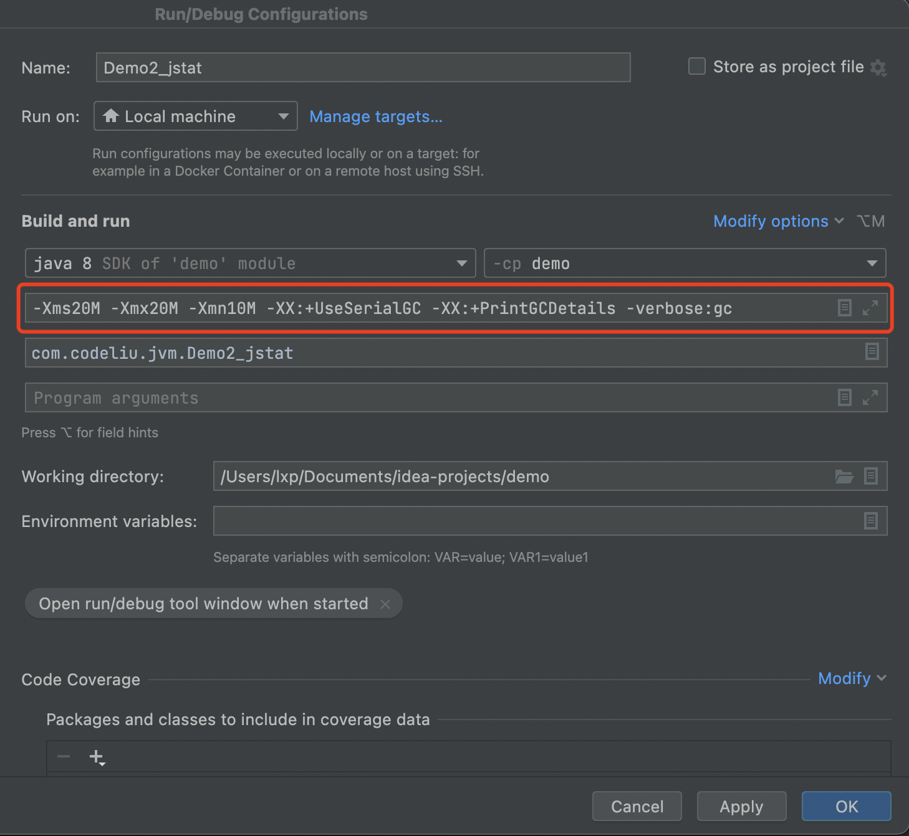

然后启动demo

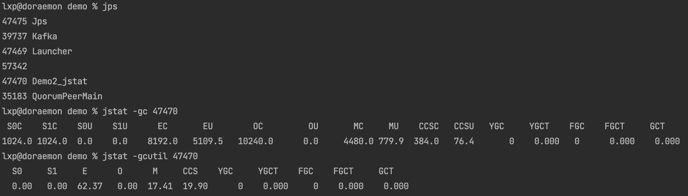

刚启动时，程序会申请2M的数组，可以看到eden区的使用率是62.37%，ygc的值为0。

让程序申请第二个2M的数组，之后再查看堆内存信息

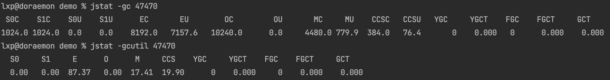

可以发现eden区的使用率达到了87.37%。

让程序申请第三个2M的数组，发现控制台输出提示

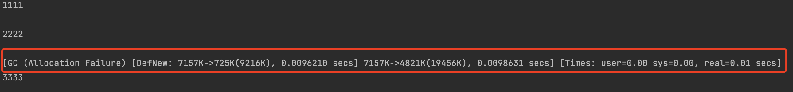

再查看堆内存信息

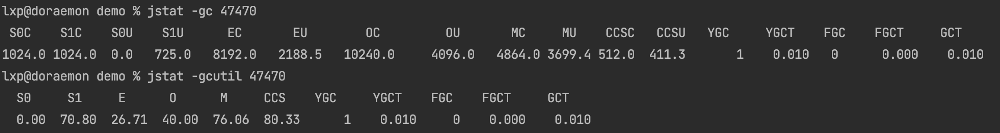

发现eden区的使用率降到了26.71，s1区使用率时70.80%，老年代的使用率是40%即4096kb也就是4M空间大小。同时ygc的次数是1，说明进行了一次ygc，并且把大对象放进了老年代中。

#### 1.3 jinfo - Configuration Info For Java

**作用**：实时的查看和调整虚拟机各项参数。

**命令格式**：jinfo [option] <pid>

**参数说明**：

第一个参数：option。

- no options：输出全部的参数和系统属性。
- -flag name：输出对应名称的参数。
- -flag [+ | -] name：开启或者关闭对应名称的参数。
- -flag name=value：设置对于名称参数的参数值。
- -flags：输出全部的参数。
- -sysprops：输出全部的系统属性。

**命令演示**：

- jinfo pid
- jinfo -flag PrintGCDetails pid （输出PrintGCDetails参数的值）
- jinfo -flag +PrintGCDetails pid （开启PrintGCDetails参数）
- jinfo -flag HeapDumpPath=/ pid （设置HeapDumpPath参数的值）

在我电脑上使用这个命令会报错，据说是macOS的一个bug，需要升级到jdk9，懒得升了。[bug链接](https://bugs.java.com/bugdatabase/view_bug.do?bug_id=8160376)

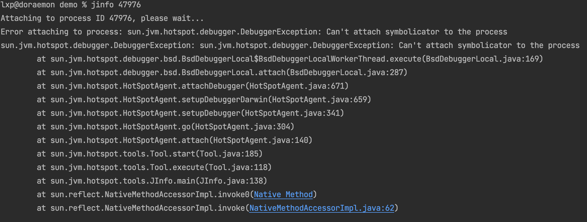

#### 1.4 jmap  - Memory Map For Java

**作用**：一个多功能的命令，它可以生成Java程序的dump文件，也可以查看堆内对象的信息、classloader的信息和finalizer队列。

**命令格式**：jmap [option] <pid>

**参数解释**：

第一个参数：option

- no option：查看进程的内存镜像信息。
- -heap：显示Java堆详细信息。
- -histo[:live]：显示堆中对象的统计信息。
- -clstats：打印类加载器信息。
- -finalizerinfo：显示在F-Queue队列等待Finalizer线程执行finaizer方法的对象。
- -dump:<dump-options>：生成堆转储快照。

**命令演示**：

- jamp pid。打印出虚拟机加载的每个共享对象的起始地址、映射大小以及共享对象文件的路径全称。
- jamp -heap pid。打印一个堆的摘要信息，包括使用的GC算法、堆配置信息和各内存区域内存使用信息。
- jmap -histo:live pid。显示堆中对象的统计信息，包括每个Java类型，对象数量，内存大小（单位字节），完全限定的类名。打印的虚拟机内部的类名称将会带一个‘*’前缀。如果指定了live子选项，则只计算活动的对象。
- jmap -clstats pid。打印Java堆内存的永久保存区域的类加载器的智能统计信息。对于每个类加载器而言，它的名称、活跃度、地址、父类加载器、它所加载的类的数量和大小都会打印。
- jmap -finalizerinfo pid。打印等待终结的对象信息。`Number of objects pending for finalization: 0`说明没有等待终结的对象。
- jamp -dump:live,format=b,file=./jmap.bin pid。以二进制格式转储java堆到指定路径下的filename文件中。指定了live子选项，则只会转储活动的对象。

在macOS上使用这个命令同样也会报错。但某些命令还是可以的，比如dump二进制文件。

#### 1.5 jhat - JVM Heap Dump Browser

**作用**：与jmap搭配使用，用来分析jmap生成的堆转储文件。jhat内置了一个微型的http/html服务器，生成dump文件的分析结果后，可以在浏览器中查看。

不过这个工具一般比较少使用，一是因为功能比较简陋，VisualVM和MAT等工具完全能够替代它。二是因为我们一般不会在生产服务器上直接去dump二进制文件，并且分析二进制文件是一个比较耗时的工作，所以就没必要使用命令行工具了。

**命令格式**：jhat [options] 堆转储文件

**参数解释**：

第一个参数：option

- [-stack <bool>]：开关对象分配调用栈跟踪，如果分配位置信息在堆转储中不可用，则必须将此标志设置为false，默认为true。
- [-refs <bool>]：开关对象引用跟踪，默认为true。默认情况下，返回的指针是指向其他特定对象的对象。如果为false则会统计堆中所有对象。
- [-port <port>]：设置jhat http server的端口号，默认为7000。
- [-exclude <file>]：指定对象查询时需要排除的数据成员列表文件。例如，如果文件列出了java.lang.String.value，那么当从某个对象Object o计算可达的对象列表时，引用路径涉及java.lang.String.value的都会排除。
- [-baseline <file>]：指定一个基准堆转储。在两个heap dumps中有相同object ID的对象会被标记为不是新的，其他对象会被标记为新的（new），在比较两个不同的堆转储时有用。
- [-debug <int>]：设置debug级别，0表示不输出调试信息，值越大表示输出的调试信息越详细。[0, 1, 2]
- [-version]：启动后只显示版本信息就退出。

第二个参数：堆转储文件。

**命令演示**：

我们可以先生成一个二进制文件。

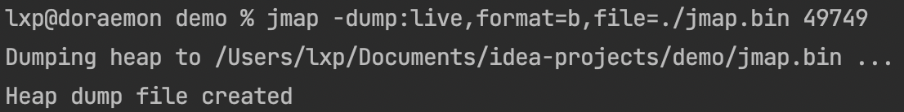

然后使用jhat命令进行分析

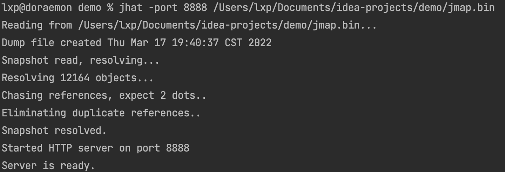

浏览器访问8888端口

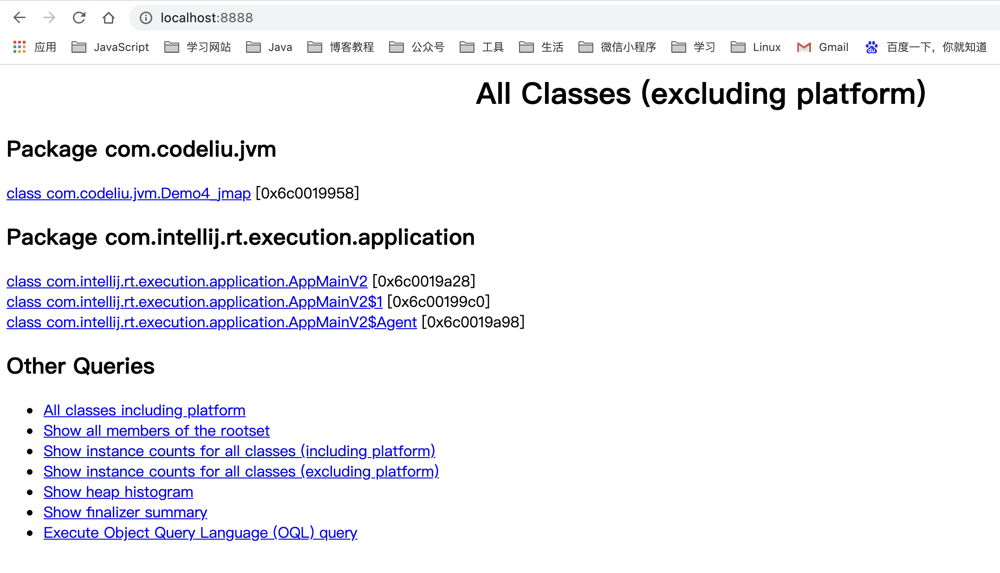

#### 1.6 jstack - Stack Trace For Java

**作用**：查看或导出Java应用程序中线程堆栈信息。

线程快照是当前Java虚拟机内每一条线程正在执行的方法堆栈的集合。生成线程快照的主要目的是定位线程出现长时间停顿的原因，比如线程死锁、死循环、长时间等待外部资源等。线程出现停顿的时候通过jstack来查看各个线程的调用堆栈，就可以知道没有响应的线程到底在后台做什么事情，或者等待什么资源。如果Java程序崩溃生成core文件，jstack工具可以用来获得core文件的java stack和native stack的信息，从而轻松地知道Java程序是如何崩溃和在程序何处发生问题。另外jstack工具还可以附属到正在运行的java程序中，看到当时运行的java程序的java stack和native stack信息。

**命令格式**：jstack [options] <pid>

**参数说明**：

第一个参数：options

- -F：当线程挂起时，使用jstack -l pid请求不被响应时，强制输出线程堆栈。
- -l：除堆栈外，显示关于锁的附加信息，比如ownable synchronizers。
- -m：可以同时输出java以及C/C++的堆栈信息。

命令演示：

```java
import java.util.concurrent.locks.Lock;
import java.util.concurrent.locks.ReentrantLock;

public class Demo5_jstack {
    public static void main(String[] args) {
        System.out.println("start");
        test1();
      	// test2();
        System.out.println("end");
    }

    // 测试死循环
    private static void test1() {
        while (true) {}
    }

    // 测试死锁
    private static void test2() {
        Lock lock1 = new ReentrantLock();
        Lock lock2 = new ReentrantLock();

        new Thread(() -> {
            try {
                lock1.lock();
                Thread.sleep(100);
                lock2.lock();
            } catch (InterruptedException e) {
                e.printStackTrace();
            }
        }, "thread1").start();

        new Thread(() -> {
            try {
                lock2.lock();
                Thread.sleep(100);
                lock1.lock();
            } catch (InterruptedException e) {
                e.printStackTrace();
            }
        }, "thread2").start();
    }
}
```

**测试死循环**

启动程序后，`top`命令查看进程状态

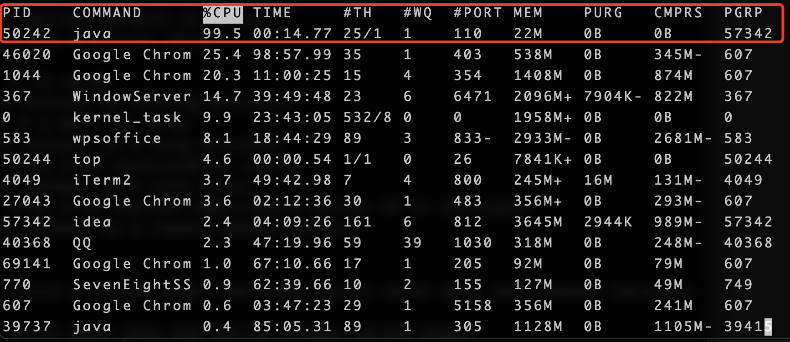

Linux系统中可以使用`top -Hp 50242`命令查看进程下的线程信息，但在macOS上不支持这个命令。我也没找到怎么查看macOS里进程下所有线程的方式==。

一般在Linux上的步骤就是下面这几步：

（1）`top`查看哪个进程cpu最高。

（2）`top -Hp pid`查看进程下面哪个线程cpu最高。

（3）`jstack -l pid`打印出进程的堆栈信息，然后将占有cpu最高的线程id转换为16进制，将这个16进制在堆栈信息中查询它的位置，一般都能定位到具体的代码位置。

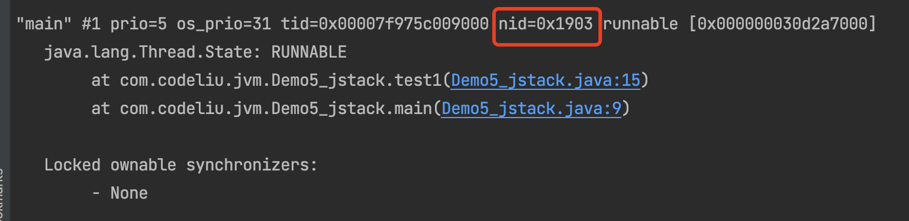

**测试死锁**

调用test2方法，然后启动程序，使用`jstack -l pid`命令能够打印出死锁信息。

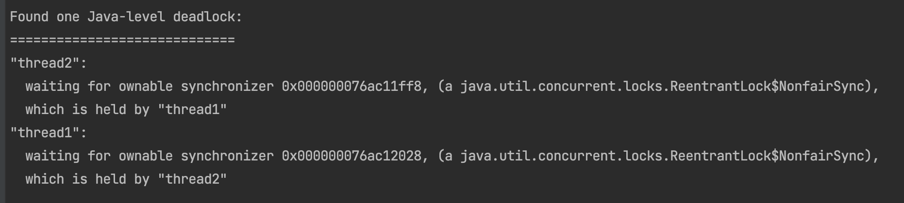

### 2、一些可视化分析工具

#### 2.1 jConsole

使用jConsole可以查看程序的堆内存使用量、线程信息、CPU使用信息等。

在控制台输入`jconsole`命令，选择我们本地的程序

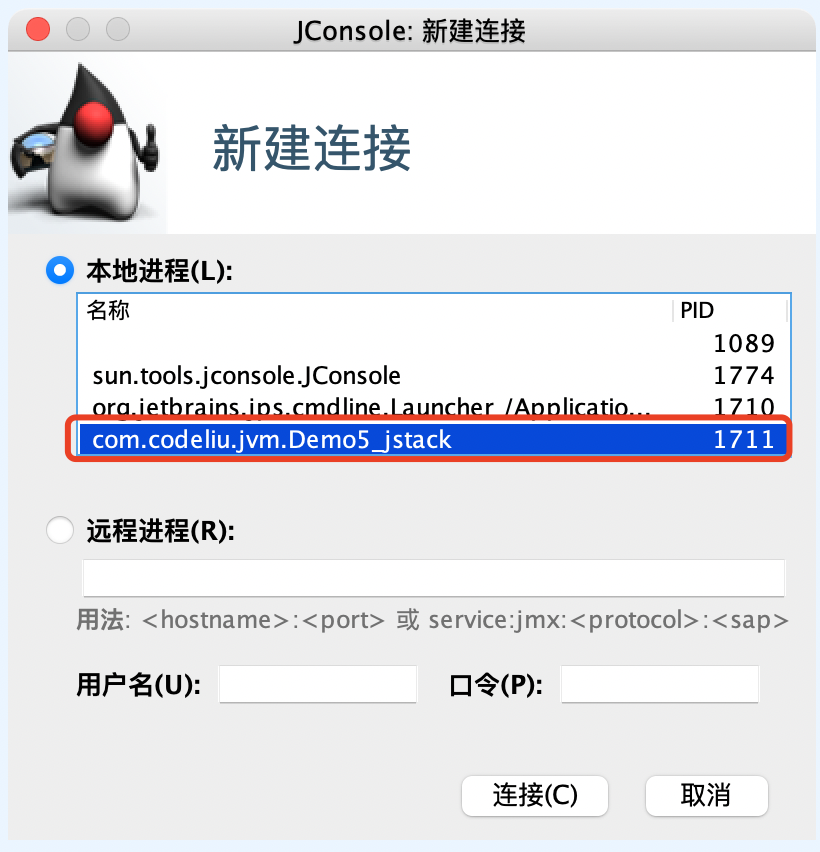

进入后就能看到一些基本信息了

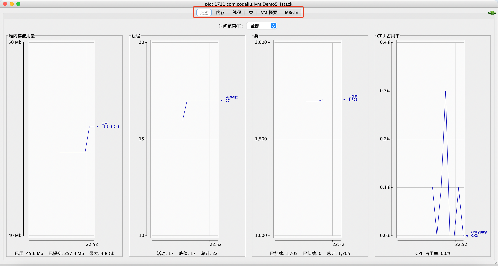

在内存模块，我们可以查看新生代、老年代、元空间等区域的使用率

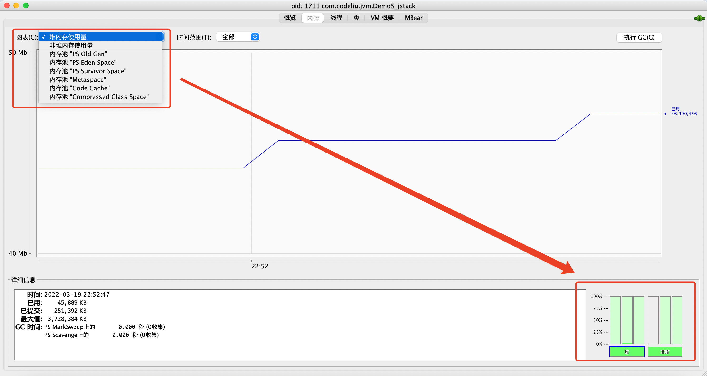

在线程模块，我们能看到该进程下的所有线程，同时还能检测死锁

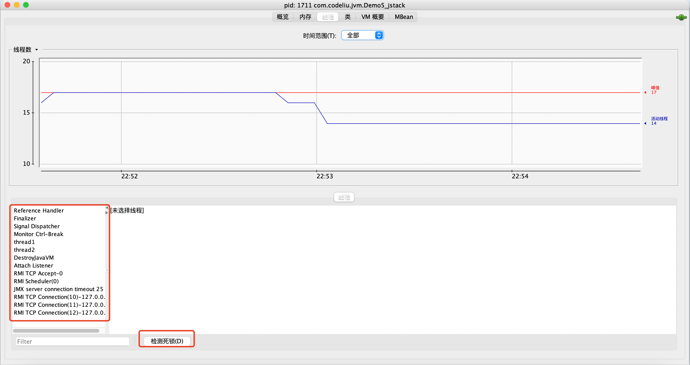

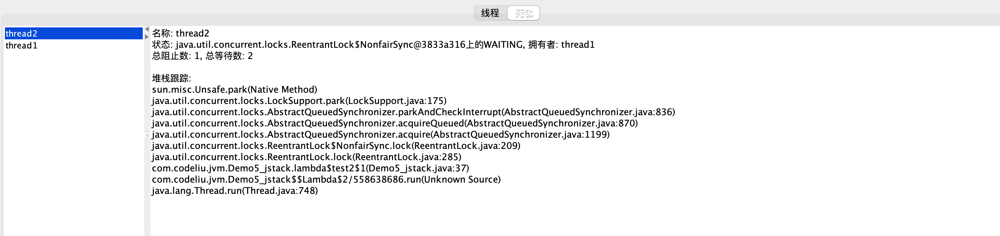

在VM概要模块，则可以看到本机的一些JVM信息。

#### 2.2 Visual VM

**作用**：是到目前为止随JDK发布的功能最强大的运行监视和故障处理程序。官方在VisualVM的软件说明中写上了“All-in-One”的描述，说明它除了运行监视、故障处理外，还提供了很多其他方面的功能。如性能分析，VisualVM的性能分析甚至比很多专业的收费工具都好用，而且VisualVM不需要被监视的程序基于特殊的运行，因此它对应用程序的实际性能的影响很小，使得它可以直接应用在生产环境中。

VisualVM基于NetBeans平台开发，因此它一开始就具备了插件扩展功能的特性，通过插件扩展支持，VisualVM可以做到：

- 显示虚拟机进程以及进程的配置、环境信息（jps、jinfo）
- 监视应用程序的CPU、GC、堆、方法区以及线程的信息（jstat、jstack）
- dump以及分析堆转储快照（jmap、jhat）
- 方法级的程序运行性能分析，找到被调用最多、运行时间最长的方法。
- 离线程序快照：收集程序的运行时配置、线程dump、内存dump等信息建立一个快照。
- 动态的安装plugins。

**使用**：在控制台输入`jvisualvm`执行即可。进入后主页还会有一些文档，十分贴心。

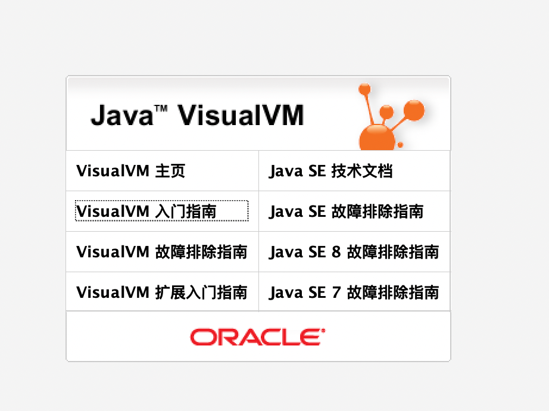

在工具栏可以进行插件的安装

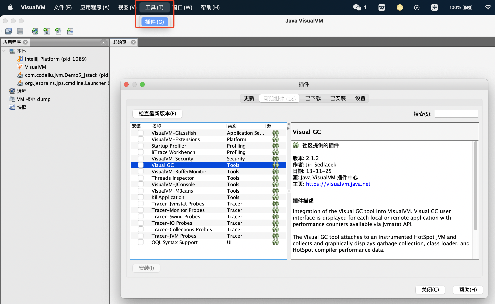

可以看到左侧可以选择本地进程或者远程的进程，选择我们的目标程序，顶部有概述、监视、线程、抽样器、Profiler几个选项。

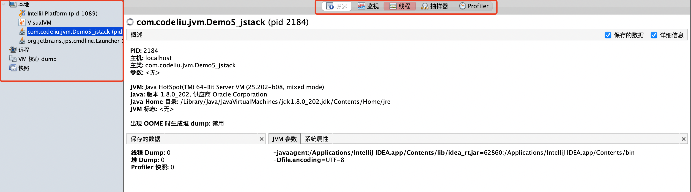

监视页面和jconsole的也有点像，不过在visualvm中可以直接进行堆dump文件分析

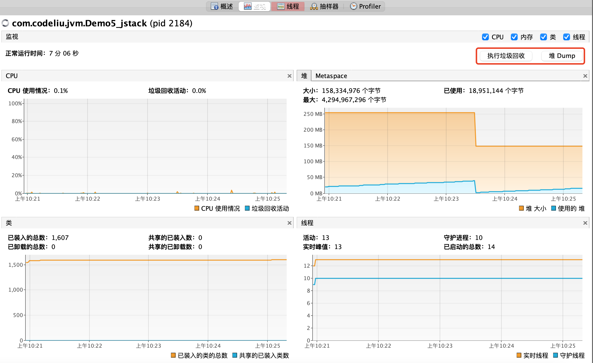

在线程页面，还可以检测程序的死锁，进行线程dump的分析

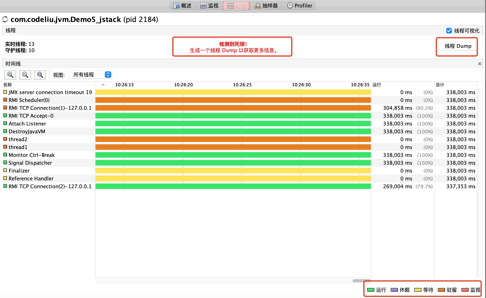

还有很多的功能大家可以一一去看看。以前还不知道JDK自带了这么多性能分析利器啊，以后遇到一些性能问题可以尝试使用一下上面的工具，也不需要额外安装。
