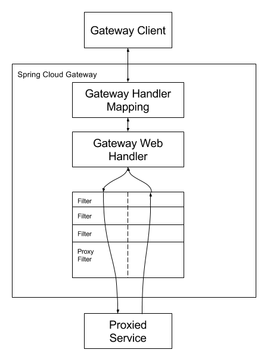

官方文档：https://cloud.spring.io/spring-cloud-static/spring-cloud-gateway/2.2.1.RELEASE/reference/html/#configuration

文中涉及到了一些模块代码没有给出，我一并上传到github了，可以整个项目clone下来进行调试。

地址：https://github.com/stronglxp/springcloud-test


### 1、GateWay是什么

#### 1.1 概念

Cloud全家桶中有个很重要的组件就是网关，在1.x版本中都是采用的Zuul网关。但在2.x版本中，zuul的升级一直跳票，SpringCloud最后自己研发了一个网关替代Zuul。

Gateway是在Spring生态系统之上构建的API网关服务，基于Spring 5，Spring Boot 2和Project Reactor等技术。

Gateway旨在提供一种简单而有效的方式来对API进行路由，以及提供一些强大的过滤器功能，例如:熔断、限流、重试等。

SpringCloud Gateway是Spring Cloud的一个全新项目，基于Spring 5.0+Spring Boot 2.0和Project Reactor等技术开发的网关，它旨在为微服务架构提供—种简单有效的统一的API路由管理方式。

SpringCloud Gateway作为Spring Cloud 生态系统中的网关，目标是替代Zuul，在Spring Cloud 2.0以上版本中，没有对新版本的Zul 2.0以上最新高性能版本进行集成，仍然还是使用的Zuul 1.x非Reactor模式的老版本。而为了提升网关的性能，SpringCloud Gateway是基于WebFlux框架实现的，而WebFlux框架底层则使用了高性能的Reactor模式通信框架Netty。

Spring Cloud Gateway的目标提供统一的路由方式且基于 Filter链的方式提供了网关基本的功能，例如:安全，监控/指标，和限流。

#### 1.2 作用

- 方向代理
- 鉴权
- 流量控制
- 熔断
- 日志监控
- …

#### 1.3 微服务架构中网关的位置


### 2、GateWay非阻塞异步模型

#### 2.1 为什么选择Gateway?

netflix不太靠谱，zuul2.0一直跳票，迟迟不发布。

- 一方面因为Zuul1.0已经进入了维护阶段，而且Gateway是SpringCloud团队研发的，是亲儿子产品，值得信赖。而且很多功能Zuul都没有用起来也非常的简单便捷。
- Gateway是基于异步非阻塞模型上进行开发的，性能方面不需要担心。虽然Netflix早就发布了最新的Zuul 2.x，但Spring Cloud貌似没有整合计划。而且Netflix相关组件都宣布进入维护期；不知前景如何?
- 多方面综合考虑Gateway是很理想的网关选择。

SpringCloud Gateway具有如下特性

- 基于Spring Framework 5，Project Reactor和Spring Boot 2.0进行构建；
- 动态路由：能够匹配任何请求属性；
- 可以对路由指定Predicate (断言)和Filter(过滤器)；
- 集成Hystrix的断路器功能；
- 集成Spring Cloud 服务发现功能；
- 易于编写的Predicate (断言)和Filter (过滤器)；
- 请求限流功能；
- 支持路径重写。

SpringCloud Gateway与Zuul的区别

- 在SpringCloud Finchley正式版之前，Spring Cloud推荐的网关是Netflix提供的Zuul。
- Zuul 1.x，是一个基于阻塞I/O的API Gateway。
- Zuul 1.x基于Servlet 2.5使用阻塞架构它不支持任何长连接(如WebSocket)Zuul的设计模式和Nginx较像，每次I/О操作都是从工作线程中选择一个执行，请求线程被阻塞到工作线程完成，但是差别是Nginx用C++实现，Zuul用Java实现，而JVM本身会有第-次加载较慢的情况，使得Zuul的性能相对较差。
- Zuul 2.x理念更先进，想基于Netty非阻塞和支持长连接，但SpringCloud目前还没有整合。Zuul .x的性能较Zuul 1.x有较大提升。在性能方面，根据官方提供的基准测试,Spring Cloud Gateway的RPS(每秒请求数)是Zuul的1.6倍。
- Spring Cloud Gateway建立在Spring Framework 5、Project Reactor和Spring Boot2之上，使用非阻塞API。
- Spring Cloud Gateway还支持WebSocket，并且与Spring紧密集成拥有更好的开发体验

#### 2.2 Zuul1.x模型

Springcloud中所集成的Zuul版本，采用的是Tomcat容器，使用的是传统的Serviet IO处理模型。

Servlet的生命周期？servlet由servlet container进行生命周期管理。

- container启动时构造servlet对象并调用servlet init()进行初始化；
- container运行时接受请求，并为每个请求分配一个线程（一般从线程池中获取空闲线程）然后调用service)；
- container关闭时调用servlet destory()销毁servlet。
  


上述模式的缺点：

Servlet是一个简单的网络IO模型，当请求进入Servlet container时，Servlet container就会为其绑定一个线程，在并发不高的场景下这种模型是适用的。但是一旦高并发(如抽风用Jmeter压)，线程数量就会上涨，而线程资源代价是昂贵的（上线文切换，内存消耗大）严重影响请求的处理时间。在一些简单业务场景下，不希望为每个request分配一个线程，只需要1个或几个线程就能应对极大并发的请求，这种业务场景下servlet模型没有优势。

所以Zuul 1.X是基于servlet之上的一个阻塞式处理模型，即Spring实现了处理所有request请求的一个servlet (DispatcherServlet)并由该servlet阻塞式处理处理。所以SpringCloud Zuul无法摆脱servlet模型的弊端。

#### 2.3 GateWay模型

WebFlux是什么？[官方文档](https://docs.spring.io/spring-framework/docs/current/reference/html/web-reactive.html#spring-webflux)

传统的Web框架，比如说: Struts2，SpringMVC等都是基于Servlet APl与Servlet容器基础之上运行的。

但是在Servlet3.1之后有了异步非阻塞的支持。而WebFlux是一个典型非阻塞异步的框架，它的核心是基于Reactor的相关API实现的。相对于传统的web框架来说，它可以运行在诸如Netty，Undertow及支持Servlet3.1的容器上。非阻塞式+函数式编程(Spring 5必须让你使用Java 8)。

Spring WebFlux是Spring 5.0 引入的新的响应式框架，区别于Spring MVC，它不需要依赖Servlet APl，它是完全异步非阻塞的，并且基于Reactor来实现响应式流规范。

> Spring Cloud Gateway requires the Netty runtime provided by Spring Boot and Spring Webflux. It does not work in a traditional Servlet Container or when built as a WAR.

### 3、GateWay工作流程

#### 3.1 三大核心概念

- Route(路由) - 路由是构建网关的基本模块,它由ID,目标URI,一系列的断言和过滤器组成,如断言为true则匹配该路由；
- Predicate(断言) - 参考的是Java8的java.util.function.Predicate，开发人员可以匹配HTTP请求中的所有内容(例如请求头或请求参数),如果请求与断言相匹配则进行路由；
- Filter(过滤) - 指的是Spring框架中GatewayFilter的实例,使用过滤器,可以在请求被路由前或者之后对请求进行修改。


web请求，通过一些匹配条件，定位到真正的服务节点。并在这个转发过程的前后，进行一些精细化控制。

predicate就是我们的匹配条件；而fliter，就可以理解为一个无所不能的拦截器。有了这两个元素，再加上目标uri，就可以实现一个具体的路由了。

#### 3.2 GateWay工作流程



> Clients make requests to Spring Cloud Gateway. If the Gateway Handler Mapping determines that a request matches a route, it is sent to the Gateway Web Handler. This handler runs the request through a filter chain that is specific to the request. The reason the filters are divided by the dotted line is that filters can run logic both before and after the proxy request is sent. All “pre” filter logic is executed. Then the proxy request is made. After the proxy request is made, the “post” filter logic is run.

客户端向Spring Cloud Gateway发出请求。然后在Gateway Handler Mapping 中找到与请求相匹配的路由，将其发送到GatewayWeb Handler。

Handler再通过指定的过滤器链来将请求发送到我们实际的服务执行业务逻辑，然后返回。

过滤器之间用虚线分开是因为过滤器可能会在发送代理请求之前(“pre”)或之后(“post"）执行业务逻辑。

Filter在“pre”类型的过滤器可以做参数校验、权限校验、流量监控、日志输出、协议转换等，在“post”类型的过滤器中可以做响应内容、响应头的修改，日志的输出，流量监控等有着非常重要的作用。

核心逻辑：**路由转发 + 执行过滤器链**。

### 4、GateWay模块搭建

创建新module：cloud-gateway

pom.xml文件如下

```xml
<?xml version="1.0" encoding="UTF-8"?>
<project xmlns="http://maven.apache.org/POM/4.0.0" xmlns:xsi="http://www.w3.org/2001/XMLSchema-instance"
         xsi:schemaLocation="http://maven.apache.org/POM/4.0.0 https://maven.apache.org/xsd/maven-4.0.0.xsd">
    <modelVersion>4.0.0</modelVersion>
    <parent>
        <groupId>com.codeliu</groupId>
        <artifactId>springcloud-test</artifactId>
        <version>1.0-SNAPSHOT</version>
    </parent>

    <artifactId>cloud-gateway</artifactId>

    <dependencies>
        <!--引入cloud-api-common模块-->
        <dependency>
            <groupId>com.codeliu</groupId>
            <artifactId>cloud-api-common</artifactId>
            <version>${project.version}</version>
        </dependency>
        <dependency>
            <groupId>org.springframework.cloud</groupId>
            <artifactId>spring-cloud-starter-gateway</artifactId>
        </dependency>
        <dependency>
            <groupId>org.springframework.cloud</groupId>
            <artifactId>spring-cloud-starter-netflix-eureka-client</artifactId>
        </dependency>

        <dependency>
            <groupId>org.springframework.boot</groupId>
            <artifactId>spring-boot-devtools</artifactId>
            <scope>runtime</scope>
            <optional>true</optional>
        </dependency>
        <dependency>
            <groupId>org.projectlombok</groupId>
            <artifactId>lombok</artifactId>
            <optional>true</optional>
        </dependency>
        <dependency>
            <groupId>org.springframework.boot</groupId>
            <artifactId>spring-boot-starter-test</artifactId>
            <scope>test</scope>
        </dependency>
    </dependencies>

    <build>
        <plugins>
            <plugin>
                <groupId>org.springframework.boot</groupId>
                <artifactId>spring-boot-maven-plugin</artifactId>
                <configuration>
                    <excludes>
                        <exclude>
                            <groupId>org.projectlombok</groupId>
                            <artifactId>lombok</artifactId>
                        </exclude>
                    </excludes>
                </configuration>
            </plugin>
        </plugins>
    </build>

</project>
```

application.yml文件如下，注册到eureka服务器

```yml
server:
  port: 9527

spring:
  application:
    name: cloud-gateway
    
eureka:
  client:
    register-with-eureka: true
    fetch-registry: true
    service-url:
      defaultZone: http://localhost:9001/eureka
```

启动类如下

```java
import org.springframework.boot.SpringApplication;
import org.springframework.boot.autoconfigure.SpringBootApplication;
import org.springframework.cloud.netflix.eureka.EnableEurekaClient;

@SpringBootApplication
@EnableEurekaClient
public class CloudGatewayApplication {
    public static void main(String[] args) {
        SpringApplication.run(CloudGatewayApplication.class, args);
    }
}
```

在provider模块中，我们有一个接口如下


可以通过配置网关访问该接口

```yml
spring:
  application:
    name: cloud-gateway
  # 网关配置
  cloud:
    gateway:
      routes:
        - id: provider-payment-route1  # 路由的id，没有固定规则但要求唯一，建议配合服务名
          uri: http://localhost:8001   # 匹配后提供服务的路由地址
          predicates:
            - Path=/payment/**         # 断言，路径相匹配的路由

eureka:
  client:
    register-with-eureka: true
    fetch-registry: true
    service-url:
      defaultZone: http://localhost:9001/eureka
```

启动Eureka服务器，启动provider服务，然后启动gateway服务，通过provider访问该接口和通过gateway访问该接口返回的结果一致。

### 5、GateWay配置路由的两种方式

（1）通过yml文件配置，上一章就是这样搞的。

（2）代码中注入RouteLocator的Bean

[官方样例](https://cloud.spring.io/spring-cloud-static/spring-cloud-gateway/2.2.1.RELEASE/reference/html/#modifying-the-way-remote-addresses-are-resolved)

```java
RemoteAddressResolver resolver = XForwardedRemoteAddressResolver
    .maxTrustedIndex(1);

...

.route("direct-route",
    r -> r.remoteAddr("10.1.1.1", "10.10.1.1/24")
        .uri("https://downstream1")
.route("proxied-route",
    r -> r.remoteAddr(resolver, "10.10.1.1", "10.10.1.1/24")
        .uri("https://downstream2")
)
```

我们可以自己写一个访问百度新闻网

```java
import org.springframework.cloud.gateway.route.RouteLocator;
import org.springframework.cloud.gateway.route.builder.RouteLocatorBuilder;
import org.springframework.context.annotation.Bean;
import org.springframework.context.annotation.Configuration;

/**
 * 配置路由有两种方式：1、通过配置文件。2、通过配置类
 * 这里通过配置类配置路由
 */
@Configuration
public class GatewayConfig {
    @Bean
    public RouteLocator customerRouteLocator(RouteLocatorBuilder routeLocatorBuilder) {
        RouteLocatorBuilder.Builder routes = routeLocatorBuilder.routes();
        // 第一个参数是路由的唯一id
        // http://localhost:9527/guonei  =>  http://news.baidu.com/guonei
        routes.route("path_route_baidu",
                        r -> r.path("/guonei")
                        .uri("http://news.baidu.com/guonei")).build();
        return routes.build();
    }
}
```

浏览器输入http://localhost:9527/guonei，返回http://news.baidu.com/guonei相同的页面。

### 6、GateWay配置动态路由

默认情况下Gateway会根据注册中心注册的服务列表，以注册中心上微服务名为路径创建**动态路由进行转发，从而实现动态路由的功能**（不写死一个地址）。

修改GateWay模块的yml文件

```yml
server:
  port: 9527

spring:
  application:
    name: cloud-gateway
# 网关配置
  cloud:
    gateway:
      discovery:
        locator:
          enabled: true   # 开启从注册中心动态创建路由的功能，利用微服务名进行路由
      routes:
        - id: provider-payment-route1  # 路由的id，没有固定规则但要求唯一，建议配合服务名
          # uri: http://localhost:8001   # 匹配后提供服务的路由地址
          uri: lb://provider-payment   # 需要注意的是uri的协议为lb，表示启用Gateway的负载均衡功能。lb://serviceName是spring cloud gateway在微服务中自动为我们创建的负载均衡uri。
          predicates:
            - Path=/payment/**         # 断言，路径相匹配的路由

eureka:
  client:
    register-with-eureka: true
    fetch-registry: true
    service-url:
      defaultZone: http://localhost:9001/eureka
```

启动Eureka服务器，启动两个provider服务，启动GateWay服务，重复访问http://localhost:9527/payment/1，会轮询访问两个provider服务的接口。

### 7、GateWay内置的Predicate

[文档链接](https://cloud.spring.io/spring-cloud-static/spring-cloud-gateway/2.2.1.RELEASE/reference/html/#gateway-request-predicates-factories)

Spring Cloud Gateway将路由匹配作为Spring WebFlux HandlerMapping基础架构的一部分。

Spring Cloud Gateway包括许多内置的Route Predicate工厂。所有这些Predicate都与HTTP请求的不同属性匹配。多个RoutePredicate工厂可以进行组合。

Spring Cloud Gateway创建Route 对象时，使用RoutePredicateFactory 创建 Predicate对象，Predicate 对象可以赋值给Route。Spring Cloud Gateway包含许多内置的Route Predicate Factories。

所有这些谓词都匹配HTTP请求的不同属性。多种谓词工厂可以组合，并通过逻辑and。

常用的Route Predicate Factory

（1）The After Route Predicate Factory
（2）The Before Route Predicate Factory
（3）The Between Route Predicate Factory
（4）The Cookie Route Predicate Factory
（5）The Header Route Predicate Factory
（6）The Host Route Predicate Factory
（7）The Method Route Predicate Factory
（8）The Path Route Predicate Factory
（9）The Query Route Predicate Factory
（10）The RemoteAddr Route Predicate Factory
（11）The weight Route Predicate Factory

可以尝试在yml中配置一些predicate

```yml
server:
  port: 9527

spring:
  application:
    name: cloud-gateway
# 网关配置
  cloud:
    gateway:
      discovery:
        locator:
          enabled: true   # 开启从注册中心动态创建路由的功能，利用微服务名进行路由
      routes:
        - id: provider-payment-route1  # 路由的id，没有固定规则但要求唯一，建议配合服务名
          # uri: http://localhost:8001   # 匹配后提供服务的路由地址
          uri: lb://provider-payment   # 需要注意的是uri的协议为lb，表示启用Gateway的负载均衡功能。lb://serviceName是spring cloud gateway在微服务中自动为我们创建的负载均衡uri。
          predicates:
            - Path=/payment/**         # 断言，路径相匹配的路由

        # gateway内置的路由断言：https://cloud.spring.io/spring-cloud-static/spring-cloud-gateway/2.2.1.RELEASE/reference/html/#gateway-request-predicates-factories
        - id: after-route
          uri: https://example.org
          predicates:
            # 对于同一个path，从上到下匹配，匹配成功后，后面的规则就不生效了
            - Path=/example/**
            # 这个时间后才生效
            - After=2021-07-08T10:25:20.760+08:00[Asia/Shanghai]

        - id: between-route
          uri: https://example.org
          predicates:
            - Path=/example/**
            - Between=2021-07-08T10:25:20.760+08:00[Asia/Shanghai], 2021-07-09T10:25:20.760+08:00[Asia/Shanghai]

        - id: cookie-route
          uri: https://example.org
          predicates:
            - Path=/example/**
            - Cookie=chocolate, ch.p

        - id: header-route
          uri: https://example.org
          predicates:
            - Path=/example/**
            - Header=X-Request-Id, \d+

eureka:
  client:
    register-with-eureka: true
    fetch-registry: true
    service-url:
      defaultZone: http://localhost:9001/eureka
```

可以使用`ZonedDateTime `生成上面这种格式的时间

```java
// 生成gateway内置路由断言工厂需要的时间戳格式 2021-07-05T10:25:20.760+08:00[Asia/Shanghai]
ZonedDateTime zbj = ZonedDateTime.now();
System.out.println(zbj);
```

上面我们加了4个内置的断言，分别是After、Between、Cookie、Header，源uri是： https://example.org，匹配的uri是：/example/**

通过下面的请求进行测试

```shell
# 该命令相当于发get请求，且没带cookie
curl http://localhost:9527/example

# 带cookie的
curl http://localhost:9527/example --cookie "chocolate=chip"

# 带指定请求头的参数的CURL命令
curl http://localhost:9527/example -H "X-Request-Id:123"
```

测试发现：**对于同一个path，从上往下匹配规则，匹配上了就不会往下走了**。

总结：**predicate就是为了实现一组匹配规则，让请求过来找到对应的Route进行处理**。

### 8、GateWay的Filter

[文档链接](https://cloud.spring.io/spring-cloud-static/spring-cloud-gateway/2.2.1.RELEASE/reference/html/#gatewayfilter-factories)

路由过滤器可用于修改进入的HTTP请求和返回的HTTP响应，路由过滤器只能指定路由进行使用。Spring Cloud Gateway内置了多种路由过滤器，他们都由GatewayFilter的工厂类来产生。

Spring Cloud Gateway的Filter:

- 生命周期：
  - pre
  - post
- 种类（具体看官方文档）：
  - GatewayFilter - 有31种
  - GlobalFilter - 有10种

如果我们要自定义一个全局GlobalFilter，需要实现GlobalFilter, Ordered接口。

比如我们实现一个Filter，所有通过该网关进行请求都需要带上特定的字符串才行

```java
import lombok.extern.slf4j.Slf4j;
import org.apache.commons.lang.StringUtils;
import org.springframework.cloud.gateway.filter.GatewayFilterChain;
import org.springframework.cloud.gateway.filter.GlobalFilter;
import org.springframework.core.Ordered;
import org.springframework.http.HttpStatus;
import org.springframework.stereotype.Component;
import org.springframework.web.server.ServerWebExchange;
import reactor.core.publisher.Mono;

import java.util.Date;

/**
 * 这里自定义一个全局filter，实现 GlobalFilter 和 Ordered接口，所有的请求访问都要先经过这个全局 filter验证
 */
@Component
@Slf4j
public class MyLogGatewayFilter implements GlobalFilter, Ordered {
    @Override
    public Mono<Void> filter(ServerWebExchange exchange, GatewayFilterChain chain) {
        log.info("come in MyLogGatewayFilter: " + new Date());
        String name = exchange.getRequest().getQueryParams().getFirst("name");
        if (StringUtils.isBlank(name)) {
            log.info("非法用户!");
            exchange.getResponse().setStatusCode(HttpStatus.NOT_ACCEPTABLE);
            return exchange.getResponse().setComplete();
        }
        // 继续下一个filter
        return chain.filter(exchange);
    }

    @Override
    public int getOrder() {
        return 0;
    }
}
```

在上面的filter中我们规定所有请求过来都需要带上name字段并且值不能为空。

访问：http://localhost:9527/payment/1，后台打印【非法用户!】，访问：http://localhost:9527/payment/1?name=a，返回结果。