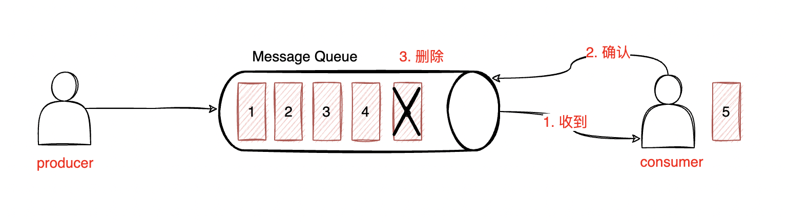

[官方文档](https://kafka.apache.org/documentation/)

### 一、Kafka概述

#### 1.1 kafka是什么


根据官网的文档，kafka是一个事件流平台，一般有以下用途：

- 发布（写入）和订阅（读取）事件流，包括从其他系统持续导入/导出数据。
- 根据需要持久可靠地存储事件流。
- 在事件发生时或回顾性地处理事件流。

所有这些功能都以分布式、高度可扩展、弹性、容错和安全的方式提供。 Kafka 可以部署在裸机硬件、虚拟机和容器上，也可以部署在本地和云端。您可以在自行管理 Kafka 环境和使用各种供应商提供的完全托管服务之间进行选择。

何为事件流，根据官网的描述：

> Technically speaking, event streaming is the practice of capturing data in real-time from event sources like databases, sensors, mobile devices, cloud services, and software applications in the form of streams of events; storing these event streams durably for later retrieval; manipulating, processing, and reacting to the event streams in real-time as well as retrospectively; and routing the event streams to different destination technologies as needed. Event streaming thus ensures a continuous flow and interpretation of data so that the right information is at the right place, at the right time.

从技术上讲，事件流是从事件源（如数据库、传感器、移动设备、云服务和软件应用程序）以事件流的形式实时捕获数据的实践； 持久存储这些事件流以供以后检索； 实时和回顾性地操作、处理和响应事件流； 并根据需要将事件流路由到不同的目标技术。 因此，事件流确保了数据的连续流动和解释，以便正确的信息在正确的时间出现在正确的位置。

听这意思就像是一个数据中转站，它可以暂存/持久存储数据，在需要的时候去里面取数据。而kafka最常用的也是作为消息队列，**它是一个分布式的基于发布/订阅的消息队列**。

#### 1.2 消息队列

对于一个网站注册的示例，一般情况下是按照用户填写注册信息、注册信息写入数据库、返回注册成功的顺序执行。


加入消息队列后，可以把发送短信的请求暂存在消息队列中，立刻把响应结果返回给用户，同时可以处理消息队列中的请求。


使用消息队列的好处：

（1）**异步**：很多情况下，用户不想也不需要立即处理消息。消息队列提供了异步处理机制，允许用户把消息放入队列中，然后在需要的时候再去处理。

（2）**削峰**：在访问量突然剧增的情况下，使用消息队列可以使关键组件顶住突发的访问压力，不会因为超负荷的请求而完全崩溃。

（3）**解耦**：允许独立的扩展或修改两边的处理过程，只要确保它们遵守同样的接口约束。当系统中一部分组件失效时，不会影响到整个系统

消息队列一般有两种模式：**点对点模式**和**发布订阅模式**。

（1）**点对点模式**：一对一，消费者主动拉取数据，消费后清除消息。生产者生产消息发送到Queue 中，然后消费者从Queue 中取出并且消费消息。消息被消费以后，queue 中不再有存储，所以消费者不可能消费到已经被消费的消息。Queue 支持存在多个消费者， 但是对一个消息而言， 只会有一个消费者可以消费。



（2）**发布/订阅模式**：一对多，消费者消费后不会清除消息。生产者（发布）将消息发布到 topic 中，同时有多个消费者（订阅）消费该消息。和点对点方式不同，发布到 topic 的消息会被所有订阅者消费。


#### 1.3 kafka基础架构


（1）broker：一台kafka服务器就是一个broker，一个kafka集群中有多个broker，每个broker中可以有多个topic。

（2）topic：主题，可以理解成一个队列，生产者和消费者面向的都是一个队列。

（3）partition：分区。为了实现扩展性，一个非常大的topic可以分布到多个broker上，一个topic可以分成多个partition，每个partition是一个有序的队列。

（4）replication：副本，为保证集群中的某个节点发生故障时，该节点上的partition数据不丢失且kafka仍然能正常工作，kafka提供了副本机制，一个topic的每个分区都有若干副本，即一个leader个若干个follower。

（5）leader： 每个分区多个副本的“主”，生产者发送数据的对象，以及消费者消费数据的对象都是 leader。

（6）follower：每个分区多个副本中的“从”，实时从 leader 中同步数据，保持和 leader 数据的同步。leader 发生故障时，某个 follower 会成为新的 leader。

（7）producer：生产者，向broker发消息的客户端。

（8）consumer：消费者，从broker取消息的客户端。

（9）consumer group：消费者组，由多个 consumer 组成。**消费者组内每个消费者负责消费不同分区的数据，一个分区只能由一个组内消费者消费**；消费者组之间互不影响，所有的消费者都属于某个消费者组，即消费者组是逻辑上的一个订阅者。

### 二、kafka集群配置

#### 2.1 下载安装配置

[下载链接](https://kafka.apache.org/downloads)

下载后进行解压


修改配置文件`config/server.properties`

```properties
#broker 的全局唯一编号，不能重复
broker.id=0
#处理网络请求的线程数量
num.network.threads=3
#用来处理磁盘 IO 的现成数量
num.io.threads=8
#发送套接字的缓冲区大小
socket.send.buffer.bytes=102400 
#接收套接字的缓冲区大小
socket.receive.buffer.bytes=102400 
#请求套接字的缓冲区大小
socket.request.max.bytes=104857600 
#kafka 运行日志存放的路径
log.dirs=/opt/module/kafka/logs
#topic 在当前 broker 上的分区个数
num.partitions=1
#用来恢复和清理 data 下数据的线程数量
num.recovery.threads.per.data.dir=1 
#segment 文件保留的最长时间，超时将被删除
log.retention.hours=168
#配置连接Zookeeper 集群地址
zookeeper.connect=192.168.1.190:2181,192.168.1.191:2181,192.168.1.192:2181
```

配置环境变量

```bash
vi /etc/profile

#KAFKA_HOME
export KAFKA_HOME=/opt/module/kafka 
export PATH=$PATH:$KAFKA_HOME/bin

source /etc/profile
```

`192.168.1.190,192.168.1.191,192.168.1.192`三台机器上同步上面的配置，`broker.id`不能重复。

启动集群

```bash
# 三台机器分别执行
bin/kafka-server-start.sh	-daemon config/server.properties
```

关闭集群

```bash
bin/kafka-server-stop.sh stop
```

#### 2.2 kafka命令行操作


##### 2.2.1 kafka-topic.sh


（1）查看当前服务器中所有的topic

```bash
./kafka-topic.sh --list --bootstrap-server localhost:9092
```


（2）创建topic

```bash
# --topic 定义topic名
# --partitions 定义分区数
# --replication-factor 定义副本数
./kafka-topic.sh --bootstrap-server localhost:9092 --create --replication-factor 3 --partitions 1 --topic first
```

（3）删除topic

```bash
./kafka-topic.sh --bootstrap-server localhost:9092 --delete --topic first
```

（4）修改分区数

```bash
./kafka-topic.sh --bootstrap-server localhost:9092 --alter --topic first --partitions 2
```

##### 2.2.2 kafka-console-producer.sh

（1）发送消息

```bash
./kafka-console-producer.sh --bootstrap-server localhost:9092 --topic first
```

##### 2.2.3 kafka-console-consumer.sh

（1）接收消息

```bash
./kafka-console-consumer.sh --bootstrap-server localhost:9092 --topic first --form-begining
```


### 三、kafka架构深入

#### 3.1 kafka工作流程


kafka中消息是以topic进行分类的，生产者生产消息，消费者消费消息，都是面向topic。

topic是逻辑上的概念，partition是物理上的概念。每个 partition 对应于一个 log 文件，该 log 文件中存储的就是 producer 生产的数据。Producer 生产的数据会被不断**追加**到该log 文件末端，且每条数据都有自己的 offset。消费者组中的每个消费者，都会实时记录自己消费到了哪个offset，以便出错恢复时，从上次的位置继续消费。


由于生产者生产的消息会不断追加到log文件末尾，为了防止log文件过大导致数据定位效率降低，kafka采取了==分片==和==索引==的机制。将每个partition分成多个segment，每个segment对应一个log文件和index文件，这些文件位于topic为文件夹下。

```properties
lxp@doraemon kafka_2.12-2.8.1 % vi config/server.properties

# The maximum size of a log segment file. When this size is reached a new lo    g segment will be created. 1GB
log.segment.bytes=1073741824
```

对于每个topic，都会在配置的log目录下生成对应的文件夹，命名规则是“**topic名 + 分区序号**”。比如名为first的topic有3个分区


在每个文件夹下，都存在log和index文件


**index和log文件以当前segment的第一条消息的offset命名**，

#### 3.2 index文件和log文件

[官方文档](https://kafka.apache.org/documentation/#log)

log文件存储数据，index文件存储索引信息，记录offset对应的物理位置，正是因为有index文件，才能对任一数据写入和查看具有O(1)复杂度。

