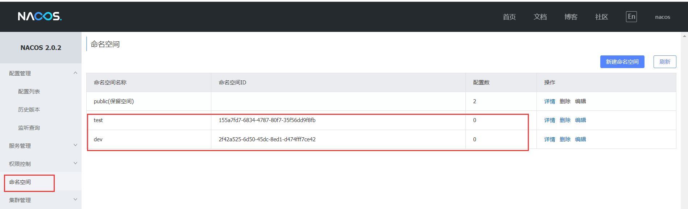

### 1、SpringCloud Alibaba介绍

#### 1.1 为什么会出现SpringCloud Alibaba

Spring Cloud Netflix项目进入维护模式。https://spring.io/blog/2018/12/12/spring-cloud-greenwich-rc1-available-now

将模块置于维护模式，意味着Spring Cloud团队将不会再向模块添加新功能。他们将修复block级别的 bug 以及安全问题，他们也会考虑并审查社区的小型pull request。

#### 1.2 SpringCloud Alibaba是什么

文档：https://github.com/alibaba/spring-cloud-alibaba/blob/master/README-zh.md

Spring Cloud Alibaba 致力于提供微服务开发的一站式解决方案。此项目包含开发分布式应用微服务的必需组件，方便开发者通过 Spring Cloud 编程模型轻松使用这些组件来开发分布式应用服务。

依托 Spring Cloud Alibaba，您只需要添加一些注解和少量配置，就可以将 Spring Cloud 应用接入阿里微服务解决方案，通过阿里中间件来迅速搭建分布式应用系统。

诞生：2018.10.31，Spring Cloud Alibaba 正式入驻了Spring Cloud官方孵化器，并在Maven 中央库发布了第一个版本。

#### 1.3 SpringCloud Alibaba能干嘛

- **服务限流降级**：默认支持 WebServlet、WebFlux, OpenFeign、RestTemplate、Spring Cloud Gateway, Zuul, Dubbo 和 RocketMQ 限流降级功能的接入，可以在运行时通过控制台实时修改限流降级规则，还支持查看限流降级 Metrics 监控。
- **服务注册与发现**：适配 Spring Cloud 服务注册与发现标准，默认集成了 Ribbon 的支持。
- **分布式配置管理**：支持分布式系统中的外部化配置，配置更改时自动刷新。
- **消息驱动能力**：基于 Spring Cloud Stream 为微服务应用构建消息驱动能力。
- **分布式事务**：使用 @GlobalTransactional 注解， 高效并且对业务零侵入地解决分布式事务问题。
- **阿里云对象存储**：阿里云提供的海量、安全、低成本、高可靠的云存储服务。支持在任何应用、任何时间、任何地点存储和访问任意类型的数据。
- **分布式任务调度**：提供秒级、精准、高可靠、高可用的定时（基于 Cron 表达式）任务调度服务。同时提供分布式的任务执行模型，如网格任务。网格任务支持海量子任务均匀分配到所有 Worker（schedulerx-client）上执行。
- **阿里云短信服务**：覆盖全球的短信服务，友好、高效、智能的互联化通讯能力，帮助企业迅速搭建客户触达通道。

#### 1.4 如何使用

如果需要使用已发布的版本，在 `dependencyManagement` 中添加如下配置。

```xml
<dependencyManagement>
    <dependencies>
        <dependency>
            <groupId>com.alibaba.cloud</groupId>
            <artifactId>spring-cloud-alibaba-dependencies</artifactId>
            <version>2.2.5.RELEASE</version>
            <type>pom</type>
            <scope>import</scope>
        </dependency>
    </dependencies>
</dependencyManagement>
```

然后在 `dependencies` 中添加自己所需使用的依赖即可使用。

#### 1.5 组件

**[Sentinel](https://github.com/alibaba/Sentinel)**：把流量作为切入点，从流量控制、熔断降级、系统负载保护等多个维度保护服务的稳定性。

**[Nacos](https://github.com/alibaba/Nacos)**：一个更易于构建云原生应用的动态服务发现、配置管理和服务管理平台。

**[RocketMQ](https://rocketmq.apache.org/)**：一款开源的分布式消息系统，基于高可用分布式集群技术，提供低延时的、高可靠的消息发布与订阅服务。

**[Dubbo](https://github.com/apache/dubbo)**：Apache Dubbo™ 是一款高性能 Java RPC 框架。

**[Seata](https://github.com/seata/seata)**：阿里巴巴开源产品，一个易于使用的高性能微服务分布式事务解决方案。

**[Alibaba Cloud OSS](https://www.aliyun.com/product/oss)**: 阿里云对象存储服务（Object Storage Service，简称 OSS），是阿里云提供的海量、安全、低成本、高可靠的云存储服务。您可以在任何应用、任何时间、任何地点存储和访问任意类型的数据。

**[Alibaba Cloud SchedulerX](https://help.aliyun.com/document_detail/43136.html)**: 阿里中间件团队开发的一款分布式任务调度产品，提供秒级、精准、高可靠、高可用的定时（基于 Cron 表达式）任务调度服务。

**[Alibaba Cloud SMS](https://www.aliyun.com/product/sms)**: 覆盖全球的短信服务，友好、高效、智能的互联化通讯能力，帮助企业迅速搭建客户触达通道。

#### 1.6 学习资料

- 官网：https://spring.io/projects/spring-cloud-alibaba#overview
- 英文
  - https://github.com/alibaba/spring-cloud-alibaba
  - https://spring-cloud-alibaba-group.github.io/github-pages/greenwich/spring-cloud-alibaba.html

- 中文：https://github.com/alibaba/spring-cloud-alibaba/blob/master/README-zh.md

### 2、nacos介绍及下载安装

#### 2.1 nacos介绍

Nacos（Dynamic Naming and Configuration Service），一个更易于构建云原生应用的动态服务发现、配置管理和服务管理平台。


通过上面的SpringCloud组件图可知，nacos这个玩意在服务注册和服务配置、服务总线都有应用，直接把Eureka、Config和Bus给替换了，一箭三雕。

总结一下nacos的作用：**注册中心＋配置中心的组合 -> Nacos = Eureka+Config+Bus**

#### 2.2 各种注册中心比较


CAP定理：https://zh.wikipedia.org/wiki/CAP%E5%AE%9A%E7%90%86


**Nacos服务发现实例模型**


**Nacos支持AP和CP模式的切换**

C是所有节点在同一时间看到的数据是一致的；而A的定义是所有的请求都会收到响应。

**何时选择使用何种模式?**

—般来说，如果不需要存储服务级别的信息且服务实例是通过nacos-client注册，并能够保持心跳上报，那么就可以选择AP模式。当前主流的服务如Spring cloud和Dubbo服务，都适用于AP模式，AP模式为了服务的可能性而减弱了一致性，因此AP模式下只支持注册临时实例。

如果需要在服务级别编辑或者存储配置信息，那么CP是必须，K8S服务和DNS服务则适用于CP模式。CP模式下则支持注册持久化实例，此时则是以Raft协议为集群运行模式，该模式下注册实例之前必须先注册服务，如果服务不存在，则会返回错误。

切换命令：

```shell
curl -X PUT '$NACOS_SERVER:8848/nacos/v1/ns/operator/switches?entry=serverMode&value=CP
```

#### 2.3 学习文档

- https://nacos.io/zh-cn/docs/what-is-nacos.html
- https://spring-cloud-alibaba-group.github.io/github-pages/greenwich/spring-cloud-alibaba.html#_spring_cloud_alibaba_nacos_discovery

#### 2.4 nacos服务器下载安装

下载前确保有jdk环境和maven环境

选择合适的版本，[点击下载](https://github.com/alibaba/nacos/releases)


下载完成后解压，然后以**单机模式**启动bin/startup.cmd

```cmd
startup.cmd -m standalone
```


### 3、nacos的服务注册功能

#### 3.1 创建服务提供者模块

如何创建分布式项目可参考：[SpringCloud入门及创建分布式项目](https://github.com/stronglxp/learnNote/blob/main/Java/SpringCloud%E7%9B%B8%E5%85%B3/SpringCloud%E5%85%A5%E9%97%A8%E5%8F%8A%E5%88%9B%E5%BB%BA%E5%88%86%E5%B8%83%E5%BC%8F%E9%A1%B9%E7%9B%AE.md)一文。

我们新建module：cloud-nacos-provider


pom.xml文件如下

```xml
<?xml version="1.0" encoding="UTF-8"?>
<project xmlns="http://maven.apache.org/POM/4.0.0" xmlns:xsi="http://www.w3.org/2001/XMLSchema-instance"
         xsi:schemaLocation="http://maven.apache.org/POM/4.0.0 https://maven.apache.org/xsd/maven-4.0.0.xsd">
    <modelVersion>4.0.0</modelVersion>
    <parent>
        <groupId>com.codeliu</groupId>
        <artifactId>springcloud-test</artifactId>
        <version>1.0-SNAPSHOT</version>
    </parent>

    <artifactId>cloud-nacos-provider</artifactId>

    <dependencies>
        <!--SpringCloud ailibaba nacos -->
        <dependency>
            <groupId>com.alibaba.cloud</groupId>
            <artifactId>spring-cloud-starter-alibaba-nacos-discovery</artifactId>
        </dependency>
        <!-- SpringBoot整合Web组件 -->
        <dependency>
            <groupId>org.springframework.boot</groupId>
            <artifactId>spring-boot-starter-web</artifactId>
        </dependency>

        <dependency>
            <groupId>org.springframework.boot</groupId>
            <artifactId>spring-boot-starter-actuator</artifactId>
        </dependency>

        <dependency>
            <groupId>org.springframework.boot</groupId>
            <artifactId>spring-boot-devtools</artifactId>
            <scope>runtime</scope>
            <optional>true</optional>
        </dependency>
        <dependency>
            <groupId>org.projectlombok</groupId>
            <artifactId>lombok</artifactId>
            <optional>true</optional>
        </dependency>
        <dependency>
            <groupId>org.springframework.boot</groupId>
            <artifactId>spring-boot-starter-test</artifactId>
            <scope>test</scope>
        </dependency>
    </dependencies>

    <build>
        <plugins>
            <plugin>
                <groupId>org.springframework.boot</groupId>
                <artifactId>spring-boot-maven-plugin</artifactId>
                <configuration>
                    <excludes>
                        <exclude>
                            <groupId>org.projectlombok</groupId>
                            <artifactId>lombok</artifactId>
                        </exclude>
                    </excludes>
                </configuration>
            </plugin>
        </plugins>
    </build>

</project>
```

application.yml文件如下

```yml
server:
  port: 10001

spring:
  application:
    name: cloud-nacos-provider
  cloud:
    nacos:
      discovery:
        server-addr: localhost:8848  # 配置本地的Nacos服务器地址
```

主启动类

```java
import org.springframework.boot.SpringApplication;
import org.springframework.boot.autoconfigure.SpringBootApplication;
import org.springframework.cloud.client.discovery.EnableDiscoveryClient;

@SpringBootApplication
@EnableDiscoveryClient
public class CloudNacosProviderApplication {
    public static void main(String[] args) {
        SpringApplication.run(CloudNacosProviderApplication.class, args);
    }
}
```

编写一个控制器

```java
import org.springframework.beans.factory.annotation.Value;
import org.springframework.web.bind.annotation.GetMapping;
import org.springframework.web.bind.annotation.PathVariable;
import org.springframework.web.bind.annotation.RestController;

@RestController
public class ProviderController {
    @Value("${server.port}")
    private String port;

    @GetMapping(value = "/payment/nacos/{id}")
    public String getPayment(@PathVariable("id") Integer id) {
        return "nacos registry, serverPort: " + port + "\t id" + id;
    }
}
```

然后启动该模块，在nacos控制台就能看到该实例已经注册到nacos。


#### 3.2 创建服务消费者模块

新建module：cloud-nacos-consumer

pom.xml文件如下

```xml
<?xml version="1.0" encoding="UTF-8"?>
<project xmlns="http://maven.apache.org/POM/4.0.0" xmlns:xsi="http://www.w3.org/2001/XMLSchema-instance"
         xsi:schemaLocation="http://maven.apache.org/POM/4.0.0 https://maven.apache.org/xsd/maven-4.0.0.xsd">
    <modelVersion>4.0.0</modelVersion>
    <parent>
        <groupId>com.codeliu</groupId>
        <artifactId>springcloud-test</artifactId>
        <version>1.0-SNAPSHOT</version>
    </parent>

    <artifactId>cloud-nacos-consumer</artifactId>

    <dependencies>
        <!--SpringCloud ailibaba nacos -->
        <dependency>
            <groupId>com.alibaba.cloud</groupId>
            <artifactId>spring-cloud-starter-alibaba-nacos-discovery</artifactId>
        </dependency>
        <dependency>
            <groupId>org.springframework.boot</groupId>
            <artifactId>spring-boot-starter-actuator</artifactId>
        </dependency>
        <dependency>
            <groupId>org.springframework.boot</groupId>
            <artifactId>spring-boot-starter-web</artifactId>
        </dependency>

        <dependency>
            <groupId>org.springframework.boot</groupId>
            <artifactId>spring-boot-devtools</artifactId>
            <scope>runtime</scope>
            <optional>true</optional>
        </dependency>
        <dependency>
            <groupId>org.projectlombok</groupId>
            <artifactId>lombok</artifactId>
            <optional>true</optional>
        </dependency>
        <dependency>
            <groupId>org.springframework.boot</groupId>
            <artifactId>spring-boot-starter-test</artifactId>
            <scope>test</scope>
        </dependency>
    </dependencies>

    <build>
        <plugins>
            <plugin>
                <groupId>org.springframework.boot</groupId>
                <artifactId>spring-boot-maven-plugin</artifactId>
                <configuration>
                    <excludes>
                        <exclude>
                            <groupId>org.projectlombok</groupId>
                            <artifactId>lombok</artifactId>
                        </exclude>
                    </excludes>
                </configuration>
            </plugin>
        </plugins>
    </build>

</project>
```

application.yml文件如下

```yml
server:
  port: 10083
spring:
  application:
    name: cloud-nacos-consumer
  cloud:
    nacos:
      discovery:
        server-addr: localhost:8848
# 消费者将要去访问的微服务名称(注册成功进nacos的微服务提供者)
service-url:
  nacos-user-service: http://cloud-nacos-provider
```

主启动类

```java
import org.springframework.boot.SpringApplication;
import org.springframework.boot.autoconfigure.SpringBootApplication;
import org.springframework.cloud.client.discovery.EnableDiscoveryClient;

@SpringBootApplication
@EnableDiscoveryClient
public class CloudNacosConsumerApplication {
    public static void main(String[] args) {
        SpringApplication.run(CloudNacosConsumerApplication.class, args);
    }
}
```

配置类

```java
import org.springframework.cloud.client.loadbalancer.LoadBalanced;
import org.springframework.context.annotation.Bean;
import org.springframework.context.annotation.Configuration;
import org.springframework.web.client.RestTemplate;

@Configuration
public class ApplicationContextConfig {
    @Bean
    @LoadBalanced
    public RestTemplate restTemplate() {
        return new RestTemplate();
    }
}
```

控制器

```java
import lombok.extern.slf4j.Slf4j;
import org.springframework.beans.factory.annotation.Autowired;
import org.springframework.beans.factory.annotation.Value;
import org.springframework.web.bind.annotation.GetMapping;
import org.springframework.web.bind.annotation.PathVariable;
import org.springframework.web.bind.annotation.RestController;
import org.springframework.web.client.RestTemplate;

@RestController
@Slf4j
public class OrderNacosController {
    @Autowired
    private RestTemplate restTemplate;

    @Value("${service-url.nacos-user-service}")
    private String serviceUrl;

    @GetMapping(value = "/consumer/nacos/{id}")
    public String paymentInfo(@PathVariable("id") Long id) {
        return restTemplate.getForObject(serviceUrl + "/payment/nacos/" + id, String.class);
    }
}
```

然后启动消费者模块，在nacos控制台可以看到服务列表


我们通过consumer去访问provider的接口


#### 3.3 Nacos的负载均衡

nacos支持负载均衡是因为spring-cloud-starter-alibaba-nacos-discovery内含netflix-ribbon包。

为了省事，我们可以直接copy一个provider进行启动


copy完成后，启动


然后通过consumer付访问provider提高的接口，通过打印可以知道是轮询访问10001/10002

### 4、nacos作为配置中心

#### 4.1 创建配置模块

新建module：cloud-nacos-config

pom.xml文件如下

```xml
<?xml version="1.0" encoding="UTF-8"?>
<project xmlns="http://maven.apache.org/POM/4.0.0" xmlns:xsi="http://www.w3.org/2001/XMLSchema-instance"
         xsi:schemaLocation="http://maven.apache.org/POM/4.0.0 https://maven.apache.org/xsd/maven-4.0.0.xsd">
    <modelVersion>4.0.0</modelVersion>
    <parent>
        <groupId>com.codeliu</groupId>
        <artifactId>springcloud-test</artifactId>
        <version>1.0-SNAPSHOT</version>
    </parent>

    <artifactId>cloud-nacos-config</artifactId>

    <dependencies>
        <!--nacos-config-->
        <dependency>
            <groupId>com.alibaba.cloud</groupId>
            <artifactId>spring-cloud-starter-alibaba-nacos-config</artifactId>
        </dependency>

        <dependency>
            <groupId>org.springframework.boot</groupId>
            <artifactId>spring-boot-starter-actuator</artifactId>
        </dependency>

        <dependency>
            <groupId>org.springframework.boot</groupId>
            <artifactId>spring-boot-devtools</artifactId>
            <scope>runtime</scope>
            <optional>true</optional>
        </dependency>
        <dependency>
            <groupId>org.projectlombok</groupId>
            <artifactId>lombok</artifactId>
            <optional>true</optional>
        </dependency>
        <dependency>
            <groupId>org.springframework.boot</groupId>
            <artifactId>spring-boot-starter-test</artifactId>
            <scope>test</scope>
        </dependency>
    </dependencies>

    <build>
        <plugins>
            <plugin>
                <groupId>org.springframework.boot</groupId>
                <artifactId>spring-boot-maven-plugin</artifactId>
                <configuration>
                    <excludes>
                        <exclude>
                            <groupId>org.projectlombok</groupId>
                            <artifactId>lombok</artifactId>
                        </exclude>
                    </excludes>
                </configuration>
            </plugin>
        </plugins>
    </build>

</project>
```

nacos和springcloud-config一样，**在项目初始化时，要保证先从配置中心进行配置拉取，拉取配置之后，才能保证项目的正常启动**。

springboot中配置文件的加载是存在优先级顺序的，bootstrap优先级高于application。所以我们拉取配置需要写在bootstrap.yml文件中，启动完bootstrap.yml把相关配置拉取下来后才能正常启动项目。

配置bootstrap.yml文件

```yml
server:
  port: 3377
spring:
  application:
    name: cloud-nacos-config
  cloud:
    nacos:
      config:
        server-addr: localhost:8848   # nacos本地服务器地址
        file-extension: yaml   # 配置文件的格式，默认properties
        group: DEFAULT_GROUP  # 分组，默认DEFAULT_GROUP
```

配置application.yml文件

```yml
spring:
  profiles:
    active: dev
```

#### 4.2 在nacos控制台增加配置信息

前面我们在bootstrap.yml文件中配置了`spring.application.name`，是因为它是构成 Nacos 配置管理 `dataId`字段的一部分。

在 Nacos Spring Cloud 中，`dataId` 的完整格式如下：

```
${prefix}-${spring.profiles.active}.${file-extension}
```

- `prefix` 默认为 `spring.application.name` 的值，也可以通过配置项 `spring.cloud.nacos.config.prefix`来配置。
- `spring.profiles.active` 即为当前环境对应的 profile，详情可以参考 [Spring Boot文档](https://docs.spring.io/spring-boot/docs/current/reference/html/boot-features-profiles.html#boot-features-profiles)。 **注意：当 `spring.profiles.active` 为空时，对应的连接符 `-` 也将不存在，dataId 的拼接格式变成 `${prefix}.${file-extension}`**
- `file-exetension` 为配置内容的数据格式，可以通过配置项 `spring.cloud.nacos.config.file-extension` 来配置。目前只支持 `properties` 和 `yaml` 类型。

最后公式：

```
${spring.application.name}-${spring.profiles.active}.${spring.cloud.nacos.config.file-extension}
```


接下来在nacos控制台新增配置


保存后，再修改启动类

```java
import org.springframework.boot.SpringApplication;
import org.springframework.boot.autoconfigure.SpringBootApplication;
import org.springframework.context.ConfigurableApplicationContext;

@SpringBootApplication
public class CloudNacosConfigApplication {
    public static void main(String[] args) {
        ConfigurableApplicationContext applicationContext = SpringApplication.run(CloudNacosConfigApplication.class, args);
        // 读取启用配置文件中的属性
        String userName = applicationContext.getEnvironment().getProperty("user.name");
        String userAge = applicationContext.getEnvironment().getProperty("user.age");
        System.err.println("user name :" +userName+"; age: "+userAge);
    }
}
```

启动项目，控制台打印


#### 4.3 动态更新配置

nacos支持动态更新配置信息。我们修改启动类代码如下

```java
import org.springframework.boot.SpringApplication;
import org.springframework.boot.autoconfigure.SpringBootApplication;
import org.springframework.context.ConfigurableApplicationContext;

import java.util.concurrent.TimeUnit;

@SpringBootApplication
public class CloudNacosConfigApplication {
    public static void main(String[] args) throws InterruptedException {
        ConfigurableApplicationContext applicationContext = SpringApplication.run(CloudNacosConfigApplication.class, args);
        while (true) {
            // 读取启用配置文件中的属性
            String userName = applicationContext.getEnvironment().getProperty("user.name");
            String userAge = applicationContext.getEnvironment().getProperty("user.age");
            System.err.println("user name :" +userName+"; age: "+userAge);
            TimeUnit.SECONDS.sleep(1);
        }
    }
}
```

while条件永远为真，每隔一秒就是获取配置文件的值。然后我们在nacos控制台修改对应配置文件中user.age的值，发现控制台打印的user.age的值也更新了。


如果要禁用自动更新，在bootstrap.yml中进行配置

```yml
spring:
  cloud:
    nacos:
      config:
        refresh:
          enabled: false
```

#### 4.4 namespace和group和dataId三者的关系

三个东西是为了解**多项目多环境**的问题。

实际开发中，通常一个系统会准备

- dev开发环境
- test测试环境
- prod生产环境

如何保证指定环境启动时服务能正确读取到Nacos上相应环境的配置文件呢?

一个大型分布式微服务系统会有很多微服务子项目，每个微服务项目又都会有相应的开发环境、测试环境、预发环境、正式环境…那怎么对这些微服务配置进行管理呢?

**nacos默认的namespace是public，默认的group是DEFAULT_GROUP**


类似Java里面的package名和类名，最外层的namespace是可以用于区分部署环境的，Group和DatalD逻辑上区分两个目标对象。


- Nacos默认的Namespace是public，Namespace主要用来实现隔离。

  比方说我们现在有三个环境：开发、测试、生产环境，我们就可以创建三个Namespace，不同的Namespace之间是隔离的。

- Group默认是DEFAULT_GROUP，Group可以把不同的微服务划分到同一个分组里面去

- Service就是微服务:一个Service可以包含多个Cluster (集群)，Nacos默认Cluster是DEFAULT，Cluster是对指定微服务的一个虚拟划分。
  比方说为了容灾，将Service微服务分别部署在了杭州机房和广州机房，这时就可以给杭州机房的Service微服务起一个集群名称(HZ) ，给广州机房的Service微服务起一个集群名称(GZ)，还可以尽量让同一个机房的微服务互相调用，以提升性能。

- 最后是Instance，就是微服务的实例

我们可以在nacos控制台创建namespace和group。

创建dev和test的namespace



回到配置列表，就能看到我们创建的namespace


分别在test和dev的namespace里新建配置文件


在bootstrap.yml中指定group和namespace就可以获取不同的配置文件了。（记住dataId的生成规则）

```yml
spring:
  application:
    name: cloud-nacos-config
  cloud:
    nacos:
      config:
        server-addr: localhost:8848   # nacos本地服务器地址
        file-extension: yaml   # 配置文件的格式，默认properties
        group: TEST_GROUP  # 分组，默认DEFAULT_GROUP
        # group: DEV_GROUP
        namespace: 155a7fd7-6834-4787-80f7-35f56dd9f8fb
        # namespace: 2f42a525-6d50-45dc-8ed1-d474fff7ce42
```

### 5、nacos集群

参考文档：https://nacos.io/zh-cn/docs/cluster-mode-quick-start.html

环境准备：centos7系统、64 bit JDK 1.8+、Maven 3.2.x+、1个Nginx+3个nacos注册中心+1个mysql

**等待更新.......**