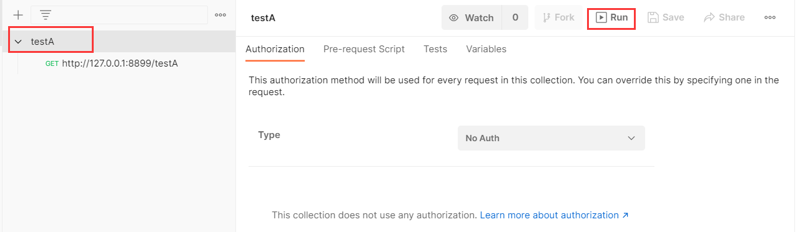
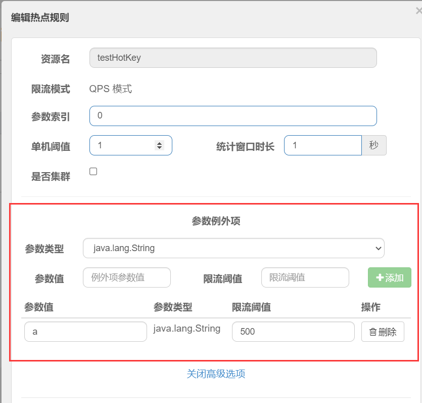

文中涉及到了一些模块代码没有给出，我一并上传到github了，可以整个项目clone下来进行调试。

地址：https://github.com/stronglxp/springcloud-test


### 0、Sentinel学习文档

仓库地址：https://github.com/alibaba/Sentinel

文档：

- https://github.com/alibaba/Sentinel/wiki/%E4%BB%8B%E7%BB%8D
- https://sentinelguard.io/zh-cn/docs/introduction.html

### 1、Sentinel是什么

随着微服务的流行，服务和服务之间的稳定性变得越来越重要。Sentinel 以流量为切入点，从流量控制、熔断降级、系统负载保护等多个维度保护服务的稳定性。

Sentinel 具有以下特征:

- 丰富的应用场景：Sentinel 承接了阿里巴巴近 10 年的双十一大促流量的核心场景，例如秒杀（即突发流量控制在系统容量可以承受的范围）、消息削峰填谷、集群流量控制、实时熔断下游不可用应用等。
- 完备的实时监控：Sentinel 同时提供实时的监控功能。您可以在控制台中看到接入应用的单台机器秒级数据，甚至 500 台以下规模的集群的汇总运行情况。
- 广泛的开源生态：Sentinel 提供开箱即用的与其它开源框架/库的整合模块，例如与 Spring Cloud、Dubbo、gRPC 的整合。您只需要引入相应的依赖并进行简单的配置即可快速地接入 Sentinel。
- 完善的 SPI 扩展点：Sentinel 提供简单易用、完善的 SPI 扩展接口。您可以通过实现扩展接口来快速地定制逻辑。例如定制规则管理、适配动态数据源等。

Sentinel 的主要特性：


Hystrix与Sentinel比较：

- Hystrix
  1. 需要我们程序员自己手工搭建监控平台
  2. 没有一套web界面可以给我们进行更加细粒度化得配置流控、速率控制、服务熔断、服务降级
- Sentinel
  1. 单独一个组件，可以独立出来。
  2. 直接界面化的细粒度统一配置。

### 2、Sentinel下载安装运行

Sentinel 分为两个部分：

- 核心库（Java 客户端）不依赖任何框架/库，能够运行于所有 Java 运行时环境，同时对 Dubbo / Spring Cloud 等框架也有较好的支持。
- 控制台（Dashboard）基于 Spring Boot 开发，打包后可以直接运行，不需要额外的 Tomcat 等应用容器。

[点击下载](https://github.com/alibaba/Sentinel/releases)控制台


运行前确保有jdk1.8环境并且8080端口没有被占用。

```cmd
java -jar sentinel-dashboard-1.8.2.jar
```

启动完成后输入localhost:8080访问即可，账号密码默认sentinel


### 3、创建sentinel模块

创建module：cloud-sentinel-service，目录结构如下


pom.xml文件如下

```xml
<?xml version="1.0" encoding="UTF-8"?>
<project xmlns="http://maven.apache.org/POM/4.0.0" xmlns:xsi="http://www.w3.org/2001/XMLSchema-instance"
         xsi:schemaLocation="http://maven.apache.org/POM/4.0.0 https://maven.apache.org/xsd/maven-4.0.0.xsd">
    <modelVersion>4.0.0</modelVersion>
    <parent>
        <groupId>com.codeliu</groupId>
        <artifactId>springcloud-test</artifactId>
        <version>1.0-SNAPSHOT</version>
    </parent>

    <artifactId>cloud-sentinel-service</artifactId>

    <dependencies>
        <!--引入cloud-api-common模块-->
        <dependency>
            <groupId>com.codeliu</groupId>
            <artifactId>cloud-api-common</artifactId>
            <version>${project.version}</version>
        </dependency>
        <!--SpringCloud ailibaba nacos -->
        <dependency>
            <groupId>com.alibaba.cloud</groupId>
            <artifactId>spring-cloud-starter-alibaba-nacos-discovery</artifactId>
        </dependency>
        <!--SpringCloud ailibaba sentinel-datasource-nacos 后续做持久化用到-->
        <dependency>
            <groupId>com.alibaba.csp</groupId>
            <artifactId>sentinel-datasource-nacos</artifactId>
        </dependency>
        <!--SpringCloud ailibaba sentinel -->
        <dependency>
            <groupId>com.alibaba.cloud</groupId>
            <artifactId>spring-cloud-starter-alibaba-sentinel</artifactId>
        </dependency>

        <dependency>
            <groupId>org.springframework.boot</groupId>
            <artifactId>spring-boot-starter-web</artifactId>
        </dependency>
        <dependency>
            <groupId>org.springframework.boot</groupId>
            <artifactId>spring-boot-starter-actuator</artifactId>
        </dependency>

        <dependency>
            <groupId>org.springframework.boot</groupId>
            <artifactId>spring-boot-starter-test</artifactId>
            <scope>test</scope>
        </dependency>
    </dependencies>

    <build>
        <plugins>
            <plugin>
                <groupId>org.springframework.boot</groupId>
                <artifactId>spring-boot-maven-plugin</artifactId>
            </plugin>
        </plugins>
    </build>

</project>
```

`application.yaml`文件如下

```yaml
server:
  port: 8899
spring:
  application:
    name: cloud-sentinel-service
  cloud:
    nacos:
      discovery:
        server-addr: localhost:8848  # nacos服务注册地址
    sentinel:
      transport:
        dashboard: localhost:8080  # sentinel dashboard的地址
        # 默认8719端口，如果8719端口被占用，那么从8719开始依次+1进行扫描，直到找到未被占用的端口
        port: 8719

management:
  endpoints:
    web:
      exposure:
        include: '*'
```

启动类加上`@EnableDiscoveryClient`注解，编写一个`FlowLimitController`类进行测试

```java
import lombok.extern.slf4j.Slf4j;
import org.springframework.web.bind.annotation.GetMapping;
import org.springframework.web.bind.annotation.RestController;

@RestController
@Slf4j
public class FlowLimitController {

    @GetMapping("/testA")
    public String testA() {
        return "------testA";
    }

    @GetMapping("/testB")
    public String testB() {
        log.info(Thread.currentThread().getName()+"\t"+"...testB");
        return "------testB";
    }
}
```

启动本地的nacos服务器和sentinel控制台，然后启动项目，登录sentinel后刷新发现并没有新的信息。登录nacos发现服务已经注册成功。这是因为**sentinel采用懒加载**，需要我们执行访问请求后才会进行监控。所以我们先访问一下上面写的接口后再刷新sentinel控制台


### 4、sentinel-流量控制

sentinel可以对每个url进行流量控制。我们可以在控制台进行配置


各项含义如下：

- 资源名：唯一名称，默认请求路径。
- 针对来源：Sentinel可以针对调用者进行限流，填写微服务名，默认default（不区分来源）。
- 阈值类型/单机阈值：
  - QPS(每秒钟的请求数量)︰当调用该API的QPS达到阈值的时候，进行限流。
  - 线程数：当调用该API的线程数达到阈值的时候，进行限流。
- 是否集群：不需要集群。
- 流控模式：
  - 直接：API达到限流条件时，直接限流。
  - 关联：当关联的资源达到阈值时，就限流自己。
  - 链路：只记录指定链路上的流量（指定资源从入口资源进来的流量，如果达到阈值，就进行限流)【API级别的针对来源】。
- 流控效果：
  - 快速失败：直接失败，抛异常。
  - Warm up：根据Code Factor（冷加载因子，默认3）的值，从阈值/codeFactor，经过预热时长，才达到设置的QPS阈值。
  - 排队等待：匀速排队，让请求以匀速的速度通过，阈值类型必须设置为QPS，否则无效。

#### 4.1 QPS直接失败

Queries Per Second意思是“每秒查询率”，是一台服务器每秒能够响应的查询次数，是对一个特定的查询服务器在规定时间内所处理流量多少的衡量标准。

直接 -> 快速失败，系统默认。表示1秒钟内最多查询1次，若超过次数1，就直接->快速失败，报默认错误。`Blocked by Sentinel (flow limiting)`


**TODO**：我们可以自定义fallback方法，失败后的处理逻辑。

#### 4.2 并发线程数直接失败

并发线程数：当同一时间调用该API的线程数达到阈值的时候，进行限流。


1s内并发线程数超过1的时候直接失败。开两个浏览器窗口，访问testB请求，手速快的同学就能看到效果了。

#### 4.3 关联模式

当自己关联的资源达到阈值时，限流自己。比如订单和支付两个接口，支付接口达到阈值的时候，就限流订单接口。

基于上面的代码，我们可以让testA接口和testB接口关联。


然后使用postman模拟并发访问testA，让testA接口达到阈值即可。





1s有1个请求testA。点击run testA后，用浏览器访问testB，发现testB被限流了。

#### 4.4 预热效果

**Warm Up**

Warm Up（`RuleConstant.CONTROL_BEHAVIOR_WARM_UP`）方式，即预热/冷启动方式。当系统长期处于低水位的情况下，当流量突然增加时，直接把系统拉升到高水位可能瞬间把系统压垮。通过"冷启动"，让通过的流量缓慢增加，在一定时间内逐渐增加到阈值上限，给冷系统一个预热的时间，避免冷系统被压垮。详细文档可以参考 [流量控制 - Warm Up 文档](https://github.com/alibaba/Sentinel/wiki/限流---冷启动)，具体的例子可以参见 [WarmUpFlowDemo](https://github.com/alibaba/Sentinel/blob/master/sentinel-demo/sentinel-demo-basic/src/main/java/com/alibaba/csp/sentinel/demo/flow/WarmUpFlowDemo.java)。

通常冷启动的过程系统允许通过的 QPS 曲线如下图所示：


默认coldFactor为3，即请求QPS 从 threshold / 3开始，经预热时长逐渐升至设定的QPS阈值。[link](https://github.com/alibaba/Sentinel/wiki/流量控制#warm-up)

**源码** - com.alibaba.csp.sentinel.slots.block.flow.controller.WarmUpController

**WarmUp配置**

案例，阀值为10+预热时长设置5秒。

系统初始化的阀值为10/ 3约等于3,即阀值刚开始为3;然后过了5秒后阀值才慢慢升高恢复到10


浏览器访问testA，一开始会直接失败，5s后稳定。

**应用场景**

如：秒杀系统在开启的瞬间，会有很多流量上来，很有可能把系统打死，预热方式就是把为了保护系统，可慢慢的把流量放进来,慢慢的把阀值增长到设置的阀值。

#### 4.5 排队等待

匀速排队（`RuleConstant.CONTROL_BEHAVIOR_RATE_LIMITER`）方式会严格控制请求通过的间隔时间，也即是让请求以均匀的速度通过，对应的是漏桶算法。详细文档可以参考 [流量控制 - 匀速器模式](https://github.com/alibaba/Sentinel/wiki/流量控制-匀速排队模式)，具体的例子可以参见 [PaceFlowDemo](https://github.com/alibaba/Sentinel/blob/master/sentinel-demo/sentinel-demo-basic/src/main/java/com/alibaba/csp/sentinel/demo/flow/PaceFlowDemo.java)。

该方式的作用如下图所示：


这种方式主要用于处理间隔性突发的流量，例如消息队列。想象一下这样的场景，在某一秒有大量的请求到来，而接下来的几秒则处于空闲状态，我们希望系统能够在接下来的空闲期间逐渐处理这些请求，而不是在第一秒直接拒绝多余的请求。

> 注意：匀速排队模式暂时不支持 QPS > 1000 的场景。

源码 - com.alibaba.csp.sentinel.slots.block.flow.controller.RateLimiterController

设置：/testB每秒1次请求，超过的话就排队等待，等待的超时时间为20000毫秒。


### 5、sentinel-熔断降级

#### 5.1 熔断降级介绍

除了流量控制以外，对调用链路中不稳定的资源进行熔断降级也是保障高可用的重要措施之一。一个服务常常会调用别的模块，可能是另外的一个远程服务、数据库，或者第三方 API 等。例如，支付的时候，可能需要远程调用银联提供的 API；查询某个商品的价格，可能需要进行数据库查询。然而，这个被依赖服务的稳定性是不能保证的。如果依赖的服务出现了不稳定的情况，请求的响应时间变长，那么调用服务的方法的响应时间也会变长，线程会产生堆积，最终可能耗尽业务自身的线程池，服务本身也变得不可用。

现代微服务架构都是分布式的，由非常多的服务组成。不同服务之间相互调用，组成复杂的调用链路。以上的问题在链路调用中会产生放大的效果。复杂链路上的某一环不稳定，就可能会层层级联，最终导致整个链路都不可用。因此我们需要对不稳定的**弱依赖服务调用**进行熔断降级，暂时切断不稳定调用，避免局部不稳定因素导致整体的雪崩。熔断降级作为保护自身的手段，通常在客户端（调用端）进行配置。


（1）慢调用比例(`SLOW_REQUEST_RATIO`)：Sentinel 1.8.0新增的策略。选择以慢调用比例作为阈值，需要设置允许的慢调用 RT（即最大的响应时间），请求的响应时间大于该值则统计为慢调用。当单位统计时长（statIntervalMs）内请求数目大于设置的最小请求数目，并且慢调用的比例大于阈值，则接下来的熔断时长内请求会自动被熔断。经过熔断时长后熔断器会进入探测恢复状态（HALF-OPEN 状态），若接下来的一个请求响应时间小于设置的慢调用 RT 则结束熔断，若大于设置的慢调用 RT 则会再次被熔断。在Sentinel 1.8.0之前，使用的是平均响应时间(`DEGRADE_GRADE_RT`)

（2）平均响应时间(DEGRADE_GRADE_RT)：当1s内持续进入5个请求，对应时刻的平均响应时间（秒级）均超过阈值（ count，以ms为单位），那么在接下的时间窗口（DegradeRule中的timeWindow，以s为单位）之内，对这个方法的调用都会自动地熔断(抛出DegradeException )。注意Sentinel 默认统计的RT上限是4900 ms，超出此阈值的都会算作4900ms，若需要变更此上限可以通过启动配置项-Dcsp.sentinel.statistic.max.rt=xxx来配置。

（3）异常比例 (ERROR_RATIO)：当单位统计时长（statIntervalMs）内请求数目大于设置的最小请求数目，并且异常的比例大于阈值，则接下来的熔断时长内请求会自动被熔断。经过熔断时长后熔断器会进入探测恢复状态（HALF-OPEN 状态），若接下来的一个请求成功完成（没有错误）则结束熔断，否则会再次被熔断。异常比率的阈值范围是 [0.0, 1.0]，代表 0% - 100%。

（4）异常数 (ERROR_COUNT)：当单位统计时长内的异常数目超过阈值之后会自动进行熔断。经过熔断时长后熔断器会进入探测恢复状态（HALF-OPEN 状态），若接下来的一个请求成功完成（没有错误）则结束熔断，否则会再次被熔断。

Sentinel熔断降级会在调用链路中某个资源出现不稳定状态时（例如调用超时或异常比例升高)，对这个资源的调用进行限制，让请求快速失败，避免影响到其它的资源而导致级联错误。

当资源被降级后，在接下来的降级时间窗口之内，对该资源的调用都自动熔断（默认行为是抛出 DegradeException）。

Sentinei的断路器是没有类似Hystrix半开状态的。(Sentinei 1.8.0 已有半开状态)

半开的状态系统自动去检测是否请求有异常，没有异常就关闭断路器恢复使用，有异常则继续打开断路器不可用。

#### 5.2 慢调用比例

配置后使用jmeter进行测试即可

#### 5.3 异常比例

配置后使用jmeter进行测试即可

#### 5.4 异常数

配置后使用jmeter进行测试即可

### 6、sentinel-热点key

[link](https://github.com/alibaba/Sentinel/wiki/%E7%83%AD%E7%82%B9%E5%8F%82%E6%95%B0%E9%99%90%E6%B5%81)

#### 6.1 何为热点key

何为热点？热点即经常访问的数据。很多时候我们希望统计某个热点数据中访问频次最高的 Top K 数据，并对其访问进行限制。比如：

- 商品 ID 为参数，统计一段时间内最常购买的商品 ID 并进行限制
- 用户 ID 为参数，针对一段时间内频繁访问的用户 ID 进行限制

热点参数限流会统计传入参数中的热点参数，并根据配置的限流阈值与模式，对包含热点参数的资源调用进行限流。热点参数限流可以看做是一种特殊的流量控制，仅对包含热点参数的资源调用生效。


Sentinel 利用 LRU 策略统计最近最常访问的热点参数，结合令牌桶算法来进行参数级别的流控。热点参数限流支持集群模式。

#### 6.2 测试

原来代码的基础上，新增加一个接口

```java
@GetMapping("/testHotKey")
@SentinelResource(value = "testHotKey", blockHandler = "dealTestHotKey")
public String testHotKey(@RequestParam(value = "p1", required = false) String p1,
                         @RequestParam(value = "p2", required = false) String p2) {
    return p1 + " " + p2;
}

/**
     * 处理sentinel的异常，注意方法必须是public类型，不然报错
     * java.lang.IllegalAccessException: Class com.alibaba.csp.sentinel.annotation.aspectj.AbstractSentinelAspectSupport can not access a member
     * @return
     */
public String dealTestHotKey(String p1, String p2, BlockException e) {
    return "处理sentinel异常";
}
```

然后在sentinel控制台配置热点规则


浏览器访问该接口，带上参数p1，超过阈值就会打印我们自定义handler方法里的信息。如果只带参数p2，则不存在热点规则。

我们还可以设置**参数例外项**，比如我们希望参数p1的值等于a的时候，它的阈值是500，其他情况阈值是1。



访问测试即可。

需要注意的是，`@SentinelResource`的`blockHandler`属性指定的方法只处理sentinel抛出的异常，对于程序自己的异常不会处理。

### 7、sentinel-系统规则

[link](https://github.com/alibaba/Sentinel/wiki/%E7%B3%BB%E7%BB%9F%E8%87%AA%E9%80%82%E5%BA%94%E9%99%90%E6%B5%81)

Sentinel 系统自适应限流从**整体维度**对应用入口流量进行控制，结合应用的 Load、CPU 使用率、总体平均 RT、入口 QPS 和并发线程数等几个维度的监控指标，通过自适应的流控策略，让系统的入口流量和系统的负载达到一个平衡，让系统尽可能跑在最大吞吐量的同时保证系统整体的稳定性。

系统规则支持以下的模式：

- **Load 自适应**（仅对 Linux/Unix-like 机器生效）：系统的 load1 作为启发指标，进行自适应系统保护。当系统 load1 超过设定的启发值，且系统当前的并发线程数超过估算的系统容量时才会触发系统保护（BBR 阶段）。系统容量由系统的 `maxQps * minRt` 估算得出。设定参考值一般是 `CPU cores * 2.5`。
- **CPU usage**（1.5.0+ 版本）：当系统 CPU 使用率超过阈值即触发系统保护（取值范围 0.0-1.0），比较灵敏。
- **平均 RT**：当单台机器上所有入口流量的平均 RT 达到阈值即触发系统保护，单位是毫秒。
- **并发线程数**：当单台机器上所有入口流量的并发线程数达到阈值即触发系统保护。
- **入口 QPS**：当单台机器上所有入口流量的 QPS 达到阈值即触发系统保护。

### 8、@SentinelResource注解

上面的代码也使用了该注解。但sentinel需要和业务代码进行解耦并且不应该一个接口一个处理方法，所以和hystrix一样，需要有全局的异常处理。

新建一个全局异常处理类

```java
import com.alibaba.csp.sentinel.slots.block.BlockException;

public class CustomerHandler {
    public static String handler1(BlockException exception) {
        return "handler1: " + exception.getMessage();
    }

    public static String handler2(BlockException exception) {
        return "handler2: " + exception.getMessage();
    }
}
```

然后在接口上进行使用

```java
@GetMapping("/hanlder")
@SentinelResource(value = "handler",
                  blockHandlerClass = CustomerHandler.class,  // 指定哪个类
                  blockHandler = "handler1")   // 指定哪个方法
public String testHandler() {
    return "testHandler";
}
```

注意：**注解方式埋点不支持 private 方法**。

`@SentinelResource` 用于定义资源，并提供可选的异常处理和 fallback 配置项。 `@SentinelResource` 注解包含以下属性：

- `value`：资源名称，必需项（不能为空）
- `entryType`：entry 类型，可选项（默认为 `EntryType.OUT`）
- `blockHandler` / `blockHandlerClass`: `blockHandler` 对应处理 `BlockException` 的函数名称，可选项。blockHandler 函数访问范围需要是 `public`，返回类型需要与原方法相匹配，参数类型需要和原方法相匹配并且最后加一个额外的参数，类型为 `BlockException`。blockHandler 函数默认需要和原方法在同一个类中。若希望使用其他类的函数，则可以指定 `blockHandlerClass` 为对应的类的 `Class` 对象，注意对应的函数必需为 static 函数，否则无法解析。
- `fallback/fallbackClass`：fallback 函数名称，可选项，用于在抛出异常的时候提供 fallback 处理逻辑。fallback 函数可以针对所有类型的异常（除了`exceptionsToIgnore`里面排除掉的异常类型）进行处理。fallback 函数签名和位置要求：
  - 返回值类型必须与原函数返回值类型一致；
  - 方法参数列表需要和原函数一致，或者可以额外多一个 `Throwable` 类型的参数用于接收对应的异常。
  - fallback 函数默认需要和原方法在同一个类中。若希望使用其他类的函数，则可以指定 `fallbackClass` 为对应的类的 `Class` 对象，注意对应的函数必需为 static 函数，否则无法解析。
- `defaultFallback`（since 1.6.0）：默认的 fallback 函数名称，可选项，通常用于通用的 fallback 逻辑（即可以用于很多服务或方法）。默认 fallback 函数可以针对所有类型的异常（除了`exceptionsToIgnore`里面排除掉的异常类型）进行处理。若同时配置了 fallback 和 defaultFallback，则只有 fallback 会生效。defaultFallback 函数签名要求：
  - 返回值类型必须与原函数返回值类型一致；
  - 方法参数列表需要为空，或者可以额外多一个 `Throwable` 类型的参数用于接收对应的异常。
  - defaultFallback 函数默认需要和原方法在同一个类中。若希望使用其他类的函数，则可以指定 `fallbackClass` 为对应的类的 `Class` 对象，注意对应的函数必需为 static 函数，否则无法解析。
- `exceptionsToIgnore`（since 1.6.0）：用于指定哪些异常被排除掉，不会计入异常统计中，也不会进入 fallback 逻辑中，而是会原样抛出。

1.8.0 版本开始，`defaultFallback` 支持在类级别进行配置。

> 注：1.6.0 之前的版本 fallback 函数只针对降级异常（`DegradeException`）进行处理，**不能针对业务异常进行处理**。

特别地，若 blockHandler 和 fallback 都进行了配置，则被限流降级而抛出 `BlockException` 时只会进入 `blockHandler` 处理逻辑。若未配置 `blockHandler`、`fallback` 和 `defaultFallback`，则被限流降级时会将 `BlockException` **直接抛出**（若方法本身未定义 throws BlockException 则会被 JVM 包装一层 `UndeclaredThrowableException`）。

### 9、sentinel + ribbon + openfeigin 服务熔断