### 1、了解微服务

#### 1.1 什么是微服务

- 微服务是一种架构风格
- 一个应用拆分为一组小型服务
- 每个服务运行在自己的进程内，也就是可独立部署和升级
- 服务之间使用轻量级HTTP交互
- 服务围绕业务功能拆分
- 可以由全自动部署机制独立部署
- 去中心化，服务自治。服务可以使用不同的语言、不同的存储技术

#### 1.2 微服务架构

- 服务调用
- 服务降级
- 服务注册与发先
- 服务熔断
- 负载均衡
- 服务消息队列
- 服务网关
- 配置中心管理
- 自动化构建部署
- 服务监控
- 全链路追踪
- 服务定时任务
- 调度操作

### 2、了解SpringCloud

#### 2.1 SpringCloud是什么

**SpringCloud是分布式微服务架构的站式解决方案，是多种微服务架构落地技术的集合体，俗称微服务全家桶**。

官方文档：https://spring.io/projects/spring-cloud

> Spring Cloud provides tools for developers to quickly build some of the common patterns in distributed systems (e.g. configuration management, service discovery, circuit breakers, intelligent routing, micro-proxy, control bus, one-time tokens, global locks, leadership election, distributed sessions, cluster state).    ---摘自官网

根据官方对SpringCloud的描述，SpringCloud提供了一系列工具，能够让开发者快速的构建分布式系统。所以SpringCloud并不是一个新技术，只是整合了一些常用的技术进行封装，然后结合SpringBoot，我们就可以快速构建分布式项目。

SpringCloud包含了很多的技术，看官网的目录就知道了，一个屏幕都截不全。往往一个技术还没学会就告诉我已经不用了，特喵的。

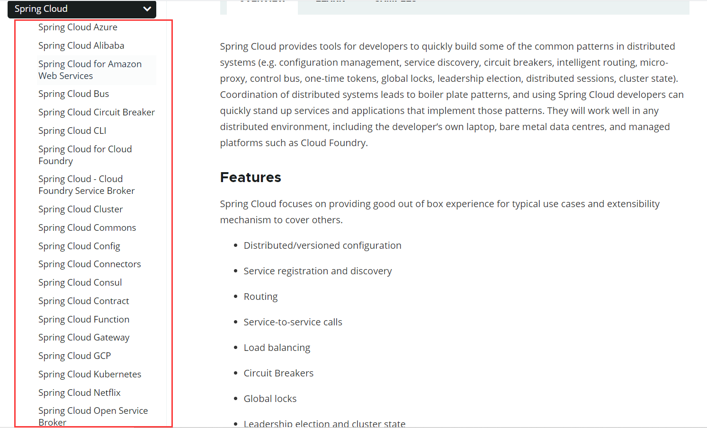

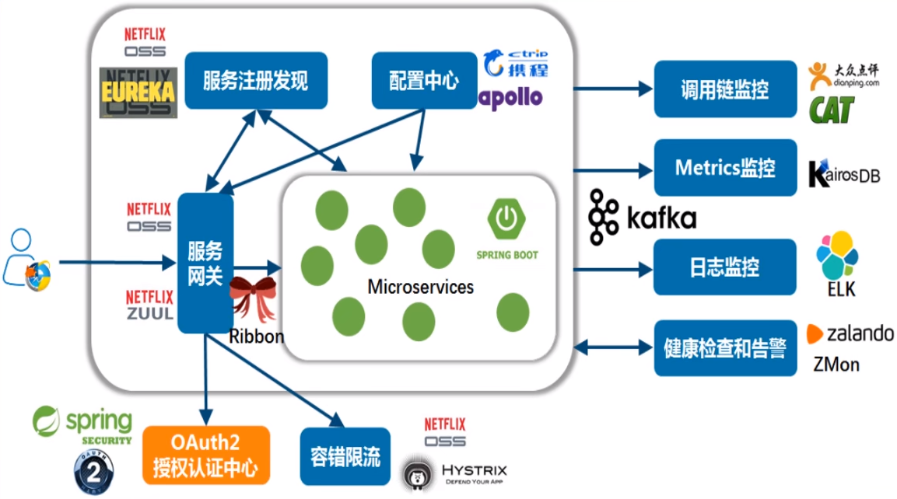


#### 2.2 SpringCloud停更组件和替换

SpringCloud的Hoxton版本，和之前的版本相比，用新的组件替换掉了原来大部分的组件，老的组件现在处于 **停更不停用** 的状况。

详情见下图（**×** 的表示之前的组件，现在停更了的；**√** 的表示新的替换后的组件）：

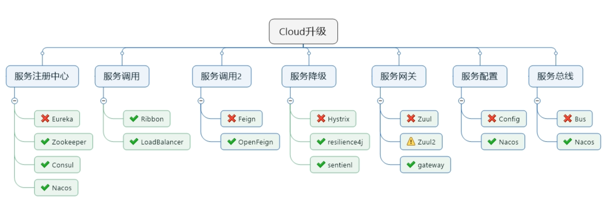

> 服务注册中心

Eureka：官方停止更新，并且已经有更好的替代产品了，可以使用，但是官方已经不建议使用了。

Zookeeper：某些老系统，以前是用的Zookeeper + Dubbo，后来做技术升级，结果发现SpringCloud的Eureka停更了，然后就用了最少的技术切换，那么就用了Zookeeper做注册中心。

Consul：go语言开发的，也是一个优秀的服务注册框架，但是使用量较少，风头都被Nacos抢了。

Nacos：来自于SpringCloudAlibaba，在企业中经过了百万级注册考验的，不但可以完美替换Eureka，还能做其他组件的替换，所以强烈建议使用，是学习的重点。

> 服务调用

Ribbon：也进入了维护状态，停止更新了，但是Spring官方还在使用。

LoadBalancer：Spring官方推出的一个新的组件，打算逐渐取代掉Ribbon，但是现在还处于萌芽状态。

> 服务调用2

Feign：Netflix 公司产品，也停止更新了。

OpenFeign：Spring社区等不了Netflix更新了，然后就自己做了一个组件，不用Feign了。

> 服务降级

Hystrix：官网不推荐使用，但是中国企业中还在大规模使用。

Resilience4J：官网推荐使用，但是国内很少用这个。

Sentienl：来自于SpringCloudAlibaba，在中国企业替换Hystrix的组件，国内强烈建议使用。

> 服务网关

Zuul：Netflix 公司产品，公司内部产生分歧，有的人想自己出一个Zuul2。

Zuul2：也是Netflix 公司准备出的产品，但是由于内部分歧，所以Zuul2已经胎死腹中了。

gateway：Spring社区自己出的网关组件，官方隆重介绍和极度推荐的网关服务组件。

> 服务配置

Config：目前也在使用，风头被Nacos抢了。

Nacos：来自于SpringCloudAlibaba，后来居上，把Config给替换了。

> 服务总线

Bus：SpringCloud原生的服务总线组件，现在风头也被Nacos抢了。

Nacos：来自于SpringCloudAlibaba，后来居上，把Bus给替换了。

---

综上可以看出，Nacos 是重中之重，一个组件就替换掉了原来的几个组件。

### 3、创建分布式项目

分布式项目和单体项目不一样，一般都会分为多个模块，构成父工程子工程的关系。一般单个SpringBoot项目，pom文件总是有这么一段

```xml
<parent>
    <groupId>org.springframework.boot</groupId>
    <artifactId>spring-boot-starter-parent</artifactId>
    <version>2.1.2.RELEASE</version>
    <relativePath/> <!-- lookup parent from repository -->
</parent>
```

父项目指定为SringBoot某个版本，后续使用相关的jar包都继承父项目指定的版本信息。

下面来新建一个分布式项目的父工程

#### 3.1 创建父工程

创建微服务cloud整体聚合父工程Project，有8个关键步骤：

（1）New Project - maven工程 
（2）聚合总父工程名字
（3）Maven选版本
（4）工程名字
（5）字符编码 - Settings - File encoding
（6）注解生效激活 - Settings - Annotation Processors
（7）Java编译版本选8
（8）File Type过滤 - Settings - File Type

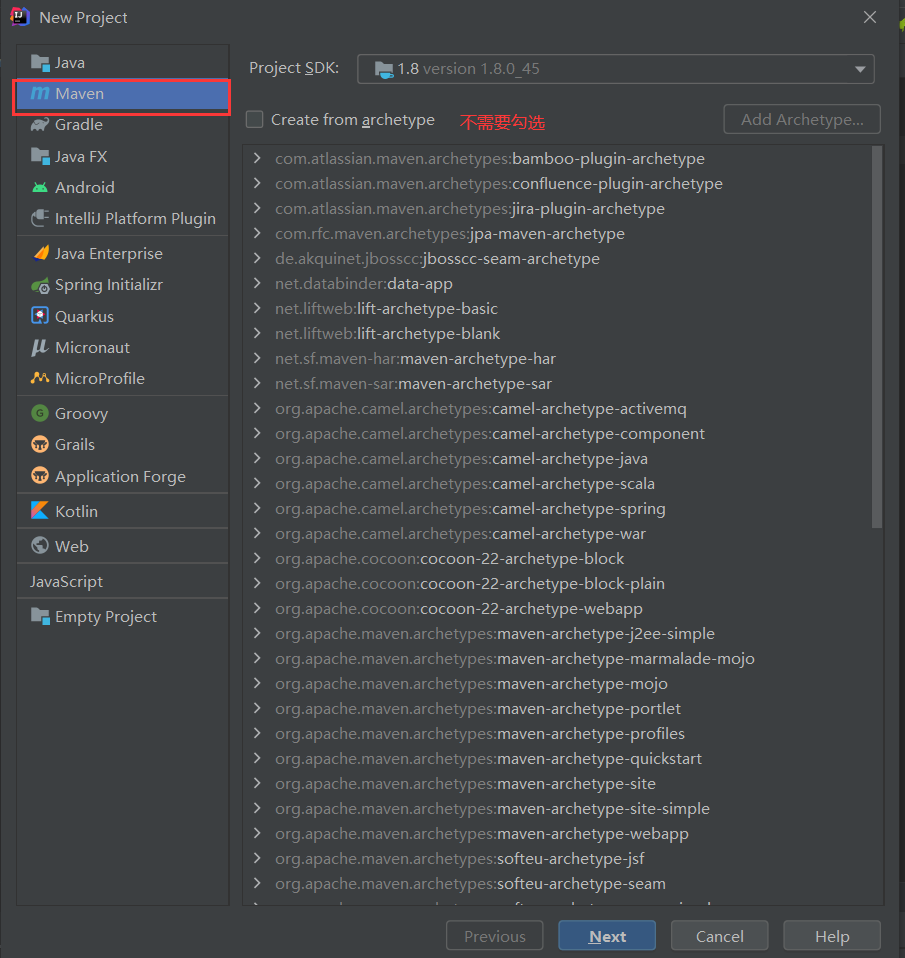

创建完后，可以把src目录删除，因为父工程不需要，删除后变成了下面这样

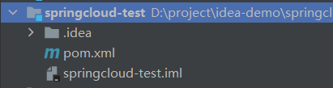

然后需要修改pom.xml文件，**注意看注释**

```xml
<?xml version="1.0" encoding="UTF-8"?>
<project xmlns="http://maven.apache.org/POM/4.0.0"
         xmlns:xsi="http://www.w3.org/2001/XMLSchema-instance"
         xsi:schemaLocation="http://maven.apache.org/POM/4.0.0 http://maven.apache.org/xsd/maven-4.0.0.xsd">
    <modelVersion>4.0.0</modelVersion>

    <groupId>com.codeliu</groupId>
    <artifactId>springcloud-test</artifactId>
    <version>1.0-SNAPSHOT</version>
    <!--父工程的打包方式必须为pom-->
    <packaging>pom</packaging>

    <!--统一管理jar包版本号-->
    <properties>
        <project.build.sourceEncoding>UTF-8</project.build.sourceEncoding>
        <maven.compiler.source>8</maven.compiler.source>
        <maven.compiler.target>8</maven.compiler.target>
        <junit.version>4.12</junit.version>
        <log4j.version>1.2.17</log4j.version>
        <lombok.version>1.16.18</lombok.version>
        <mysql.version>8.0.11</mysql.version>
        <druid.version>1.1.16</druid.version>
        <mybatis.spring.boot.version>1.3.0</mybatis.spring.boot.version>
    </properties>

    <!--声明依赖jar包和指定版本，并不实现引入，由子项目进行引入，子项目如果不指定版本则使用父项目申明的版本，也可以指定版本进行覆盖-->
    <dependencyManagement>
        <dependencies>
            <!--spring boot 2.2.2-->
            <dependency>
                <groupId>org.springframework.boot</groupId>
                <artifactId>spring-boot-dependencies</artifactId>
                <version>2.2.2.RELEASE</version>
                <type>pom</type>
                <scope>import</scope>
            </dependency>
            <!--spring cloud Hoxton.SR1-->
            <dependency>
                <groupId>org.springframework.cloud</groupId>
                <artifactId>spring-cloud-dependencies</artifactId>
                <version>Hoxton.SR1</version>
                <type>pom</type>
                <scope>import</scope>
            </dependency>
            <!--spring cloud alibaba 2.1.0.RELEASE-->
            <dependency>
                <groupId>com.alibaba.cloud</groupId>
                <artifactId>spring-cloud-alibaba-dependencies</artifactId>
                <version>2.1.0.RELEASE</version>
                <type>pom</type>
                <scope>import</scope>
            </dependency>
            <dependency>
                <groupId>mysql</groupId>
                <artifactId>mysql-connector-java</artifactId>
                <version>${mysql.version}</version>
            </dependency>
            <dependency>
                <groupId>com.alibaba</groupId>
                <artifactId>druid</artifactId>
                <version>${druid.version}</version>
            </dependency>
            <dependency>
                <groupId>org.mybatis.spring.boot</groupId>
                <artifactId>mybatis-spring-boot-starter</artifactId>
                <version>${mybatis.spring.boot.version}</version>
            </dependency>
            <dependency>
                <groupId>junit</groupId>
                <artifactId>junit</artifactId>
                <version>${junit.version}</version>
            </dependency>
            <dependency>
                <groupId>log4j</groupId>
                <artifactId>log4j</artifactId>
                <version>${log4j.version}</version>
            </dependency>
            <dependency>
                <groupId>org.projectlombok</groupId>
                <artifactId>lombok</artifactId>
                <version>${lombok.version}</version>
                <optional>true</optional>
            </dependency>
        </dependencies>
    </dependencyManagement>

    <build>
        <plugins>
            <plugin>
                <groupId>org.springframework.boot</groupId>
                <artifactId>spring-boot-maven-plugin</artifactId>
                <configuration>
                    <fork>true</fork>
                    <addResources>true</addResources>
                </configuration>
            </plugin>
        </plugins>
    </build>
</project>
```

关于`dependencyManagement`和`dependencies`，Maven使用dependencyManagement元素来管理依赖版本号。通常会在一个组织或者项目的最顶层的父POM中看到dependencyManagement元素。

使用pom.xml中的dependencyManagement元素能让所有子项目中引用依赖而不用显式的列出版本号。

Maven会沿着父子层次向上走，直到找到一个拥有dependencyManagement元素的项目，然后它就会使用这个
dependencyManagement元素中指定的版本号。

比如在父项目中声明了数据库驱动的jar

```xml
<dependency>
    <groupId>mysql</groupId>
    <artifactId>mysql-connector-java</artifactId>
    <version>8.0.11</version>
</dependency>
```

那么在子项目中，就不需要指定版本号了

```xml
<dependency>
    <groupId>mysq1</groupId>
    <artifactId>mysql-connector-java</artifactId>
</dependency>
```

这样做的好处就是：如果有多个子项目都引用同一样依赖，则可以避免在每个使用的子项目里都声明一个版本号，这样当想升级或切换到另一个版本时，只需要在顶层父容器里更新，而不需要一个一个子项目的修改；另外如果某个子项目需要另外的一个版本，只需要声明version即可。

dependencyManagement里只是声明依赖，并不实现引入，因此子项目需要显示的声明需要用的依赖。如果不在子项目中声明依赖，是不会从父项目中继承下来的；只有在子项目中写了该依赖项,并且没有指定具体版本，才会从父项目中继承该项，并且version和scope都读取自父pom。

如果子项目中指定了版本号，那么会使用子项目中指定的jar版本。

另外关于`springcloud`的版本号，指定的是`Hoxton.SR1`，这也是有说法的。具体可以参考：https://juejin.cn/post/6844903922511904776

#### 3.2 创建子项目

在父工程上右键新建

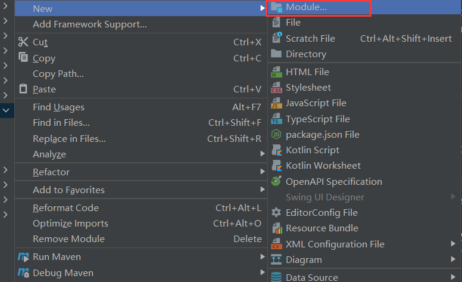

我们的子项目是什么类型的就建什么类型的，这里新建一个SpringBoot项目，填写相关信息

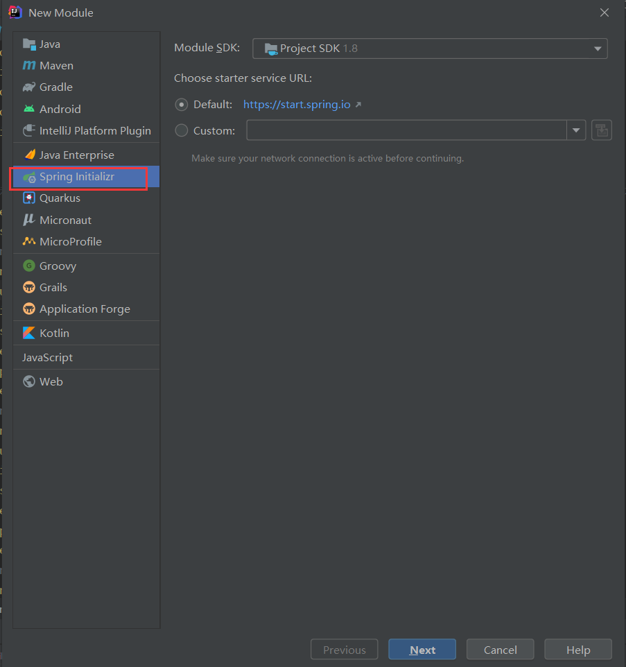

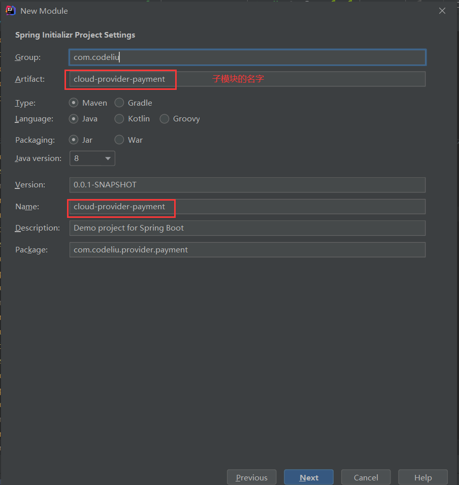

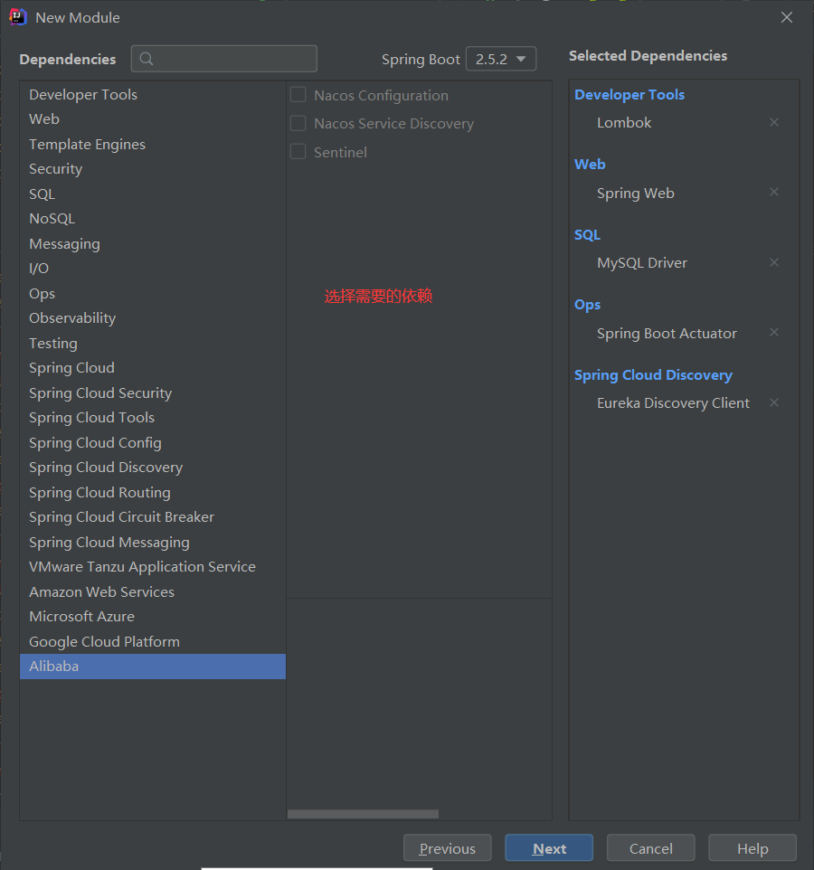

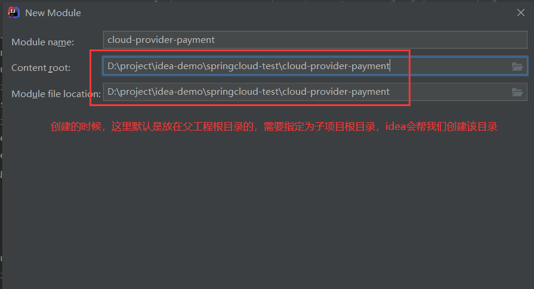

创建完成后的目录结构如下

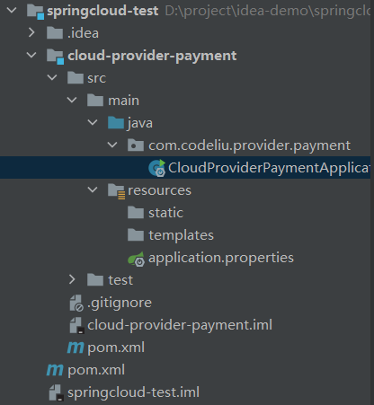

然后我们需要修改父项目和子项目的pom文件进行关联

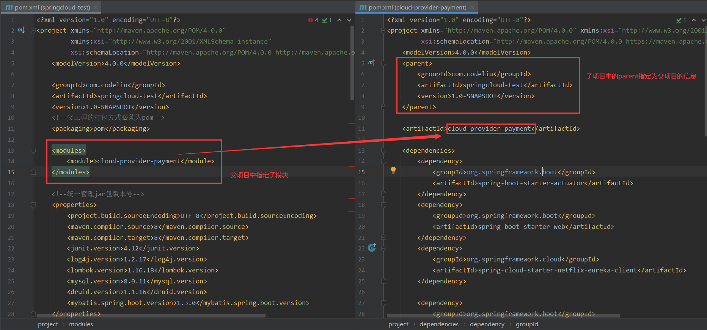

创建其他的子项目都是一样的步骤。

在子项目中如果要互相引用，比如某个子模块要引入`cloud-provider-payment`模块，直接在pom文件中进行指定即可

```xml
<dependency>
    <groupId>com.codeliu</groupId>
    <artifactId>cloud-provider-payment</artifactId>
    <version>1.0-SNAPSHOT</version>
</dependency>
```

**参考**：

- SpringCloud停更组件和替换：https://www.cnblogs.com/y3blogs/p/13276504.html
- https://blog.csdn.net/u011863024/article/details/114298270
- SpringCloud版本说明：https://juejin.cn/post/6844903922511904776