### 一、Zookeeper概述

#### 1、概述

Zookeeper 是一个开源的为分布式框架提供协调服务的 Apache 项目。在分布式系统中，扮演**注册中心**的角色。

Zookeeper数据模型的结构与Linux文件系统很像，整体上可以看做一棵树，从根节点往下，每个节点称为ZNode。每一个ZNode默认能够存储1MB的数据，每个ZNode都对应一个唯一的路径，类似于Linux中的文件路径。

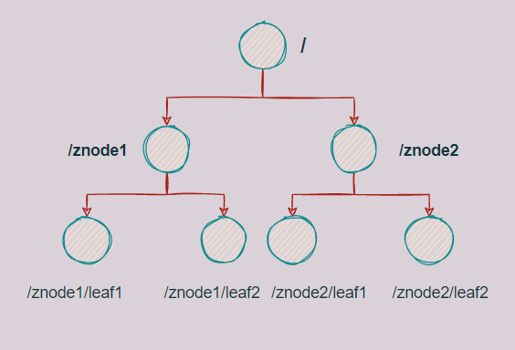


Zookeeper从设计模式角度来理解：是一个基于**观察者模式**设计的分布式服务管理框架，它负责存储和管理大家都关心的数据，然后接受观察者的注册，一旦这些数据的状态发生变化，Zookeeper就 将负责通知已经在Zookeeper上注册的那些观察者，做出相应的反应。

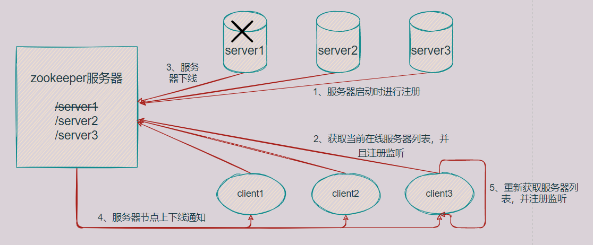

#### 2、特点

（1）Zookeeper：一个领导者（Leader），多个跟随者（Follower）组成的集群。

（2）集群中只要有**半数以上**节点存活，Zookeeper集群就能正常提供服务。所以Zookeeper集群适合安装**奇数台**服务器。

（3）全局数据一致：每个Server保存一份相同的数据副本，Client无论连接到哪个Server，数据都是一样的。

（4）更新请求顺序执行，来自同一个Client的更新请求按其发送顺序依次执行。

（5）数据更新具有原子性，一次更新要么成功要么失败。

（6）实时性，在一定时间范围内，Client能读到最新数据。

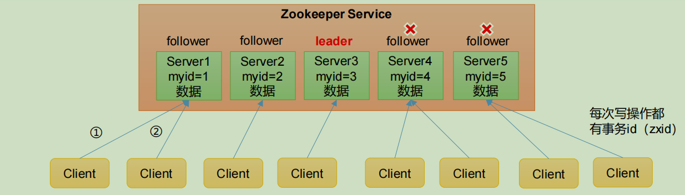

#### 3、应用场景

Zookeeper能提供的服务包括：**统一命名服务、统一配置管理、统一集群管理、服务器节点动态上下线、软负载均衡**等。

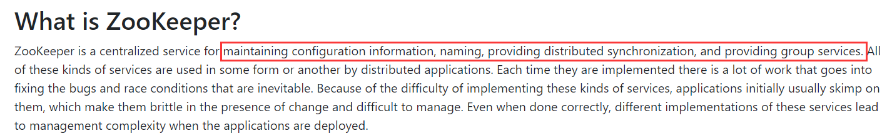

（1）**统一命名服务**

在分布式环境下，经常需要对应用或者服务进行统一命名，便于识别。例如IP和域名的对应关系，一般我们都是输入域名即可访问对应网站，但其实内部使用DNS把域名解析成了对应的IP地址。

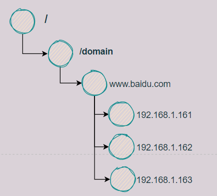

（2）**统一配置管理**

在分布式系统中，一个集群里各个服务器的配置文件在修改后经常需要进行同步，手动同步容易出错并且耗时耗力，利用Zookeeper监听的功能，可以很好的实现这个功能。

可以将共同的配置文件写入Zookeeper的一个节点中，然后各个Client监听这个节点，一旦节点中的内容发生变化时，Zookeeper就通知各个Client。

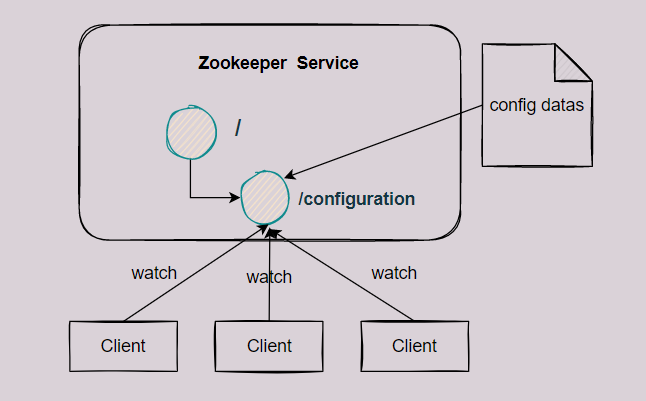

（3）**统一集群管理**

分布式环境中，实时监控节点的状态是很有必要的，这样可以依据节点的状态动态的做出一些调整。可以将节点信息写入Zookeeper的ZNode中，然后监听这个ZNode就可以获取它的实时状态变化了。

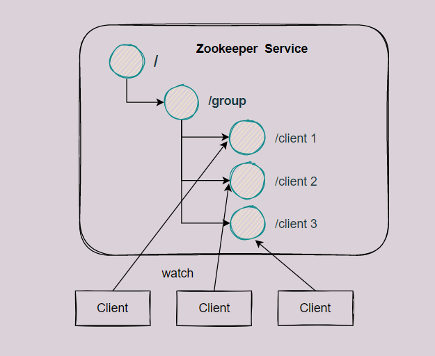

（4）**服务器动态上下线通知**

这个第一小节就讲了。


（5）**软负载均衡**

在Zookeeper中记录每台服务器的访问数，这样有新的客户端请求到来时，可以让访问数最少的服务器处理请求。

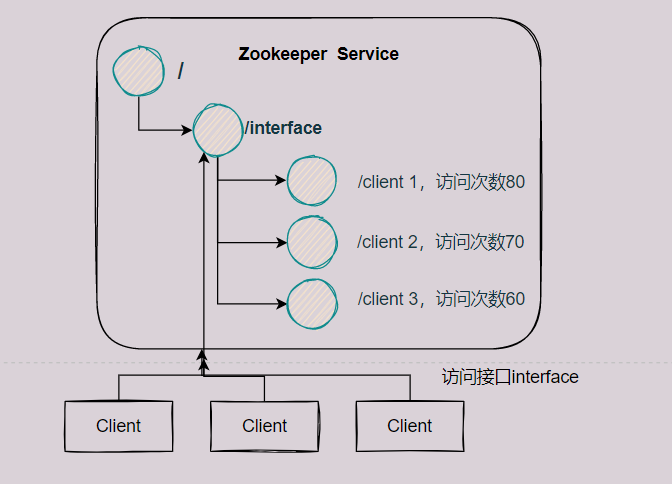

### 二、Zookeeper安装配置启动

#### 1、安装

进入[下载地址](https://archive.apache.org/dist/zookeeper/)，选择对应的版本下载

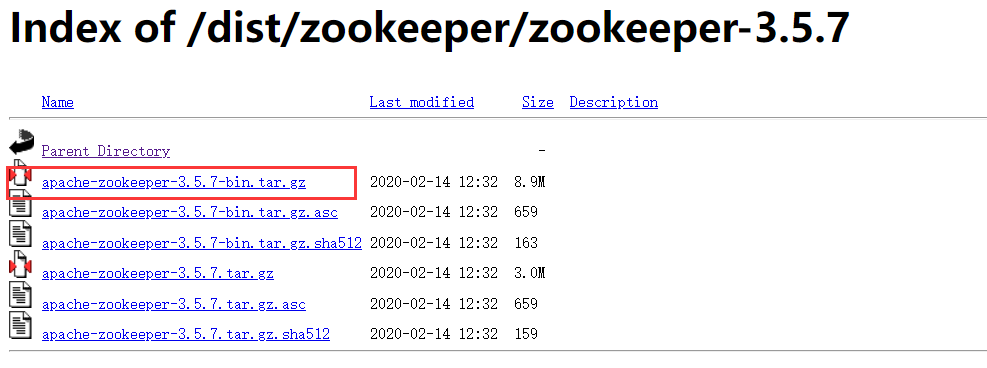

下载后放到Linux某个目录下解压即可。

#### 2、配置

解压完毕后，来到zookeeper文件夹conf目录下拷贝一份配置文件，命名为`zoo.cfg`

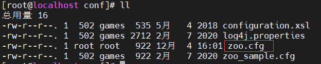

将dataDir的目录修改成自定义的目录，因为/tmp目录下的文件容易被清理掉。

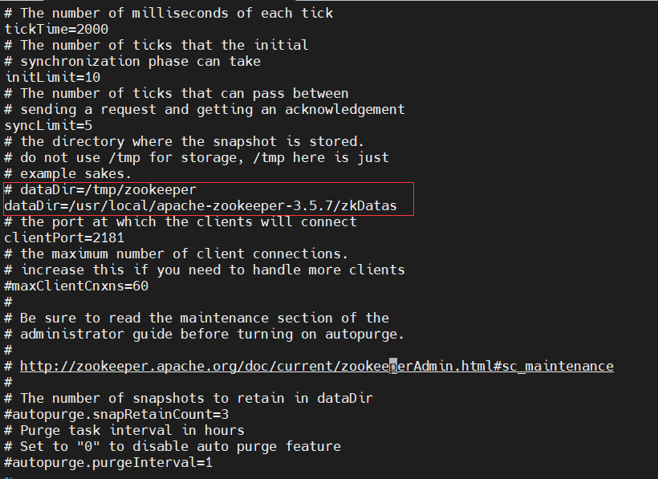

除了dataDir，上面还有几个配置项如下：

（1）tickTime，默认2000ms。通信心跳时间，即客户端和服务器或者服务器和服务器之间2s会发送一次心跳，检测机器的工作状态是否正常。

（2）initLimit，默认10次。LF初始通信时限，即集群中的FL（Follow和Leader）服务器之间**初始连接**时能容忍的最多心跳数（tickTime的数量）。

（3）syncLimit，默认5次。LF同步通信时限，即集群中的FL（Follow和Leader）服务器之间一次请求和响应能容忍的最大心跳数。LF之间如果通信时间超过syncLimit * tickTime，Leader则会认为Follow出故障了，将会从服务器列表中删除Follow。

（4）dataDir，Zookeeper数据存放路径。

（5）clientPort，客户端连接端口，默认2181。

#### 3、启动

```shell
# 可选参数
./zkServer.sh [--config <conf-dir>] {start|start-foreground|stop|restart|status|print-cmd}
# 启动
./zkServer.sh start
# 查看状态
./zkServer.sh status
# 重启
./zkServer.sh restart
# 停止
./zkServer.sh stop

# 启动客户端
./zkCli.sh
# 退出客户端
[zk: localhost:2181(CONNECTED) 3] quit
```

### 三、Zookeeper集群配置

因为Zookeeper集群的规则是半数以上的服务器可用则这个集群可用，所以集群中**最少需要3台以上的服务器并且服务器的数量最好是奇数**。

为什么是奇数，因为在相同容错能力的情况下，奇数台服务器更节省资源。比如3台服务器的集群，至少要2台以上服务器正常工作这个集群才可用，也就是最多允许1台服务器宕机；4台服务器的集群，至少需要3台以上服务器正常工作这个集群才可用，也就是最多允许1台服务器宕机。3台或者4台服务器的集群，都至多允许一台服务器宕机，容错能力相同的情况下，4台服务器就浪费了一台的数量。

另外一个原因是因为follow在选举leader的时候，要求可用节点数量 > 总节点数量 / 2。如果集群的节点数量为偶数台，那么就可能出现无法选举出Leader的情况。具体参考[这篇文章](https://blog.csdn.net/u010476994/article/details/79806041)

简单点，这里我们的集群中有3个节点，即3个Zookeeper服务器。

#### 1、解压安装

跟上面单机一样，分别下载解压到3台服务器的指定目录。

#### 2、配置服务器编号

在服务器的zookeeper文件夹的根目录下创建zkDatas文件夹，并在zkDatas文件夹下创建一个myid的文件，在文件中添加server对应的编号，集群中唯一。

```shell
cd /usr/local/apache-zookeeper-3.5.7
mkdir zkDatas
cd zkDatas
vi myid

## 服务器1的myid文件内容如下，对应的，服务器2的myid内容为2，服务器3的myid内容为3
1
```

#### 3、配置zoo.cfg文件

配置三个服务器的zoo.cfg文件内容如下

```shell
# 拷贝zoo_sample.cfg文件
cp -r zoo_sample.cfg zoo.cfg
vi zoo.cfg

## zoo.cfg文件内容如下
dataDir=/usr/local/apache-zookeeper-3.5.7/zkDatas
#######################cluster##########################
server.1=192.168.1.128:2888:3888
server.2=192.168.1.129:2888:3888
server.3=192.168.1.130:2888:3888
```

关于上面集群的配置`server.A=B:C:D`解释如下

- A是一个数字，表示第几号服务器。之前我们配置了myid文件，A的值就是myid文件中的值。zookeeper在启动的时候会读取此文件，拿到里面的文件内容后再和zoo.cfg文件里的配置进行比较，判断是哪个服务器。
- B代表服务器的地址。
- C是Leader和Follow交换信息的端口。
- D是当集群中的Leader服务器歇逼的时候，重新选举时的通信端口。

#### 4、启动各个服务器

启动完后，就会告诉你谁是leader谁是follow。

```shell
[root@localhost apache-zookeeper-3.5.7]# bin/zkServer.sh status
JMX enabled by default
Using config: /usr/local/apache-zookeeper-3.5.7/bin/../conf/zoo.cfg
Mode: follower

[root@localhost apache-zookeeper-3.5.7]# bin/zkServer.sh status
JMX enabled by default
Using config: /usr/local/apache-zookeeper-3.5.7/bin/../conf/zoo.cfg
Mode: leader

[root@localhost apache-zookeeper-3.5.7]# bin/zkServer.sh status
JMX enabled by default
Using config: /usr/local/apache-zookeeper-3.5.7/bin/../conf/zoo.cfg
Mode: follower
```

### 四、Zookeeper的选举机制

单机模式下不涉及选举，只有在集群模式下才会进行选举。Leader选举一般发生在下面两种情况：第一次启动集群的时候和集群运行过程中Leader挂了。这两种情况下Leader的选举机制时不同的，需要分开讨论。

在学习选举机制之前，需要先学习几个概念。

- SID：服务器ID，即myid文件中的值，用来唯一标识一台Zookeeper集群中的机器，不能重复。
- ZXID：zookeeper transaction id，即zookeeper事务id，用来标识一次服务器状态的变更。在某一时刻，集群中每台机器的zxid大概率是不同的。
- Epoch：逻辑时钟，也叫投票的次数，每投完一次票这个值就会增加，同一轮投票过程中逻辑时钟的值是相同的。

#### 1、第一次启动时的选举机制

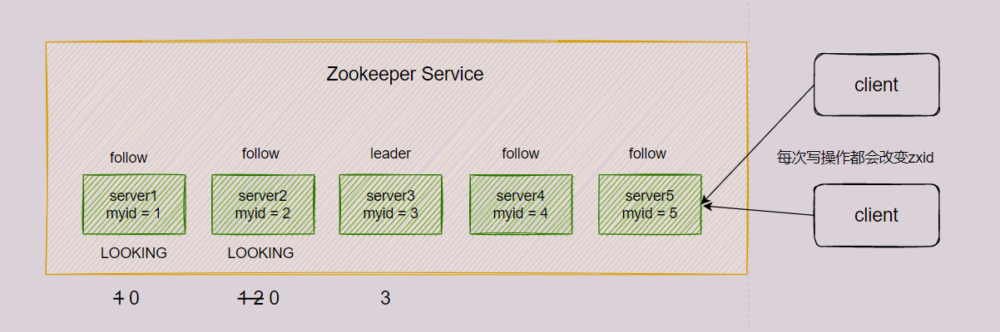

（1）server1启动后，发起一次选举。server1投自己一票，此时server1共有1票，不够半数以上（3票），无法产生Leader，server1状态保持LOOKING。

（2）server2启动，发起一次选举。server1和server2各投自己一票并交换选票信息，此时server1发现server2的SID比自己目前投票的（也就是它自身）更大，于是更改投票为server2。此时server1共有0票，server2共有2票，不够半数以上，无法产生leader，server1和server2状态保持LOOKING。

（3）server3启动，发起一次选举。和（2）一样，server1和server2最终都会把票投给server3，那么此时server1和server2的票数就为0，而server3的票数为3，超过了半数，server3变成leader。server1和server2更改状态为FOLLOWING，server3更改状态为LEADING。

（4）server4启动，发起一次选举。此时server1和server2都不是LOOKING状态，所以不会更改选票信息，所以最终server4少数服从多数，把选票投给server3，此时server3总票数为4，其他三台服务器总票数都为0。

（5）server4启动，发起一次选举。和（4）一样的流程。

#### 2、非第一次启动时的选举机制

当集群中出现下面的情况时，会触发leader选举机制

（1）集群运行过程中，有新的服务器节点加入。

（2）follow服务器无法和leader服务器通信时，follow会认为leader挂了。

当触发选举机制时，集群可能存在两种情况

（1）集群中此时已经存在leader。那么在这种情况下，只需要告诉发起选举的服务器有关leader的相关信息，让该服务器和leader建立连接并进行状态同步即可。

（2）集群中此时不存在leader。

还是用上一小节的图来说，集群中5台server，SID分别是1,2,3,4,5，ZXID分别是8,8,8,7,7，server3是leader。此时server3和server5挂了，follow服务器都会把自己的状态变成LOOKING，开始进行leader选举。

这里就需要用到上面说过的三个概念：Epoch、SID和ZXID。选举Leader规则：

- Epoch大的直接胜出 
- Epoch相同，ZXID大的胜出 
- ZXID相同，SID大的胜出

对于剩下的server1、server2和server4，它们的(Epoch, ZXID, SID)的值分别是(1, 8, 1)、(1, 8, 2)、(1, 7, 4)。所以最后的leader就是server2。

### 五、客户端相关的命令

```shell
# 启动客户端
./zkCli.sh
# help命令，可以显式所有的操作命令
[zk: localhost:2181(CONNECTED) 0] help
```

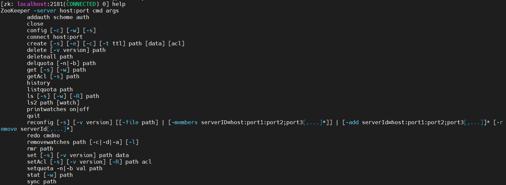

一些比较常见的如下

（1）`ls [-s] [-w] [-R] path`，查看对应path下的子节点，`-w`表示监听子节点变化，`-s`附加次级信息。

（2）`create path`，在对应path下创建一个节点，`-s`表示节点带序号，`-e`表示创建临时节点，重启后或者超时就会被删除。

（3）`get path`，获得节点的值（可监听）。`-w`表示监听节点内容变化，`-s`表示附加次级信息。

（4）`set path data`，设置节点的具体值。

（5）`stat path`，查看节点状态。

（6）`delete path`，删除节点。

（7）`deleteall path`，递归删除节点。

#### 1、查看ZNode节点信息

```shell
[zk: localhost:2181(CONNECTED) 4] ls /
[zookeeper]

[zk: localhost:2181(CONNECTED) 5] ls -s /
[zookeeper]cZxid = 0x0
ctime = Thu Jan 01 08:00:00 CST 1970
mZxid = 0x0
mtime = Thu Jan 01 08:00:00 CST 1970
pZxid = 0x0
cversion = -1
dataVersion = 0
aclVersion = 0
ephemeralOwner = 0x0
dataLength = 0
numChildren = 1
```

`ls -s path`可以查看节点的详细数据。

（1）cZxid：创建节点的事务id

每次修改 ZooKeeper 状态都会产生一个 ZooKeeper 事务 ID。事务 ID 是 ZooKeeper 中所有修改总的次序。每次修改都有唯一的 zxid，如果 zxid1 小于 zxid2，那么 zxid1 在 zxid2 之前发生。

（2）ctime：znode 被创建的毫秒数（从 1970 年开始）

（3）mZxid：znode 最后更新的事务 zxid

（4）mtime：znode 最后修改的毫秒数（从 1970 年开始）

（5）pZxid：znode 最后更新的子节点 zxid

（6）cversion：znode 子节点变化号，znode 子节点修改次数

（7）dataVersion：znode 数据变化号

（8）aclVersion：znode 访问控制列表的变化号

（9）ephemeralOwner：如果是临时节点，这个是 znode 拥有者的 session id。如果不是临时节点则是 0

（10）dataLength：znode 的数据长度

（11）numChildren：znode 子节点数量

#### 2、创建ZNode节点

Zookeeper中节点类型可以大致分为两类**持久化（Persistent）节点**和**临时（Ephemeral）节点**，又可以细分为四类：

（1）**持久化目录节点**

客户端与Zookeeper断开连接后，该节点依旧存在。

（2）**持久化顺序编号目录节点**

客户端与Zookeeper断开连接后，该节点依旧存在，只是Zookeeper给该节点名称进行顺序编号。

（3）**临时目录节点**

客户端与Zookeeper断开连接后，该节点被删除。

（4）**临时顺序编号目录节点**

客户端与 Zookeeper 断开连接后，该节点被删除，只是Zookeeper给该节点名称进行顺序编号。

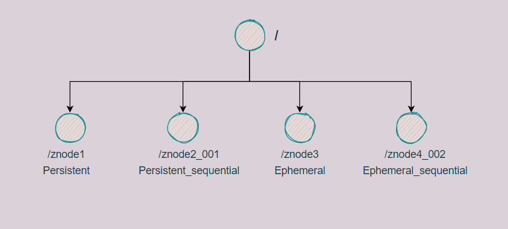

创建znode时设置顺序标识，znode名称后会附加一个值，顺序号是一个单调递增的计数器，由**父节点**维护。

注意：**在分布式系统中，顺序号可以被用于为所有的事件进行全局排序，这样客户端可以通过顺序号推断事件的顺序**。

##### 2.1 创建不带序号的永久节点

```shell
[zk: localhost:2181(CONNECTED) 14] create /znode1 "value1"
Created /znode1

[zk: localhost:2181(CONNECTED) 15] create /znode2 "value2"
Created /znode2

# 获得节点的值
[zk: localhost:2181(CONNECTED) 16] get -s /znode1
value1
cZxid = 0x6
ctime = Sat Dec 04 18:43:50 CST 2021
mZxid = 0x6
mtime = Sat Dec 04 18:43:50 CST 2021
pZxid = 0x6
cversion = 0
dataVersion = 0
aclVersion = 0
ephemeralOwner = 0x0
dataLength = 6
numChildren = 0
```

##### 2.2 创建带序号的永久节点

```shell
[zk: localhost:2181(CONNECTED) 17] create -s /znode1/znode3 "value3"
Created /znode1/znode30000000000

[zk: localhost:2181(CONNECTED) 18] create -s /znode1/znode4 "value4"
Created /znode1/znode40000000001

[zk: localhost:2181(CONNECTED) 19] create -s /znode5 "value5"
Created /znode50000000003

[zk: localhost:2181(CONNECTED) 20] create -s /znode1/znode6 "value6"
Created /znode1/znode60000000002
```

可以发现如果原来没有序号节点，序号从 0 开始依次递增。如果原节点下已有 2 个节点，则再排序时从 2 开始，以此类推。

##### 2.3 创建临时节点

```shell
[zk: localhost:2181(CONNECTED) 21] create -e /znode2/znode7 "value7"
Created /znode2/znode7

[zk: localhost:2181(CONNECTED) 22] create -e -s /znode2/znode8 "value8"
Created /znode2/znode80000000001

[zk: localhost:2181(CONNECTED) 23] ls /znode2
[znode7, znode80000000001]

# 重启客户端数据消失
```

##### 2.4 修改节点的值

```shell
[zk: localhost:2181(CONNECTED) 24] set /znode2/znode7 "val"

[zk: localhost:2181(CONNECTED) 25] get /znode2/znode7
val
```

#### 3、监听节点

##### 3.1 监听器原理

客户端注册监听它关心的目录节点，当目录节点发生变化时（数据改变、节点删除、子目录节点增加删除），Zookeeper会通知客户端。

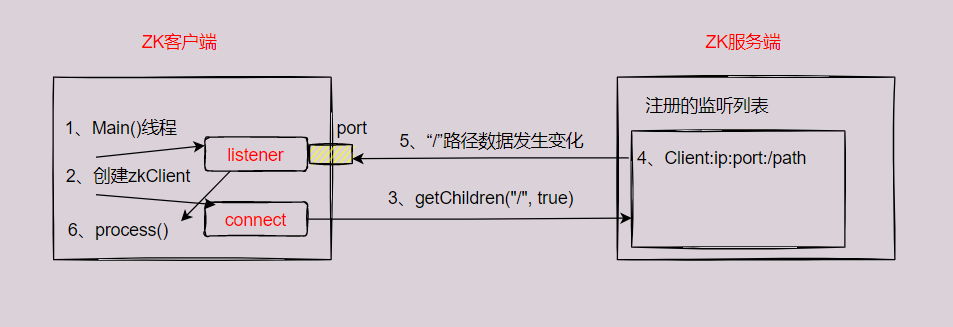

（1）首先要有一个main()线程。

（2）在main线程中创建zookeeper客户端，这时就会创建两个线程，一个负责网络连接通信（connect），一个负责监听（listener）。

（3）通过connect线程将注册的监听事件发送给zookeeper。

（4）将监听事件添加到zookeeper的注册监听列表中。

（5）zookeeper监听到有数据或路径变化时，就会通知listener线程。

（6）listener线程内部调用process方法。

##### 3.2 常见的监听

（1）监听节点数据的变化：`get -w path`

（2）监听子节点增减的变化：`ls -w path`

注意：上面两种监听都是**注册一次生效一次**。如果想要多次生效，那么就要注册多次。

#### 4、删除和查看节点

```shell
# 查看/znode2下的子节点
[zk: localhost:2181(CONNECTED) 1] ls /znode2
[znode7, znode80000000001]

# 删除/znode2节点，因为下面存在子节点，所以不能删除
[zk: localhost:2181(CONNECTED) 2] delete /znode2
Node not empty: /znode2

# 删除/znode2/znode80000000001节点
[zk: localhost:2181(CONNECTED) 3] delete /znode2/znode80000000001

[zk: localhost:2181(CONNECTED) 4] ls /znode2
[znode7]

[zk: localhost:2181(CONNECTED) 5] delete /znode2
Node not empty: /znode2

# 删除/znode2及其下面所有子节点
[zk: localhost:2181(CONNECTED) 6] deleteall /znode2

[zk: localhost:2181(CONNECTED) 7] ls /znode2
Node does not exist: /znode2

# 查看节点状态
[zk: localhost:2181(CONNECTED) 9] stat /znode1
cZxid = 0x6
ctime = Sat Dec 04 18:43:50 CST 2021
mZxid = 0x6
mtime = Sat Dec 04 18:43:50 CST 2021
pZxid = 0xb
cversion = 3
dataVersion = 0
aclVersion = 0
ephemeralOwner = 0x0
dataLength = 6
numChildren = 3
```

### 六、客户端相关的API

除了在启动zkCli.sh在命令行中使用相关的命令，也可以使用编程语言操作zookeeper相关的api。

首先创建一个Java的maven项目，在pom.xml文件中引入zookeeper相关的依赖

```xml
<dependency>
    <groupId>org.apache.zookeeper</groupId>
    <artifactId>zookeeper</artifactId>
    <version>3.4.5</version>
    <exclusions>
        <exclusion>
            <groupId>org.slf4j</groupId>
            <artifactId>slf4j-log4j12</artifactId>
        </exclusion>
    </exclusions>
</dependency>
```

zookeeper相关的api可以参考官方文档：[点击链接](https://zookeeper.apache.org/doc/r3.7.0/apidocs/zookeeper-server/index.html)

为了便于测试，可以引入junit的依赖

```xml
<dependency>
    <groupId>junit</groupId>
    <artifactId>junit</artifactId>
    <version>RELEASE</version>
</dependency>
```

代码参考pdf文档。。

client写数据的时候，写请求可能是发送给Leader也可能是Follow。假设集群中有3台服务器，1台Leader，2台Follow

（1）发送给Leader节点时

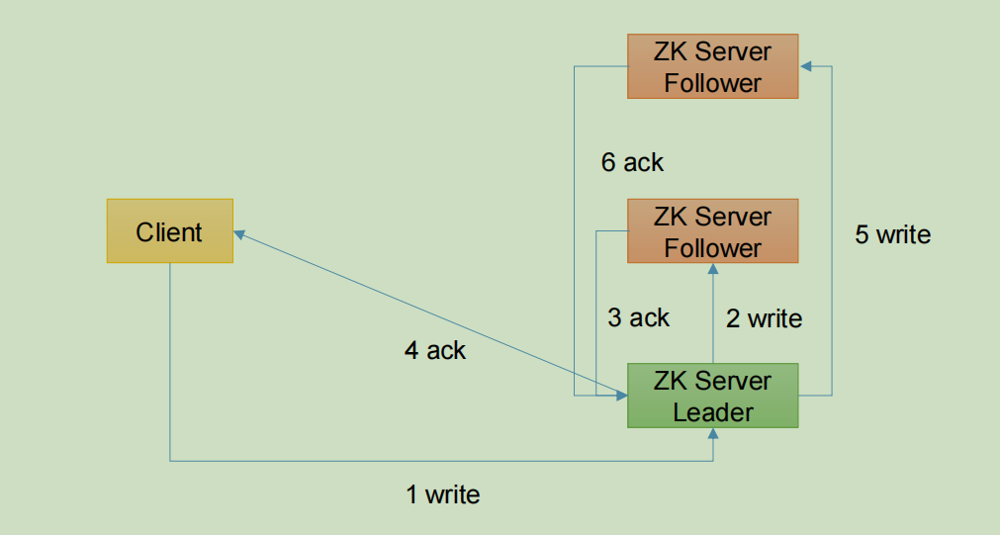

当集群中半数以上节点完成write请求后，就开始开放给客户端请求了。

（2）发送给Follow节点时

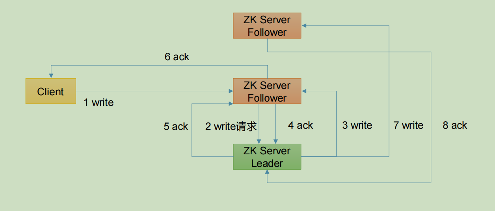

当集群中半数以上节点完成write请求后，就开始开放给客户端请求了。

### 七、Zookeeper实现分布式锁

在分布式系统下，使用Java中的synchronized或者Lock已经不能满足需求了。关于分布式锁的实现，我们可以利用MySQL的唯一索引去实现，也可以利用Redis的SETNX，同样也可以使用Zookeeper的节点唯一路径去实现。

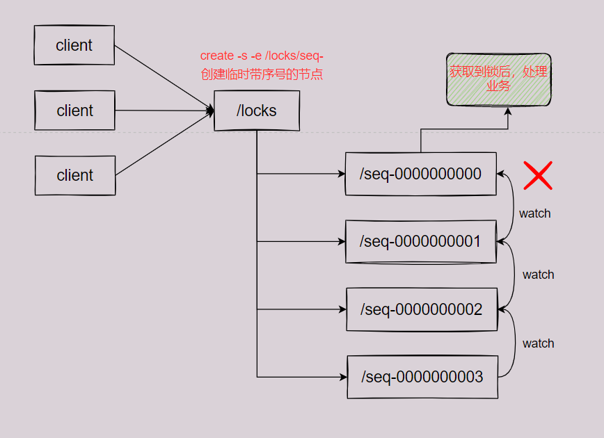

（1）线程先去`/locks`路径下面创建一个带序号的临时节点。

（2）判断自己创建的这个节点是不是`/locks`路径下序号最小的节点，如果是，则获取锁；如果不是，则监听自己的前一个节点。

（3）获取到锁后，处理自己的业务逻辑，然后删除自己创建的节点。监听它的后一个节点收到通知后，执行步骤（2）

上面的过程是不是跟AQS的同步队列有点像，判断自己是不是队列的头结点，如果是就去获取锁，不是就等待。

#### 1、原生Zookeeper代码实现分布式锁

```java
import org.apache.zookeeper.*;
import org.apache.zookeeper.data.Stat;
import java.io.IOException;
import java.util.Collections;
import java.util.List;
import java.util.concurrent.CountDownLatch;

public class DistributedLock {
     // zookeeper server 列表
     private String connectString =                                                                                "192.168.1.128:2181,192.168.1.129:2181,192.168.1.130:2181";
     // 超时时间
     private int sessionTimeout = 2000;
     private ZooKeeper zk;
     private String rootNode = "locks";
     private String subNode = "seq-";
     // 当前 client 等待的子节点
     private String waitPath;
     // ZooKeeper 连接
     private CountDownLatch connectLatch = new CountDownLatch(1);
     // ZooKeeper 节点等待
     private CountDownLatch waitLatch = new CountDownLatch(1);
     // 当前 client 创建的子节点
     private String currentNode;
    
     // 和 zk 服务建立连接，并创建根节点
     public DistributedLock() throws IOException, InterruptedException, KeeperException {
 	 	zk = new ZooKeeper(connectString, sessionTimeout, new Watcher() {
 			@Override
 			public void process(WatchedEvent event) {
 				// 连接建立时, 打开 latch, 唤醒 wait 在该 latch 上的线程
 				if (event.getState() == Event.KeeperState.SyncConnected) {
 					connectLatch.countDown();
 				}
 				// 发生了 waitPath 的删除事件
 				if (event.getType() == Event.EventType.NodeDeleted && 		                                           event.getPath().equals(waitPath)) {
					waitLatch.countDown();
 				}
 			}
 		});
 
        // 等待连接建立
 		connectLatch.await();
 		//获取根节点状态
 		Stat stat = zk.exists("/" + rootNode, false);
		//如果根节点不存在，则创建根节点，根节点类型为永久节点
 		if (stat == null) {
 			System.out.println("根节点不存在");
 			zk.create("/" + rootNode, new byte[0], ZooDefs.Ids.OPEN_ACL_UNSAFE, 			                      CreateMode.PERSISTENT);
 		}
 	}
    
 	// 加锁方法
 	public void zkLock() {
 		try {
 			//在根节点下创建临时顺序节点，返回值为创建的节点路径
 			currentNode = zk.create("/" + rootNode + "/" + subNode, null, 	                                            ZooDefs.Ids.OPEN_ACL_UNSAFE,CreateMode.EPHEMERAL_SEQUENTIAL);
			// wait 一小会, 让结果更清晰一些
			Thread.sleep(10);
 			// 注意, 没有必要监听"/locks"的子节点的变化情况
     		List<String> childrenNodes = zk.getChildren("/" + rootNode, false);
 			// 列表中只有一个子节点, 那肯定就是 currentNode , 说明client 获得锁
 			if (childrenNodes.size() == 1) {
 				return;
			} else {
 				//对根节点下的所有临时顺序节点进行从小到大排序
 				Collections.sort(childrenNodes);
 				//当前节点名称
 				String thisNode = currentNode.substring(("/" + rootNode + "/").length());
 				//获取当前节点的位置
 				int index = childrenNodes.indexOf(thisNode);
 				if (index == -1) {
 					System.out.println("数据异常");
 				} else if (index == 0) {
 					// index == 0, 说明 thisNode 在列表中最小, 当前client 获得锁
 					return;
 				} else {
 					// 获得排名比 currentNode 前 1 位的节点
 					this.waitPath = "/" + rootNode + "/" + childrenNodes.get(index - 1);
			 		// 在 waitPath 上注册监听器, 当 waitPath 被删除时, zookeeper 会回调监听器的 process 方法
					zk.getData(waitPath, true, new Stat());
 					//进入等待锁状态
 					waitLatch.await();
 					return;
 				}
 			}
 		} catch (KeeperException e) {
	 		e.printStackTrace();
 		} catch (InterruptedException e) {
 			e.printStackTrace();
 		}
 	}
    
 	// 解锁方法
 	public void zkUnlock() {
 		try {
 			zk.delete(this.currentNode, -1);
 		} catch (InterruptedException | KeeperException e) {
 			e.printStackTrace();
 		}
 	} 
}
```

测试

```java
import org.apache.zookeeper.KeeperException;
import java.io.IOException;

public class DistributedLockTest {
 	public static void main(String[] args) throws InterruptedException, IOException, KeeperException {
 		// 创建分布式锁 1
 		final DistributedLock lock1 = new DistributedLock();
 		// 创建分布式锁 2
 		final DistributedLock lock2 = new DistributedLock();
        
 		new Thread(new Runnable() {
 			@Override
 			public void run() {
 				// 获取锁对象
 				try {
 					lock1.zkLock();
 					System.out.println("线程 1 获取锁");
 					Thread.sleep(5 * 1000);
 					lock1.zkUnlock();
 					System.out.println("线程 1 释放锁");
 				} catch (Exception e) {
 					e.printStackTrace();
 				}
 			}
 		}).start();
 
        new Thread(new Runnable() {
 			@Override
		 	public void run() {
 				// 获取锁对象
 				try {
 					lock2.zkLock();
 					System.out.println("线程 2 获取锁");
 					Thread.sleep(5 * 1000);
 					lock2.zkUnlock();
 					System.out.println("线程 2 释放锁");
 				} catch (Exception e) {
 					e.printStackTrace();
 				}
 			}
 		}).start();
 	} 
}
```

控制台输出

```java
线程 1 获取锁
线程 1 释放锁
线程 2 获取锁
线程 2 释放锁
```

#### 2、使用Curator框架实现分布式锁

[官方文档](https://curator.apache.org/index.html)

##### 2.1 原生的Java API开发存在的问题

- 会话连接是异步的，需要自己去处理。比如使用 CountDownLatch
- Watch 需要重复注册，不然就不能生效
- 开发的复杂性比较高
- 不支持多节点删除和创建。需要自己去递归

##### 2.2 Curator框架使用

（1）添加依赖

```xml
<dependency>
     <groupId>org.apache.curator</groupId>
     <artifactId>curator-framework</artifactId>
     <version>4.3.0</version>
</dependency>
<dependency>
     <groupId>org.apache.curator</groupId>
     <artifactId>curator-recipes</artifactId>
     <version>4.3.0</version>
</dependency>
<dependency>
     <groupId>org.apache.curator</groupId>
     <artifactId>curator-client</artifactId>
     <version>4.3.0</version>
</dependency
```

（2）代码实现

```java
import org.apache.curator.RetryPolicy;
import org.apache.curator.framework.CuratorFramework;
import org.apache.curator.framework.CuratorFrameworkFactory;
import org.apache.curator.framework.recipes.locks.InterProcessLock;
import org.apache.curator.framework.recipes.locks.InterProcessMutex;
import org.apache.curator.retry.ExponentialBackoffRetry;

public class CuratorLockTest {
 	private String rootNode = "/locks";
    // zookeeper server 列表
	private String connectString = 
                 "192.168.1.128:2181,192.168.1.129:2181,192.168.1.130:2181";
 	// connection 超时时间
 	private int connectionTimeout = 2000;
 	// session 超时时间
 	private int sessionTimeout = 2000;
 
    public static void main(String[] args) {
 		new CuratorLockTest().test();
 	}
    
 	// 测试
 	private void test() {
 		// 创建分布式锁 1
 		final InterProcessLock lock1 = new InterProcessMutex(getCuratorFramework(), 																	rootNode);
 		// 创建分布式锁 2
 		final InterProcessLock lock2 = new InterProcessMutex(getCuratorFramework(), 																	rootNode);
 
        new Thread(new Runnable() {
 			@Override
 			public void run() {
 				// 获取锁对象
 				try {
 					lock1.acquire();
 					System.out.println("线程 1 获取锁");
 					// 测试锁重入
 					lock1.acquire();
 					System.out.println("线程 1 再次获取锁");
 					Thread.sleep(5 * 1000);
 					lock1.release();
 					System.out.println("线程 1 释放锁");
 					lock1.release();
 					System.out.println("线程 1 再次释放锁");
 				} catch (Exception e) {
 					e.printStackTrace();
 				}
 			}
 		}).start();
 
        new Thread(new Runnable() {
 			@Override
 			public void run() {
 				// 获取锁对象
		 		try {
 					lock2.acquire();
 					System.out.println("线程 2 获取锁");
 					// 测试锁重入
 					lock2.acquire();
     				System.out.println("线程 2 再次获取锁");
 					Thread.sleep(5 * 1000);
 					lock2.release();
 					System.out.println("线程 2 释放锁");
 					lock2.release();
 					System.out.println("线程 2 再次释放锁");
 				} catch (Exception e) {
 					e.printStackTrace();
 				}
 			}
 		}).start();
 	}
 
    // 分布式锁初始化
 	public CuratorFramework getCuratorFramework (){
 		//重试策略，初试时间 3 秒，重试 3 次
 		RetryPolicy policy = new ExponentialBackoffRetry(3000, 3);
 		//通过工厂创建 Curator
 		CuratorFramework client = CuratorFrameworkFactory.builder()
 												.connectString(connectString)
 												.connectionTimeoutMs(connectionTimeout)
 												.sessionTimeoutMs(sessionTimeout)
 												.retryPolicy(policy).build();
 		//开启连接
 		client.start();
 		System.out.println("zookeeper 初始化完成...");
 		return client;
 	} 
}
```

控制台输出

```java
线程 1 获取锁
线程 1 再次获取锁
线程 1 释放锁
线程 1 再次释放锁
线程 2 获取锁
线程 2 再次获取锁
线程 2 释放锁
线程 2 再次释放锁
```

