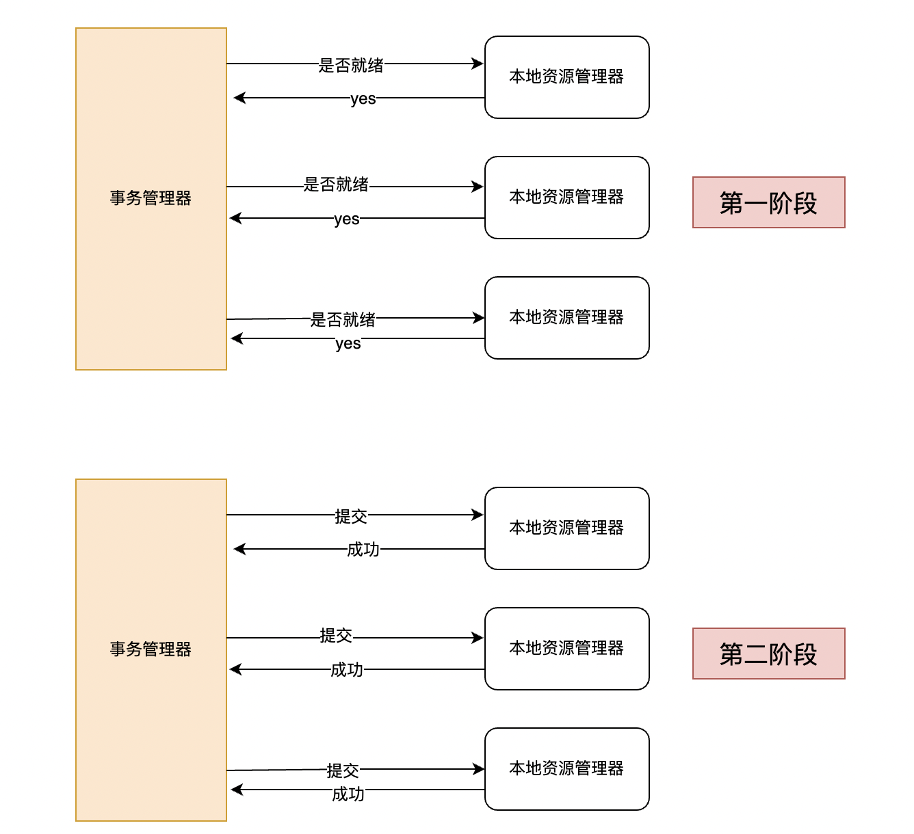
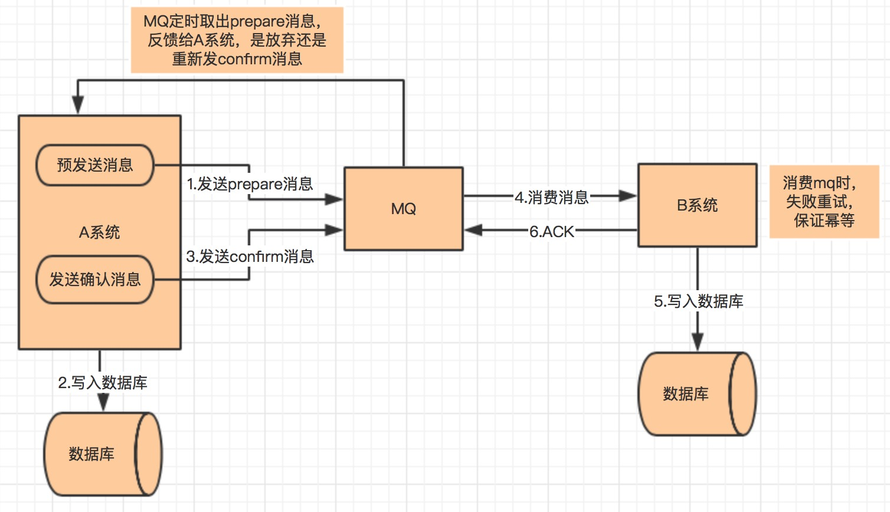
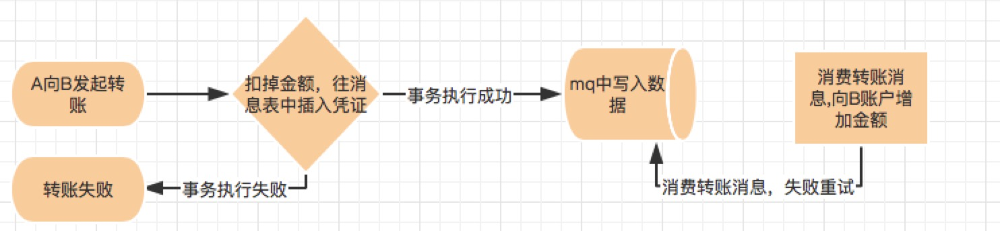
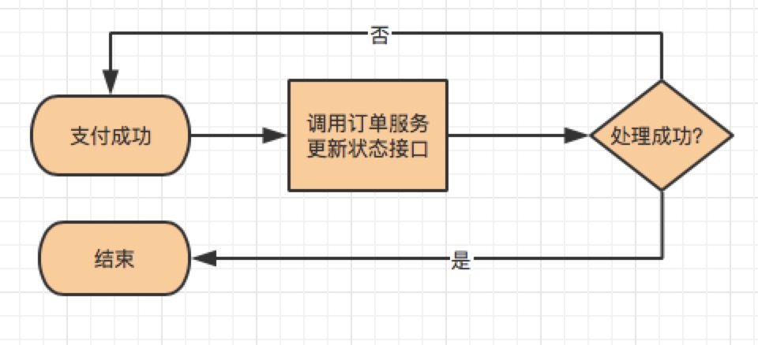

### 1、相关概念学习

#### 1.1 事务和分布式事务

（1）事务

事务就是一系列操作要么全部成功，要么全部失败。事务具有A（原子性）、C（持久性）、I（隔离性）、D（一致性）特性。

（2）分布式事务

在分布式系统中，不同的应用部署在不同的服务器上，而一个操作可能会涉及到多个不同的应用，该操作要成功就意味着多个应用的每一步操作都要成功。如果保证不同服务器上的操作要么都成功要么都失败呢，这就是分布式事务要做的。

比如大型的电商系统，客户下单操作，会有查询库存，扣减库存，生成订单等一系列操作，都是位于不同服务器上。客户要下单成功，流程中的每一步都需要成功，此时单机事务无能为力，只能由分布式事务来保障。

#### 1.2 CAP理论和BASE理论

[CAP理论和BASE理论](https://github.com/stronglxp/learnNote/blob/main/Java/SpringCloud%E7%9B%B8%E5%85%B3/%E5%88%86%E5%B8%83%E5%BC%8F%E7%B3%BB%E7%BB%9FCAP%E7%90%86%E8%AE%BA.md)

#### 1.3 幂等操作

幂等操作指的是**多次执行某个操作与执行一次所产生的结果相同**。在分布式系统中由于网络故障，服务器宕机等情况，有时需要重复执行某个操作，而该操作可能在出现异常之前已经执行过了，这时候就需要幂等来保障结果的一致性。

### 2、分布式事务使用场景

#### 2.1 跨行转账

转账是很常见的一种分布式使用场景。用户A通过银行转账给用户B，此时需要先扣减用户A的银行金额，再增加用户B的银行金额。两个操作必须同时成功或者同时失败，不然就会出现余额不一致的情况。

#### 2.2 用户下单

在电商系统中，下单是很常见的操作。扣减库存和生成订单一般位于不同的服务器节点上，此时就需要分布式事务来保证下单操作正常进行。

#### 2.3 同步超时

在分布式系统中，订单的支付依赖于第三方支付系统，而订单状态依赖于订单的支付结果。这两步都有可能会出现超时的情况，如果没有分布式事务的控制，那么可能会出现订单状态和支付结果不一致的情况。

### 3、分布式事务的解决方案

#### 3.1 两阶段提交

##### 3.1.1 原理

两阶段提交分为两步：**准备阶段和提交阶段**。在系统中存在一个事务管理器，用来管理所有的本地资源管理器。

（1）第一阶段（prepare），事务管理器会询问各个本地资源管理器是否就绪，如果收到的都是yes，则进行第二阶段，否则进行回滚。

（2）第二阶段（commit/rollback），事务管理器根据所有本地资源管理器的响应，通知所有资源管理器执行提交或者回滚。

##### 3.1.2 存在的问题

（1）**单点故障**

事务管理器是整个方案的核心，一旦事务管理器出现问题，整个方案都没用了。

（2）**同步故障**

因为事务管理器要等待所有的本地资源管理器响应，如果任何一个本地资源管理器阻塞，则其他本地资源管理器都要会被阻塞。

（3）**数据不一致**

在第二阶段，如果事务管理器给部门本地资源管理器发送提交请求后就出现了问题，那么剩下大热本地资源管理器不能接收到提交请求就不会进行提交，从而造成数据不一致的情况。

（4）**不确定性**

在第二阶段，如果事务管理器给一个本地资源管理器发生提交请求后，事务管理和这个本地资源管理器都挂了，那么重新选举的事务管理器不知道这次事务是要提交还是回退。

#### 3.2 TCC

关于 TCC（Try-Confirm-Cancel）的概念，最早是由 Pat Helland 于 2007 年发表的一篇名为《Life beyond Distributed Transactions:an Apostate’s Opinion》的论文提出。 TCC 事务机制相比于上面介绍的 XA，解决了其几个缺点：

1. 解决了协调者单点，由主业务方发起并完成这个业务活动。业务活动管理器也变成多点，引入集群。
2. 同步阻塞：引入超时，超时后进行补偿，并且不会锁定整个资源，将资源转换为业务逻辑形式，粒度变小。
3. 数据一致性，有了补偿机制之后，由业务活动管理器控制一致性

TCC(Try Confirm Cancel)

- Try 阶段：尝试执行，完成所有业务检查（一致性）, 预留必须业务资源（准隔离性）
- Confirm 阶段：确认执行真正执行业务，不作任何业务检查，只使用 Try 阶段预留的业务资源，Confirm 操作满足幂等性。要求具备幂等设计，Confirm 失败后需要进行重试。
- Cancel 阶段：取消执行，释放 Try 阶段预留的业务资源 Cancel 操作满足幂等性 Cancel 阶段的异常和 Confirm 阶段异常处理方案基本上一致。

在 Try 阶段，是对业务系统进行检查及资源预览，比如订单和存储操作，需要检查库存剩余数量是否够用，并进行预留，预留操作的话就是新建一个可用库存数量字段，Try 阶段操作是对这个可用库存数量进行操作。

基于 TCC 实现分布式事务，会将原来只需要一个接口就可以实现的逻辑拆分为 Try、Confirm、Cancel 三个接口，所以代码实现复杂度相对较高。

#### 3.3 本地消息表

本地消息表这个方案最初是 ebay 架构师 Dan Pritchett 在 2008 年发表给 ACM 的文章。该方案中会有消息生产者与消费者两个角色。

流程大致如下：

系统A是生产者，系统B是消息者，生产者端需要额外增加一个本地消息表，可以是数据库、消息队列等。

（1）生产者执行完业务后，会往本地消息表插入一条数据，两个操作在同一个事务中。

（2）如果生产者往本地消息表插入数据失败，会进行重试。

（3）消息者消费本地消息表的数据，并执行相应的业务逻辑。如果消费本地消息表的数据失败，则会进行重试。如果执行业务逻辑失败，则通知系统A进行回滚。

本地消息表实现的条件：

- 生产者和消费者的接口都要支持幂等。
- 生产者需要增加本地消息表。
- 如果消费者业务失败，生产者需要支持业务回滚。

容错机制

- 如果步骤（1）执行失败，则生产者A直接回滚。
- 如果步骤（2）和步骤（3）写本地消息失败或者消费本地消息失败，则进行重试。
- 如果步骤（3）执行业务失败，则B系统向A系统发起回滚操作。

#### 3.4 可靠消息最终一致性

大致流程如下

1. A 系统先向 mq 发送一条 prepare 消息，如果 prepare 消息发送失败，则直接取消操作
2. 如果消息发送成功，则执行本地事务
3. 如果本地事务执行成功，则向mq 发送一条 confirm 消息，如果发送失败，则发送回滚消息
4. B 系统定期消费 mq 中的 confirm 消息，执行本地事务，并发送 ack 消息。如果 B 系统中的本地事务失败，会一直不断重试，如果是业务失败，会向 A 系统发起回滚请求
5. 5.mq 会定期轮询所有 prepared 消息调用系统 A 提供的接口查询消息的处理情况，如果该 prepare 消息本地事务处理成功，则重新发送 confirm 消息，否则直接回滚该消息

该方案与本地消息最大的不同是去掉了本地消息表，其次本地消息表依赖消息表重试写入 mq 这一步由本方案中的轮询 prepare 消息状态来重试或者回滚该消息替代。其实现条件与余容错方案基本一致。目前市面上实现该方案的只有阿里的 RocketMq。

#### 3.5 尽最大努力通知

最大努力通知是最简单的一种柔性事务，适用于一些最终一致性时间敏感度低的业务，且被动方处理结果 不影响主动方的处理结果。

流程大致是：

（1）系统A本地事务执行完成后，发送一个消息到MQ。

（2）有个专门消费MQ的服务，会定时消费MQ并且调用系统B的接口。

（3）如果系统B执行成功则完成本次流程。如果系统B执行不成功，那么就会定时尝试重新调用系统B的服务，反复N次，如果最后还是失败则放弃。

### 4、分布式事务实战

#### 4.1 两阶段提交

目前支付宝使用两阶段提交思想实现了分布式事务服务 (Distributed Transaction Service, DTS) ，它是一个分布式事务框架，用来保障在大规模分布式环境下事务的最终一致性。具体可参考支付宝官方文档：https://tech.antfin.com/docs/2/46887

#### 4.2 TCC

TCC 需要事务接口提供 try, confirm, cancel 三个接口，提高了编程的复杂性。依赖于业务方来配合提供这样的接口，推行难度大，所以一般不推荐使用这种方式。

#### 4.3 可靠消息最终一致性

目前市面上支持该方案的 mq 只有阿里的 rocketmq, 该方案应用场景也比较多，比如用户注册成功后发送邮件、电商系统给用户发送优惠券等需要保证最终一致性的场景。

#### 4.4 本地消息表

跨行转账可通过该方案实现。

用户 A 向用户 B 发起转账，首先系统会扣掉用户 A 账户中的金额，将该转账消息写入消息表中，如果事务执行失败则转账失败，如果转账成功，系统中会有定时轮询消息表，往 mq 中写入转账消息，失败重试。mq 消息会被实时消费并往用户 B 中账户增加转账金额，执行失败会不断重试。

#### 4.5 最大努力通知

最大努力通知最常见的场景就是**支付回调**，支付服务收到第三方服务支付成功通知后，先更新自己库中订单支付状态，然后同步通知订单服务支付成功。如果此次同步通知失败，会通过异步脚步不断重试地调用订单服务的接口。

