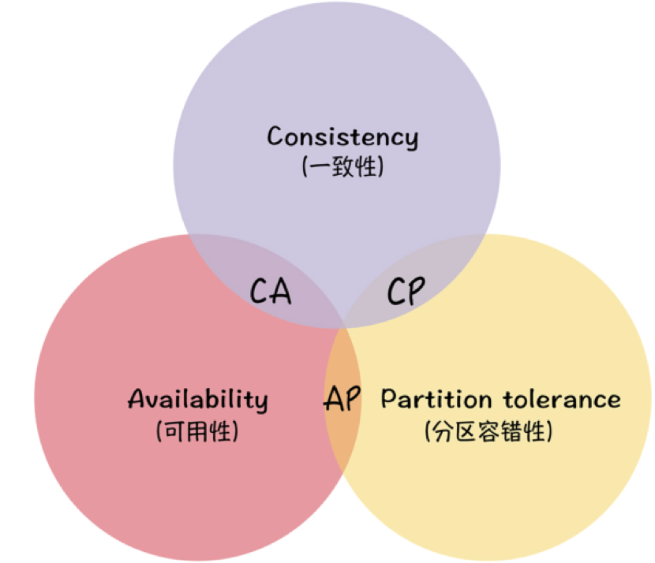
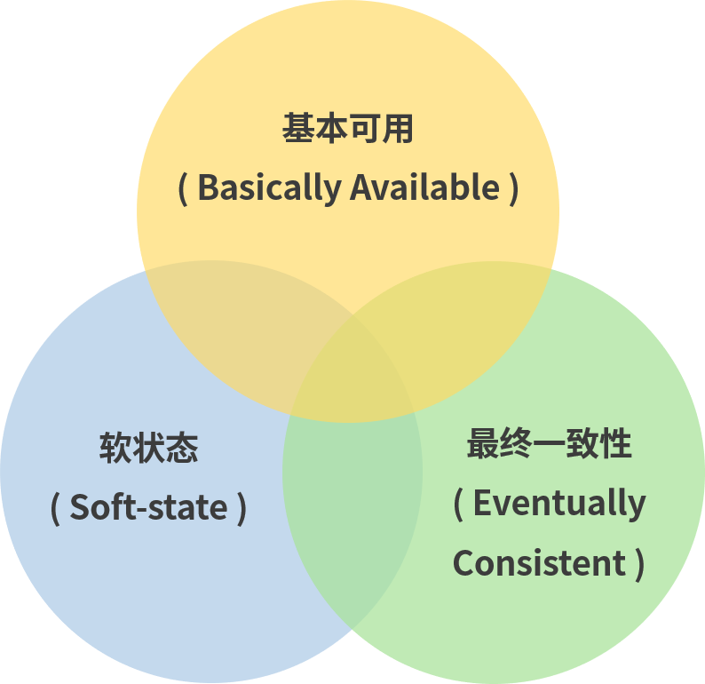
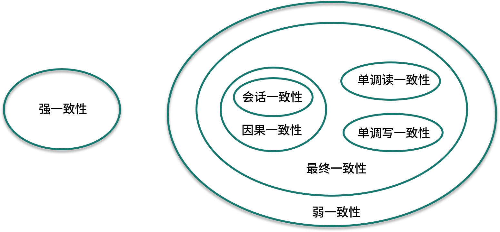

#### 1、分布式系统中CAP分别代表什么？对它们的理解？

CAP即一致性（Consistency）、可用性（Availability）、分区容错性（Partition tolerance）。

- 一致性（Consistency）：所有节点同时看到相同的数据
- 可用性（Availability）：任何时候，读写都是成功的
- 分区容错性（Partition tolerance）：当部分节点出现消息丢失或者分区故障的时候，分布式系统仍然能够继续运行

CAP理论指在分布式系统中，最多只能同时满足其中两点，不能三者兼顾。

#### 2、为什么分布式系统不能三者兼顾？

首先分布式系统与单机系统不同，涉及到多个节点的通讯和交互，那么节点间的分区故障是必然会发生的，所以分区容错性（P）是必然要保证的，不然就成了单机系统。所以只能在可用性（A）和一致性（C）里做选择。

如果我们选择可用性（A），那么系统始终会响应客户端的请求，返回信息。如果发生了网络分区，那么一些节点就不能返回最新的数据，只能返回当前自己手里认为最新的数据。

如果我们选择一致性（C），那么节点每次响应客户端的一定是最新的数据，不会返回旧数据。但节点在拿最新数据的时候，因为网络故障、消息丢失等问题，无法拿到最新数据，那么当客户端请求过来的时候，为了保证一致性，就只能返回错误信息了。

所以只能选择AP或者CP

#### 3、对Base理论的理解？

对于 CAP 来说，放弃**强一致性**（这里说的一致性是强一致性），追求分区容错性和可用性，这是很多分布式系统设计时的选择。在工程实践中，基于 CAP 定理逐步演化，就提出了 Base 理论。

Base 是三个短语的简写，即**基本可用**（Basically Available）、**软状态**（Soft State）和**最终一致性**（Eventually Consistent）。

**Base 理论**的核心思想是**最终一致性**，即使无法做到强一致性（Strong Consistency），但每个应用都可以根据自身的业务特点，采用适当的方式来使系统达到**最终一致性**（Eventual Consistency）。

- **基本可用（Basically Available）**：不保证任何时候，读写都是成功的。而是系统能够基本运行，一直提供服务。基本可用强调了当分布式系统出现故障的时候，允许损失部分可用性，相比于可能的系统，可能出现的是响应延迟或者服务降级等。
- **软状态（Soft-state）**：软状态可以对应 ACID 事务中的原子性（在 ACID 的事务中，实现的是强制一致性，要么全做要么不做，所有用户看到的数据一致。其中的原子性（Atomicity）要求多个节点的数据副本都是一致的，强调数据的一致性，可以理解为一种“硬状态”），软状态则是允许系统中的数据存在中间状态，并认为该状态不影响系统的整体可用性，即允许系统在多个不同节点的数据副本存在数据延时。
- **最终一致性（Eventually Consistent）**：数据不可能一直是软状态，必须在一个时间期限之后达到各个节点的一致性，在期限过后，应当保证所有副本保持数据一致性，也就是达到数据的最终一致性。在系统设计中，最终一致性实现的时间取决于网络延时、系统负载、不同的存储选型、不同数据复制方案设计等因素。

#### 4、如何理解数据一致性？数据一致性有几种模型？

我理解的数据一致性就是多个节点间的数据保持同步。

数据一致性模型可以分为**强一致性**和**弱一致性**。在大多数系统中，都要牺牲强一致性来保证系统的高可用性，只需要保证**最终一致性**即可，只要这个最终时间是在用户可以接受的范围内即可。比如网站的积分排行榜，它会告诉你一小时更新一次，并不是实时更新。

- **强一致性**：也就是我们上面说的CAP理论中的C。当数据发生变化时，后续进程访问到的都是最新的数据。这是对用户最友好的，但需要牺牲可用性。

- **弱一致性**：系统在数据写入成功之后，不承诺立即可以读到最新写入的值，也不会具体的承诺多久之后可以读到。用户读到某一操作对系统数据的更新需要一段时间，我们称这段时间为“**不一致性窗口**”。

- **最终一致性**：是弱一致性的特例，强调的是所有的数据副本，在经过一段时间的同步之后，最终都能够达到一个一致的状态。因此，最终一致性的本质是需要系统保证最终数据能够达到一致，而不需要实时保证系统数据的强一致性。

  到达最终一致性的时间 ，就是不一致窗口时间，在没有故障发生的前提下，不一致窗口的时间主要受**通信延迟**，**系统负载**和**复制副本**的个数影响。

最终一致性模型根据其提供的不同保证可以划分为更多的模型，包括因果一致性和会话一致性等。

- **因果一致性**：因果一致性要求有因果关系的操作需要有先后顺序。比如进程A在更新完某个数据后通知进程B，那么进程B之后对该数据的访问都能获取到进程A更新后的最新值，并且进程B要更新该数据的话，必须基于进程A更新后的最新值。
- **会话一致性**：会话一致性将对系统数据的访问过程框定在了一个会话当中，约定了**系统能保证在同一个有效的会话中实现“读己之所写”的一致性**，就是在你的一次访问中，执行更新操作之后，客户端能够在同一个会话中始终读取到该数据项的最新值。实际开发中有分布式的 Session 一致性问题，可以认为是会话一致性的一个应用。

#### 5、设计系统时，强一致性和弱一致性怎么选择？

对数据比较敏感，数据实时性、严谨性要求比较高的系统，应该选择强一致性，比如银行之类的涉及到交易的系统。而对于数据没有这么敏感的系统，则可以选择弱一致性，比如会员网站的积分排行榜，用户个人信息更改等。

#### 6、CAP理论和Base理论的关系

Base理论是在CAP理论上发展出来的，CAP 理论描述了分布式系统中数据一致性、可用性、分区容错性之间的制约关系，当你选择了其中的两个时，就不得不对剩下的一个做一定程度的牺牲。

Base 理论则是对 CAP 理论的实际应用，也就是在分区和副本存在的前提下，通过一定的系统设计方案，放弃强一致性，实现基本可用，这是大部分分布式系统的选择，比如 NoSQL 系统、微服务架构。在这个前提下，如何把基本可用做到最好，就是分布式工程师们追求的。

除了 CAP 和 Base，还有 ACID 原理，ACID 是一种强一致性模型，强调原子性、一致性、隔离性和持久性，主要用于在**数据库**实现中。Base 理论面向的是高可用、可扩展的分布式系统，ACID 适合传统金融等业务，在实际场景中，不同业务对数据的一致性要求不一样，ACID 和 Base 理论往往会结合使用。

