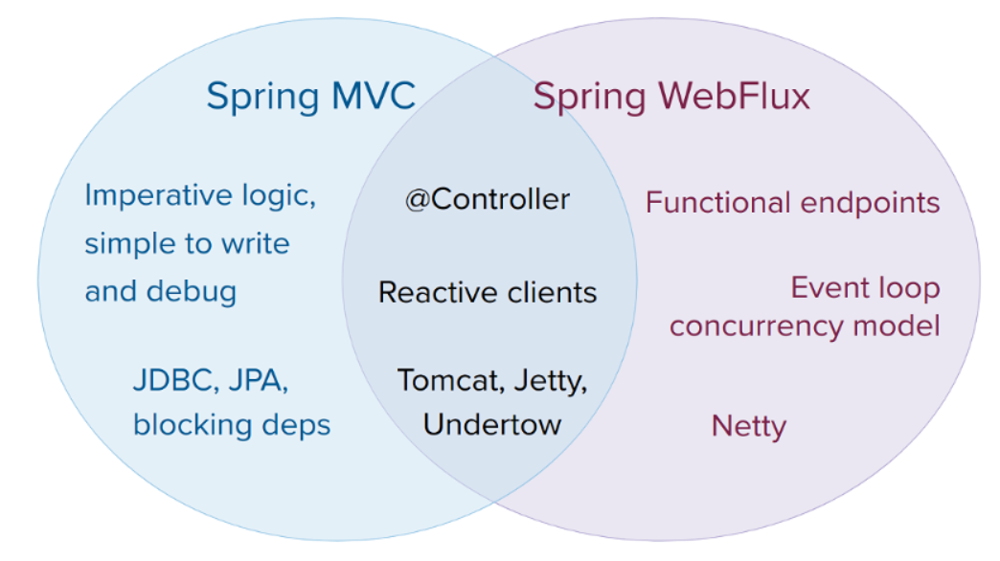
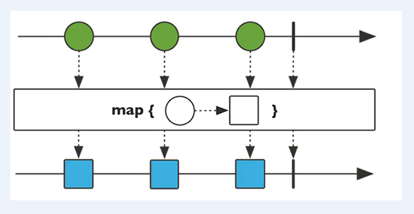
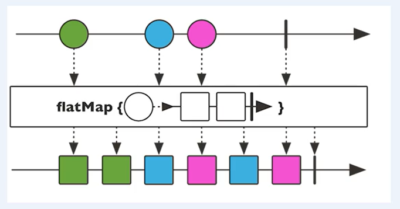
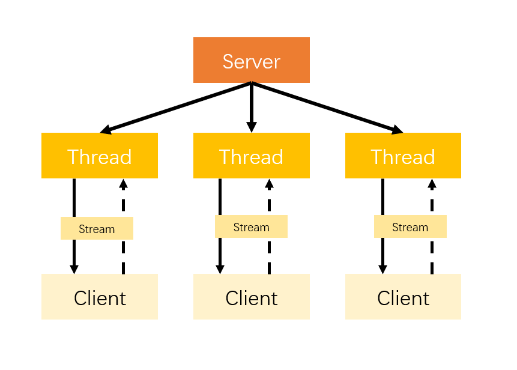
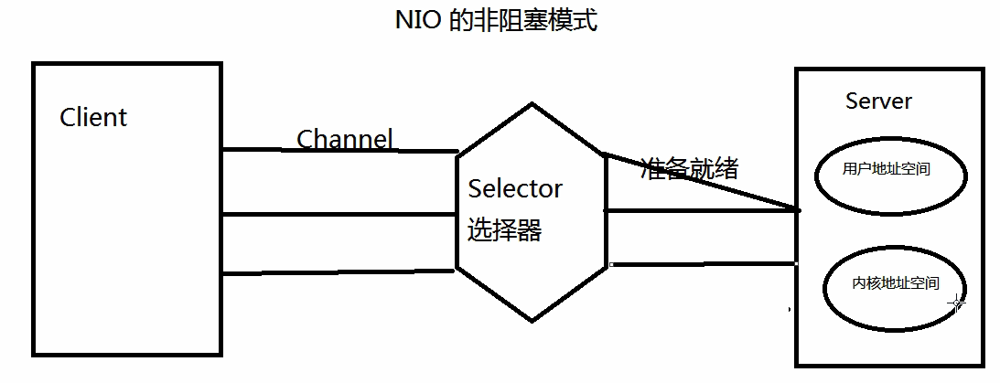
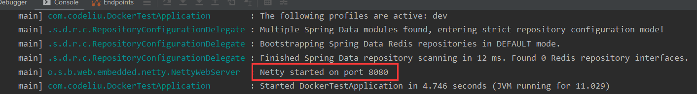
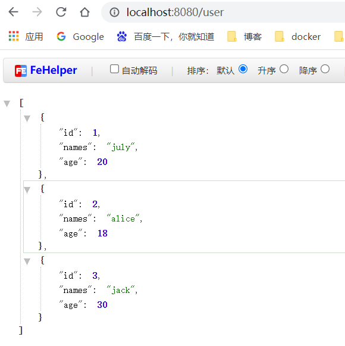
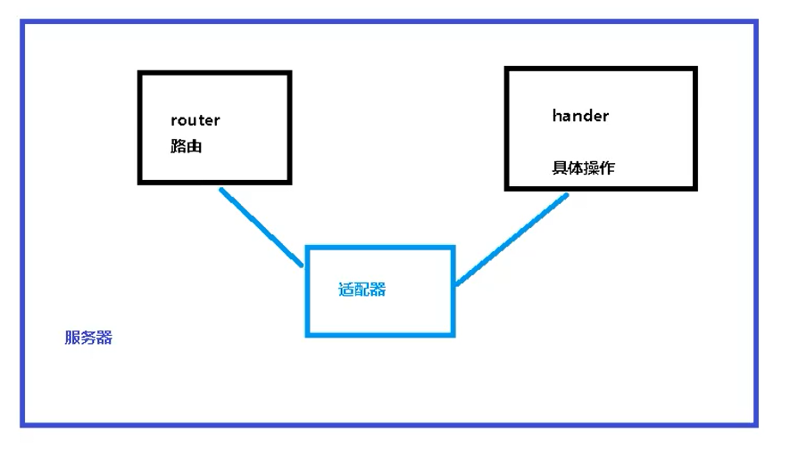

[官方文档](https://docs.spring.io/spring-framework/docs/current/reference/html/web-reactive.html#webflux-client)

### 1、WebFlux介绍

#### 1.1 是什么

（1）Spring5 添加的响应式web框架，用于web开发，功能和SpringMVC类似，使用响应式编程出现的框架。

（2）WebFlux是一种异步非阻塞框架，异步非阻塞的框架在Servlet3.1以后才支持，核心是基于Reactor的相关API实现的。

**异步非阻塞**：

- **异步和同步是针对调用者**。调用者发送请求后，如果等着对方回应后再去做其他事情，那就是同步，反之则为异步。
- **阻塞和非阻塞时针对被调用者**。被调用者接收到请求后，做完请求任务后才给出反馈就是阻塞，收到请求后马上给出反馈然后再去做事情就是非阻塞。

#### 1.2 特点

（1）非阻塞：在有限资源下， 提高系统吞吐量和伸缩性，以Reactor为基础实现响应式编程。

（2）函数式编程：Spring5基于Java8，WebFlux使用Java8的函数式编程实现路由请求。

#### 1.3 和SpringMVC比较



### 2、响应式编程

#### 2.1 响应式编程的概念

**响应式编程**或**反应式编程**（英语：Reactive programming）是一种面向数据[流](https://zh.wikipedia.org/wiki/串流)和变化传播的[声明式](https://zh.wikipedia.org/wiki/声明式编程)[编程范式](https://zh.wikipedia.org/wiki/编程范式)。这意味着可以在编程语言中很方便地表达静态或动态的数据流，而相关的计算模型会自动将变化的值通过数据流进行传播。

例如，在命令式编程环境中，a:=b+c 表示将表达式的结果赋给 a，而之后改变 b 或者 c的值不会影响a。但在响应式编程中，a的值会随着b或者c的更新而进行更新。电子表格程序就是响应式编程的一个例子。单元格可以包含字面值或类似"=B1+C1"的公式，而包含公式的单元格的值会依据其他单元格的值的变化而变化 。

#### 2.2 基于Reactor的响应式编程

WebFlux就是基于Reactor。

（1）Reactor有两个核心类：`Mono`和`Flux`，这两个类都实现了`Publisher`接口，提供了丰富的操作符。`Flux`返回n个元素，`Mono`返回0或1个元素。

（2）`Mono`和`Flux`都是数据流的发布者，使用`Mono`和`Flux`可以发出三种数据信号：元素值、错误信号、完成信号。错误信号和完成信号都代表终止信号，终止信号用于告诉订阅者数据流结束了，错误信号在终止数据流的同时会把错误信息发送给订阅者。

（3）三种信号的特点

- 错误信号和完成信号都是终止信号，不能共存。
- 如果没有发送任何元素值，而是直接发送错误信号或者完成信号，表示空数据流。
- 如果没有错误信号，没有完成信号，表示无限数据流。

#### 2.3 Flux和Mono的小demo

首先引入相关的依赖

```xml
<dependency>
    <groupId>io.projectreactor</groupId>
    <artifactId>reactor-core</artifactId>
    <version>3.3.13.RELEASE</version>
</dependency>
```

代码

```java
import org.junit.jupiter.api.Test;
import org.springframework.boot.test.context.SpringBootTest;
import reactor.core.publisher.Flux;
import reactor.core.publisher.Mono;

import java.util.Arrays;
import java.util.List;
import java.util.stream.Stream;

@SpringBootTest
class DockerTestApplicationTests {

    @Test
    void contextLoads() {
        // just方法直接声明
        Flux.just(1, 2, 3, 4);
        Mono.just(1);

        Integer[] arr = {1, 2, 3, 4};
        Flux.fromArray(arr);

        List<Integer> list = Arrays.asList(arr);
        Flux.fromIterable(list);

        Stream<Integer> stream = list.stream();
        Flux.fromStream(stream);
    }
}
```

运行上面的测试方法，没有数据输出。因为调用just或者其他的方法只是声明数据流，数据流并没有发出，只有进行订阅之后才会触发数据流。修改上面代码

```java
Flux.just(1, 2, 3, 4).subscribe(System.out::print);
Mono.just(1).subscribe(System.out::print);
```

#### 2.4 操作符

对数据流进行一道道操作，成为操作符，比如工厂流水线。

（1）Map将元素映射为新元素



（2）flatMap将元素映射为流

把每个元素转为成流，把转换后的多个流合并成大的流。



### 3、Spring WebFlux执行流程和核心API

Spring WebFlux基于Reactor，默认使用的容器是Netty，Netty是高性能的异步非阻塞（NIO）框架

#### 3.1 BIO和NIO

**BIO**



解读一下BIO的流程——

- 首先由服务器端开启一个Socket监听固定端口，等待客户端连接
- 等到和客户端线程建立连接，从连接中的数据流中等待读取数据
- 客户端下线之后，服务器的线程随之终止

在服务端的线程中存在以下几个问题——

- 服务端线程在读取数据的时候，如果流中目前不存在数据，那么服务端处理线程将会空等
- 操作系统切换线程也需要耗费大量的时间
- 在进行网络数据传输的时候，采用的是流的方式，效率不高

因此基于以上的两个原因，传统的IO才会对服务器造成很大的压力，适合处理请求数量较小的客户端请求。即使服务器端是多线程，线程的数量也是有限的，而且有时一味单纯增加线程数，只会让阻塞的线程原来越多。

**NIO**



NIO的非阻塞方式：

- 将用于传输的通道全都注册到选择器上

- 选择器的作用是：监控这些通道的IO状况

选择器和通道的关系：通道注册到选择器上，选择器监控通道。

当某一个通道上，某一个事件准备就绪时，那么选择器才会将这个通道分配到服务器端一个或多个线程上，再继续运行。比如说当客户端发送一些数据给服务器端，只有当客户端的所有数据都准备就绪时，选择器才会将这个注册的通道分配到服务器端的一个或者多个线程上。

那就意味这，如果客户端的线程没有将数据准备就绪时，服务器端的线程可以执行其他任务，而不必阻塞在那里。

打个比方来说，原先的传统的阻塞IO模式，相当于你没有手机等快递，算准了EMS每天中午1：00会到你们公司门口，所以你12:50在那里等着他们来，在这10分钟里你被这件事情阻塞着，什么事情都做不了，真是浪费时间；而NIO的这种通道注册选择器，选择器监控通道，等到数据准备就绪才会占用服务器线程的非阻塞IO方式，更像是带着手机等外卖，我在饿了么注册了一个用户（通道在选择器上注册了），然后定完外卖就忙自己的去了，等到外卖送来之后我接到电话下去取就可以了。

#### 3.2 Spring WebFlux执行流程

和SpringMVC执行流程类似。SpringMVC的核心控制器是`DispatcherServlet`，而Spring WebFlux的核心控制器是`DispatcherHandler`，实现了接口`WebHandler`

引入依赖

```xml
<dependency>
    <groupId>org.springframework.boot</groupId>
    <artifactId>spring-boot-starter-webflux</artifactId>
    <version>2.4.4</version>
</dependency>
```

`WebHandler`接口如下

```java
public interface WebHandler {

	/**
	 * Handle the web server exchange.
	 * @param exchange the current server exchange
	 * @return {@code Mono<Void>} to indicate when request handling is complete
	 */
	Mono<Void> handle(ServerWebExchange exchange);

}
```

`DispatcherHandler`类如下

```java
public class DispatcherHandler implements WebHandler, PreFlightRequestHandler, ApplicationContextAware {
    // map requests to handler objects
    @Nullable
	private List<HandlerMapping> handlerMappings;

	// for using any handler interface
	@Nullable
	private List<HandlerAdapter> handlerAdapters;

    // process handler return values
	@Nullable
	private List<HandlerResultHandler> resultHandlers;
    
    ...
    @Override
	public Mono<Void> handle(ServerWebExchange exchange) {
		if (this.handlerMappings == null) {
			return createNotFoundError();
		}
		if (CorsUtils.isPreFlightRequest(exchange.getRequest())) {
			return handlePreFlight(exchange);
		}
		return Flux.fromIterable(this.handlerMappings)
                // 获取对应的handler
				.concatMap(mapping -> mapping.getHandler(exchange))
				.next()
				.switchIfEmpty(createNotFoundError())
                // 调用具体的业务方法
				.flatMap(handler -> invokeHandler(exchange, handler))
                // 处理结果并返回
				.flatMap(result -> handleResult(exchange, result));
	} 
    ...
}
```

#### 3.3 核心API

Spring WebFlux实现函数式编程，两个接口：RouterFunction（路由处理）和HandlerFunction（处理函数）

### 4、WebFlux实践

#### 4.1 基于注解

新建一个SpringBoot项目，引入webflux依赖，这里就不需要引入`spring-boot-starter-web`依赖了。

```xml
<dependency>
    <groupId>org.springframework.boot</groupId>
    <artifactId>spring-boot-starter-webflux</artifactId>
</dependency>
```

编写相关的类

```java
import org.springframework.stereotype.Component;

@Component
public class User {
    private Integer id;
    private String names;
    private int age;

    public User() {
    }

    public User(Integer id, String names, int age) {
        this.id = id;
        this.names = names;
        this.age = age;
    }

    public Integer getId() {
        return id;
    }

    public void setId(Integer id) {
        this.id = id;
    }

    public String getNames() {
        return names;
    }

    public void setNames(String names) {
        this.names = names;
    }

    public int getAge() {
        return age;
    }

    public void setAge(int age) {
        this.age = age;
    }

    @Override
    public String toString() {
        return "User{" +
                "id=" + id +
                ", names='" + names + '\'' +
                ", age=" + age +
                '}';
    }
}
```

`UserService`类

```java
import com.codeliu.entity.User;
import reactor.core.publisher.Flux;
import reactor.core.publisher.Mono;

public interface UserService {
    /**
     * 根据id获取用户信息
     * @param id
     * @return
     */
    Mono<User> getUserById(Integer id);

    /**
     * 获取所有用户
     * @return
     */
    Flux<User> getUserList();

    /**
     * 插入用户
     * @param userMono
     * @return
     */
    Mono<Void> addUser(Mono<User> userMono);
}
```

`UserServiceImpl`类

```java
import com.codeliu.entity.User;
import com.codeliu.service.UserService;
import org.springframework.stereotype.Service;
import reactor.core.publisher.Flux;
import reactor.core.publisher.Mono;

import java.util.HashMap;
import java.util.Map;

@Service
public class UserServiceImpl implements UserService {
    private final Map<Integer, User> userMap = new HashMap<>();

    public UserServiceImpl() {
        userMap.put(1, new User(1, "july", 20));
        userMap.put(2, new User(2, "alice", 18));
        userMap.put(3, new User(3, "jack", 30));
    }

    @Override
    public Mono<User> getUserById(Integer id) {
        return Mono.justOrEmpty(userMap.get(id));
    }

    @Override
    public Flux<User> getUserList() {
        return Flux.fromIterable(userMap.values());
    }

    @Override
    public Mono<Void> addUser(Mono<User> userMono) {
        return userMono.doOnNext(user -> {
            int num = userMap.size() + 1;
            userMap.put(num, user);
        }).thenEmpty(Mono.empty());
    }
}
```

`UserController`类

```java
@RestController
@RequestMapping("/user")
public class UserController {
    @Autowired
    private UserService userService;

    @GetMapping("/{id}")
    public Mono<User> getUserById(@PathVariable Integer id) {
        return userService.getUserById(id);
    }

    @GetMapping
    public Flux<User> getUserList() {
        return userService.getUserList();
    }

    @PostMapping
    public Mono<Void> addUser(@RequestBody User user) {
        Mono<User> mono = Mono.just(user);
        return userService.addUser(mono);
    }
}
```

可以发现写法和使用SpringMVC基本一致。启动主类



可以发现使用的Netty而不是tomcat。

浏览器输入url访问测试



SpringMVC使用同步阻塞的方式，基于SpringMVC + Servlet + Tomcat

Spring WebFlux使用异步非阻塞的方式，基于WebFlux + Reactor + Netty

#### 4.2 基于函数式

（1）在使用函数式编程模型的时候，需要自己初始化服务器。

（2）基于函数式编程模型，有两个核心接口：RouterFunction（实现路由功能，请求转发给对应的handler）和HandlerFunction（处理请求生成响应的函数）

（3）Spring WebFlux请求和响应不再是ServletRequest和ServletResponse，而是ServerRequest和ServerResponse。

