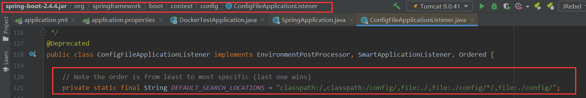
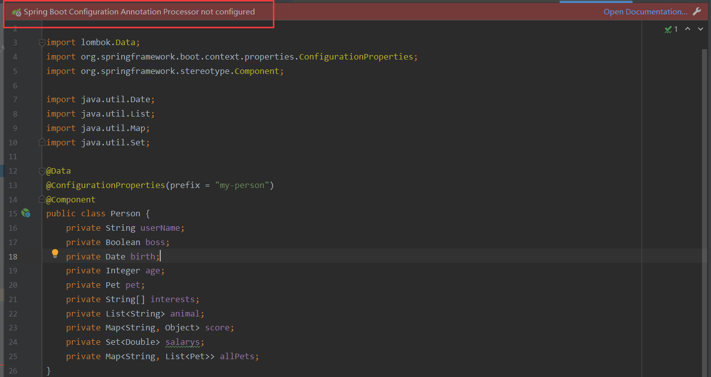
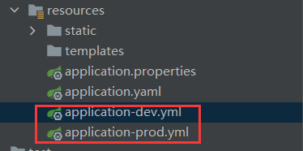

**源码基于SpringBoot 2.4.4**

### 1、认识配置文件

#### 1.1 配置文件的加载

创建SpringBoot项目的时候，会自动创建一个application.properties文件，该文件是SpringBoot默认的配置文件。

SpringBoot在启动的时候会默认去寻找并加载application.properties文件和application.yaml文件，在以下路径中寻找：

（1）classpath目录下

（2）classpath目录下的config文件夹

（3）项目根目录

（4）项目根目录下config文件夹的子文件夹

（5）项目根目录下config文件夹



优先级从高到低，并且后加载的会覆盖前面加载的。

参考官方文档：https://docs.spring.io/spring-boot/docs/current/reference/html/features.html#features.external-config.files

#### 1.2 配置文件类型

（1）properties后缀：application.properties

（2）yaml后缀：application.yaml

#### 1.3 两种配置文件比较

- 可以使用 **@PropertySource** 注解加载自定义的 **Properties** 配置文件，但无法加载自定义的 **YAML** 文件。
- 配置文件加载顺序：yaml、yml、xml、properties（后加载的会覆盖前面加载的）

### 2、yaml配置文件

#### 2.1 介绍

YAML 是 "YAML Ain't Markup Language"（YAML 不是一种标记语言）的递归缩写。在开发的这种语言时，YAML 的意思其实是："Yet Another Markup Language"（仍是一种标记语言）。 

非常适合用来做以数据为中心的配置文件

#### 2.2 基本语法

（1）key: value。**冒号与value之间必须有一个空格**。

（2）大小写敏感。

（3）使用缩进表示层级关系。

（4）缩进不允许使用tab，只能使用空格。

（5）缩进的空格数不重要，只要相同层级的元素左对齐即可。

（6）# 后面跟注释内容

（7）字符串无须加引号。""会进行转义。比如'\n'就输出\n，但"\n"则会输出换行。

#### 2.3 数据类型

（1）**字面量**：单个的、不可再分的值。date、boolean、string、number、null

```yaml
k: v
```

（2）**对象**：键值对的集合。map、hash、set、object

```yaml
# 行内写法
k: {k1:v1,k2:v2,k3:v3}
# 或
k: 
  k1: v1
  k2: v2
  k3: v3
```

（3）**数组**：一组按次序排列的值。array、list、queue

```yaml
# 行内写法
k: [v1,v2,v3]
# 或
k:
 - v1
 - v2
 - v3
```

#### 2.4 实例

定义两个实体类`Person`和`Pet`，并且`Person`类和配置文件的属性绑定

```java
@Data
@ConfigurationProperties(prefix = "my-person")
@Component
public class Person {
    private String userName;
    private Boolean boss;
    private Date birth;
    private Integer age;
    private Pet pet;
    private String[] interests;
    private List<String> animal;
    private Map<String, Object> score;
    private Set<Double> salarys;
    private Map<String, List<Pet>> allPets;
}

@Data
public class Pet {
    private String name;
    private Double weight;
}
```

在yaml文件中配置Person的属性

```yaml
my-person:
  user-name: CodeTiger
  boss: true
  birth: 1996/11/29
  # 可以使用random来生成各种不同类型的随机值
  age: ${random.int}
  pet:
    name: tomcat
    weight: 100
  interests: [basketball, football]
  animal:
    - jerry
    - tom
  score:
    english:
      first: 30
      second: 40
      third: 50
    math: [131,140,148]
    chinese: {first: 128, second: 136}
    salarys: [3999,4999.98,5999.99]
    allPets:
      sick:
        - {name: tom}
        - {name: jerry,weight: 47}
      health: [{name: mario,weight: 47}]
```

启动SpringBoot，可以打印出Person实体类的属性值。如果在application.properties中配置Person的一些字段值，那么会如何加载呢？

```properties
my-person.interests=basketball, football, pingpang
my-person.user-name=lxp
my-person.score.chinese=100
my-person.score.english=99
```

启动SpringBoot，打印Person

```java
Person(userName=lxp, boss=true, birth=Fri Nov 29 00:00:00 CST 1996, age=16165848, pet=Pet(name=tomcat, weight=100.0), interests=[basketball, football, pingpang], animal=[jerry, tom], score={english=99, chinese=100, math={0=131, 1=140, 2=148}}, salarys=[3999.0, 4999.98, 5999.99], allPets={sick=[Pet(name=tom, weight=null), Pet(name=jerry, weight=47.0)], health=[Pet(name=mario, weight=47.0)]})
```

会发现application.properties中配置的属性会覆盖掉application.yaml中配置的属性，并且如果该属性有多个字段时，会进行合并，比如`score={english=99, chinese=100, math={0=131, 1=140, 2=148}}`就是两个配置文件合并后的结果。

#### 2.5 开启自动提示

我们的类和配置文件属性绑定时，在配置文件中设置属性发现并没有自动提示。在我们为类加上`@ConfigurationProperties`注解的时候，idea就会提示我们配置`Annotation Processor`

https://docs.spring.io/spring-boot/docs/2.4.4/reference/html/appendix-configuration-metadata.html#configuration-metadata-annotation-processor



根据文档，我们只需要在`pom.xml`中增加相关的jar包即可。

```xml
<dependency>
    <groupId>org.springframework.boot</groupId>
    <artifactId>spring-boot-configuration-processor</artifactId>
    <optional>true</optional>
</dependency>
```

在打包的时候，我们不需要把它打入jar包，所以去除

```xml
<build>
    <plugins>
        <plugin>
            <groupId>org.springframework.boot</groupId>
            <artifactId>spring-boot-maven-plugin</artifactId>
            <configuration>
                <excludes>
                    <exclude>
                        <groupId>org.springframework.boot</groupId>
                        <artifactId>spring-boot-configuration-processor</artifactId>
                    </exclude>
                </excludes>
            </configuration>
        </plugin>
    </plugins>
</build>
```

### 3、使用yaml实现多环境配置

我们可以把多个环境的配置写在一个文件里，可以使用符号`---`进行分割，如下application.yaml文件

```yaml
spring:
  profiles:
  	# 使用开发环境的配置
    active: dev
---
# 开发环境配置
server:
  port: 8888
spring:
  profiles: dev
---
# 生产环境配置
server:
  port: 8888
spring:
  profiles: prod
```

也可以不同的开发环境写在不同的配置文件，比如在**resources**目录下创建两个配置文件：**application-dev.yml** 和 **application-prod.yml** 此时，分别表示开发环境中的配置和生产环境中的配置。



然后在application.yaml文件中指定使用哪个配置文件即可。

我们还可以通过在代码中指定使用哪种环境的配置

```java
import org.springframework.boot.autoconfigure.SpringBootApplication;
import org.springframework.boot.builder.SpringApplicationBuilder;

@SpringBootApplication
public class TestApplication {

    public static void main(String[] args) {
        SpringApplicationBuilder builder = new SpringApplicationBuilder(TestApplication.class);
        builder.application().setAdditionalProfiles("dev");
        builder.run(args);
    }
}
```

当然也可以在使用命令启动jar包的时候指定

```shell
java -jar xxx.jar --spring.profiles.active=dev
```

