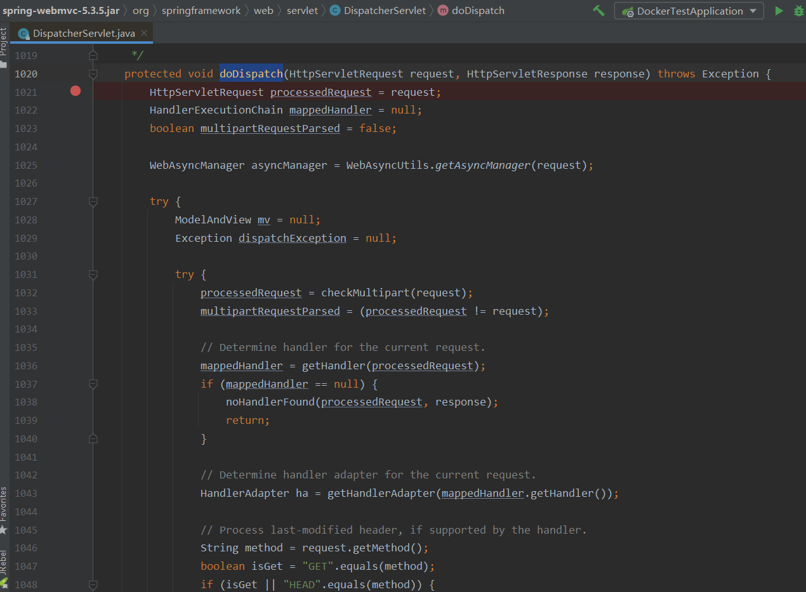
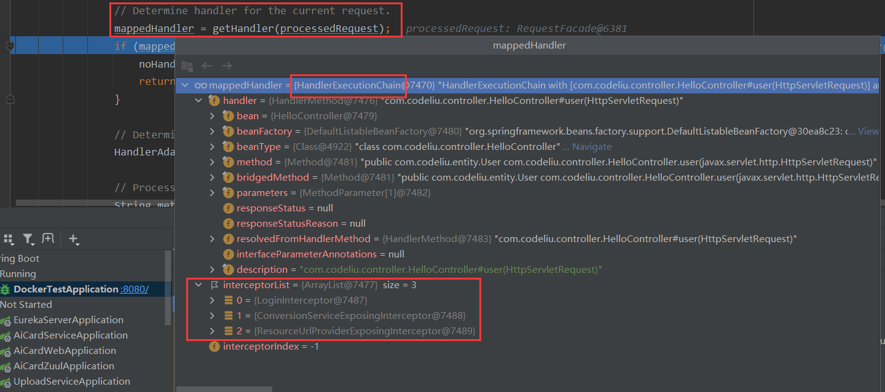
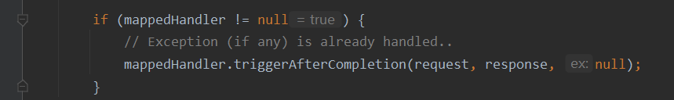
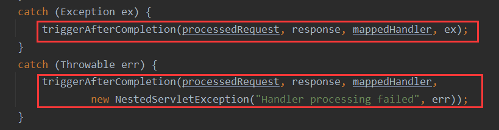
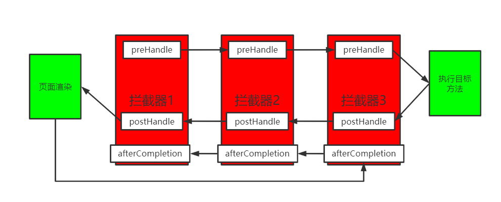

### 1、拦截器是什么

java里的拦截器（Interceptor）是动态拦截Action调用的对象，它提供了一种机制可以使开发者在一个Action执行的前后执行一段代码，也可以在一个Action执行前阻止其执行，同时也提供了一种可以提取Action中可重用部分代码的方式。在AOP中，拦截器用于在某个方法或者字段被访问之前进行拦截，然后再之前或者之后加入某些操作。

上面的Action一般指的就是我们Controller层的接口。

### 2、自定义拦截器

一般自定义一个拦截器分为三步

（1）编写一个拦截器实现`HandlerInterceptor`接口。

（2）拦截器注册到容器中。

（3）配置拦截规则。

#### 2.1 编写拦截器

我们新建一个SpringBoot项目，然后自定义一个拦截器`LoginInterceptor`，拦截未登录状态下的某些请求。JDK1.8开始，接口的方法加上`default`关键字可以有默认实现，所以实现一个接口只需要实现没有加该关键字的方法。

```java
import lombok.extern.slf4j.Slf4j;
import org.springframework.web.servlet.HandlerInterceptor;
import org.springframework.web.servlet.ModelAndView;

import javax.servlet.http.HttpServletRequest;
import javax.servlet.http.HttpServletResponse;

/**
 * 登录拦截器
 */
@Slf4j
public class LoginInterceptor implements HandlerInterceptor {
    /**
     * 目标方法执行之前执行
     * @param request
     * @param response
     * @param handler
     * @return
     * @throws Exception
     */
    @Override
    public boolean preHandle(HttpServletRequest request, HttpServletResponse response, Object handler) throws Exception {
        // 获取请求路径
        String requestUrl = request.getRequestURI();
        log.info("请求的路径是: {}", requestUrl);

        String username = request.getParameter("username");
        if (username != null) {
            // 放行
            return true;
        }

        request.setAttribute("msg", "请先登录");
        // 携带msg跳转到登录页
        request.getRequestDispatcher("/").forward(request, response);
        return false;
    }

    /**
     * 目标方法完成以后执行
     * @param request
     * @param response
     * @param handler
     * @param modelAndView
     * @throws Exception
     */
    @Override
    public void postHandle(HttpServletRequest request, HttpServletResponse response, Object handler, ModelAndView modelAndView) throws Exception {
        log.info("postHandle执行");
    }

    /**
     * 页面渲染以后执行
     * @param request
     * @param response
     * @param handler
     * @param ex
     * @throws Exception
     */
    @Override
    public void afterCompletion(HttpServletRequest request, HttpServletResponse response, Object handler, Exception ex) throws Exception {
        log.info("afterCompletion执行");
    }
}
```

#### 2.2 注册和配置拦截器

在SpringBoot中，我们需要自定义配置的时候，只需要实现`WebMvcConfigurer`类重写对应的方法即可。这里我们需要配置拦截器，那么重写它的`addInterceptors`方法即可。

```java
import com.codeliu.interceptor.LoginInterceptor;
import org.springframework.context.annotation.Configuration;
import org.springframework.web.servlet.config.annotation.InterceptorRegistry;
import org.springframework.web.servlet.config.annotation.WebMvcConfigurer;

// 表示这是一个配置类
@Configuration
public class WebMvcConfig implements WebMvcConfigurer {
    @Override
    public void addInterceptors(InterceptorRegistry registry) {
        registry.addInterceptor(new LoginInterceptor())
                .addPathPatterns("/**")  // 拦截所有路径
                .excludePathPatterns("/","/login","/css/**","/fonts/**","/images/**","/js/**");  // 不拦截这些路径
    }
}
```

注意如果我们配置了拦截所有的路径，那么一定要排除掉静态资源，不然图片样式都会被拦截。

通过上面几步，我们就实现了一个给系统加了一个拦截器。启动验证即可。

### 3、拦截器原理

我们通过打断点调试的方法，看看从浏览器请求开始到后端是如何进行处理的。在`DispatcherServlet`的`doDispatch`方法打上断点，这是请求的入口，浏览器发送请求后，由此方法进行转发和处理。



debug模式启动应用，访问任意接口，跟踪代码流程

#### 3.1 找到可以处理请求的handler以及handler的所有拦截器



这里找到了`HandlerExecutionChain`以及拦截器链，里面有三个拦截器，我们自定义的`LoginInterceptor`和系统默认的两个拦截器。

#### 3.2 执行拦截器的preHandle方法

在`doDispatch`方法中，有下面两行代码

```java
// 执行拦截器的preHandle方法，如果返回为fasle，则直接return，不执行目标方法
if (!mappedHandler.applyPreHandle(processedRequest, response)) {
    return;
}

// 反射执行目标方法
mv = ha.handle(processedRequest, response, mappedHandler.getHandler());
```

我们进入`applyPreHandle`方法，看看该方法的逻辑

```java
/**
 * Apply preHandle methods of registered interceptors.
 * @return {@code true} if the execution chain should proceed with the
 * next interceptor or the handler itself. Else, DispatcherServlet assumes
 * that this interceptor has already dealt with the response itself.
 */
boolean applyPreHandle(HttpServletRequest request, HttpServletResponse response) throws Exception {
    // 遍历拦截器
    for (int i = 0; i < this.interceptorList.size(); i++) {
        HandlerInterceptor interceptor = this.interceptorList.get(i);
        // 执行当前拦截器的preHandle方法
        if (!interceptor.preHandle(request, response, this.handler)) {
            // 如果preHandle方法返回为false，则执行当前拦截器的afterCompletion方法
            triggerAfterCompletion(request, response, null);
            return false;
        }
        // 记录当前拦截器的下标
        this.interceptorIndex = i;
    }
    return true;
}
```

通过上面的代码， 我们知道如果当前拦截器的`preHandle`方法返回为`true`，则会继续执行下一拦截器的`preHandle`方法，否则执行拦截器的`afterCompletion`方法。

那么我们看看`triggerAfterCompletion`方法的逻辑。

```java
/**
 * Trigger afterCompletion callbacks on the mapped HandlerInterceptors.
 * Will just invoke afterCompletion for all interceptors whose preHandle invocation
 * has successfully completed and returned true.
 */
void triggerAfterCompletion(HttpServletRequest request, HttpServletResponse response, @Nullable Exception ex) {
    // 反向遍历拦截器
    for (int i = this.interceptorIndex; i >= 0; i--) {
        HandlerInterceptor interceptor = this.interceptorList.get(i);
        try {
            // 执行当前拦截器的afterCompletion方法
            interceptor.afterCompletion(request, response, this.handler, ex);
        }
        catch (Throwable ex2) {
            logger.error("HandlerInterceptor.afterCompletion threw exception", ex2);
        }
    }
}
```

通过上面的代码，我们知道对于拦截器的`afterCompletion`方法，是反向执行的。

#### 3.3 执行目标方法

如果上面拦截器的所有`preHandle`方法返回都为`true`，那么在`doDispatch`方法内就不会直接return，而是继续往下执行目标方法。如果任何一个拦截器的`preHandle`方法返回为`false`，那么执行完拦截器（已经执行过`preHandle`方法的拦截器）的`afterCompletion`方法后，在`doDispatch`方法内会直接return，不会执行目标方法。

通过下面的代码执行目标方法

```java
// Actually invoke the handler.
mv = ha.handle(processedRequest, response, mappedHandler.getHandler());
```

内部具体怎么执行的就不看了，看看执行完后的逻辑。

#### 3.4 执行拦截器的postHandle方法

目标方法执行完后，代码往下走

```java
mappedHandler.applyPostHandle(processedRequest, response, mv);
```

查看`applyPostHandle`的逻辑

```java
/**
 * Apply postHandle methods of registered interceptors.
 */
void applyPostHandle(HttpServletRequest request, HttpServletResponse response, @Nullable ModelAndView mv)
    throws Exception {
	// 反向遍历
    for (int i = this.interceptorList.size() - 1; i >= 0; i--) {
        HandlerInterceptor interceptor = this.interceptorList.get(i);
        // 执行当前拦截器的postHandle方法
        interceptor.postHandle(request, response, this.handler, mv);
    }
}
```

倒序执行拦截器的`postHandle`方法

#### 3.5 执行拦截器的afterCompletion方法

继续往下走

```java
processDispatchResult(processedRequest, response, mappedHandler, mv, dispatchException);
```

进入该方法，该方法会处理执行结果，渲染页面，该方法的最后，执行下面的代码



#### 3.6 异常处理

如果在执行`doDispatch`方法过程中，抛出了异常，在catch模块，都会触发执行`afterCompletion`方法



### 4、总结

上面的过程，大概可以总结为以下几步：

（1）根据当前请求，找到可以处理请求的handler和handler的所有拦截器。

（2）顺序执行所有拦截器的`preHandle`方法

- 如果当前拦截器的`preHandle`方法返回为`true`，则执行下一拦截器的`preHandle`方法。
- 如果当前拦截器返回为false，倒序执行所有已经执行了的拦截器的`afterCompletion`。

（3）如果任何一个拦截器返回false，执行返回，不执行目标方法。

（4）所有拦截器都返回true，执行目标方法。

（5）倒序执行所有拦截器的`postHandle`方法。

（6）前面的步骤有任何异常都会触发倒序执行`afterCompletion`方法。

（7）页面成功渲染后，也会倒序执行`afterCompletion`方法。

