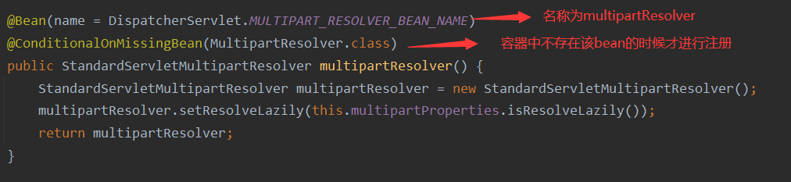

### 1、编写代码

#### 1.1 前端代码

这里方便测试，前端使用Thymeleaf

```html
<form method="post" th:action="@{/upload}" enctype="multipart/form-data">
    <div class="form-group">
        <label for="headImage">头像</label>
        <input type="file" name="headImage" id="headImage"><br>
    </div>
    <div class="form-group">
        <label for="photos">生活照</label>
        <input type="file" name="photos" id="photos" multiple><br>
    </div>
    <input type="submit" value="提交">
</form>
```

上面有几个注意的点：

- 表单提交方式不能为get，必须为post。
- 表单需要加上`enctype`属性。
- 多图片上传加上`multiple`属性。

#### 1.2 后端代码

```java
/**
 * MultipartFile 自动封装上传过来的文件
 * @param email
 * @param username
 * @param headerImg
 * @param photos
 * @return
 */
@PostMapping("/upload")
public String upload(@RequestParam("email") String email,
                     @RequestParam("username") String username,
                     @RequestPart("headerImg") MultipartFile headerImg,
                     @RequestPart("photos") MultipartFile[] photos) throws IOException {

    log.info("上传的信息：email={}，username={}，headerImg={}，photos={}",
             email,username,headerImg.getSize(),photos.length);

    if(!headerImg.isEmpty()){
        //保存到文件服务器，OSS服务器
        String originalFilename = headerImg.getOriginalFilename();
        headerImg.transferTo(new File("H:\\cache\\"+originalFilename));
    }

    if(photos.length > 0){
        for (MultipartFile photo : photos) {
            if(!photo.isEmpty()){
                String originalFilename = photo.getOriginalFilename();
                photo.transferTo(new File("H:\\cache\\"+originalFilename));
            }
        }
    }

    return "main";
}
```

### 2、测试

启动项目点击上传，可以看到后台的打印信息。如果上传的图片过大，会报错`FileSizeLimitExceededException`。


### 3、源码分析

#### 3.1 文件上传属性分析

通过前面的学习，可以知道SpringBoot在启动的时候会去加载很多`spring-boot-autoconfigure`包下的自动配置类，关于文件上传的自动配置类，是`MultipartAutoConfiguration`类。


这个类代码不多，如下

```java
@Configuration(proxyBeanMethods = false)
@ConditionalOnClass({ Servlet.class, StandardServletMultipartResolver.class, MultipartConfigElement.class })
@ConditionalOnProperty(prefix = "spring.servlet.multipart", name = "enabled", matchIfMissing = true)
@ConditionalOnWebApplication(type = Type.SERVLET)
@EnableConfigurationProperties(MultipartProperties.class)
public class MultipartAutoConfiguration {

	private final MultipartProperties multipartProperties;

	public MultipartAutoConfiguration(MultipartProperties multipartProperties) {
		this.multipartProperties = multipartProperties;
	}

	@Bean
	@ConditionalOnMissingBean({ MultipartConfigElement.class, CommonsMultipartResolver.class })
	public MultipartConfigElement multipartConfigElement() {
		return this.multipartProperties.createMultipartConfig();
	}

	@Bean(name = DispatcherServlet.MULTIPART_RESOLVER_BEAN_NAME)
	@ConditionalOnMissingBean(MultipartResolver.class)
	public StandardServletMultipartResolver multipartResolver() {
		StandardServletMultipartResolver multipartResolver = new StandardServletMultipartResolver();
		multipartResolver.setResolveLazily(this.multipartProperties.isResolveLazily());
		return multipartResolver;
	}

}
```

通过`@EnableConfigurationProperties(MultipartProperties.class)`的作用可知，`MultipartProperties`会被注册到容器中，我们进入`MultipartProperties`类，该类主要是定义一些文件上传的属性

```java
@ConfigurationProperties(prefix = "spring.servlet.multipart", ignoreUnknownFields = false)
public class MultipartProperties {

	/**
	 * Whether to enable support of multipart uploads.
	 */
	private boolean enabled = true;

	/**
	 * Intermediate location of uploaded files.
	 */
	private String location;

	/**
	 * Max file size.
	 */
	private DataSize maxFileSize = DataSize.ofMegabytes(1);

	/**
	 * Max request size.
	 */
	private DataSize maxRequestSize = DataSize.ofMegabytes(10);

	/**
	 * Threshold after which files are written to disk.
	 */
	private DataSize fileSizeThreshold = DataSize.ofBytes(0);

	/**
	 * Whether to resolve the multipart request lazily at the time of file or parameter
	 * access.
	 */
	private boolean resolveLazily = false;

	....
}
```

由代码可知，默认单个文件大小最大为1M，单次请求的总大小最大为10M。

`@ConfigurationProperties`注解定义该类与配置文件绑定，并且前缀为`spring.servlet.multipart`。所以针对上面图片上传过大报错的问题，我们可以在application.yml文件中配置

```yaml
spring.servlet.multipart.max-file-size=10MB
spring.servlet.multipart.max-request-size=100MB
```

#### 3.2 自动配置原理

首先通过`MultipartAutoConfiguration`类，我们知道它自动配置了一个文件上传解析器



所以如果我们需要自定义文件上传解析器，直接覆盖即可。

**原理步骤**

- **1、请求进来使用文件上传解析器判断（**isMultipart**）并封装（**resolveMultipart，**返回**MultipartHttpServletRequest**）文件上传请求**
- **2、参数解析器来解析请求中的文件内容封装成MultipartFile**

- **3、将request中文件信息封装为一个Map；**MultiValueMap<String, MultipartFile>

**FileCopyUtils**。实现文件流的拷贝