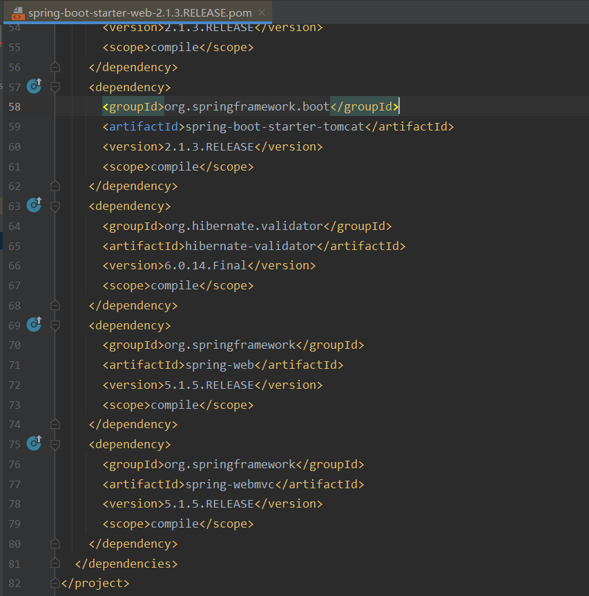

### 1、前言

从Spring转到SpringBoot的xdm应该都有这个感受，以前整合Spring + MyBatis + SpringMVC我们需要写一大堆的配置文件，堪称配置文件地狱，我们还要在pom.xml文件里引入各种类型的jar包，Mybatis的、SpringMVC的、Spring-aop的，Spring-context等等。

自从使用SpringBoot后，新建一个项目几乎不需要做任何改动，我们就可以运行起来。pom文件里，我们只需要引入一个`spring-boot-starter-web`就可以，之前我们所做的一切，SpringBoot都在底层帮我们做了。

写过SSM的xdm应该都记得`dispatcherServle`t和`characterEncoding`，这是我们在web.xml中必须配置的两个选项，我们还需要配置文件上传解析器`multipartResolver`，需要配置数据源`druidDataSource`，如果解析jsp，还需要配置视图解析器`viewResolver`。。。到最后，你就会有一坨的配置文件。


然后我们使用SpringBoot后，好像也从来没有配置过这些东西了，以前闭着眼睛都能写出来的各种配置文件，突然之间好像离我们很遥远了，而我们也渐渐忘记了各种Filter（过滤器）和Interceptor（拦截器）的名字。这既是SpringBoot简化了配置带给我们的好处，也是它带来的坏处。

这篇文章就一起来学习一下SpringBoot是如何做依赖管理以及自动配置的。

### 2、依赖管理

#### 2.1 父项目做依赖管理

每个SpringBoot项目，pom.xml文件都会给我们定义一个parent节点

```xml
<parent>
    <groupId>org.springframework.boot</groupId>
    <artifactId>spring-boot-starter-parent</artifactId>
    <version>2.1.3.RELEASE</version>
    <relativePath/> <!-- lookup parent from repository -->
</parent>
```

该节点指定了`version`版本号，所以在pom.xml文件里我们很多引入的jar都没有定义版本号，但这样也不会出错，因为SpringBoot帮我们为一些常用的jar包指定了版本号。

ctrl + 鼠标右键点击进入`spring-boot-starter-parent`这个jar包，会发现它的父项目是`spring-boot-dependencies`

```xml
<parent>
    <groupId>org.springframework.boot</groupId>
    <artifactId>spring-boot-dependencies</artifactId>
    <version>2.1.3.RELEASE</version>
    <relativePath>../../spring-boot-dependencies</relativePath>
</parent>
```

而在这个jar包里，就声明了很多开发中常用jar的版本号


所以在你pom.xml文件中引入jar的时候，如果该jar在`spring-boot-dependencies`中定义了版本号，那么你可以不写。如果你想使用其他的版本号，那么也可以在pom.xml中定义version，遵循就近原则。比如你想使用自定义版本号的MySQL驱动，只需在pom.xml中进行定义

```xml
<properties>
    <mysql.version>5.1.43</mysql.version>
</properties>
```

#### 2.2 starter场景启动器

在SpringBoot项目中，我们只需要引入`spring-boot-starter-web`包就可以写接口并且进行访问，因为在这个starter中整合了我们之前写Spring项目时引入的`spring-aop`、`spring-context`、`spring-webmvc`等jar包，包括tomcat，所以SpringBoot项目不需要外部的tomcat，只需要启动application类使用内置的tomcat服务器即可。



在SpringBoot项目中，根据[官方文档](https://docs.spring.io/spring-boot/docs/current/reference/html/using.html#using.build-systems.starters)，有各种场景的`spring-boot-starter-*`可以使用，只要引入了starter，这个场景所有常规需要的依赖就会自动引入。（https://docs.spring.io/spring-boot/docs/current/reference/html/using.html#using.build-systems.starters）

所有场景启动器最底层的依赖就是`spring-boot-starter`，该jar包是核心启动包，包含了自动配置的支持，日志以及YAML。Core starter, including auto-configuration support, logging and YAML，这是官方对它的描述。


而这个`spring-boot-autoconfigure`就关系到我们接下来要说的SpringBoot自动配置功能。

### 3、容器功能

了解SpringBoot的自动配置功能之前，需要先了解一下SpringBoot的容器管理功能。学习Spring的时候就知道，Spring的IOC和AOP。

IOC容器帮助我们存放对象，并且管理对象，包括：创建、装配、销毁，这样就将原本由程序完成的工作交给了Spring框架来完成。学习的核心在于如何将对象放在Spring中以及从Spring中取出。

#### 3.1 SpringBoot的默认包扫描路径

在SpringBoot中，我们没有指定任何一个包的扫描路径，但你注册进容器中的对象却都可以拿到，这是因为SpringBoot有默认的包扫描路径，在这个路径下的目标对象，都会被注册进容器中。**默认的扫描路径是Main Application Class所在的目录以及子目录**。可以通过`scanBasePackages`属性改变扫描路径

```java
@SpringBootApplication(scanBasePackages = "xxx.xxx.xxx")
```


该属性其实和`@ComponentScan`注解的`basePackages`属性绑定了，所以使用`@ComponentScan`也能达到一样的效果。

获取默认扫描路径在代码在`ComponentScanAnnotationParser`类的`parse`方法中，在对应的行打上断点，启动主类进行调试


调试后就会发现，其实这个`declaringClass`就是项目的启动类，然后启动类所在的包就会加入`basePackages`中。


#### 3.2 组件添加

（1）**@Configuration和@Bean**

`@Configuration`注解表示这个类是个配置类，`@Bean`注解往容器中注册实例。

```java
import com.codeliu.entity.User;
import org.springframework.context.annotation.Bean;
import org.springframework.context.annotation.Configuration;

@Configuration
public class MyConfig {

    @Bean
    public User user() {
        User user = new User("秃头哥", 20);
        return user;
    }
}
```

然后在启动类中进行测试，可以发现容器中的实例都是单例的，即多次拿到的都是同一个对象。

```java
@SpringBootApplication
public class DockerTestApplication {

    public static void main(String[] args) {
        ConfigurableApplicationContext run = SpringApplication.run(DockerTestApplication.class, args);
        User user1 = run.getBean("user", User.class);
        User user2 = run.getBean(User.class);
        // true
        System.out.println(user1 == user2);
    }
}
```

`@Configuration`注解中的`proxyBeanMethods`属性即代理bean的方法，决定是否是单例模式，默认为true。Full模式（proxyBeanMethods = true）和Lite（proxyBeanMethods = false）模式，Full模式保证每个@Bean方法被调用多少次返回的组件都是单实例的，而Lite模式每个@Bean方法被调用多少次返回的组件都是新创建的。组件依赖必须使用Full模式默认，其他默认是否Lite模式

（2）**@Component、@Controller、@Service、@Repository**

四大法王，使用在pojo、mapper、service、controller类上的注解。

（3）**@Import**

该注解定义如下，只有一个`value`属性，你可以传入一个Class数组，在启动过程中，会自动帮你把类注册进容器。

```java
@Configuration
@Import({User.class, DBHelper.class})
public class MyConfig {

}
```

```java
@SpringBootApplication
public class DockerTestApplication {

    public static void main(String[] args) {
        ConfigurableApplicationContext run = SpringApplication.run(DockerTestApplication.class, args);
        User user1 = run.getBean(User.class);
        User user2 = run.getBean(User.class);
        // true
        System.out.println(user1 == user2);

        User user = run.getBean(User.class);
        // com.codeliu.entity.User@63411512
        System.out.println(user);

        DBHelper dbHelper = run.getBean(DBHelper.class);
        // ch.qos.logback.core.db.DBHelper@35cd68d4
        System.out.println(dbHelper);
    }
}
```

可以看到，默认组件的名字是全类名。

（4）**@Conditional条件装配**

意思就是满足`@Conditional`指定的条件，才进行组件注入。


```java
import com.codeliu.entity.User;
import org.springframework.boot.autoconfigure.condition.ConditionalOnMissingBean;
import org.springframework.context.annotation.Bean;
import org.springframework.context.annotation.Configuration;

@Configuration
// 没有名字为test的bean，才进行注册，该注解可以放在类型，也可以放在方法上，作用范围不一样
@ConditionalOnMissingBean(name = "test")
public class MyConfig {
    @Bean
    public User user() {
        User user = new User("秃头哥", 20);
        return user;
    }
}
```

其他注解类似。在SpringBoot进行自动配置的时候，底层使用了很多条件装配，达到**按需加载**的目的。

#### 3.3 原生配置文件引入

`@ImportResource`注解可以导入Spring的配置文件，让配置文件里的内容生效。因为有些项目bean定义在xml文件里，但你必须知道xml文件的路径，这样在项目启动的时候Spring才会加载配置文件。那对于SpringBoot项目来说，所有的bean都是通过java配置实现，xml没有用武之地了吗？

`@Configuration`搭配`@ImportResource`可以实现xml配置的装载。

```java
import org.springframework.context.annotation.Configuration;
import org.springframework.context.annotation.ImportResource;

@Configuration
@ImportResource("classpath:beans.xml")
public class MyConfig {

}
```

#### 3.4 配置绑定

很多时候我们需要读取properties文件中的属性，封装到对应的Java bean中。我们可以通过代码进行读取

```java
public class getProperties {
     public static void main(String[] args) throws FileNotFoundException, IOException {
         Properties pps = new Properties();
         pps.load(new FileInputStream("a.properties"));
         Enumeration enum1 = pps.propertyNames();//得到配置文件的名字
         while(enum1.hasMoreElements()) {
             String strKey = (String) enum1.nextElement();
             String strValue = pps.getProperty(strKey);
             System.out.println(strKey + "=" + strValue);
             //封装到JavaBean。
         }
     }
 }
```

当配置文件中属性很多的时候，极其不方便。

（1）**@Component和@ConfigurationProperties**

在Java bean上使用这两个注解，可以和配置文件中的属性相关联，不过要注意的是，Java bean必须有setter/getter方法，否则无法赋值，另外就是配置文件中的属性不能有大写字母，否则启动报错。

```java
import org.springframework.boot.context.properties.ConfigurationProperties;
import org.springframework.stereotype.Component;

@Component
@ConfigurationProperties(prefix = "my-user")
public class User {
    private String names;
    private int age;
    ....
}
```

省略了getter/setter和toString方法。`@ConfigurationProperties`注解中指定配置文件中相关属性的前缀，在配置文件中

```java
my-user.names=CodeTiger
my-user.age=22
```

启动类中进行测试获取user对象，输出就会发现属性已经赋值。

（2）**@ConfigurationProperties和@EnableConfigurationProperties**

`@ConfigurationProperties`注解加载java bean上指定前缀，而`@EnableConfigurationProperties`注解则加在配置类上，该注解有两个作用：**开启配置绑定功能、把指定的java bean注册到容器中**。因为该注解会把java bean注册到容器中，所以在java bean上就不需要加`@Component`注解了。

```java
@Configuration
@EnableConfigurationProperties({User.class})
public class MyConfig {

}
```

### 4、自动配置原理

了解了上面的知识，就来学习一下SpringBoot底层是如何帮我们自动配置bean的。从加在启动类上的`@SpringBootApplication`注解开始。


上面四个注解跟我们本次学习无关，可以忽略。

（1）**@SpringBootConfiguration**

查看该注解的定义，发现其上标有`@Configuration`，并且里面有一个唯一的属性即`proxyBeanMethods`。前面我们讲`@Configuration`注解的时候讲过这个属性，这里就不重复讲了。这说明被`@SpringBootConfiguration`修饰的类也是一个配置类。


（2）**@ComponentScan**

指定扫描哪些Spring注解。

（3）**@EnableAutoConfiguration**

这是SpringBoot自动配置的入口，该注解定义如下


#### 4.1 自动配置basePackage

`@AutoConfigurationPackage`注解，顾名思义，自动配置包。


`@Import`注解前面讲过，将一个组件注入容器中，所以我们看看`AutoConfigurationPackages.Registrar`长啥样子。它调用了`register`方法进行组件的注册，那么是注册哪里的组件呢？看它第二个参数，是去获取`basePackage`，所以可以猜出`@AutoConfigurationPackage`注解应该是在启动项目的时候，自动把默认包或者我们指定的包路径下面的组件注册进容器。


我们进入`PackageImports`类，在对应行上打上断点进行调试，看看项目启动后这些值是什么


可以发现，它会拿到启动类所在的包路径，然后返回给`register`方法作为它的第二个参数传入。这就是为什么在启动时，我们不需要配置任何路径，SpringBoot就可以帮我们把组件注入容器的原因。

#### 4.2 自动配置导入包的配置类

这个是干什么的呢？前面我们说过，在Spring中我们会配置`dispatcherServle`t和`characterEncoding`等需要的组件，但在SpringBoot中，我们却啥都没做。


因为在SpringBoot底层帮我们做了。就是`EnableAutoConfiguration`注解上标注的`@Import(AutoConfigurationImportSelector.class)`注解。再贴一遍


所以就得去看看`AutoConfigurationImportSelector`类了。


在`AutoConfigurationImportSelector`类中有一个`getAutoConfigurationEntry`方法，该方法就是给容器中批量导入一些组件。那么是导入哪些组件呢？在该方法中，拿到一个`configurations`，然后对`configurations`又是去重又是删除。那获取看看这个变量里面存的是个啥玩意就明白了。

在相应行打上断点，运行后


这是啥？一个长度为130的数组，而里面都是一些AutoConfiguration，而且我们还看到了熟悉的AopAutoConfiguration。往下找找，发现还有我们熟悉的DispatcherServlet


那么这些自动配置类是从哪里读取的呢？看方法里的`getCandidateConfigurations`方法


该方法中调用`loadFactoryNames`方法，而`loadFactoryNames`方法则调用`loadSpringFactories`方法， 利用工厂加载得到所有` META-INF/spring.factories`文件中的组件。


而` META-INF/spring.factories`文件存在于我们导入的jar包。它会扫描所有jar包中的` META-INF/spring.factories`文件，然后进行去重以及移除掉我们exclude掉的组件。

在我测试的项目中，获取到的组件数目为130，就是在 spring-boot-autoconfigure-2.4.4.jar包中，里面刚好有130个组件。


到这里，总结一下大致的流程如下：

（1）利用getAutoConfigurationEntry(annotationMetadata);给容器中批量导入一些组件。

（2）调用List<String> configurations = getCandidateConfigurations(annotationMetadata, attributes)获取到所有需要导入到容器中的配置类。

（3）利用工厂加载 Map<String, List<String>> loadSpringFactories(@Nullable ClassLoader classLoader)；得到所有的组件。

（4）从META-INF/spring.factories位置来加载一个文件。默认扫描我们当前系统里面所有META-INF/spring.factories位置的文件。

#### 4.3 按需开启自动配置项

SpringBoot在启动的时候为我们加载了这么多组件，我们不可能全部用得上，那如果用不上的还注册进容器，岂不是耗费资源。其实底层使用了条件装配@Conditional，在我们需要的情况下才会注册对应的组件。

在我测试的项目中，因为启动的时候都是加载的 spring-boot-autoconfigure-2.4.4.jar包中的组件，所以我可以去看看该jar包中的xxxAutoConfiguration的源码。比如`AopAutoConfiguration`


在项目中，如果我们没有引入aspectj的jar，就不会有Advice类，那么jdk动态代理和cglib代理都不会生效。而此时生效的是基础代理，只作用于框架内部的advisors，项目中我们自定义的切面是不会被AOP代理的。


其他AutoConfiguration也是类似的，这里就不一一看了。

#### 4.4 用户优先

啥叫用户优先？就是SpringBoot底层虽然会为我们自动加载组件，但如果我们想用我们自己定义的呢？来看看`HttpEncodingAutoConfiguration`


首先应用是Servlet应用以及存在`CharacterEncodingFilter`类的时候，才会进行注册。而且该类和配置文件进行了绑定，可以在配置文件中对属性进行赋值。在注册`CharacterEncodingFilter`的时候，如果系统中不存在这个bean的时候，才会进行注册，防止重复注册，并且组件的值是进行动态赋值的，即如果我们编码不想使用utf-8，那我们可以在配置文件中进行修改，系统注册时候，就会使用我们自定义的值。

根据[官方文档](https://docs.spring.io/spring-boot/docs/current/reference/html/application-properties.html#application-properties.core)，有以下属性可以进行设置。


### 5、总结

本来主要分析了SpringBoot是如何进行依赖管理和自动配置的，相比于Spring，很多工作都是在底层帮我们做了。虽然我们写代码可能用不上这些，但知其然并且知其所以然，纸上得来终觉浅，绝知此事要躬行。