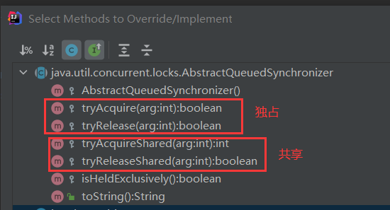
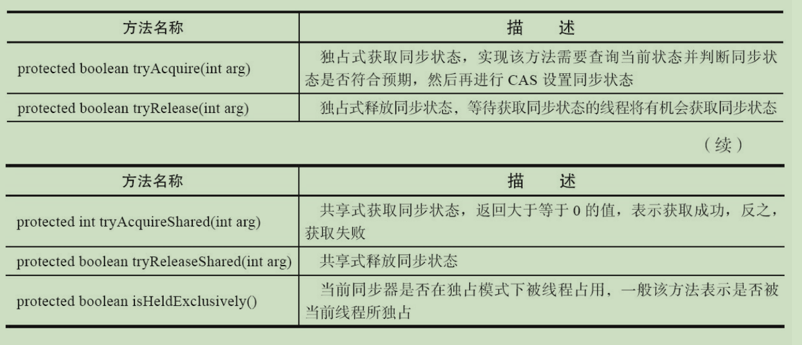
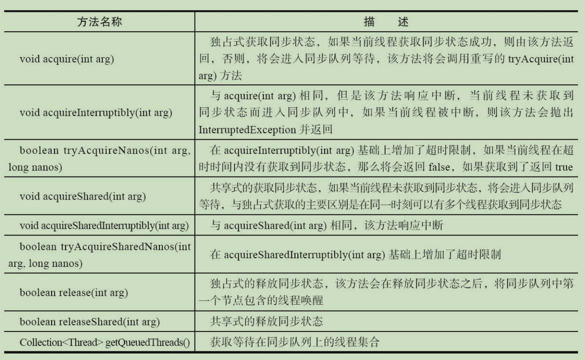

#### 1、AQS介绍

AQS全称`AbstractQueuedSynchronizer`，是一个同步器，用来构建锁或者其他同步组件的基础框架。内部主要使用一个volatile修饰的state变量和一个FIFO双向队列来实现的。

```java
	/**
     * Head of the wait queue, lazily initialized.  Except for
     * initialization, it is modified only via method setHead.  Note:
     * If head exists, its waitStatus is guaranteed not to be
     * CANCELLED.
     */
    private transient volatile Node head;

    /**
     * Tail of the wait queue, lazily initialized.  Modified only via
     * method enq to add new wait node.
     */
    private transient volatile Node tail;

    /**
     * The synchronization state.
     */
    private volatile int state;
```

`ReentrantLock`、`Semaphore`、`CountDownLatch`等都是基于AQS实现的。

同步器的主要使用方式是继承，子类通过继承同步器并实现它的抽象方法来管理同步状 态，在抽象方法的实现过程中免不了要对同步状态进行更改，这时就需要使用同步器提供的3 个方法（getState()、setState(int newState)和compareAndSetState(int expect,int update)）来进行操 作，因为它们能够保证状态的改变是安全的。



子类推荐被定义为自定义同步组件的静态内部类，同步器自身没有实现任何同步接口，它仅仅是定义了若干同步状态获取和释放的方法来 供自定义同步组件使用，同步器既可以支持独占式地获取同步状态，也可以支持共享式地获 取同步状态，这样就可以方便实现不同类型的同步组件（ReentrantLock、 ReentrantReadWriteLock和CountDownLatch等）

```java
public class Main {
    static class Sync extends AbstractQueuedSynchronizer {
        @Override
        protected boolean tryAcquire(int arg) {
            return super.tryAcquire(arg);
        }

        @Override
        protected boolean tryRelease(int arg) {
            return super.tryRelease(arg);
        }

        @Override
        protected int tryAcquireShared(int arg) {
            return super.tryAcquireShared(arg);
        }

        @Override
        protected boolean tryReleaseShared(int arg) {
            return super.tryReleaseShared(arg);
        }

        @Override
        protected boolean isHeldExclusively() {
            return super.isHeldExclusively();
        }
    }
}
```

同步器是实现锁（也可以是任意同步组件）的关键，在锁的实现中聚合同步器，利用同步器实现锁的语义。可以这样理解二者之间的关系：锁是面向使用者的，它定义了使用者与锁交 互的接口（比如可以允许两个线程并行访问），隐藏了实现细节；同步器面向的是锁的实现者，它简化了锁的实现方式，屏蔽了同步状态管理、线程的排队、等待与唤醒等底层操作。锁和同步器很好地隔离了使用者和实现者所需关注的领域。

#### 2、同步器的接口与示例

同步器的设计是基于**模板方法**模式的，也就是说，使用者需要继承同步器并重写指定的方法，随后将同步器组合在自定义同步组件的实现中，并调用同步器提供的模板方法，而这些模板方法将会调用使用者重写的方法。 这句话听起来很绕，慢慢往后看就懂了。

我们在继承AQS并重写那5个方法的时候，需要调用AQS提供的几个方法去访问或修改stats变量的状态。

```java
// 获取当前同步状态
protected final int getState() {
    return state;
}

// 设置当前同步状态
protected final void setState(int newState) {
    state = newState;
}

// 使用CAS设置当前状态，CAS能保证操作的原子性
protected final boolean compareAndSetState(int expect, int update) {
    // See below for intrinsics setup to support this
    return unsafe.compareAndSwapInt(this, stateOffset, expect, update);
}
```

我们在继承同步器时可重写的方法如下



在实现自定义同步组件时，也会调用同步器提供的模板方法，部分模板方法如下



AQS提供的模板方法主要分为三类：

（1）独占式获取和释放同步状态。

（2）共享式获取和释放同步状态。

（3）查询同步队列中等待的线程情况。

#### 3、实现一个独占锁

独占锁，就是同一时刻只能一个线程拥有锁。基于AQS，我们可以很方便的实现。

```java
import java.util.concurrent.TimeUnit;
import java.util.concurrent.locks.AbstractQueuedSynchronizer;
import java.util.concurrent.locks.Condition;
import java.util.concurrent.locks.Lock;

/**
 * 基于AQS实现独占锁
 */
public class ExclusiveLock implements Lock {

    /**
     * 实现自定义的同步器
     */
    private static class Sync extends AbstractQueuedSynchronizer {
        /**
         * 获取锁
         * @param arg
         * @return
         */
        @Override
        protected boolean tryAcquire(int arg) {
            // 设置同步变量state为1
            if (compareAndSetState(0, 1)) {
                setExclusiveOwnerThread(Thread.currentThread());
                return true;
            }
            return false;
        }

        @Override
        protected boolean tryRelease(int arg) {
            if (getState() == 0) {
                throw new IllegalMonitorStateException();
            }
            setExclusiveOwnerThread(null);
            setState(0);
            return true;
        }

        /**
         * 是否处于占用状态
         * @return
         */
        @Override
        protected boolean isHeldExclusively() {
            return getState() == 1;
        }

        // 每个condition都包含一个condition队列
        Condition newCondition() {
            return new ConditionObject();
        }
    }

    private final Sync sync = new Sync();

    @Override
    public void lock() {
        sync.acquire(1);
    }

    @Override
    public void lockInterruptibly() throws InterruptedException {
        sync.acquireInterruptibly(1);
    }

    @Override
    public boolean tryLock() {
        return sync.tryAcquire(1);
    }

    @Override
    public boolean tryLock(long time, TimeUnit unit) throws InterruptedException {
        return sync.tryAcquireNanos(1, unit.toNanos(time));
    }

    @Override
    public void unlock() {
        sync.release(1);
    }

    @Override
    public Condition newCondition() {
        return sync.newCondition();
    }
}
```

一般在实现自定义同步器时，都会把它作为静态内部类去实现。上面实现的ExclusiveLock类中就是定义了一个静态内部类Sync去继承AQS实现独占锁逻辑的。通过CAS设置同步变量state值为1表示获取锁成功，释放锁时把state设置为0即可。

#### 4、AQS的实现分析

##### 4.1 同步队列

AQS内部依赖同步队列（双向FIFO队列）来进行线程的管理，当线程获取锁失败时，会将线程以及等待状态信息构造为一个节点Node并将其放入同步队列队尾，然后阻塞该线程。当锁释放的时候，会把队首节点中的线程唤醒，使其再次尝试获取同步状态。

Node是AQS中的一个静态内部类，用来保存获取同步状态失败的线程引用、等待状态以及前驱和后继节点，主要字段如下

```java
static final class Node {
        // 表示节点是共享模式
        static final Node SHARED = new Node();
        // 表示节点是独占模式
        static final Node EXCLUSIVE = null;

        // 由于在同步队列中等待的线程等待超时或者被中断，需要从同步队列中取消等待，节点进入该状态将不会改变。
        static final int CANCELLED =  1;
        // 后继节点的线程处于等待状态，而当前节点的线程如果释放了同步状态或者被取消，将会通知后继节点，使后继节点的线程得以运行。
        static final int SIGNAL    = -1;
        // 节点在等待队列中，节点线程等待在Condition上，当其他线程对Condition调用了signal()方法后，该节点将会从等待队列转移到同步队列中，加入到对同步状态的获取中。
        static final int CONDITION = -2;
        // 表示下一次共享式同步状态获取将会无条件的传播下去。
        static final int PROPAGATE = -3;

        /**
		 * 等待状态，取值如下
		 * SIGNAL 值为-1，
		 *
		 * CANCELLED 值为1，
		 *
		 * CONDITION 值为-2，
		 *
		 * PROPAGATE 值为-3，
		 *
		 * INITIAL 值为0，表示初始状态。
         */
        volatile int waitStatus;

        // 前驱节点，当节点加入同步队列时被设置（尾部添加）
        volatile Node prev;

        // 后继节点
        volatile Node next;

        // 获取同步状态的线程
        volatile Thread thread;

       	// 等待队列中的后继节点。如果当前节点是共享的，那么这个字段将是一个SHARED常量，也就是说节点类型（独占和共享）和等待队列中的后继节点共用同一个字段
        Node nextWaiter;
}
```

没有成功获取同步状态的线程将会加入同步队列的尾部，这个加入的过程也必须要保证线程安全，因此AQS提供了`compareAndSetTail(Node expect, Node update)`方法。同步队列的结构大致如下


同步队列设置尾结点的过程大致如下


同步队列的首节点是获取锁成功的线程，首节点的线程在释放锁后，将会唤醒后继节点，后继节点如果获取锁成功的同时会把自己设置为头结点


设置头结点是通过获取同步状态成功的线程来完成的，由于只有一个线程能成功获取到同步状态，因此设置头结点的方法并不需要CAS来保证，它只需要将首节点设置为头结点的后继节点然后断开首节点即可。

##### 4.2 独占式同步状态获取和释放

我们在实现自定义的独占式同步器时，主要重写了AQS的`tryAcquire`和`tryRelease`方法，通过操作同步变量state完成同步状态的获取和释放。

我们可以调用AQS对外提供的`acquire`获取同步状态，该方法会调用我们重新的`tryAcquire`方法。

```java
public final void acquire(int arg) {
    if (!tryAcquire(arg) &&
        acquireQueued(addWaiter(Node.EXCLUSIVE), arg))
        selfInterrupt();
}
```

如果调用`tryAcquire`方法返回为false，则通过`addWaiter`把线程加入同步队列队尾，并标志位独占`Node.EXCLUSIVE`。通过CAS确保节点能安全的添加到队列尾。

```java
private Node addWaiter(Node mode) {
    Node node = new Node(Thread.currentThread(), mode);
    // Try the fast path of enq; backup to full enq on failure
    Node pred = tail;
    if (pred != null) {
        node.prev = pred;
        if (compareAndSetTail(pred, node)) {
            pred.next = node;
            return node;
        }
    }
    enq(node);
    return node;
}

private Node enq(final Node node) {
    for (;;) {
        Node t = tail;
        if (t == null) { // Must initialize
            if (compareAndSetHead(new Node()))
                tail = head;
        } else {
            node.prev = t;
            if (compareAndSetTail(t, node)) {
                t.next = node;
                return t;
            }
        }
    }
}
```

加入队列尾后，通过CAS不断的尝试获取同步状态。只有在前驱节点是头结点的情况下，才有可能获取到同步状态。如果获取不到则阻塞节点中的线程，而被阻塞线程的唤醒主要依靠前驱节点的出队或阻塞线程被中断来实现。 

```java
final boolean acquireQueued(final Node node, int arg) {
    boolean failed = true;
    try {
        boolean interrupted = false;
        for (;;) {
            final Node p = node.predecessor();
            if (p == head && tryAcquire(arg)) {
                setHead(node);
                p.next = null; // help GC
                failed = false;
                return interrupted;
            }
            if (shouldParkAfterFailedAcquire(p, node) &&
                parkAndCheckInterrupt())
                interrupted = true;
        }
    } finally {
        if (failed)
            cancelAcquire(node);
    }
}
```

在`acquireQueued(final Node node,int arg)`方法中，当前线程在“死循环”中尝试获取同步状态，而只有前驱节点是头节点才能够尝试获取同步状态，这是为什么？原因有两个，如下。

（1）头节点是成功获取到同步状态的节点，而头节点的线程释放了同步状态之后，将会唤醒其后继节点，后继节点的线程被唤醒后需要检查自己的前驱节点是否是头节点。 

（2）维护同步队列的FIFO原则。


独占式同步状态获取流程，也就是acquire(int arg)方法调用流程大致如下


上图中，当同步状态获取成功之后，当前线程从acquire(int arg)方法返回，如果对于锁这种并发组件而言，代表着当前线程获取了锁。 

当线程获取同步状态并执行完相应的逻辑后，就需要释放同步状态，通过调用AQS提供的`release`方法。该方法在释放了同步状态之后，会唤醒其后继节点（进而使后继节点重新尝试获取同步状态）。

```java
public final boolean release(int arg) {
    if (tryRelease(arg)) {
        Node h = head;
        if (h != null && h.waitStatus != 0)
            unparkSuccessor(h);
        return true;
    }
    return false;
}
```

该方法执行时，会唤醒头节点的后继节点线程，unparkSuccessor(Node node)方法使用LockSupport来唤醒处于等待状态的线程。

```java
private void unparkSuccessor(Node node) {
    /*
         * If status is negative (i.e., possibly needing signal) try
         * to clear in anticipation of signalling.  It is OK if this
         * fails or if status is changed by waiting thread.
         */
    int ws = node.waitStatus;
    if (ws < 0)
        compareAndSetWaitStatus(node, ws, 0);

    /*
         * Thread to unpark is held in successor, which is normally
         * just the next node.  But if cancelled or apparently null,
         * traverse backwards from tail to find the actual
         * non-cancelled successor.
         */
    Node s = node.next;
    if (s == null || s.waitStatus > 0) {
        s = null;
        for (Node t = tail; t != null && t != node; t = t.prev)
            if (t.waitStatus <= 0)
                s = t;
    }
    if (s != null)
        LockSupport.unpark(s.thread);
}
```

分析了独占式同步状态获取和释放过程后，适当做个总结：**在获取同步状态时，同步器维护一个同步队列，获取状态失败的线程都会被加入到队列中并在队列中进行自旋；移出队列（或停止自旋）的条件是前驱节点为头节点且成功获取了同步状态。在释放同步状态时，同步器调用tryRelease(int arg)方法释放同步状态，然后唤醒头节点的后继节点**。 

##### 4.3 共享式同步状态获取和释放

共享式获取与独占式获取最主要的区别在于同一时刻能否有多个线程同时获取到同步状态。以文件的读写为例，如果一个程序在对文件进行读操作，那么这一时刻对于该文件的写操作均被阻塞，而读操作能够同时进行。写操作要求对资源的独占式访问，而读操作可以是共享式访问。

通过调用同步器的acquireShared(int arg)方法可以共享式地获取同步状态

```java
public final void acquireShared(int arg) {
    if (tryAcquireShared(arg) < 0)
        doAcquireShared(arg);
}

private void doAcquireShared(int arg) {
    final Node node = addWaiter(Node.SHARED);
    boolean failed = true;
    try {
        boolean interrupted = false;
        for (;;) {
            final Node p = node.predecessor();
            if (p == head) {
                int r = tryAcquireShared(arg);
                if (r >= 0) {
                    setHeadAndPropagate(node, r);
                    p.next = null; // help GC
                    if (interrupted)
                        selfInterrupt();
                    failed = false;
                    return;
                }
            }
            if (shouldParkAfterFailedAcquire(p, node) &&
                parkAndCheckInterrupt())
                interrupted = true;
        }
    } finally {
        if (failed)
            cancelAcquire(node);
    }
}
```

在`acquireShared`方法中，会调用我们重写的`tryAcquireShared`方法尝试获取同步状态，该方法返回值为int，返回值大于等于0时，表示获取成功。因此，在共享式获取的自旋过程中，成功获取到同步状态并退出自旋的条件就是`tryAcquireShared(int arg)`方法返回值大于等于0。可以看到，在doAcquireShared(int arg)方法的自旋过程中，如果当前节点的前驱为头节点时，尝试获取同步状态，如果返回值大于等于0，表示该次获取同步状态成功并从自旋过程中退出。 

与独占式一样，共享式获取也需要释放同步状态，通过调用`releaseShared(int arg)`方法可以释放同步状态

```java
public final boolean releaseShared(int arg) {
    if (tryReleaseShared(arg)) {
        doReleaseShared();
        return true;
    }
    return false;
}

private void doReleaseShared() {
    /*
         * Ensure that a release propagates, even if there are other
         * in-progress acquires/releases.  This proceeds in the usual
         * way of trying to unparkSuccessor of head if it needs
         * signal. But if it does not, status is set to PROPAGATE to
         * ensure that upon release, propagation continues.
         * Additionally, we must loop in case a new node is added
         * while we are doing this. Also, unlike other uses of
         * unparkSuccessor, we need to know if CAS to reset status
         * fails, if so rechecking.
         */
    for (;;) {
        Node h = head;
        if (h != null && h != tail) {
            int ws = h.waitStatus;
            if (ws == Node.SIGNAL) {
                if (!compareAndSetWaitStatus(h, Node.SIGNAL, 0))
                    continue;            // loop to recheck cases
                unparkSuccessor(h);
            }
            else if (ws == 0 &&
                     !compareAndSetWaitStatus(h, 0, Node.PROPAGATE))
                continue;                // loop on failed CAS
        }
        if (h == head)                   // loop if head changed
            break;
    }
}
```

该方法在释放同步状态之后，将会唤醒后续处于等待状态的节点。对于能够支持多个线程同时访问的并发组件（比如Semaphore），它和独占式主要区别在于`tryReleaseShared(int arg)`方法必须确保同步状态（或者资源数）线程安全释放，一般是通过循环和CAS来保证的，因为释放同步状态的操作会同时来自多个线程。 

##### 4.4 超时获取同步状态

通过调用同步器的`doAcquireNanos(int arg,long nanosTimeout)`和`doAcquireSharedNanos(int arg, long nanosTimeout)`方法可以超时获取同步状态，即在指定的时间段内获取同步状态，如果获取到同步状态则返回true，否则，返回false。该方法提供了传统Java同步操作（比如synchronized关键字）所不具备的特性。 

```java
private boolean doAcquireNanos(int arg, long nanosTimeout)
            throws InterruptedException {
    if (nanosTimeout <= 0L)
        return false;
    // 从现在起经过nanosTimeout后超时
    final long deadline = System.nanoTime() + nanosTimeout;
    final Node node = addWaiter(Node.EXCLUSIVE);
    boolean failed = true;
    try {
        for (;;) {
            final Node p = node.predecessor();
            // 调用tryAcquire方法独占式获取同步状态
            if (p == head && tryAcquire(arg)) {
                setHead(node);
                p.next = null; // help GC
                failed = false;
                return true;
            }
            // 更新超时时间
            nanosTimeout = deadline - System.nanoTime();
            if (nanosTimeout <= 0L)
                return false;
            if (shouldParkAfterFailedAcquire(p, node) &&
                nanosTimeout > spinForTimeoutThreshold)
                LockSupport.parkNanos(this, nanosTimeout);
            if (Thread.interrupted())
                throw new InterruptedException();
        }
    } finally {
        if (failed)
            cancelAcquire(node);
    }
}
```

大致流程如下

