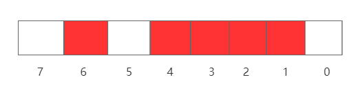
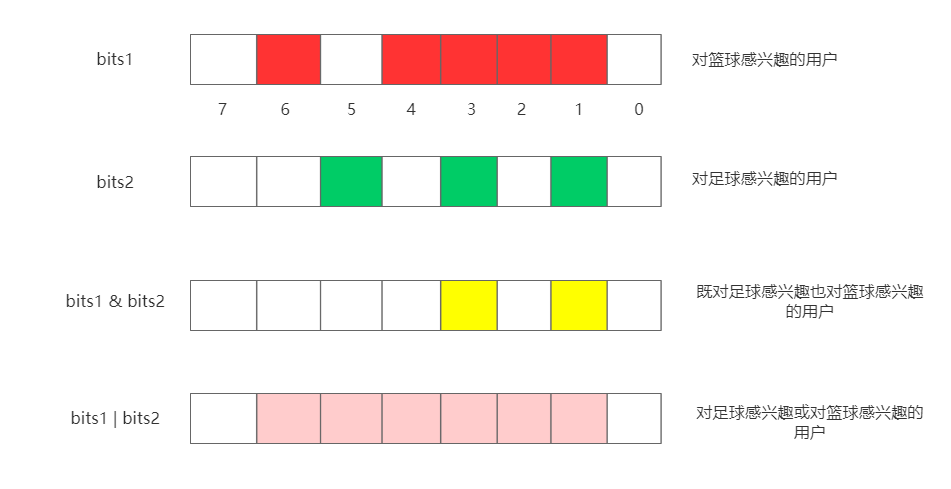
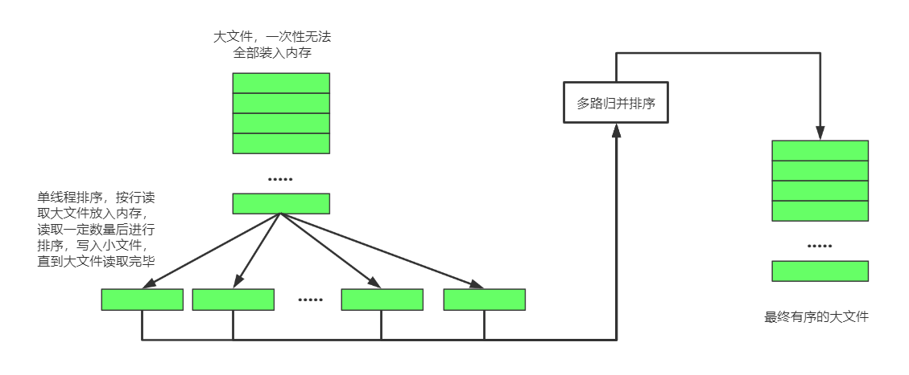

#### 从一道高大上的面试题来学习位图算法

今天我偶然刷到了一篇文章，“华为二面：一个文件里面有5亿个数据，一行一个，没有重复的，进行排序”。不知道又是哪个无良媒体瞎起的标题，夺人眼球。

不过说归说，这题听着就很高大上，5亿个数据排序，想想就很爽。常用的内排序算法有很多，比如我们熟悉的冒泡排序、插入排序、快速排序等等。所谓内排序，意思就是在内存里进行排序，不需要占用外存。

对于内部排序算法，在数据量比较小的情况下，还是可以玩玩的，但像上面说的，5亿个数据，先不说时间要多少，来算算需要多少空间存储这些数据 5 * 10 ^ 8 * 32 =  (1.6 * 10 ^ 10)bit = (1.6 * 10 ^ 10) / (1024 * 1024 * 8) = 1920M = 1.875G，快接近2G了，面试官就是这么坏，他只给你1G的内存，那玩个毛啊，内存都不够，连数据都装不下，何来排序。

这时候就有必要学习一下位图法（BitMap）了。

### 1、什么是位图算法

#### 1.1 基本思想

BitMap的核心思想就是用一个bit位来记录0和1两种状态，将具体数据映射到比特数组的具体某一位上，这个bit位设置为0表示该数不存在，设置为1表示该数存在。由于BitMap使用bit来记录数据，所以大大节省了存储空间，比如上面5亿个数据，如果使用bit来记录，只需要(1.875 / 32)G不到60兆内存即可。

利用这个特性，**BitMap可以用来处理大量数据的排序、查询以及去重等，BitMap在用户群做交集和并集运算的时候也有极大的便利**。

举个栗子，比如对于数列[2, 3, 6, 4, 1]，在BitMap里是如何存储的呢？

（1）先申请1字节(8 bit)的空间，这样就可以表示8个数，下标范围从0 ~ 7。

（2）然后根据数列将对应的bit位进行设置。对于2，则把下标为2的bit设置为1，依次类推，最终结果如下



这样如果我们需要得到有序数组的话，只需要从下标0开始遍历，如果bit位的值为1，则把下标输出，即可得到有序数列。

那如果数据很大呢？比如50，那0 ~ 7的下标肯定不够，这时候就需要扩充了，算起来好像需要8个这样的bit数组才行，50应该存放在第8个bit数组下标为0的地方。那中间岂不是还剩下6个空着没用？这是后面要讨论的问题了。注意：即使你只需要用到一个bit，也要至少申请8个bit，这是为了内存对齐。

#### 1.2 Map映射

从上面的介绍可以知道，BitMap的思想还是挺简单的，关键就是如何确定10进制到2进制的关系映射图。因为你可以用int(32bit)或者long(64bit)来进行映射。

如果使用int进行映射，假设我们要排序的数有N个，那么需要申请的内存空间大小就是int[(N - 1) / 32 + 1]，映射关系如下：

a[0]：0 ~ 31

a[1]：32 ~ 63

a[2]：64 ~ 95

.......

#### 1.3 数据和下标的转换

搞定了数据结构，接下来就是怎么把数据转换到我们申请的bit数组中。我们用“三步走”战略

（1）**确定数据在对应数组a中的下标**

十进制数0 - 31，对应于数组元素a[0]，十进制数32 - 63在数组元素a[1]中，所以可以很容易的知道，一个数num在数组a[num / 32]中，即下标为num / 32。

（2）**确定数据在对应数字a[i]中的下标**

十进制数1在a[0]的下标为1，十进制数31在a[0]中下标为31，十进制数32在a[1]中下标为0。 在十进制0-31就对应0-31，而32-63则对应也是0-31，即给定一个数num可以通过模32求得在对应数组a[i]中的下标 num % 32。

（3）**存放**

经过上面两步，我们知道一个数num存放在a[num / 32]的num % 32下标上。我可以通过移位操作将对应位置1

a[n >> 5] |= 1 << (n & 0x1F)

n >> 5不用多解释，大家都会，n & 0x1F 保留n的后五位，相当于 n % 32。

#### 1.4 实现一个简单的BitMap

具备了上面的知识，我们可以很容易的实现一个简陋的BitMap

```java
import java.util.Arrays;

public class BitSet {
    private int[] bits;

    private final static int ADDRESS_BITS_PER_WORD = 5;
    private final static int BITS_PER_WORD = 1 << ADDRESS_BITS_PER_WORD;

    /**
     * 无参构造器
     * 默认构造容量为32bit的数组，即数组长度为1
     */
    public BitSet() {
        bits = new int[(BITS_PER_WORD - 1) >> ADDRESS_BITS_PER_WORD + 1];
    }

    /**
     * 有参构造器
     * @param nbits 数字的个数
     */
    public BitSet(int nbits) {
        bits = new int[(nbits - 1) >> ADDRESS_BITS_PER_WORD + 1];
    }

    public int[] getBits() {
        return bits;
    }

    /**
     * 把num映射到bits数组中
     * @param num
     */
    public void set(int num) {
        // num在数组中的下标
        int index = num >> ADDRESS_BITS_PER_WORD;
        // TODO：要检查数组是否需要扩容
        bits[index] |= 1 << (num & 0x1F);
    }

    /**
     * 判断bits数组中对应位的值
     * @param bitIndex
     * @return
     */
    public boolean get(int bitIndex) throws Exception {
        if (bitIndex < 0) {
            throw new Exception();
        }
        // 把输入的下标进行转换，对应数组某个值的某个位置
        int index = bitIndex >> ADDRESS_BITS_PER_WORD;
        return (bitIndex < bits.length) && ((bits[index] & (1 << (bitIndex & 0x1F))) != 0);
    }

    public static void main(String[] args) throws Exception {
        // 5亿个数
        BitSet bitSet = new BitSet(1_0000_0000);
        // 目标数组
        int[] arr = {2, 98, 76, 56, 100, 762, 16, 95};
        Arrays.stream(arr).forEach(num -> {
            bitSet.set(num);
        });

        // 判断某个数在数组中是否存在
        System.out.println(bitSet.get(100));  // true
        System.out.println(bitSet.get(200));  // false
        System.out.println(bitSet.get(762));  // true

        // 输出排序后的数组
        int[] res = bitSet.getBits();
        int count = 0;
        for (int i = 0; i < res.length; i++) {
            // 按位输出
            for (int j = 0; j < 32; j++) {
                // 为1表示该数存在
                if (((res[i] >> j) & 1) == 1) {
                    arr[count++] = i * 32 + j;
                }
            }
        }
        // 2 16 56 76 95 98 100 762
        Arrays.stream(arr).forEach(System.out::println);
    }
}
```

我们可以输出看看它的内部怎么存储的

```java
bits[0][0, 0, 1, 0, 0, 0, 0, 0, 0, 0, 0, 0, 0, 0, 0, 0, 1, 0, 0, 0, 0, 0, 0, 0, 0, 0, 0, 0, 0, 0, 0, 0]
bits[1][0, 0, 0, 0, 0, 0, 0, 0, 0, 0, 0, 0, 0, 0, 0, 0, 0, 0, 0, 0, 0, 0, 0, 0, 1, 0, 0, 0, 0, 0, 0, 0]
bits[2][0, 0, 0, 0, 0, 0, 0, 0, 0, 0, 0, 0, 1, 0, 0, 0, 0, 0, 0, 0, 0, 0, 0, 0, 0, 0, 0, 0, 0, 0, 0, 1]
bits[3][0, 0, 1, 0, 1, 0, 0, 0, 0, 0, 0, 0, 0, 0, 0, 0, 0, 0, 0, 0, 0, 0, 0, 0, 0, 0, 0, 0, 0, 0, 0, 0]
bits[4][0, 0, 0, 0, 0, 0, 0, 0, 0, 0, 0, 0, 0, 0, 0, 0, 0, 0, 0, 0, 0, 0, 0, 0, 0, 0, 0, 0, 0, 0, 0, 0]
    ......
```

那么位图算法有没有一些对应的开源实现呢？毕竟自己写肯定不如大神写的好啊，答案是有。JDK的BitSet和Google的EWAHCompressedBitmap，Redis里也提供了类似的一些命令，主要有以下几个：SETBIT， GETBIT， BITCOUNT， BITOP， BITPOS，BITFIELD。

BitSet从JDK1.0开始就存在，是对BitMap算法的简单实现，而EWAHCompressedBitmap对BitMap的存储空间做了优化。比如我要存储的两个数1和100000，按照上面的思路，1和100000中间空了好多位置，但为了存储100000，必须要开足够长的数组才行，那么中间就会浪费很多位置。在这种数据分布极度不均匀的情况下BitMap的空间利用率是很低的。EWAHCompressedBitmap实现就对这种情况作了优化。

这篇文章先不分析JDK的BitSet和Google的EWAHCompressedBitmap的源码，放到下篇文章来。扯远了，现在还是回到面试题吧。：)

### 2、面试题怎么解决

其实通过上一节的学习，对于5亿个数据如何进行排序已经显而易见了。别说5亿个，50亿个都没问题。

### 3、BitMap的应用

由以上内容可得知，在数据量越大的情况下，BitMap节省空间的效果就越显著。所以BitMap很适合用来进行**大量数据的排序、去重、查找，包括在线活跃用户的统计，用户签到等**。

> 对5亿个没有重复元素的数据进行排序

上面代码里就有这个例子，只需要把数装进Bit数组里，然后按顺序输出即可，美得一批。但要注意是**没有重复元素**的情况下。

> 在5亿个数中找出重复/不重复整数的个数，限制内存不足以容纳5亿个整数

这种情况需要使用2-BitMap来解决，即用两个bit来表示一个数，定义00表示该数没有出现，01表示出现一次，11表示出现多次。

那么在存入的时候，如果是对应位是00，则变为01，01则变为11，11不变。全部存入完毕后，遍历，如果是11说明该数重复。

> 统计不同电话号码的个数

如果电话号码是8位数，则范围0 - 99999999，每个数对应一个bit位，大约只需要1.2M即可。

> 交集、并集的运算

因为BitMap使用位来存储数据，所以自然位具有高效位运算的特性。比如在统计用户兴趣标签的时候，一个bits1数组代表兴趣a，所以存储的就是对a感兴趣的用户，一个bits2数组代表兴趣b，存储的是对b感兴趣的用户。那么如果你想知道既对a感兴趣也对b感兴趣的用户，那么只需要两个数组进行`&`运算即可。如果想知道对a或对b感兴趣的用户，那么只需要两个数组进行`|`运算即可。



### 4、BitMap的优缺点

#### 4.1 优点

（1）运算效率高。

（2）占用内存少。

#### 4.2 缺点

（1）对重复数据无法进行排序。

（2）数据碰撞。比如将字符串映射到 BitMap 的时候会有碰撞的问题，那就可以考虑用 Bloom Filter 来解决，Bloom Filter 使用多个 Hash 函数来减少冲突的概率。

（3）数据稀疏时浪费空间。比如上面举的例子，存入(1, 100000)，只有两个数，但我们不得不开足够大的空间来存放100000，这就造成了中间很多空间的浪费，可以通过引入 Roaring BitMap 来解决。

### 5、面试题的另一种解法

归根结底，BitMap还是全部使用内存来进行排序的。如果面试官不讲武德，把内存条拔了怎么办？或者他只给你很少的内存。这时候就要**外排序**上场了。

外排序，字面意思，就是要借用外部的空间来完成排序。谁让你不给我足够的内存呢。通俗一点，就是**在内存极少的情况下，利用分治策略，使用外存保存中间结果，最后用多路归并进行排序**。

#### 5.1 基本思想



#### 5.2 怎么分

（1）内存中维护一个核心缓冲区`memBuffer`，将大文件按行读入，直到`memBuffer`满了或者大文件已经读完，然后对`memBuffer`里的数据进行内排序（选择合适的内排序算法），排序后将结果写入磁盘文件sort_file1.txt。

（2）清空`memBuffer`，重复执行步骤1。

（3）大文件处理完毕后，会得到n个有序的子文件。

#### 5.3 怎么合

现在有了n个有序的文件，关键怎么把它们合并成一个有序的文件。可以利用如下原理进行归并排序：一个n个元素的有序集合
$$
S = \{x | x_i \leq x_j,i,j \in [0, n)\}
$$
那么对于m个小集合：S1,S2,S3,...,Sm，所有小集合中的最小值是
$$
min = min(min(S_1), min(S_2),...,min(S_m))
$$
举个栗子，对于下面的集合

S1 = {1, 4, 8, 9}

S2 = {3, 6, 11, 13}

S3 = {2, 7, 10, 12}

分别拿出三个集合中的最小值，则min(1, 3, 2) = 1，1是在集合S1中的，那么把1写入大文件，同时S1中拿出下一个数4，则min(4, 3, 2) = 2，2是在集合S3中的，那么把2写入大文件，同时S3中拿出下一个数7，依次类推，直到小文件的值全部取出。

### 6、总结

本文从一道面试题入手，学习了位图BitMap算法，了解了它的原理已经对它进行了简单的实现，同时列举了BitMap的一些使用场景，最后回到面试题，讲解了如何利用BitMap和外排序进行解决。

下篇文章：JDK的BitSet和Google的EWAHCompressedBitmap源码对比与分析。