### 1、MySQL逻辑架构

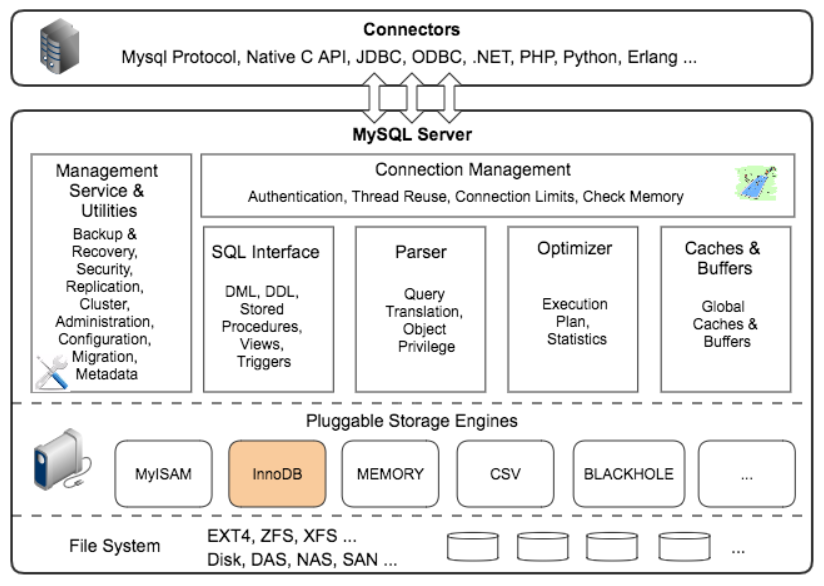

- **Connectors**
  MySQL首先是一个网络程序，其在TCP之上定义了自己的应用层协议。所以要使用MySQL，我们可以编写代码，跟MySQL Server建立TCP连接，之后按照其定义好的协议进行交互。当然这样比较麻烦，比较方便的办法是调用SDK，比如Native C API、JDBC、PHP等各语言MySQL Connector，或者通过ODBC。但通过SDK来访问MySQL，本质上还是在TCP连接上通过MySQL协议跟MySQL进行交互。
- **Connection Management**
  每一个基于TCP的网络服务都需要管理客户端链接，MySQL也不例外。MySQL会为每一个连接绑定一个线程，之后这个连接上的所有查询都在这个线程中执行。为了避免频繁创建和销毁线程带来开销，MySQL通常会缓存线程或者使用线程池，从而避免频繁的创建和销毁线程。
  客户端连接到MySQL后，在使用MySQL的功能之前，需要进行认证，认证基于用户名、主机名、密码。如果用了SSL或者TLS的方式进行连接，还会进行证书认证。
- **SQL Interface**
  MySQL支持DML（数据操作语言）、DDL（数据定义语言）、存储过程、视图、触发器、自定义函数等多种SQL语言接口。
- **Parser**
  MySQL会解析SQL查询，并为其创建语法树，并根据数据字典丰富查询语法树，会验证该客户端是否具有执行该查询的权限。创建好语法树后，MySQL还会对SQl查询进行语法上的优化，进行查询重写。
- **Optimizer**
  语法解析和查询重写之后，MySQL会根据语法树和数据的统计信息对SQL进行优化，包括决定表的读取顺序、选择合适的索引等，最终生成SQL的具体执行步骤。这些具体的执行步骤里真正的数据操作都是通过预先定义好的存储引擎API来进行的，与具体的存储引擎实现无关。
- **Caches & Buffers**
  MySQL内部维持着一些Cache和Buffer，比如Query Cache用来缓存一条Select语句的执行结果，如果能够在其中找到对应的查询结果，那么就不必再进行查询解析、优化和执行的整个过程了。
- **Pluggable Storage Engine**
  存储引擎的具体实现，这些存储引擎都实现了MySQl定义好的存储引擎API的部分或者全部。MySQL可以动态安装或移除存储引擎，可以有多种存储引擎同时存在，可以为每个Table设置不同的存储引擎。存储引擎负责在文件系统之上，管理表的数据、索引的实际内容，同时也会管理运行时的Cache、Buffer、事务、Log等数据和功能。
- **File System**
  所有的数据，数据库、表的定义，表的每一行的内容，索引，都是存在文件系统上，以文件的方式存在的。当然有些存储引擎比如InnoDB，也支持不使用文件系统直接管理裸设备，但现代文件系统的实现使得这样做没有必要了。
  在文件系统之下，可以使用本地磁盘，可以使用DAS、NAS、SAN等各种存储系统。


### 2、七种join


注意的是，对于最后两种情况，在MySQL里，是不存在`FULL OUTER JOIN`关键字的

```sql
mysql> select * from user full outer join role on user.role_id = role.role_id;
ERROR 1064 (42000): You have an error in your SQL syntax; check the manual that corresponds to your MySQL server version for the right syntax to use near 'outer join role on user.role_id = role.role_id' at line 1
```

那么对于最后两种情况，可以使用`union`关键字。`union`会对结果去重，而`union all`不会。

```sql
mysql> select * from user left join role on user.role_id = role.role_id union select * from user right join role on user.role_id = role.role_id;

mysql> select * from user left join role on user.role_id = role.role_id where user.role_id is null union select * from user right join role on user.role_id = role.role_id where role.role_id is null;
```

### 3、索引

#### 3.1 索引是什么

MySQL官方对索引的定义：索引（index）是帮助MySQL高效获取数据的**数据结构**。

索引的目的在于提高查找效率，可以类比字典。可以简单理解为“**排好序的快速查找数据结构**”。

在数据之外，数据库系统还维护着满足特定查找算法的数据结构，这些数据结构以某种方式引用（指向）数据，
这样就可以在这些数据结构上实现高级查找算法。这种数据结构，就是索引。


左边是数据表，一共有两列七条记录，最左边的是数据记录的物理地址。为了加快Col2 的查找，可以维护一个右边所示的二叉查找树，每个节点分别包含索引键值和一个指向对应数据记录物理地址的指针，这样就可以运用二叉查找在一定的复杂度内获取到相应数据，从而快速的检索出符合条件的记录。

一般来说索引本身也很大，不可能全部存储在内存中，因此索引往往以索引文件的形式存储的磁盘上。

#### 3.2 索引分类

##### 3.2.1 单列索引

单列索引只包含单个列，一个表可以有多个单列索引。

##### 3.2.2 唯一索引

索引列的值必须唯一，但允许有空值。

##### 3.2.3 主键索引

设定为主键后数据库会自动建立索引，innodb为聚簇索引。

##### 3.2.4 复合索引

一个索引包含多个列。

##### 3.2.5 基本语法

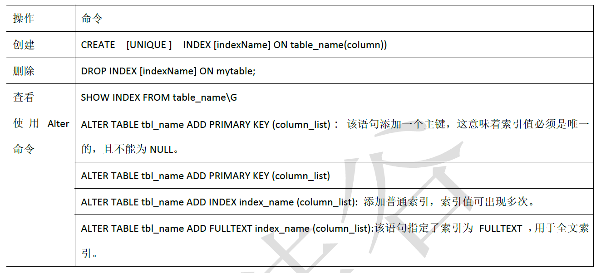

#### 3.3 索引的创建时机

##### 3.3.1 适合创建索引的情况

（1）主键自动建立唯一索引。

（2）频繁作为查询条件的字段应该建立索引。

（3）查询中与其他表建立管理的字段，外键关系建立索引。

（4）单键/组合索引的选择问题，组合索引性价比更高。

（5）查询中排序的字段，排序字段若通过索引去访问将大大提高排序速度。

（6）查询中统计或者分组字段。

##### 3.3.2 不适合建立索引的情况

（1）表记录太少。

（2）频繁增删改的表或字段。

（3）where条件里用不到的字段不创建索引。

（4）过滤性不好的不适合创建索引。（如果某个数据列包含许多重复的内容，那么建立索引就没有太大的实际效果。）

#### 3.4 索引失效的情况

准备工作，创建staffs表并创建了一个组合索引。

```sql
CREATE TABLE staffs(
id INT PRIMARY KEY AUTO_INCREMENT,
`name` VARCHAR(24)NOT NULL DEFAULT'' COMMENT'姓名',
`age` INT NOT NULL DEFAULT 0 COMMENT'年龄',
`pos` VARCHAR(20) NOT NULL DEFAULT'' COMMENT'职位',
`add_time` TIMESTAMP NOT NULL DEFAULT CURRENT_TIMESTAMP COMMENT'入职时间'
)CHARSET utf8 COMMENT'员工记录表';
INSERT INTO staffs(`name`,`age`,`pos`,`add_time`) VALUES('z3',22,'manager',NOW());
INSERT INTO staffs(`name`,`age`,`pos`,`add_time`) VALUES('July',23,'dev',NOW());
INSERT INTO staffs(`name`,`age`,`pos`,`add_time`) VALUES('2000',23,'dev',NOW());

ALTER TABLE staffs ADD INDEX index_staffs_nameAgePos(`name`,`age`,`pos`)
```

##### 3.4.1 **全值匹配&最佳左前缀原则**

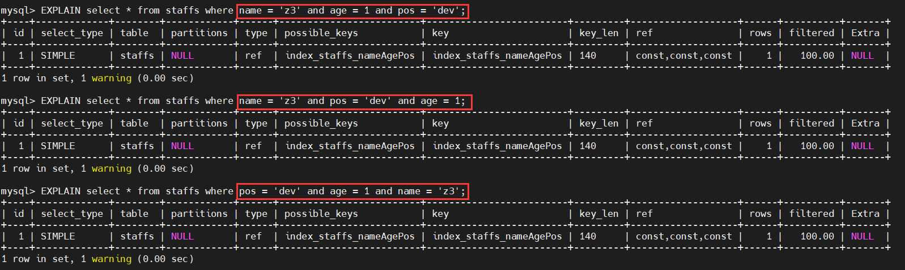

SQL 中查询字段的顺序，跟使用索引中字段的顺序，没有关系。优化器会在不影响SQL 执行结果的前提下，给
你自动地优化。

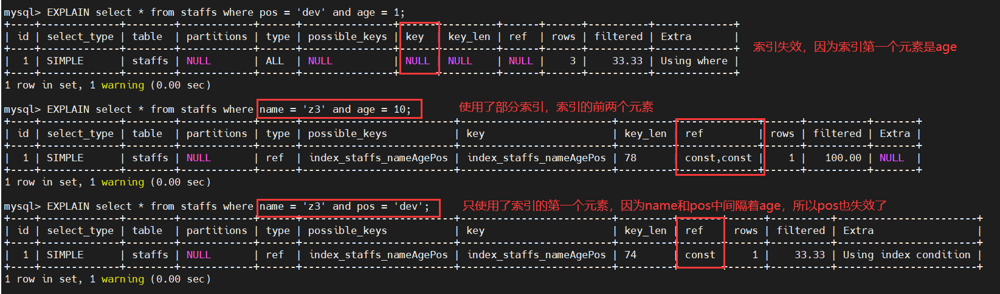

查询字段与索引字段顺序的不同会导致索引无法充分使用，甚至索引失效！

原因：使用复合索引，需要遵循最佳左前缀法则，即如果索引了多列，要遵守最左前缀法则。指的是查询从索
引的最左前列开始并且不跳过索引中的列。

结论：**过滤条件要使用索引必须按照索引建立时的顺序，依次满足，一旦跳过某个字段，索引后面的字段都无**
**法被使用**。

##### 3.4.2 不要在索引列上做任何计算

不在索引列上做任何操作（计算、函数、(自动or 手动)类型转换），会导致索引失效而转向全表扫描。

**在查询列上使用了函数**

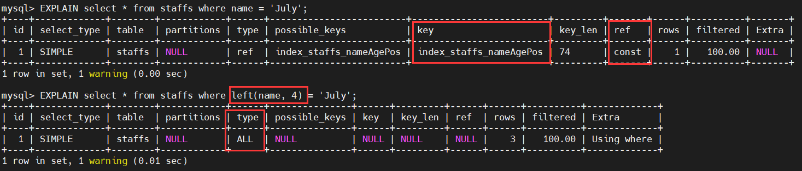

**在查询列上做了转换**，字符串不加单引号，会在name上做一次转换。（虽然查询结果一样）

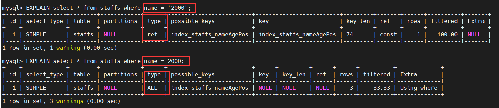

##### 3.4.3 索引列上不能有范围查询

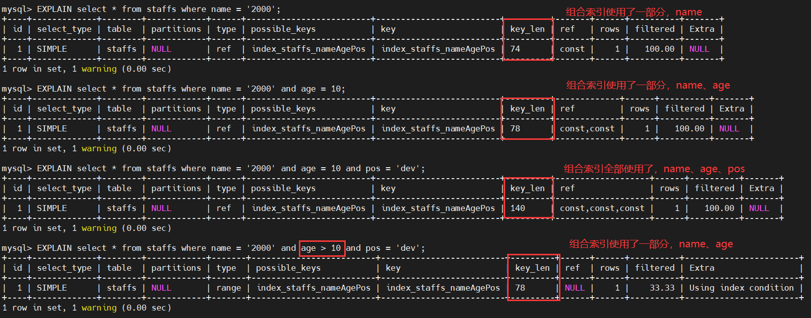

某字段做了范围查询，那么该字段后面的索引全部失效。

建议：**将可能做范围查询的字段的索引顺序放在最后**

##### 3.4.4 尽量使用覆盖索引

即查询列和索引列一致，不要写select *

##### 3.4.5 使用不等于(!= 或者<>)的时候

mysql 在使用不等于(!= 或者<>)时，有时会无法使用索引会导致全表扫描。

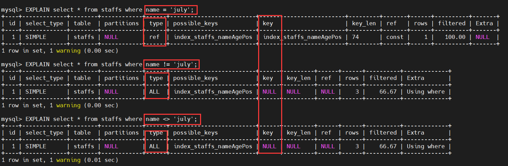

##### 3.4.6 使用is null或is not null

staffs表name字段不允许为null

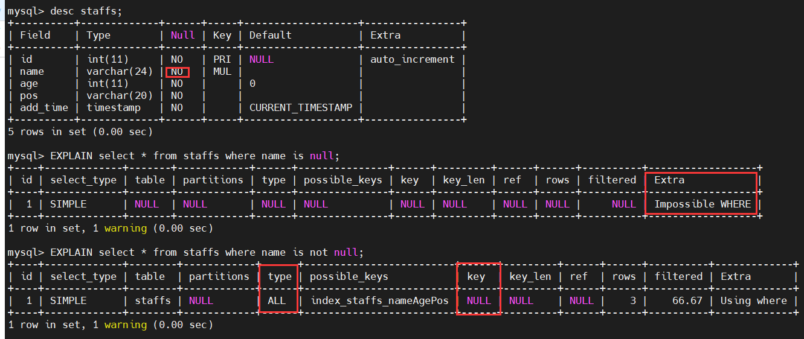 

t1表的content字段允许为null，并且建有索引

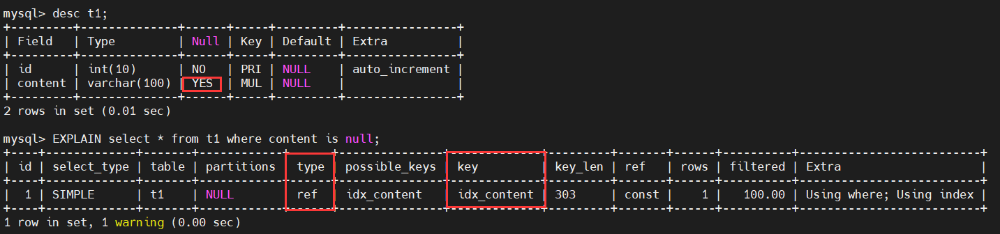

所以，**is not null 用不到索引，is null 可以用到索引。**

##### 3.4.7 like 的前后模糊匹配

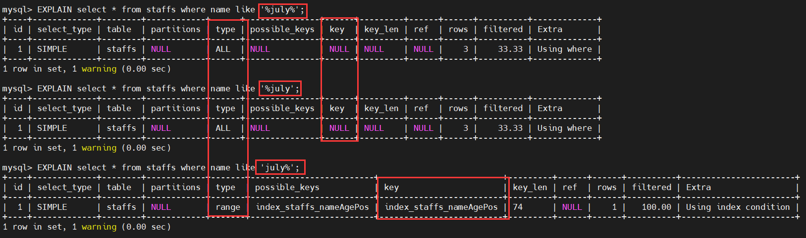

**只有%单独出现在右边的时候，索引才有效**。

但是一般情况下，【%字符串%】跟【字符串%】查出来的结果是不一样的，首先我们要保证结果正确才去考虑优化，不然就没有意义，所以这种情况下该怎么办呢？

这种情况建议使用覆盖索引，就是查询的列和索引的列一致。staffs表建有name、age、pos的组合索引

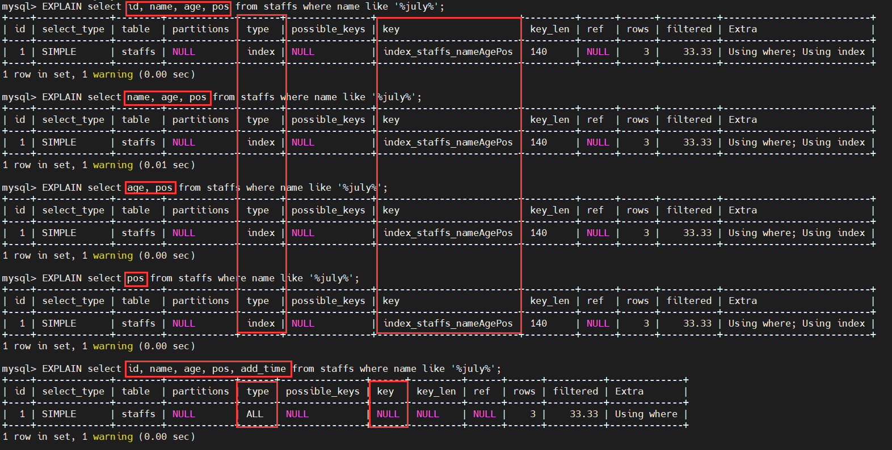

##### 3.4.8 尽量不使用or

使用union 或 union all代替。

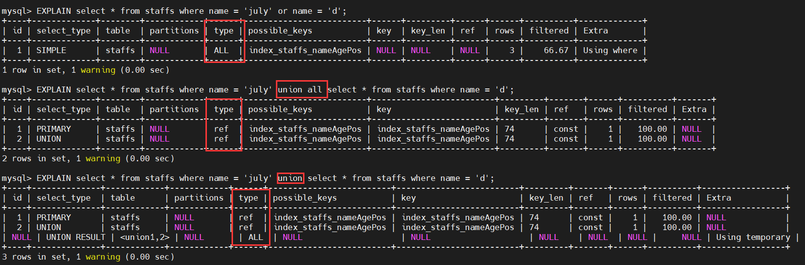

##### 3.4.9 口诀

全职匹配我最爱，最左前缀要遵守；
带头大哥不能死，中间兄弟不能断；
索引列上少计算，范围之后全失效；
LIKE 百分写最右，覆盖索引不写*；
不等空值还有OR，索引影响要注意；
VAR 引号不可丢，SQL 优化有诀窍。

### 4、使用EXPLAIN进行性能分析

以下是基于MySQL5.7.28版本进行分析的，不同版本之间略有差异。

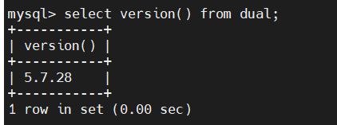

#### 4.1 概念

使用EXPLAIN关键字可以**模拟优化器**执行sql语句，从而知道MySQL是如何处理你的语句，分析你的查询语句或者表结构的性能瓶颈。

用法：EXPLAIN+ sql语句

EXPLAIN执行后返回的信息如下：

mysql> explain select * from user;
+----+-------------+-------+------------+------+---------------+------+---------+------+------+----------+-------+
| id    | select_type   | table   | partitions    | type  | possible_keys  | key     | key_len  | ref      | rows  | filtered     | Extra |
+----+-------------+-------+------------+------+---------------+------+---------+------+------+----------+-------+
|   1    |   SIMPLE      | user     | NULL           | ALL   | NULL                | NULL | NULL     | NULL |    1     |   100.00    | NULL  |
+----+-------------+-------+------------+------+---------------+------+---------+------+------+----------+-------+

各个字段的大致含义如下：

- id: SELECT 查询的标识符. 每个 SELECT 都会自动分配一个唯一的标识符.
- select_type: SELECT 查询的类型.
- table: 查询的是哪个表
- partitions: 匹配的分区
- type: join 类型
- possible_keys: 此次查询中可能选用的索引
- key: 此次查询中确切使用到的索引.
- key_len: 查询优化器使用了索引的字节数.
- ref: 哪个字段或常数与 key 一起被使用
- rows: 显示此查询一共扫描了多少行. 这个是一个估计值.
- filtered: 表示此查询条件所过滤的数据的百分比
- extra: 额外的信息

#### 4.2 准备工作

新建一个数据库test，执行下面的sql语句

```sql
CREATE TABLE t1(id INT(10) AUTO_INCREMENT,content VARCHAR(100) NULL , PRIMARY KEY (id));
CREATE TABLE t2(id INT(10) AUTO_INCREMENT,content VARCHAR(100) NULL , PRIMARY KEY (id));
CREATE TABLE t3(id INT(10) AUTO_INCREMENT,content VARCHAR(100) NULL , PRIMARY KEY (id));
CREATE TABLE t4(id INT(10) AUTO_INCREMENT,content VARCHAR(100) NULL , PRIMARY KEY (id));
INSERT INTO t1(content) VALUES(CONCAT('t1_',FLOOR(1+RAND()*1000)));
INSERT INTO t2(content) VALUES(CONCAT('t2_',FLOOR(1+RAND()*1000)));
INSERT INTO t3(content) VALUES(CONCAT('t3_',FLOOR(1+RAND()*1000)));
INSERT INTO t4(content) VALUES(CONCAT('t4_',FLOOR(1+RAND()*1000)));
```

下面一一解释各列的含义。

#### 4.3 id

select查询的序列号，包含一组数字，表示查询中执行select子句的顺序或操作表的顺序。大致分为下面几种情况

（1）**id相同，执行顺序由上至下**

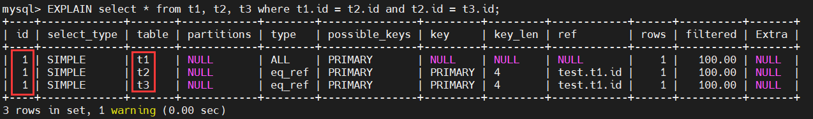

上面的查询语句，三个id都为1，具有相同的优先级，执行顺序由上而下，具体执行顺序由优化器决定，这里执行顺序为t1，t2，t3。

（2）**id不同，数字越大优先级越高**

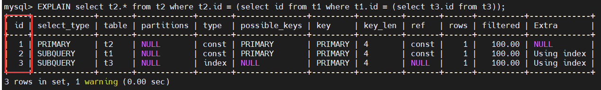

如果sql中存在子查询，那么id的序号会递增，id越大越先被执行。如上图，执行顺序是t3、t1、t2，也就是说，最里面的子查询最先执行，由里往外执行。

在我测试的时候，无意中发现，下面的语句，一**个使用的是IN关键字，一个使用的=运算符，但使用EXPLAIN执行后，结果天壤之别。**

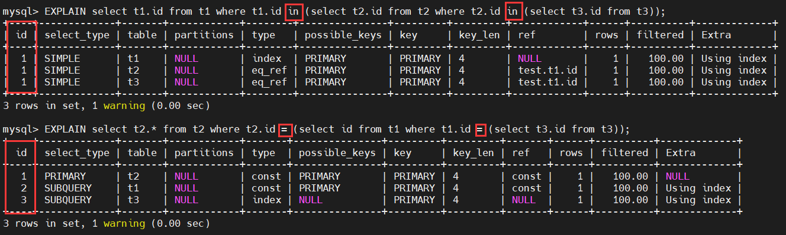

这说明使用IN嵌套子查询，它是按顺序来执行的，也就是说每执行一次最外层子查询，里面的子查询都会被重复执行，这好像和我的理解差很多啊（我一直以为是先执行最里面的子查询，再执行外面的）。

具体可以看看这篇文章，我觉得讲的大概算是明白了。https://segmentfault.com/a/1190000005742843。这里就不再继续赘述了。

**千万别用IN，使用JOIN或者EXISTS代替它**

（3）**id存在相同的和不同的**

在上面语句的基础上，增加一个IN的子查询，执行结果如下

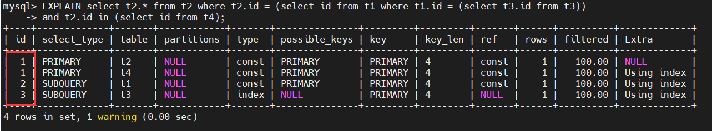

执行顺序为t3、t1、t2、t4。值越大的越先执行，相同值的从上往下执行。

#### 4.4 select_type

select_type表示查询的类型，主要是为了区分普通查询、子查询、联合查询等复杂查询。分为以下几种类型：

（1）**SIMPLE**

简单的select查询，查询中不包含子查询或者UNION。

（2）**PRIMARY**

查询中若包含任何复杂的子查询，那么最外层的查询被标记为PRIMARY。

（3）**DERIVED**

在from子句中包含的子查询被标记为DERIVED（衍生），MySQL会递归执行这些子查询，把结果放在临时表中。

（4）**SUBQUERY**

在select或where子句中包含了子查询，该子查询被标记为SUBQUERY。

（5）**UNION**

若第二个select查询语句出现在UNION之后，则被标记为UNION。若UNION包含在FROM子句的子查询中,外层SELECT将被标记为：DERIVED

（6）**UNION RESULT**

从UNION表获取结果的SELECT。

上面的前三种在上一小节已经出现过了，看看后面这三种


可以看到id列出现了一个NULL，这是上面没讲到的。**一般来说，特殊情况下，如果某行语句引用了其他多行结果集的并集，则该值可以为 NULL**。

#### 4.5 table

这个没啥好讲的，表示这个查询是基于哪种表的。并不一定是真实存在的表，比如上面出现的DERIVED和<union1,2>，一般来说会出现下面的取值：

（1）**<union a,b>**：输出结果中编号为 a 的行与编号为 b 的行的结果集的并集。

（2）<derived a>：输出结果中编号为 a 的行的结果集，derived 表示这是一个派生结果集，如 FROM 子句中的查询。

（3）**<subquery a>**：输出结果中编号为 a 的行的结果集，subquery 表示这是一个物化子查询。

#### 4.6 partitions

查询时匹配到的分区信息，对于非分区表值为`NULL`，当查询的是分区表时，`partitions`显示分区表命中的分区情况。

根据官方文档，在创建表的时候，指定不同分区存放的id值范围不同。

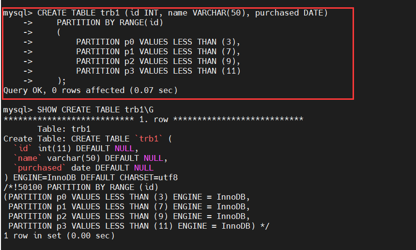

插入测试数据，让id值分布在四个分区内。

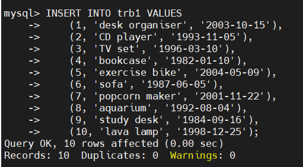

执行查询输出结果。

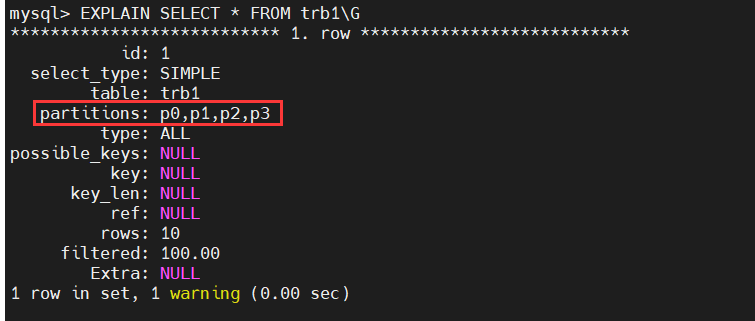

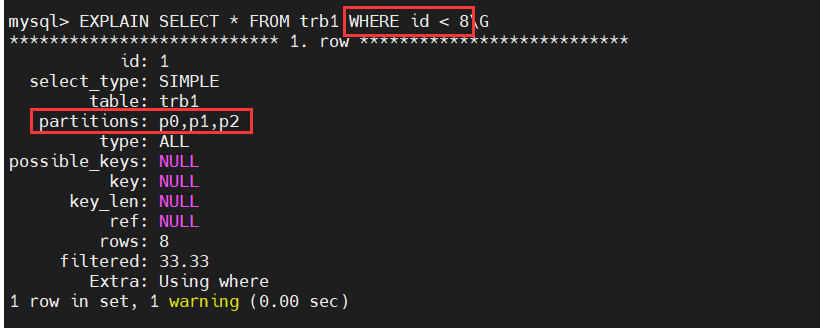

#### 4.7 type

type是查询的访问类型，是较为重要的一个指标，性能从最好到最坏依次是 system > const > eq_ref > ref > fulltext > ref_or_null > index_merge > unique_subquery > index_subquery > range > index > ALL。

一般来说，得保证查询至少到达range级别，最好能达到ref。

（1）**system** 

当表仅存在一行记录时（系统表），数据量很少，速度很快，这是一种很特殊的情况，不常见。

（2）**const**

当你的查询条件是一个主键或者唯一索引（UNION INDEX）并且值是常量的时候，查询速度非常快，因为只需要读一次表。

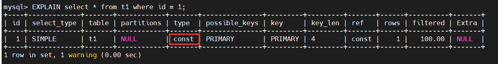

给t1表的content列增加一个唯一索引

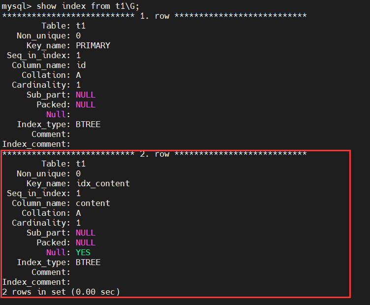

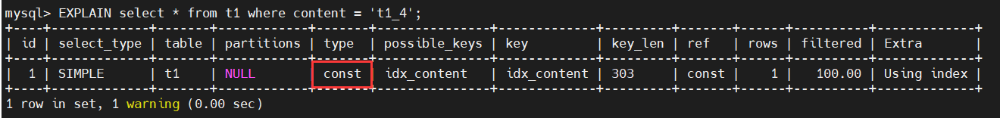

（3）**eq_ref **

除了system和const，性能最好的就是eq_ref了。唯一性索引扫描，对于每个索引键，表中只有一条记录与之匹配。常见于主键或唯一索引扫描。

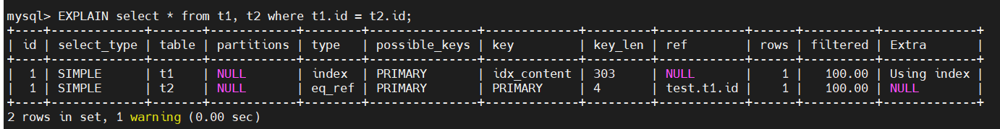

（4）**ref**

非唯一性索引扫描，返回匹配某个单独值的所有行。区别于eq_ref，ref表示使用除`PRIMARY KEY` 和`UNIQUE` index 之外的索引，即非唯一索引，查询的结果可能有多个。可以使用 = 运算符或者<=> 运算符。

在t2表的content列加上普通索引

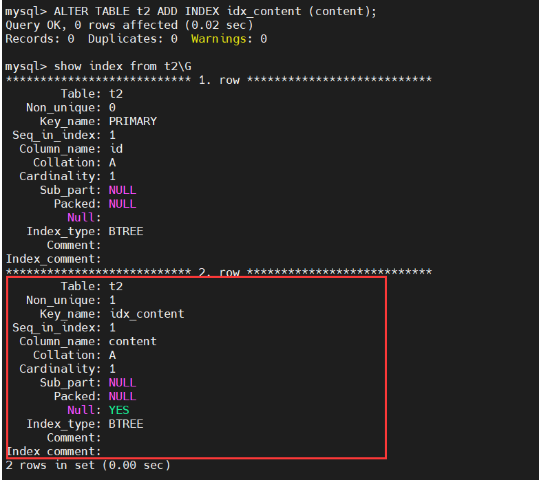

进行查询

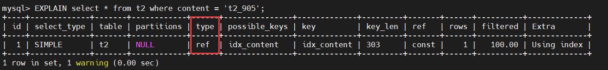

（5）**fulltext**

查询时使用 fulltext 索引。

（6）**ref_or_null**

对于某个字段既需要关联条件，也需要null 值的情况下。查询优化器会选择用ref_or_null 连接查询。

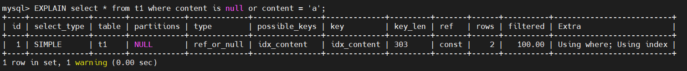

（7）**index_merge** 

在查询过程中需要多个索引组合使用，通常出现在有or 关键字的sql 中。

（8）**unique_subquery** 

该联接类型类似于index_subquery。子查询中的唯一索引。在某些in子查询里，用于替换eq_ref，比如下面的查询语句

```sql
value IN (SELECT primary_key FROM single_table WHERE some_expr)
```

（9）**index_subquery **

利用索引来关联子查询，不再全表扫描。用于**非唯一索引**，子查询可以返回重复值。类似于unique_subquery，但用于非唯一索引

```sql
value IN (SELECT key_column FROM single_table WHERE some_expr)
```

（10）**range** 

只检索给定范围的行,使用一个索引来选择行。key 列显示使用了哪个索引，一般就是在你的where 语句中出现
了between、<、>、in 等的查询，这种范围扫描索引扫描比全表扫描要好，因为它只需要开始于索引的某一点，而
结束语另一点，不用扫描全部索引。

举个例子，t3表中id字段为主键，有PRIMARY索引，content字段没有建立索引，查询时使用id作为条件，结果如下

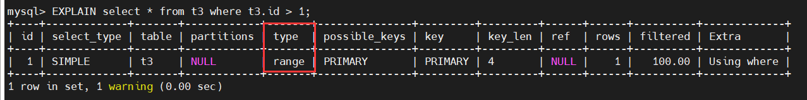

使用content作为条件，结果如下

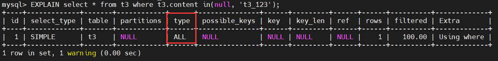

**所以，只有对设置了索引的字段，做范围检索 `type` 才是 `range`。**

（11）**index**

sql语句使用了索引，但没有通过索引进行过滤，一般是使用了覆盖索引或者利用索引进行了排序分组。

index和ALL都是读全表，区别在于index是遍历索引树读取，ALL是从硬盘读取。index通常比ALL更快，因为索引文件通常比数据文件小。

举个例子，查询t3表主键id，结果如下

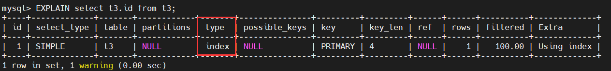

（12）**ALL**

全表扫描，性能最差。

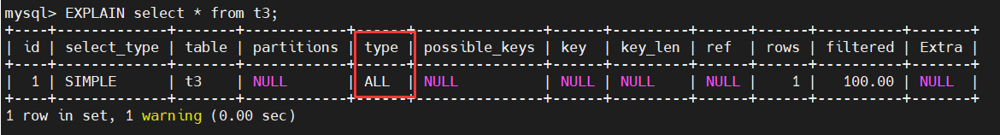

#### 4.8 possible_keys

查询时可能使用的索引，一个或多个。查询涉及到的字段上若存在索引，则该索引将被列出。注意是可能，实际查询时不一定会用到。

#### 4.9 key

查询时实际使用的索引，没有使用索引则为NULL。**查询时若使用了覆盖索引，则该索引只出现在key字段中。**

举个例子，trb1表中有一个组合索引(age, name)，那么当你的查询列和索引的个数和顺序一致时，查询结果如下：

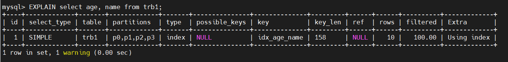

#### 4.10 key_len

表示索引中使用的字节数，可通过该列计算查询中使用的索引的长度。**在不损失精确性的情况下，长度越短越好**。

key_len显示的值是索引字段可能的最大长度，并非实际使用长度，即key_len是根据表定义计算得到，不是通过表内检索。

key_len 字段能够帮你检查是否充分的利用上了索引。ken_len 越长，说明索引使用的越充分。

注意：`key_len`只计算`where`条件中用到的索引长度，而排序和分组即便是用到了索引，也不会计算到`key_len`中。

举个例子，有表trb1，存在以下字段，以及一个组合索引idx_age_name

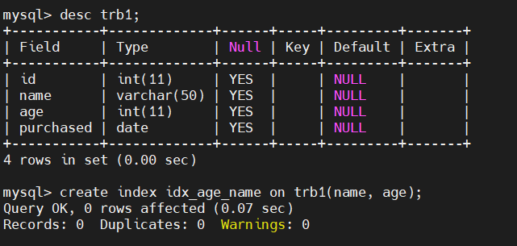

下面查询语句的执行结果

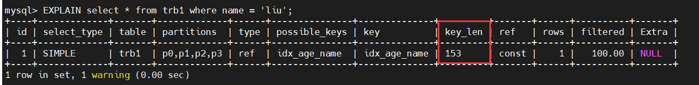

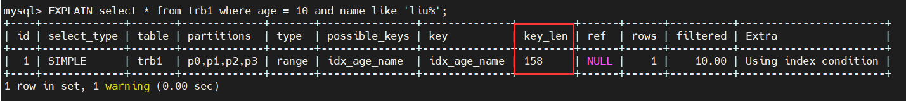

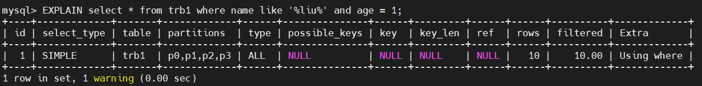

key_len的值为153、158、null。如何计算：

①先看索引上字段的类型+长度。比如int=4 ; varchar(50) = 50 ; char(50) = 50。

②如果是varchar 或者char 这种字符串字段，视字符集要乘不同的值，比如utf-8 要乘3,GBK 要乘2。

③varchar 这种动态字符串要加2 个字节。

④允许为空的字段要加1 个字节。

第一条：key_len = name的字节长度 = 50 * 3 + 2 + 1 = 153

第二条：key_len = age 的字节长度 + name 的字节长度= 4 +1 + ( 50*3 + 2 + 1)= 5 + 153 = 158。（使用的索引更充分，查询结果更精确，但消耗更大）

第三条：索引失效了。

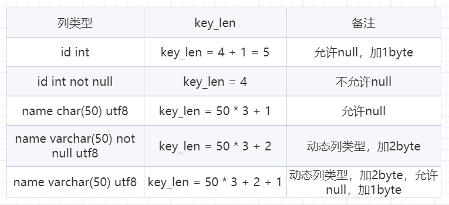

#### 4.11 ref

显示索引的哪一列被使用了，常见的取值有：const， func，null，字段名。

- 当使用常量等值查询，显示`const`，
- 当关联查询时，会显示相应关联表的`关联字段`
- 如果查询条件使用了`表达式`、`函数`，或者条件列发生内部隐式转换，可能显示为`func`
- 其他情况`null`

举个例子，t3表的content字段有普通索引，下面的查询语句结果如下

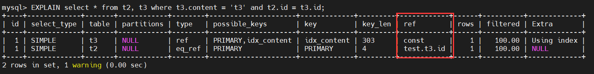

#### 4.12 rows

rows 列表示 MySQL 认为它执行查询时可能需要读取的行数，一般情况下这个值越小越好！

#### 4.13 filtered

`filtered` 是一个百分比的值，表示符合条件的记录数的百分比。简单点说，这个字段表示存储引擎返回的数据在经过过滤后，剩下满足条件的记录数量的比例。

在`MySQL.5.7`版本以前想要显示`filtered`需要使用`explain extended`命令。`MySQL.5.7`后，默认`explain`直接显示`partitions`和`filtered`的信息。

#### 4.14 Extra

其他额外的信息。

（1）**Using filesort**

说明mysql 会对数据使用一个外部的索引排序，而不是按照表内的索引顺序进行读取。MySQL 中无法利用索引完成的排序操作称为“文件排序”。

举个例子，trb1表建立一个组合索引

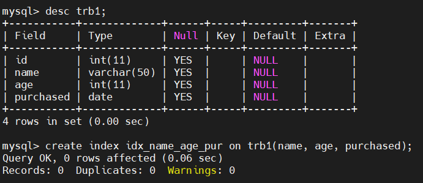

下面的查询出现filesort ：

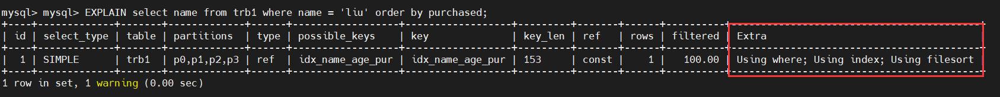

按照组合索引的顺序，是name、age、purchased，而上面的查询语句，没有使用中间的age，所以在order by的时候索引失效了。**通常这种情况是需要进行优化的**。

修改一下上面的sql语句，让索引不失效。

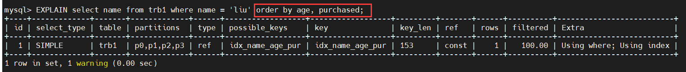

（2）**Using temporary**

使了用临时表保存中间结果,MySQL 在对查询结果排序时使用临时表。常见于排序order by 和分组查询group by。

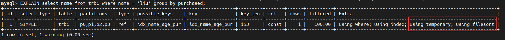

这条sql语句用了临时表，又用了文件排序，在数据量非常大的时候效率是很低的，需要进行优化。

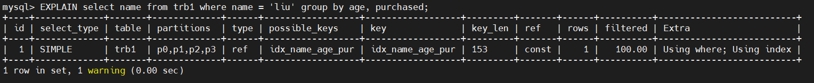

**所以在使用group by 和 order by的时候，列的数量和顺序尽量和索引的一样。**

（3）**Using index**

Using index 表示相应的select 操作中使用了覆盖索引(Covering Index)，避免访问了表的数据行，可以提高效率。

如果同时出现using where，表明索引被用来执行索引键值的查找。如果没有同时出现using where，表明索引只是用来读取数据而非利用索引执行查找。

还是使用上面的trb1表举例子

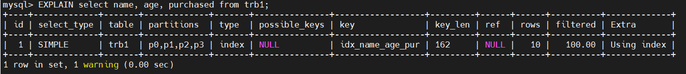

只出现了Using index，说明索引用来读取数据而不是执行查找。

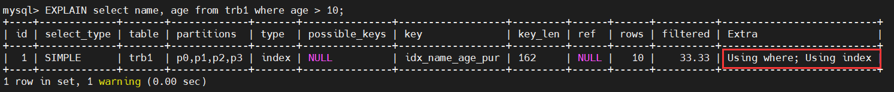

出现了Using where，说明索引被用来执行查找。

（4）**Using where**

表示查询时有索引被用来进行where过滤。

（5）**Using join buffer**

查询时使用了连接缓存。

（6）**impossible where**

查询语句的where条件总是为false，举个例子

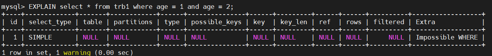

一般情况下不会出现这种。

关于Extra字段，有很多取值，这里就不一一列举了，具体可以看官方文档。

参考资料：https://dev.mysql.com/doc/refman/5.7/en/explain-output.html

### 5、关联查询优化

#### 5.1 单表索引优化

首先做好准备工作，建立需要的表

```sql
CREATE TABLE IF NOT EXISTS `article`(
`id` INT(10) UNSIGNED NOT NULL PRIMARY KEY AUTO_INCREMENT,
`author_id` INT (10) UNSIGNED NOT NULL,
`category_id` INT(10) UNSIGNED NOT NULL , 
`views` INT(10) UNSIGNED NOT NULL , 
`comments` INT(10) UNSIGNED NOT NULL,
`title` VARBINARY(255) NOT NULL,
`content` TEXT NOT NULL
);
INSERT INTO `article`(`author_id`,`category_id` ,`views` ,`comments` ,`title` ,`content` )VALUES
(1,1,1,1,'1','1'),
(2,2,2,2,'2','2'),
(3,3,3,3,'3','3');
 
SELECT * FROM ARTICLE;
```

此时没有建立任何索引，现在我们要查询 author_id = 1 并且 comments >= 1 并且views 最大的那条数据。

```sql
select id, author_id, title from article where author_id = 1 and comments >= 1 order by views desc limit 1;
```

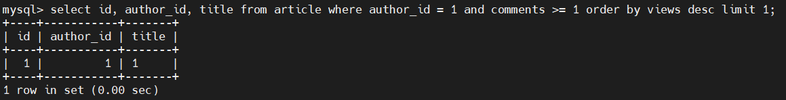

使用上节学过的EXPLAIN对sql语句进行分析

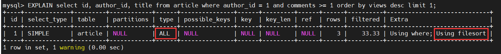

可以看到使用了全表扫描并且还使用了文件排序，效率是很低的。

此时可以尝试在该表上建立索引进行优化，如何建立合适的索引，这需要平时不断地积累。这里可以先试着建立author_id、comments、views三个字段的联合索引

```sql
CREATE INDEX idx_article_acv ON article(author_id, comments, views);
```

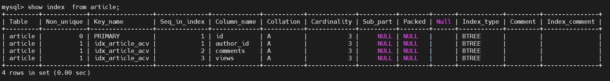

再次使用EXPLAIN对sql语句进行分析

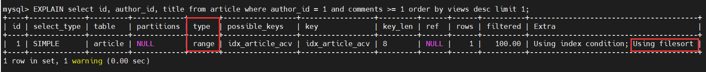

发现查询时使用了索引，但排序还是使用了文件排序。如果我们修改一下查询条件，把comments >= 1改成comments = 1，那么会发现效率提升了很多。

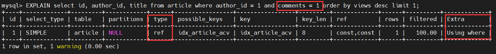

因为按照BTREE索引的原理，先排序author_id，author_id相同的情况下再排序comments，如果comments相同再排序views。当comments字段处于索引的中间位置，因为在查询时comments的条件是comments >= 1（range），一个范围值，MySQL无法利用索引对后面的views进行检索，**即range类型查询字段后面的索引无效**。

既然是这样，那么我们是否可以试试建立author_id和views两个字段的组合索引呢？

```sql
drop index idx_article_acv on article;

CREATE INDEX idx_article_av ON article(author_id, views);
```

再次执行上面的sql语句

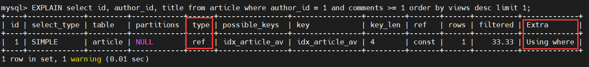

#### 5.2 双表索引优化

先建立需要的表

```sql
CREATE TABLE IF NOT EXISTS `class`(
`id` INT(10) UNSIGNED NOT NULL PRIMARY KEY AUTO_INCREMENT,
`card` INT (10) UNSIGNED NOT NULL
);
CREATE TABLE IF NOT EXISTS `book`(
`bookid` INT(10) UNSIGNED NOT NULL PRIMARY KEY AUTO_INCREMENT,
`card` INT (10) UNSIGNED NOT NULL
);
INSERT INTO class(card)VALUES(FLOOR(1+(RAND()*20)));
INSERT INTO class(card)VALUES(FLOOR(1+(RAND()*20)));
INSERT INTO class(card)VALUES(FLOOR(1+(RAND()*20)));
INSERT INTO class(card)VALUES(FLOOR(1+(RAND()*20)));
INSERT INTO class(card)VALUES(FLOOR(1+(RAND()*20)));
INSERT INTO class(card)VALUES(FLOOR(1+(RAND()*20)));
INSERT INTO class(card)VALUES(FLOOR(1+(RAND()*20)));
INSERT INTO class(card)VALUES(FLOOR(1+(RAND()*20)));
INSERT INTO class(card)VALUES(FLOOR(1+(RAND()*20)));
INSERT INTO class(card)VALUES(FLOOR(1+(RAND()*20)));
INSERT INTO class(card)VALUES(FLOOR(1+(RAND()*20)));
INSERT INTO class(card)VALUES(FLOOR(1+(RAND()*20)));
INSERT INTO class(card)VALUES(FLOOR(1+(RAND()*20)));
INSERT INTO class(card)VALUES(FLOOR(1+(RAND()*20)));
INSERT INTO class(card)VALUES(FLOOR(1+(RAND()*20)));
INSERT INTO class(card)VALUES(FLOOR(1+(RAND()*20)));
INSERT INTO class(card)VALUES(FLOOR(1+(RAND()*20)));
INSERT INTO class(card)VALUES(FLOOR(1+(RAND()*20)));
INSERT INTO class(card)VALUES(FLOOR(1+(RAND()*20)));
INSERT INTO class(card)VALUES(FLOOR(1+(RAND()*20)));
 
INSERT INTO book(card)VALUES(FLOOR(1+(RAND()*20)));
INSERT INTO book(card)VALUES(FLOOR(1+(RAND()*20)));
INSERT INTO book(card)VALUES(FLOOR(1+(RAND()*20)));
INSERT INTO book(card)VALUES(FLOOR(1+(RAND()*20)));
INSERT INTO book(card)VALUES(FLOOR(1+(RAND()*20)));
INSERT INTO book(card)VALUES(FLOOR(1+(RAND()*20)));
INSERT INTO book(card)VALUES(FLOOR(1+(RAND()*20)));
INSERT INTO book(card)VALUES(FLOOR(1+(RAND()*20)));
INSERT INTO book(card)VALUES(FLOOR(1+(RAND()*20)));
INSERT INTO book(card)VALUES(FLOOR(1+(RAND()*20)));
INSERT INTO book(card)VALUES(FLOOR(1+(RAND()*20)));
INSERT INTO book(card)VALUES(FLOOR(1+(RAND()*20)));
INSERT INTO book(card)VALUES(FLOOR(1+(RAND()*20)));
INSERT INTO book(card)VALUES(FLOOR(1+(RAND()*20)));
INSERT INTO book(card)VALUES(FLOOR(1+(RAND()*20)));
INSERT INTO book(card)VALUES(FLOOR(1+(RAND()*20)));
INSERT INTO book(card)VALUES(FLOOR(1+(RAND()*20)));
INSERT INTO book(card)VALUES(FLOOR(1+(RAND()*20)));
INSERT INTO book(card)VALUES(FLOOR(1+(RAND()*20)));
INSERT INTO book(card)VALUES(FLOOR(1+(RAND()*20)));
```

现在我们两个表做一个左连接查询

```sql
EXPLAIN select * from class left join book on class.card = book.card;
```

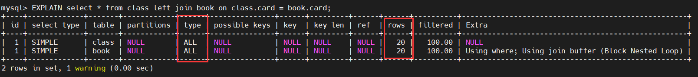

可以看到两张表都进行了全表扫描，那么这种情况下， 如果要加索引的话，应该加在左表还是右表呢？我们可以先在左表加，然后分析性能，然后在右表加，分析性能，两个结果进行对比就知道了。

现在class表card列建立索引

```sql
create index idx_card on class(card);
```

再次执行查询，发现class表的确使用了索引

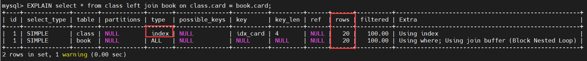

删除class表的索引，在book表建立同样的索引

```sql
drop index idx_card on class;
create index idx_card on book(card);
```

再次执行查询

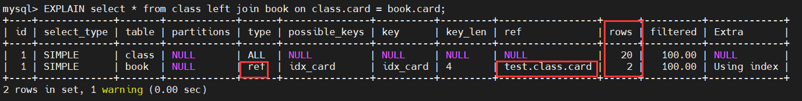

发现type从index变为了ref（速度更快），rows也从20变成了2。**这是因为左连接的时候，左边的表不管怎样，都会作为结果被查出来（即使右边表记录为空），所以如何从右表进行搜索，是我们要关注和优化的地方**。

结论：在优化关联查询的时候，只有在被驱动表上建立索引才有效。即**左连接的时候，右边的表建立索引。右连接的时候，左边的表建立索引。**

#### 5.3 三表索引优化

先创建需要的表

```sql
CREATE TABLE IF NOT EXISTS `phone`(
`phoneid` INT(10) UNSIGNED NOT NULL PRIMARY KEY AUTO_INCREMENT,
`card` INT (10) UNSIGNED NOT NULL
)ENGINE = INNODB;

INSERT INTO phone(card)VALUES(FLOOR(1+(RAND()*20)));
INSERT INTO phone(card)VALUES(FLOOR(1+(RAND()*20)));
INSERT INTO phone(card)VALUES(FLOOR(1+(RAND()*20)));
INSERT INTO phone(card)VALUES(FLOOR(1+(RAND()*20)));
INSERT INTO phone(card)VALUES(FLOOR(1+(RAND()*20)));
INSERT INTO phone(card)VALUES(FLOOR(1+(RAND()*20)));
INSERT INTO phone(card)VALUES(FLOOR(1+(RAND()*20)));
INSERT INTO phone(card)VALUES(FLOOR(1+(RAND()*20)));
INSERT INTO phone(card)VALUES(FLOOR(1+(RAND()*20)));
INSERT INTO phone(card)VALUES(FLOOR(1+(RAND()*20)));
INSERT INTO phone(card)VALUES(FLOOR(1+(RAND()*20)));
INSERT INTO phone(card)VALUES(FLOOR(1+(RAND()*20)));
INSERT INTO phone(card)VALUES(FLOOR(1+(RAND()*20)));
INSERT INTO phone(card)VALUES(FLOOR(1+(RAND()*20)));
INSERT INTO phone(card)VALUES(FLOOR(1+(RAND()*20)));
INSERT INTO phone(card)VALUES(FLOOR(1+(RAND()*20)));
INSERT INTO phone(card)VALUES(FLOOR(1+(RAND()*20)));
INSERT INTO phone(card)VALUES(FLOOR(1+(RAND()*20)));
INSERT INTO phone(card)VALUES(FLOOR(1+(RAND()*20)));
INSERT INTO phone(card)VALUES(FLOOR(1+(RAND()*20)));
```

三表关联查询

```sql
select * from class left join book on book.card = class.card left join phone on book.card = phone.card;
```

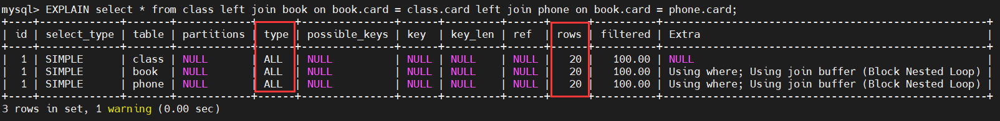

按照上面的经验，左连接，给右表建立索引，所以我们给book表和phone表建立索引。

```sql
create index idx_card on book(card);
create index idx_card on phone(card);
```

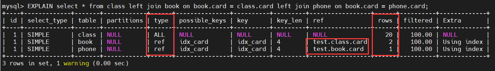

join语句的优化：

- 尽可能减少join语句中Nested Loop的循环总次数。
- 永远用小结果集驱动大结果集。
- 优化Nested Loop的内层循环。
- 保证join语句中被驱动表上join条件字段已经被索引。
- 当无法保证被驱动表的join条件字段被索引并且内存资源充足的前提下，不要太吝惜JoinBuffer的设置。

#### 5.4 内连接查询优化

上面都是都是讲的左连接和右连接。**对于左右连接，我们需要在被驱动表上建立索引**。那么对于内连接呢？

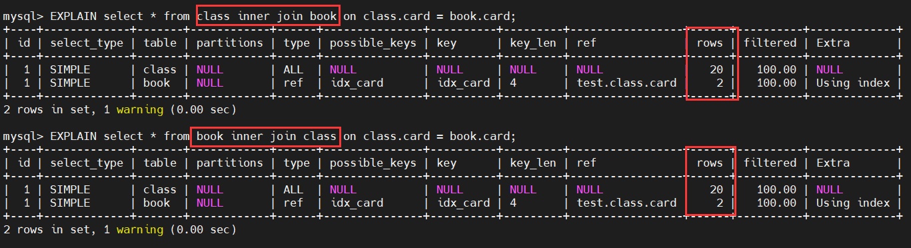

上面两条查询语句，两表位置交换，用explain进行分析结果还是一样。说明：**inner join时，MySQL会把小结果集的表作为驱动表**。

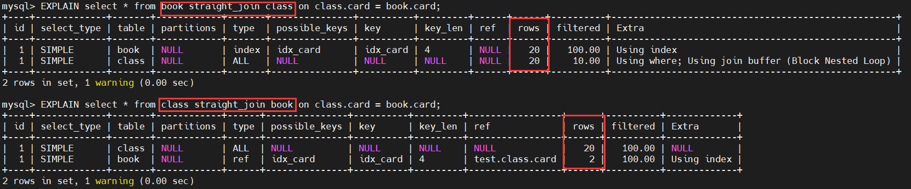

straight_join和inner join效果一样，但会强制将左表作为驱动表。

#### 5.5 其他情况

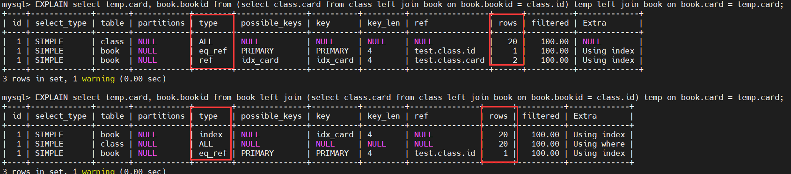

仔细分析上面两个查询语句，第一个是子查询在左边，第二个是子查询在右边。效率是第一个高于第二个的，并且第一个还有优化的空间。因为在左关联中，我们需要对被驱动表（右表）建立索引，由于子查询是虚表，无法建立索引，因此不能优化。

结论：

- **关联查询时，子查询尽量不要放在被驱动表，尽量让实体表作为被驱动表。**
- **能够直接多表关联的尽量直接关联，不用子查询！**

### 6、排序分组优化

#### 6.1 永远小表驱动大表

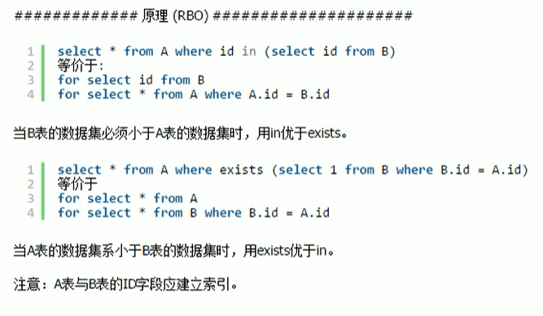

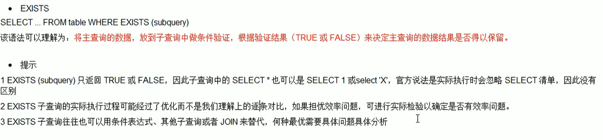

#### 6.2 order by关键字优化

（1）ORDER BY子句，尽量使用Index方式排序，避免使用filesort方式排序。

（2）尽可能在索引列上完成排序操作，遵照索引的最佳左前缀。

（3）ORDER BY后面的字段，要么全部升序，要么全部降序。（方向反，必排序）

（4）ORDER BY后面的字段顺序要和索引的字段顺序一致。（顺序错，必排序）

（5）当范围条件和group by 或者order by 的字段出现二选一时，优先观察条件字段的过滤数量，如果过滤的
数据足够多，而需要排序的数据并不多时，优先把索引放在范围字段上。反之，亦然。

（6）使用覆盖索引。SQL 只需要通过索引就可以返回查询所需要的数据，而不必通过二级索引查到主键之后再去查询数据。

（7）using filesort有两种排序算法：**双路排序和单路排序**。

① **双路排序**

MySQL 4.1 之前是使用双路排序,字面意思就是两次扫描磁盘，最终得到数据，读取行指针和orderby 列，对他们进行排序，然后扫描已经排序好的列表，按照列表中的值重新从列表中读取对应的数据输出。

从磁盘取排序字段，在buffer 进行排序，再从磁盘取其他字段。

简单来说，取一批数据，要对磁盘进行了两次扫描，众所周知，I\O 是很耗时的，所以在mysql4.1 之后，出现了第二种改进的算法，就是单路排序。

② **单路排序**

从磁盘读取查询需要的所有列，按照order by 列在buffer 对它们进行排序，然后扫描排序后的列表进行输出，它的效率更快一些，避免了第二次读取数据。并且把随机IO 变成了顺序IO，但是它会使用更多的空间，因为它把每一行都保存在内存中了。

③ **单路排序的问题**

由于单路是后出的，总体而言好过双路。但是存在以下问题：

在sort_buffer 中，方法B 比方法A 要多占用很多空间，因为方法B 是把所有字段都取出, 所以有可能取出的数据的总大小超出了sort_buffer 的容量，导致每次只能取sort_buffer 容量大小的数据，进行排序（创建tmp 文件，多路合并），排完再取取sort_buffer 容量大小，再排……从而多次I/O。

结论：本来想省一次I/O 操作，反而导致了大量的I/O 操作，反而得不偿失。

④ **如何优化**

- 增大sort_butter_size 参数的设置
  不管用哪种算法，提高这个参数都会提高效率，当然，要根据系统的能力去提高，因为这个参数是针对每个进
  程的1M-8M 之间调整。

- 增大max_length_for_sort_data 参数的设置
  mysql 使用单路排序的前提是排序的字段大小要小于max_length_for_sort_data。

  提高这个参数，会增加用改进算法的概率。但是如果设的太高，数据总容量超出sort_buffer_size 的概率就增大，
  明显症状是高的磁盘I/O 活动和低的处理器使用率。（1024-8192 之间调整）。

- 减少select 后面的查询的字段。
  当Query 的字段大小总和小于max_length_for_sort_data 而且排序字段不是TEXT|BLOB 类型时，会用改进后的
  算法——单路排序， 否则用老算法——多路排序。

两种算法的数据都有可能超出sort_buffer 的容量，超出之后，会创建tmp 文件进行合并排序，导致多次I/O，
但是用单路排序算法的风险会更大一些,所以要提高sort_buffer_size。

#### 6.3 group by关键字优化

group by 使用索引的原则几乎跟order by 一致，唯一区别是groupby 即使没有过滤条件用到索引，也可以直
接使用索引。

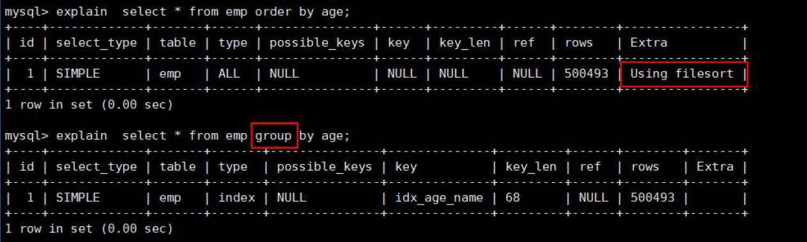

group by实质是先排序后分组，遵照索引的最佳左前缀。

当无法使用索引列， 增大max_length_for_sort_data参数的设置 + 增大sort_buffer_size参数的设置。

where高于having，能写在where里的条件就不要写在having里。

### 7、查询截取分析

（1）慢查询的开启并捕获。

（2）explain + 慢sql分析。

（3）show profile查询sql在MySQL服务器里的执行细节和生命周期情况。

（4）SQL数据库服务器的参数调优。

#### 7.1 慢查询日志

##### 7.1.1 是什么

（1）MySQL的慢查询日志是MySQL提供的一种日志记录，它用来记录MySQL中查询时间超过（大于）设置阈值（long_query_time）的语句，记录到慢查询日志中。

（2）long_query_time的默认值是10。

##### 7.1.2 怎么用

**默认情况下，MySQL没有开启慢查询日志。**需要手动打开，如果不是调优需要的话，不建议开启，因为开启会带来一定的性能影响，慢查询日志支持将日志记录写入文件。

（1）开启设置

```sql
-- 查看慢查询日志是否开启
show variables like '%slow_query_log%';
```

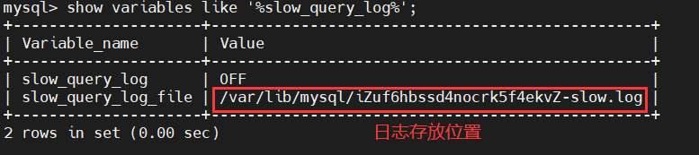

```sql
-- 开启慢查询日志，只对当前数据库生效，并且重启数据库后失效
set global slow_query_log = 1;
```

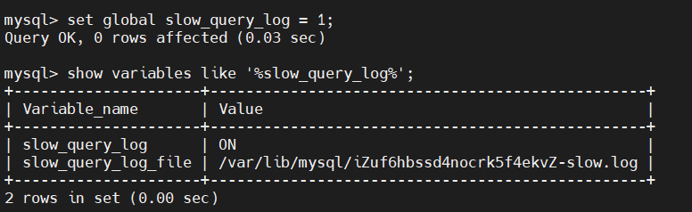

```sql
-- 查看慢查询日志的阈值，默认10s
show variables like '%long_query_time%';
```

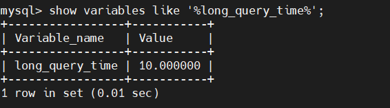

```sql
-- 设置阈值
set long_query_time = 3;
```

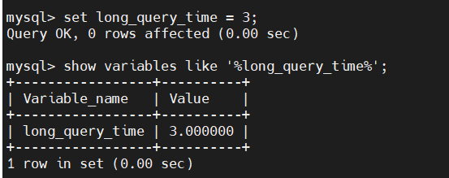

（2）如果需要永久生效则修改配置文件my.cnf

```cnf
[mysqld]
slow_query_log=1
slow_query_log_file=/var/lib/mysql/atguigu-slow.log
long_query_time=3
log_output=FILE
```

（3）运行慢查询sql，查看慢查询日志

```sql
select sleep(4);
```

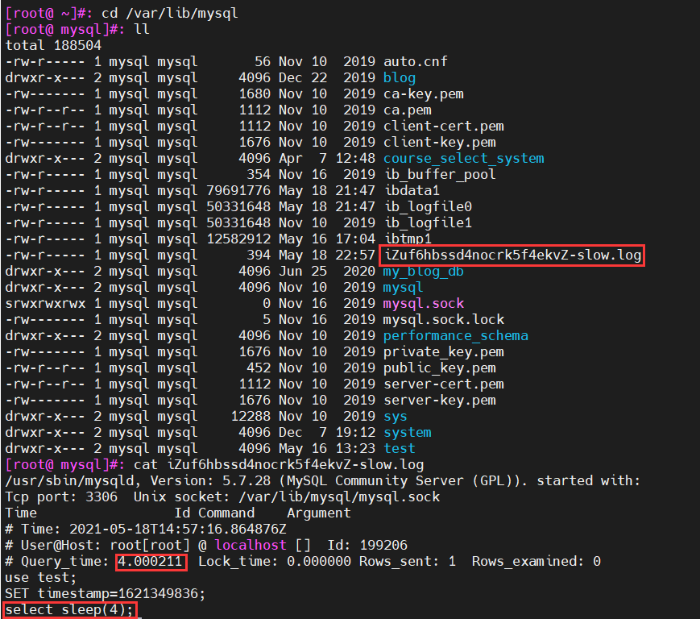

（4）查询当前系统有多少条慢查询记录

```sql
show global status like '%Slow_queries%';
```

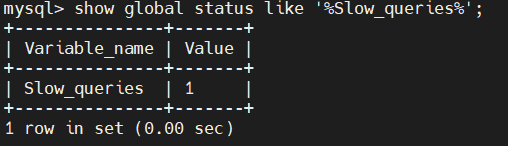

#### 7.2 日志分析工具mysqldumpslow

##### 7.2.1 是什么

慢查询日志多了，不利于我们进行分析。mysqldumpslow能将相同的慢SQL归类，并统计出相同的SQL执行的次数，每次执行耗时多久、总耗时，每次返回的行数、总行数，以及客户端连接信息等。

##### 7.2.2 怎么用

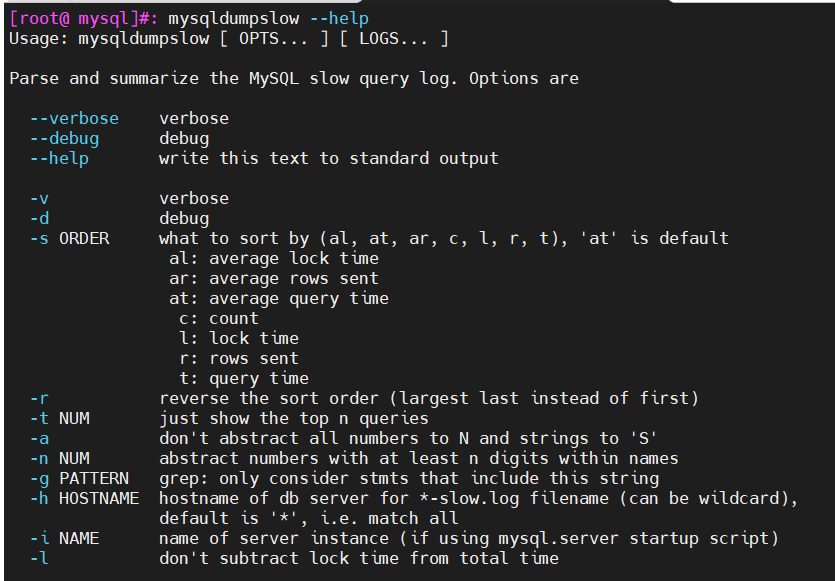

- -s 表示按何种方式排序。
- c  访问次数。
- l   锁定时间。 
- r   返回记录。
- t   查询时间。
- al  平均锁定时间。
- ar  平均返回记录数。
- at  平均查询时间。
- -t  返回前面多少条数据。
- -g  后面搭配一个正则匹配模式，大小写不敏感。

```shell
# 得到返回记录集最多的10 个SQL
mysqldumpslow -s r -t 10 /var/lib/mysql/atguigu-slow.log

# 得到访问次数最多的10 个SQL
mysqldumpslow -s c -t 10 /var/lib/mysql/atguigu-slow.log

# 得到按照时间排序的前10 条里面含有左连接的查询语句
mysqldumpslow -s t -t 10 -g "left join" /var/lib/mysql/atguigu-slow.log

# 另外建议在使用这些命令时结合| 和more 使用，否则有可能出现爆屏情况
mysqldumpslow -s r -t 10 /var/lib/mysql/atguigu-slow.log | more
```

### 8、批量数据脚本

有时候我们需要往表中批量插入几万甚至几十万条数据，这时候总不可能手工一条条插入的，这估计得累死人。可以利用MySQL的函数和存储过来实现这个需求。

#### 8.1 建立测试需要的表

```sql
CREATE TABLE `dept` (
`id` INT(11) NOT NULL AUTO_INCREMENT,
`deptName` VARCHAR(30) DEFAULT NULL,
`address` VARCHAR(40) DEFAULT NULL,
ceo INT NULL ,
PRIMARY KEY (`id`)
) ENGINE=INNODB AUTO_INCREMENT=1 DEFAULT CHARSET=utf8;
CREATE TABLE `emp` (
`id` INT(11) NOT NULL AUTO_INCREMENT,
`empno` INT NOT NULL ,
`name` VARCHAR(20) DEFAULT NULL,
`age` INT(3) DEFAULT NULL,
`deptId` INT(11) DEFAULT NULL,
PRIMARY KEY (`id`)
) ENGINE=INNODB AUTO_INCREMENT=1 DEFAULT CHARSET=utf8;
```

#### 8.2 参数设置

MySQL有一个参数`log_bin_trust_function_creators`，当二进制日志启用后，这个变量就会启用，目的是**为了控制是否信任存储函数的创建者，不会创建写入引起二进制日志不安全事件的存储函数**。默认值为0，表示不允许创建或修改存储函数。

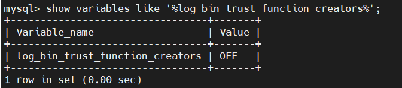

如果在变量值为0的情况下创建存储函数，就会报错

```sql
ERROR 1418 (HY000): This function has none of DETERMINISTIC, NO SQL, or READS SQL DATA in its declaration and binary logging is enabled (you *might* want to use the less safe log_bin_trust_function_creators variable)
```

那么为什么MySQL有这样的限制呢？ 因为二进制日志的一个重要功能是用于主从复制，而存储函数有可能导致主从的数据不一致。所以当开启二进制日志后，参数log_bin_trust_function_creators就会生效，限制存储函数的创建、修改、调用。

所以为了测试，我们需要把该参数打开，不然没法玩了。注意使用命令打开，重启后就会失效，如果要永久生效，需要修改my.cnf。

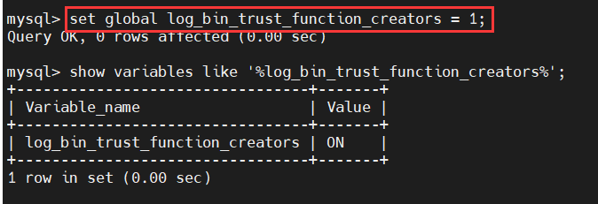

#### 8.3 编写随机函数

这里需要两个随机函数就够了，一个产生随机数字，一个产生随机字符串。

##### 8.3.1 随机产生字符串

```sql
-- 定义分隔符为$$，不然遇到;就会结束
DELIMITER $$
-- 函数名为rand_string，入参为n，类型为int，返回值为varchar类型，长度为255
CREATE FUNCTION rand_string(n INT) RETURNS VARCHAR(255)
BEGIN
-- 定义一个变量chars_str，有默认值
DECLARE chars_str VARCHAR(100) DEFAULT 'abcdefghijklmnopqrstuvwxyzABCDEFJHIJKLMNOPQRSTUVWXYZ';
DECLARE return_str VARCHAR(255) DEFAULT '';
DECLARE i INT DEFAULT 0;
-- 生成长度为n的随机字符串，存入return_str
WHILE i < n DO
	SET return_str = CONCAT(return_str, SUBSTRING(chars_str, FLOOR(1 + RAND() * 52), 1));
	SET i = i + 1;
END WHILE;
RETURN return_str;
END $$
```

##### 8.3.2 随机产生数字

```sql
-- 随机产生from_num到to_num范围内的数
DELIMITER $$
CREATE FUNCTION rand_num(from_num INT, to_num INT) RETURNS INT(11)
BEGIN
	DECLARE i INT DEFAULT 0;
	SET i = FLOOR(from_num + RAND() * (to_num - from_num +1));
	RETURN i;
END $$
```

如果要删除函数，使用下面的命令

```sql
drop function function_name;
```

#### 8.4 创建存储过程

##### 8.4.1 往emp表中插入数据的存储过程

```sql
DELIMITER $$
CREATE PROCEDURE insert_emp(START INT, max_num INT)
BEGIN
DECLARE i INT DEFAULT 0;
-- 把自动提交关闭
set autocommit = 0;
REPEAT
SET i = i +1;
INSERT INTO emp(empno, NAME, age, deptid) VALUES((START + i), rand_string(6), rand_num(30, 50), rand_num(1, 10000));
UNTIL i = max_num
END REPEAT;
COMMIT;
END $$

-- 删除
DELIMITER ;
drop PROCEDURE insert_emp;
```

##### 8.4.2 往dept表中插入数据的存储过程

```sql
DELIMITER $$
CREATE PROCEDURE insert_dept(max_num INT)
BEGIN
DECLARE i INT DEFAULT 0;
SET autocommit = 0;
REPEAT
SET i = i + 1;
INSERT INTO dept(deptname, address, ceo) VALUES(rand_string(8), rand_string(10), rand_num(1, 500000));
UNTIL i = max_num
END REPEAT;
COMMIT;
END $$

-- 删除
DELIMITER ;
drop PROCEDURE insert_dept;
```

#### 8.5 调用存储过程

##### 8.5.1 添加数据到部门表

```sql
-- 执行存储过程，往dept表添加1w条数据
DELIMITER ;
CALL insert_dept(10000);
```

##### 8.5.2 添加数据到员工表

```sql
-- 执行存储过程，往emp表添加200w条数据
DELIMITER ;
CALL insert_emp(100000, 2000000);
```

#### 8.6 批量删除某个表上的所有索引

##### 8.6.1 创建删除索引的存储过程

```sql
DELIMITER $$
CREATE PROCEDURE proc_drop_index(dbname VARCHAR(200), tablename VARCHAR(200))
BEGIN
	DECLARE done INT DEFAULT 0;
	DECLARE ct INT DEFAULT 0;
	DECLARE _index VARCHAR(200) DEFAULT '';
	DECLARE _cur CURSOR FOR SELECT index_name FROM information_schema.STATISTICS WHERE table_schema = dbname AND table_name = tablename AND seq_in_index = 1 AND index_name <> 'PRIMARY';
	DECLARE CONTINUE HANDLER FOR NOT FOUND set done = 2;
	OPEN _cur;
	FETCH _cur INTO _index;
	WHILE _index <> '' DO
		SET @str = CONCAT("drop index ", _index, " on ", tablename);
		REPEAT sql_str FROM @str;
		EXECUTE sql_str;
		DEALLOCATE PREPARE sql_str;
		SET _index = '';
		FETCH _cur INTO _index;
	END WHILE;
CLOSE _cur;
END $$
```

##### 8.6.2 执行存储过程

```sql
CALL proc_drop_index("dbname", "tablename");
```

### 9、show profile

利用show profile可以查看sql的执行周期，在每个环节耗时多少。

#### 9.1 开启profile

profile是默认关闭的。

```sql
show variables like '%profiling%';
```


```sql
-- 开启profiling
set profiling = on;
```


注意：**通过上述命令开启后仅在当前会话有效。**

#### 9.2 show profiles命令

show profiles 其作用为显示当前会话服务器最新收到的15条SQL的性能信息。其中包括：持续时间，以及Query_ID。我们可以通过Query_ID分析其性能。


上图中`profiling_history_size`属性就是显示多少条sql的性能信息，默认15条，可以进行修改

```sql
set profiling_history_size = 20;
```

`profiling_history_size`属性的取值范围是[0, 100]。当超过100时，设置为100，小于0时，设置为0。设置为的时候效果相当于`set profiling = 0`，关闭。

通过`show profiles`命令可以查看sql语句总的运行时间，那么如何分析单条sql的运行时间呢？

#### 9.3 show profile命令

通过`show profile` + `query id`可以查看单条SQL的具体运行时间。


通过上述结果，我们可以非常清楚的查看每一步的耗时，其中(Druation的单位为秒)。这样，当我们遇到一条慢SQL时，就能很清楚的知道，为什么慢，慢在哪一步了。

**备注**： 上述结果集中的Status就不再详细解析了，这里其实展示的是SQL的执行过程，经历的步骤，通过字面就能很快知道其意思。

上面我们使用的是默认展示结果。其实，我们也指定展示结果，如：CPU，IO，线程上下文切换等等。
可选参数如下：

1. all： 展示所有信息。
2. block io： 展示io的输入输出信息。
3. context switches： 展示线程的上线文切换信息。
4. cpu ：显示SQL 占用的CPU信息。
5. ipc： 显示统计消息的发送与接收计数信息。
6. page faults：显示主要与次要的页面错误。
7. memory：本意是显示内存信息，但目前还未实现。
8. swaps： 显示交换次数。
9. sources：显示源代码中的函数名称，以及函数发生的文件的名称和行。

上面参数可以组合使用，其中用 , 号分割。如下所示：


当结果显示的比较多时，你也可以通过 limit 选项，来显示指定的行数。如下所示：


#### 9.4 例子

上面我们插了50w条数据，可以测试一下。

**结论**：status出现下面四个指标，需要优化

（1）converting HEAP to MyISAM。查询结果集太大， 内存不够用，往磁盘上放。

（2）Creating tmp table。创建临时表，拷贝数据到临时表，用完再删除。

（3）Copying to tmp table on disk。把内存中临时表复制到磁盘，危险！

（4）locked。

### 10、全局查询日志

所谓全局查询日志，就是可以记录你执行的所有sql语句，把它们放到一张表里，方便查看定位，比如某个时间段执行了哪些sql语句。

#### 10.1 使用配置开启

在my.cnf中，配置如下：

```cnf
# 开启
general_log=1
# 记录日志文件的路径
general_log_file=/path/logfile
# 输出格式
log_output=FILE
```

#### 10.2 使用命令开启

```sql
set global general_log=1;
set global log_output='TABLE';
```

这样你使用的sql语句就会记录到mysql数据库的general_log表里。

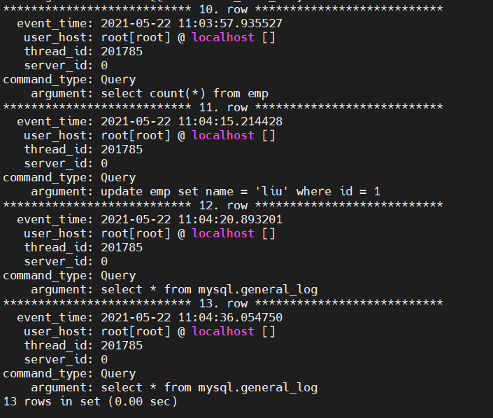

注意：**永远不要在生产环境开启这个功能**。

### 11、MySQL锁机制

#### 11.1 表锁（偏读）

偏向MyISAM存储引擎，开销小，加锁快，无死锁，锁定粒度大，发生锁冲突的概率最高，并发度最低。

手动增加/解除表锁的命令

```sql
LOCK TABLES
    tbl_name [[AS] alias] lock_type
    [, tbl_name [[AS] alias] lock_type] ...

lock_type: {
    READ [LOCAL]
  | [LOW_PRIORITY] WRITE
}

UNLOCK TABLES
```

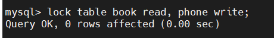

##### 11.1.1 表读锁测试

**对于一张表，如果一个线程加了读锁，其他线程可以读写吗？**对于book表，一个线程加了读锁，进行测试

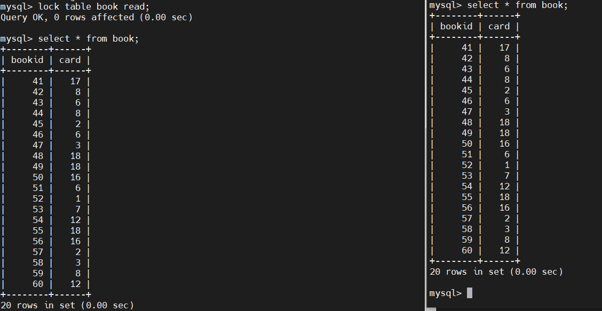

**在给表加了读锁后，并不影响其他线程读这张表。**

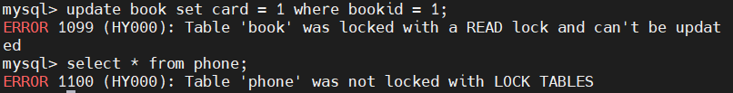

**线程给表加读锁后，该线程除了读，对于此表和其他表，不能做任何操作**。

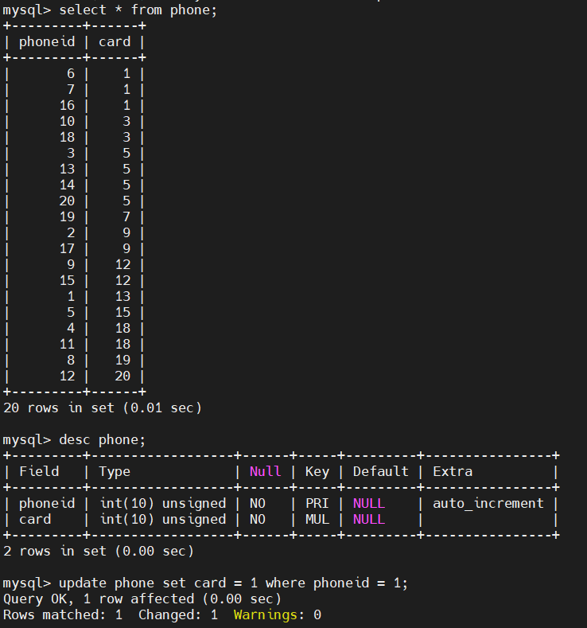

而其他线程，对于加锁的表，可以正常读，对于其他表，也能正常读写，但对于加锁的表，不能进行更新，会阻塞，直到加锁的表被释放锁。

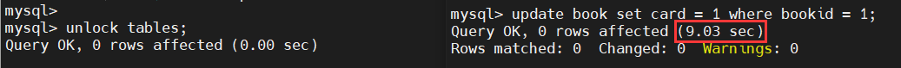

##### 11.1.2 表写锁测试

线程1在book表上增加写锁，开启两个session进行测试。

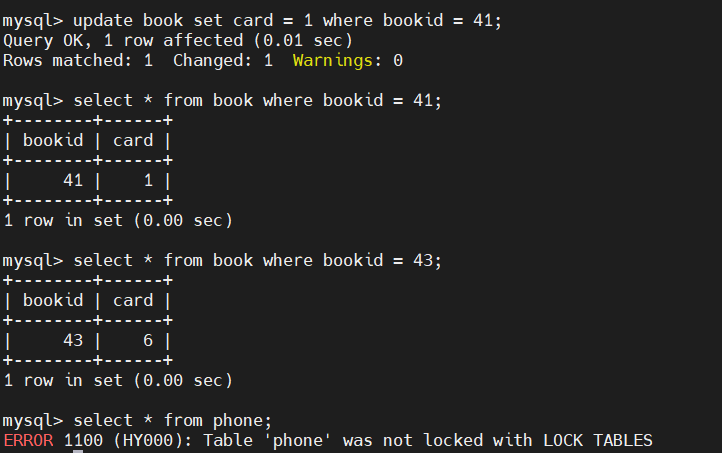

加锁的线程可以正常读写book表，但不能操作其他表。

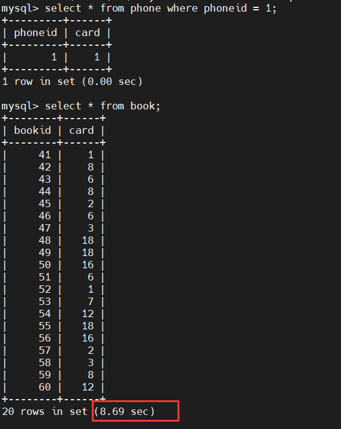

而对于其他的线程，可以读写其他的表，但对于加锁的表，读写都会阻塞，直到锁被解除。

总结：**读锁会阻塞写，但不会阻塞读，写锁会阻塞读和写**。

##### 11.1.3 如何分析表锁

查看表的加锁情况

```sql
SHOW OPEN TABLES
    [{FROM | IN} db_name]
    [LIKE 'pattern' | WHERE expr]
```

输出结果有4列

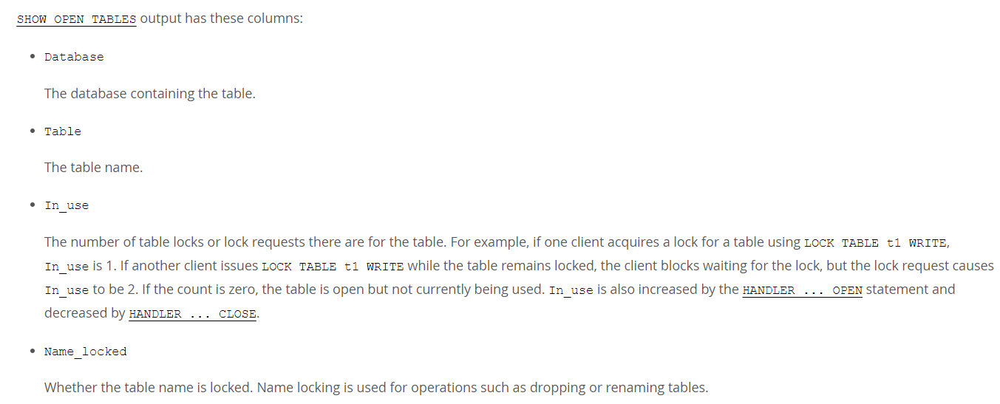

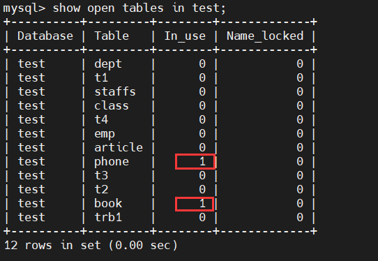

可以通过检查`table_locks_waited`和`table_locks_immediate`变量来分析系统上的表锁定。

```sql
show status like 'table_locks%';
```

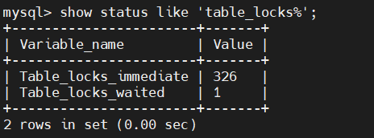

`Table_locks_immediate`：产生表级锁定的次数，表示可以立即获取锁的查询次数，每立即获取锁值加1。

`Table_locks_waited`：出现表级锁争用而发生的等待次数（不能立即获取锁的次数，每等待一次锁值加1），此值较高说明存在比较严重的表级锁竞争情况。

**此外，MyISAM存储引擎的读写锁调度是写优先，所以MyISAM不适合作为写为主的表的存储引擎。因为写锁后，其他线程不能做任何操作，大量的更新会使查询很难得到锁，从而造成阻塞。**

#### 11.2 行锁（偏写）

偏向InnoDB存储引擎，开销大，加锁慢，会出现死锁，锁粒度小，发生锁冲突的概率低，并发度高。InnoDB和MyISAM存储引擎最大的区别就是：**支持事务、使用了行级锁**。

##### 11.2.1 事务

（1）事务是由一组sql语句组成的逻辑处理单元，事务具有ACID属性：

- 原子性（Atomic）：事务是一个原子操作单元，其对数据的修改，要么全都执行，要么全都不执行。
- 一致性（Consistent）：事务完成后，所有数据的状态都是一致的，即A账户只要减去了100，B账户则必定加上了100；
- 隔离性（Isolation）：如果有多个事务并发执行，每个事务作出的修改必须与其他事务隔离；
- 持久性（Duration）：即事务完成后，对数据库数据的修改被持久化存储。

（2）并发事务处理会带来下面四个问题

- 更新丢失（Lost Update）

当两个或者多个事务选择同一行，然后基于最初的值进行更新时，由于每个事务都不知道其他事务的存在，就会发生更新丢失的问题。---最后一个事务的更新值覆盖了前面事务的更新值。

如果在一个事务完成并提交之前，其他事务不能进行访问，则可以避免此问题。

- 脏读（Dirty Read）

一个事务正在对某条记录进行更新，在这个事务还未提交之前，其他事务也来读取这条记录，这时数据就处于不一致状态，读取的就是脏数据。即事务A读取了事务B已修改但尚未提交的数据，还在这个数据基础上做了某些操作，此时事务B回滚，A读取的数据无效，不符合一致性要求。

- 不可重复读（Non-Repeatable Read）

一个事务在某个时间读取了某条记录，下次再去读的时候，却发现读出的数据已经发生了改变。这种现象就叫做不可重复读。即事务A读取了事务B已经提交的修改数据，不符合隔离性。

- 幻读（Phantom Read）

一个事务按相同的条件去查询以前检索过的数据，却发现其他事务插入了满足其查询条件的数据，这种现象称为幻读。即事务A读取到了事务B新增的数据，不符合隔离性。

不可重复读和幻读有点像，不可重复读是事务B里修改了数据（update），幻读是事务B里新增了数据（insert或delete）。

（3）事务的隔离级别

脏读、不可重复读、幻读，其实都是数据库读一致性问题，必须数据库通过一定的事务隔离机制来解决。

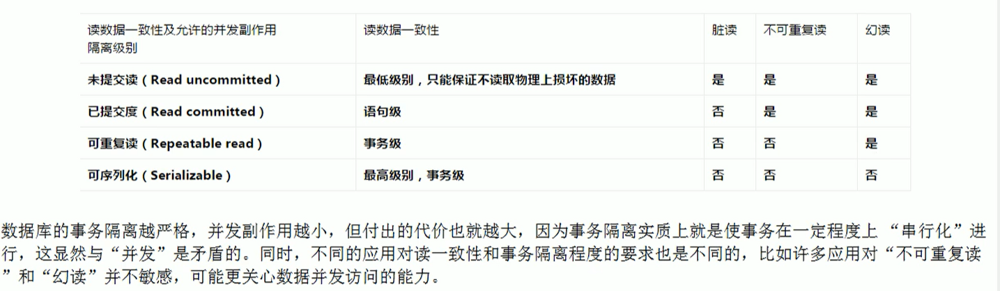

查看当前数据库的隔离级别

```sql
show variables like 'tx_isolation';
```

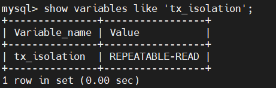

默认隔离级别是RR，可重复读。

##### 11.2.2 测试行锁

InnoDB默认加了行锁，所以这里我们不需要手动加锁。我们开两个窗口连接数据库，**把自动提交关闭**，这样两个窗口就是事务1和事务2。

```sql
set autocommit = 0;
```

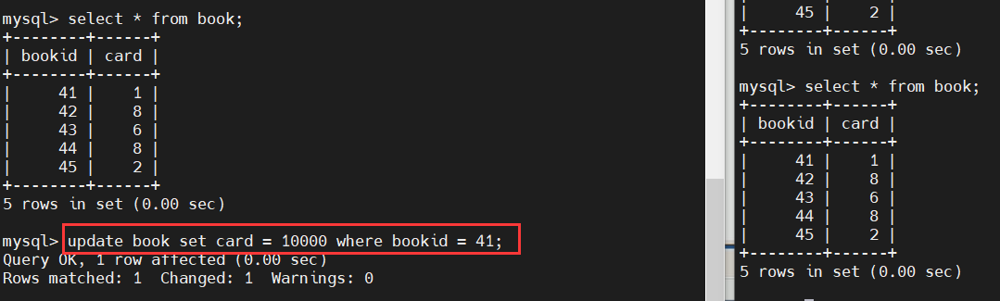

第一个事务更新了book表中bookid为41的记录，但未提交，第二个事务去读的时候，读的还是原来的数据，而不是事务1修改还没提交的数据，这就避免了脏读。

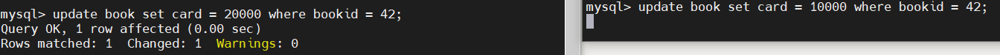

事务1修改book中bookid为42的记录，在还未提交之前，事务2也来修改bookid为42的记录，可以发现事务2会阻塞，因为锁被事务1占用，必须事务1提交后，事务2才会执行。

如果是不同行记录，那么两个事务可以同时更新。

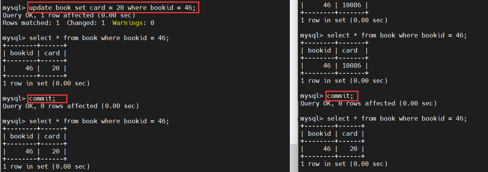

事务1更新了bookid为46的记录并且已经提交，但事务2读取的还是原来的数据，必须事务2提交后，才能读取到事务1提交的数据。这就解决了不可重复读的问题，符合事务的隔离性。

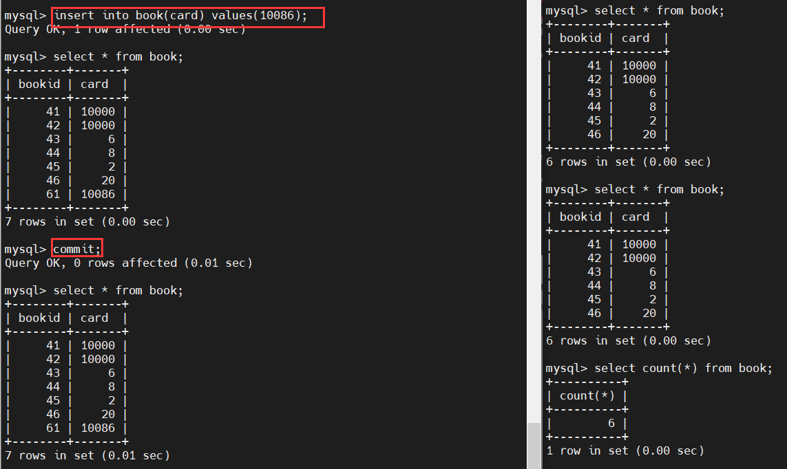

这里事务1插入一条数据并进行提交，事务2去查询，发现并没有出现幻读的现象。这就很奇怪了。

**幻读错误的理解**：说幻读是 事务A 执行两次 select 操作得到不同的数据集，即 select 1 得到 10 条记录，select 2 得到 11 条记录。这其实并不是幻读，这是不可重复读的一种，只会在 R-U R-C 级别下出现，而在 mysql 默认的 RR 隔离级别是不会出现的。

**幻读，并不是说两次读取获取的结果集不同，幻读侧重的方面是某一次的 select 操作得到的结果所表征的数据状态无法支撑后续的业务操作。更为具体一些：select 某记录是否存在，不存在，准备插入此记录，但执行 insert 时发现此记录已存在，无法插入，此时就发生了幻读。**

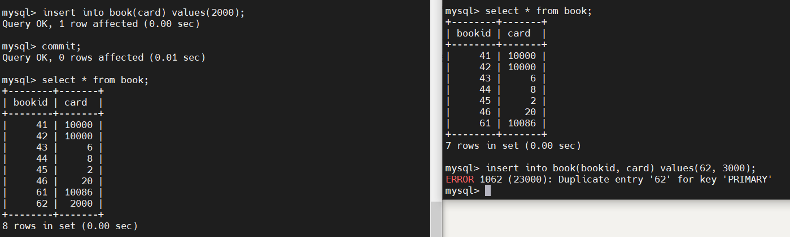

我们使用事务1对book表插入一条数据并提交，但在事务2用select是无法查出的，事务1插入的数据主键是62，这时候我们在事务2插入一条相同主键的记录，却提示我们主键重复，但查询却查询不出来记录。这才是正确的幻读现象。

##### 11.2.3 如何解决幻读

在RR级别下，如果要解决幻读，可以通过X锁（排他锁）解决，最高隔离级别serializble就是通过加X锁避免幻读的。

`SERIALIZABLE` 正是对所有事务都加 `X锁` 才杜绝了 `幻读`，但很多场景下我们的业务 `sql` 并不会存在 `幻读` 的风险。`SERIALIZABLE` 的一刀切虽然事务绝对安全，但性能会有很多不必要的损失。故可以在 `RR` 下根据业务需求决定是否加锁，存在幻读风险我们加锁，不存在就不加锁，事务安全与性能兼备，这也是 `RR` 作为 `mysql` 默认隔是个事务离级别的原因，所以需要正确的理解 `幻读`。

```sql
# 这里需要用 X锁， 用 LOCK IN SHARE MODE 拿到 S锁 后我们没办法做 写操作
SELECT `id` FROM `users` WHERE `id` = 1 FOR UPDATE;
```

如果 id = 1 的记录存在则会被加行（X）锁，如果不存在，则会加 next-lock key / gap 锁（范围行锁），即记录存在与否，mysql 都会对记录应该对应的索引加锁，其他事务是无法再获得做操作的。

mysql中，默认的事务隔离级别是可重复读（repeatable-read），为了解决不可重复读，innodb采用了MVCC（多版本并发控制）来解决这一问题。

上面的内容，可参考：https://segmentfault.com/a/1190000016566788。

##### 11.2.4 索引失效导致行锁变表锁

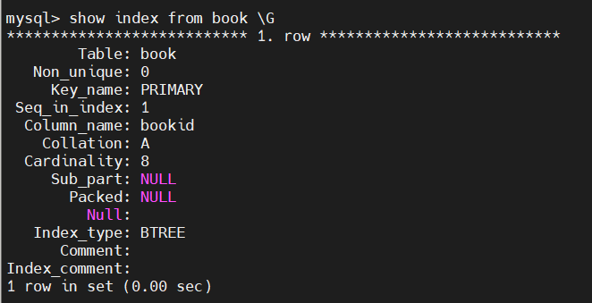

book表有一个默认的主键索引。

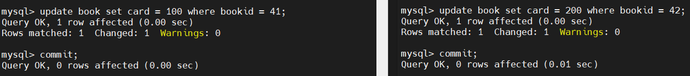

当where条件是bookid的时候，两个事务可以各自更新不同的行，不受影响。

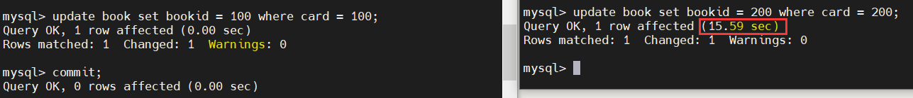

当where后面的条件换成card的时候，两个事务更新不同的行，一个事务会阻塞，必须另一个事务提交后，才能进行提交。

结论：**没有索引或者索引失效时，InnoDB 的行锁变表锁**。

##### 11.2.5 行锁分析

可以通过检查innodb_row_lock系统变量来分析系统上的行锁的竞争情况。

```sql
show status like 'innodb_row_lock%';
```

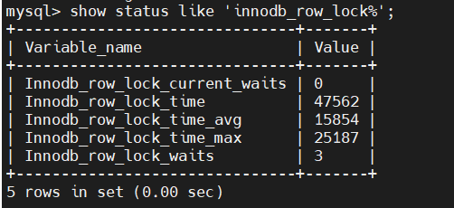

- Innodb_row_lock_current_waits：当前正在等待锁的数量。
- Innodb_row_lock_time：从系统启动到现在锁定总时间长度。
- Innodb_row_lock_time_avg：每次等待所花平均时间。
- Innodb_row_lock_time_max：从系统启动到现在等待最长的一次所花的时间。
- Innodb_row_lock_waits：系统启动到现在总共等待次数。

##### 11.2.6 行锁优化建议

（1）尽可能让所有数据检索都通过索引完成，避免无索引或索引失效导致行锁变为表锁。

（2）合理设计索引，尽量缩小锁的范围。

（3）尽可能减少检索条件，避免间隙锁。

（4）尽量控制事务大小，减少锁定资源量和时间长度。

（5）尽可能降低事务隔离级别。

#### 11.3 间隙锁

##### 11.3.1 什么是间隙锁

当用范围条件而不是相等条件去检索数据，并请求共享或排他锁时，InnoDB会给符合条件的已有数据记录的索引项加锁，对于键值在条件范围内但并不存在的记录，叫做间隙（GAP）。InnoDB也会对这个间隙加锁，这种锁机制就是间隙锁（Next-Key锁）

##### 11.3.2 危害

因为在执行过程中通过范围查找，它会锁定整个范围内所有的索引键值，即使这个键并不存在，所以在锁定的时候就无法插入锁定键值范围内的任何数据。在某些场景下可能会对性能造成很大的危害。

#### 11.4 页锁

开销和加锁时间界于表锁和行锁之间。会出现死锁，锁定粒度界于表锁和行锁之间，并发度一般。