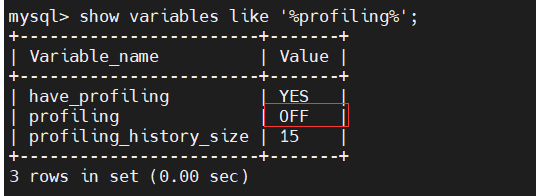
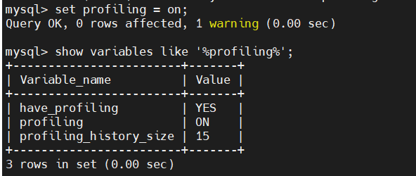
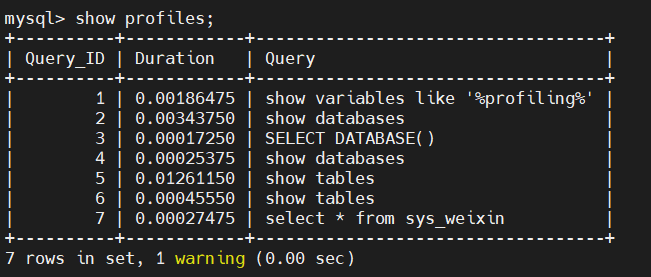
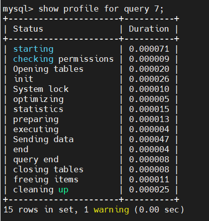
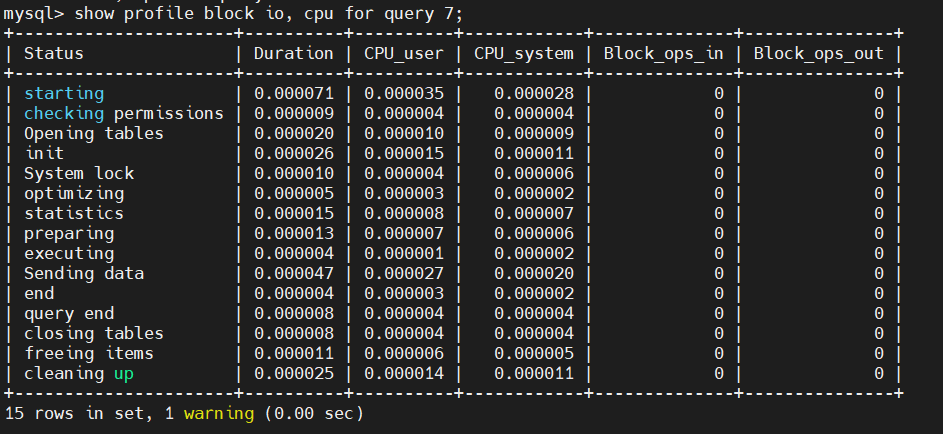
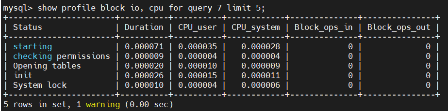
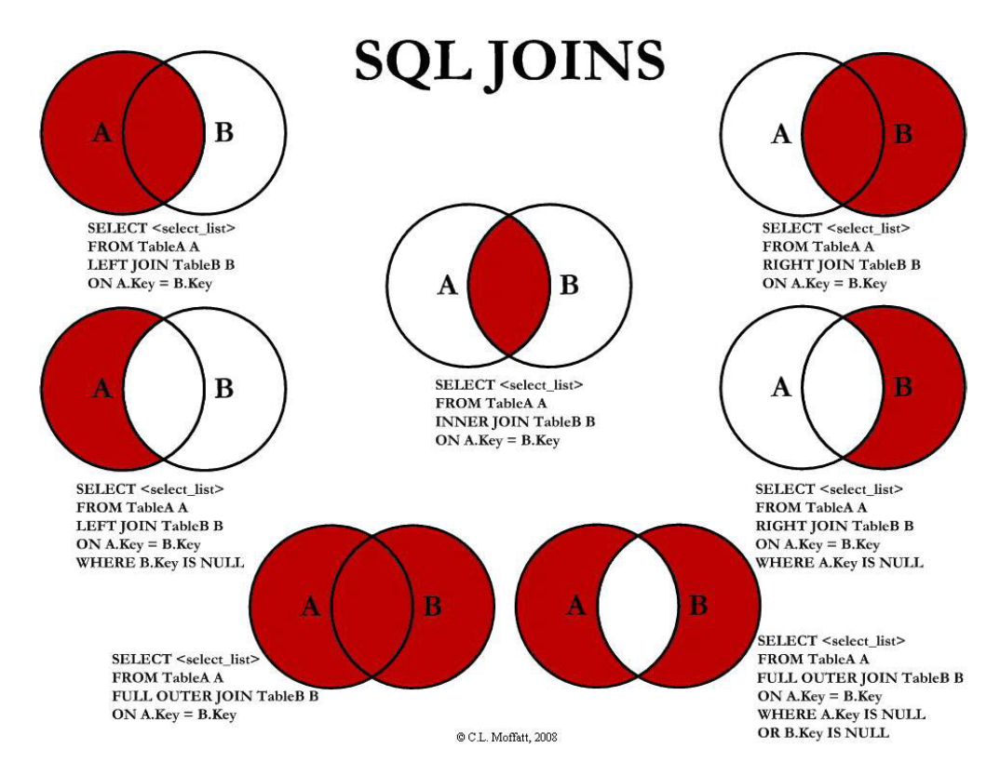
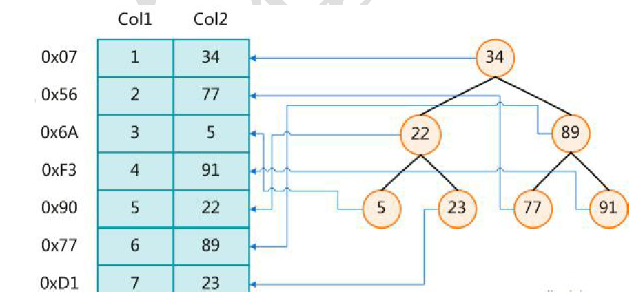

### 1、show profile

利用show profile可以查看sql的执行周期，在每个环节耗时多少。

#### 1.1 开启profile

profile是默认关闭的。

```sql
show variables like '%profiling%'
```



```sql
-- 开启profiling
set profiling = on;
```



注意：**通过上述命令开启后仅在当前会话有效。**

#### 1.2 show profiles命令

show profiles 其作用为显示当前会话服务器最新收到的15条SQL的性能信息。其中包括：持续时间，以及Query_ID。我们可以通过Query_ID分析其性能。



上图中`profiling_history_size`属性就是显示多少条sql的性能信息，默认15条，可以进行修改

```sql
set profiling_history_size = 20;
```

`profiling_history_size`属性的取值范围是[0, 100]。当超过100时，设置为100，小于0时，设置为0。设置为的时候效果相当于`set profiling = 0`，关闭。

通过`show profiles`命令可以查看sql语句总的运行时间，那么如何分析单条sql的运行时间呢？

#### 1.3 show profile命令

通过`show profile` + `query id`可以查看单条SQL的具体运行时间。



通过上述结果，我们可以非常清楚的查看每一步的耗时，其中(Druation的单位为秒)。这样，当我们遇到一条慢SQL时，就能很清楚的知道，为什么慢，慢在哪一步了。

**备注**： 上述结果集中的Status就不再详细解析了，这里其实展示的是SQL的执行过程，经历的步骤，通过字面就能很快知道其意思。

上面我们使用的是默认展示结果。其实，我们也指定展示结果，如：CPU，IO，线程上下文切换等等。
可选参数如下：

1. all： 展示所有信息。
2. block io： 展示io的输入输出信息。
3. context switches： 展示线程的上线文切换信息。
4. cpu ：显示SQL 占用的CPU信息。
5. ipc： 显示统计消息的发送与接收计数信息。
6. page faults：显示主要与次要的页面错误。
7. memory：本意是显示内存信息，但目前还未实现。
8. swaps： 显示交换次数。
9. sources：显示源代码中的函数名称，以及函数发生的文件的名称和行。

上面参数可以组合使用，其中用 , 号分割。如下所示：



当结果显示的比较多时，你也可以通过 limit 选项，来显示指定的行数。如下所示：



### 2、七种join



注意的是，对于最后两种情况，在MySQL里，是不存在`FULL OUTER JOIN`关键字的

```sql
mysql> select * from user full outer join role on user.role_id = role.role_id;
ERROR 1064 (42000): You have an error in your SQL syntax; check the manual that corresponds to your MySQL server version for the right syntax to use near 'outer join role on user.role_id = role.role_id' at line 1
```

那么对于最后两种情况，可以使用`union`关键字。`union`会对结果去重，而`union all`不会。

```sql
mysql> select * from user left join role on user.role_id = role.role_id union select * from user right join role on user.role_id = role.role_id;

mysql> select * from user left join role on user.role_id = role.role_id where user.role_id is null union select * from user right join role on user.role_id = role.role_id where role.role_id is null;
```

### 3、索引

#### 3.1 索引是什么

MySQL官方对索引的定义：索引（index）是帮助MySQL高效获取数据的**数据结构**。

索引的目的在于提高查找效率，可以类比字典。可以简单理解为“**排好序的快速查找数据结构**”。

在数据之外，数据库系统还维护着满足特定查找算法的数据结构，这些数据结构以某种方式引用（指向）数据，
这样就可以在这些数据结构上实现高级查找算法。这种数据结构，就是索引。



左边是数据表，一共有两列七条记录，最左边的是数据记录的物理地址。为了加快Col2 的查找，可以维护一个右边所示的二叉查找树，每个节点分别包含索引键值和一个指向对应数据记录物理地址的指针，这样就可以运用二叉查找在一定的复杂度内获取到相应数据，从而快速的检索出符合条件的记录。

一般来说索引本身也很大，不可能全部存储在内存中，因此索引往往以索引文件的形式存储的磁盘上。