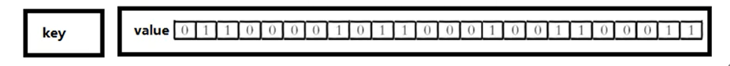

### 1、Redis介绍及安装

#### 1.1 Redis概述

（1）Redis是一个开源的key-value存储系统。

（2）和Memcached类似，它支持存储的value类型相对更多，包括string(字符串)、list(链表)、set(集合)、zset(sorted set--有序集合)和hash(哈希类型)。

（3）这些数据类型都支持push/pop、add/remove、取交集和差集等丰富的操作，而且这些操作都是原子性的。

（4）在此基础上，Redis支持各种不同方式的排序。

（5）与memcached一样，为了保证效率，数据都是缓存在内存中。

（6）区别是Redis会周期性的把更新的数据写入磁盘或者把修改操作写入追加的记录文件。

（7）在此基础上实现了master-slave(主从)同步。

#### 1.2 应用场景

（1）配合关系型数据库做高速缓存

- 缓存高频次、热门访问的数据，降低数据库IO
- 在分布式架构中，做session共享。

（2）多样的数据结构存储持久化数据

- 最新N个数据  => 通过List实现按自然时间排序的数据。
- 排行榜、top N => 利用zset(有序集合)
- 时效性的数据，比如手机验证码 => Expire过期
- 计数器、秒杀 => 原子性，自增方法INCR、DECR
- 去除大量数据中的重复数据 => 利用Set集合
- 构建队列 => 利用List集合
- 发布订阅消息系统 => pub/sub模式

#### 1.3 Redis安装

[官网](https://redis.io/download)

Redis 官方不建议在 windows 下使用 Redis，所以官网没有 windows 版本可以下载。还好微软团队维护了开源的 windows 版本，虽然只有 3.2 版本，对于普通测试使用足够了。[windows版redis下载链接](https://github.com/MicrosoftArchive/redis/releases)

这里我们下载Linux版本的，下载完成后，放到Linux服务器上进行解压安装即可。

```shell
# 查看系统是否安装gcc
gcc --version
gcc (GCC) 4.8.5 20150623 (Red Hat 4.8.5-44)
Copyright © 2015 Free Software Foundation, Inc.

# 没安装先安装gcc
yum install gcc

# 解压到指定文件夹
tar -zxvf redis-6.2.5.tar.gz -C /usr/local/redis/

# 进入redis文件夹
cd /usr/local/redis/redis-6.2.5

# 编译
make

# 安装
make install
```

安装完成后，进入安装目录`/usr/local/bin`


- redis-benchmark：性能测试工具，可以在自己电脑行运行，看看电脑性能如何。
- redis-check-aof：修复有问题的AOF文件。
- redis-check-rdb：修复有问题的dump.rdb文件。
- redis-sentinel：Redis集群使用。
- redis-cli：Redis客户端，操作入口。
- redis-server：Redis服务器启动命令。

直接执行redis-server，是前台启动，关闭窗口或者退出后就会断开连接，一般使用后台启动。修改解压目录下的redis.conf

```conf
daemonize no  => daemonize yes
```

```shell
# 连接时指定配置文件
./redis-server /usr/local/redis/redis-6.2.5/redis.conf

ps -ef | grep redis
```


#### 1.4 相关知识介绍

（1）Redis默认有16个数据库。下标从0开始，通过`select index`命令选择不同的数据库，默认使用0号数据库。

（2）所有库有相同的密码。

（3）Redis是单线程 + 多路IO复用技术。

多路复用是指使用一个线程来检查多个文件描述符（socket）的就绪状态，比如调用select和poll函数，传入多个文件描述符，如果有一个文件描述符就绪，则返回，否则阻塞直到超时。得到就绪状态后进行真正的操作可以在同一个线程里执行，也可以启动线程执行（比如使用线程池）。

串行 vs 多线程 + 锁（memcached） vs 单线程 + 多路IO复用（Redis）

与memcached三点不同：支持多数据类型、支持持久化、单线程 + IO多路复用


### 2、常用五大数据类型

#### 2.1 Redis键（key）

```shell
# 设置键值对
127.0.0.1:6379> set key 1
OK

# 查看当前库的所有key
127.0.0.1:6379> keys *
1) "key"

# 判断某个key是否存在
127.0.0.1:6379> exists key
(integer) 1

# 删除指定的key
127.0.0.1:6379> del key
(integer) 1

# 根据value选择非阻塞删除，仅将key从keyspace元数据删除，真正的删除会在后续异步执行
127.0.0.1:6379> unlink key
(integer) 1

# 给key设置过期时间，单位秒，到期后自动删除
127.0.0.1:6379> expire key 10
(integer) 1

# 查看键还有多少s过期，-1永不过期，-2已过期
127.0.0.1:6379> ttl key
(integer) -2

# 查看当前数据库的key的数量
127.0.0.1:6379> dbsize
(integer) 0

# 清空当前数据库
127.0.0.1:6379> flushdb
OK

# 清空所有库
127.0.0.1:6379> flushall
OK
```

#### 2.2 Redis字符串（string）

##### 2.2.1 简介

String是Redis最基本的类型，一个key对应一个value。

String类型是二进制安全的，意味着Redis的string可以包含任何数据，比如jpg图片或者序列化的对象。

String类型是Redis最基本的数据类型，一个Redis中字符串value最多可以是512M。

##### 2.2.2 常用命令

（1）**set key value**：添加键值对


*NX：当数据库中key不存在时，可以将key-value添加数据库。

*XX：当数据库中key存在时，可以将key-value添加数据库，与NX参数互斥。

*EX：key的超时秒数。

*PX：key的超时毫秒数，与EX互斥。

（2）**get key**：查询对应键值

（3）**append key value**：将给定的value追加到原值的末尾，返回新的value的长度

（4）**strlen key**：获得值的长度

（5）**setnx key value**：只有key不存在时，才设置key的值

（6）**incr key**：将key中存储的**数字**值自增1，只能对数字值操作，如果为空，新增值为1

（7）**decr key**：将key中存储的**数字**值减1，只能对数字值操作，如果为空，新增值为-1

（8）**incrby / decrby key 步长**：将key中存储的数字值增减自定义步长。 

INCR key等命令都是原子操作，这种操作一旦开始，就会一直运行到结束，中间不会有任何context switch（切换到另一个线程）。

**Redis单命令的原子性主要得益于Redis的单线程**。

（9）**mset key1 value1 key2 value2 ...**

同时设置一个或多个key-vaue对

（10）**mget key1 key2 key3** ...

同时获取一个或多个value

（11）**msetnx key1 value1 key2 value2 ...**

同时设置一个或多个key-value对，当且仅当所有给定的key都不存在。原子性，有一个存在则都失效。

（12）**getrange key 起始位置 结束位置**

获取值的范围，类似java的substring，包含起始和结束位置

（13）**setrange key 起始位置 value**

用value覆盖key所存储的字符串值，从起始位置开始（索引从0开始）

（14）**setex key 过期时间 value**

设置键值的同时，设置过期时间，单位秒

（15）**getset key value**

以旧换新，设置新值同时返回旧值

##### 2.2.3 数据结构

String的数据结构为简单动态字符串（Simple Dynamic String，SDS），是可以修改的字符串，内部结构实现上类似Java的ArrayList，采用预分配冗余空间的方式来减少内存的频繁分配。


如图所示，内部为当前字符串实际分配的空间capacity一般要高于实际字符串长度len，当字符串长度小于1M时，扩容都是加倍现有的空间，如果超过1M，扩容时一次只会多扩1M的空间。需要注意的是字符串最大长度为512M。

#### 2.3 Redis列表（List）

##### 2.3.1 简介

单键多值。

Redis列表是简单的字符串列表，按照插入顺序排序，你可以添加一个元素列表的头部（左边）或者尾部（右边）。

它的底层实际是个双向链表，对两端的操作性能很高，通过索引下标的操作中间的节点性能会较差。


##### 2.3.2 常用命令

（1）**lpush/rpush key value1 value2 value3 ...**

从左边/右边插入一个或多个值。

（2）**lpop/rpop key**

从左边/右边吐出一个值。值在键在，值光键亡。

（3）**rpoplpush key1 key2**

从key1列表右边吐出一个值插到key2列表左边。

（4）**lrange key start stop**

按照索引下标获得元素（从左到右）。0, -1表示获取所有

（5）**lindex key index**

按照索引下标获得元素（从左往右）

（6）**llen key**

获得列表长度

（7）**linsert key before value newvalue**

在value后面插入newvalue

（8）**lrem key n value**

从左边删除n个value（从左往右）

（9）**lset key index value**

将列表key下标为index的值替换为value

##### 2.3.3 数据结构

List的数据结构为快速链表quickList。

首先在列表元素较少的情况下会使用一块连续的内存存储，这个结构是ziplist，即压缩列表。它将所有的元素紧挨着一起存储，分配的是一块连续的内存。

当数据量比较多的时候才会改为quickList，因为普通的链表需要的附件指针空间太大，会比较浪费空间。比如这个列表里存的只是int类型的数据，结构上还需要两个额外的指针prev和next。


Redis将链表和ziplist结合起来组成了quicklist，也就是将多个ziplist使用双向指针串起来使用，这样既满足了快速的插入删除性能，又不会出现太大的空间冗余。

#### 2.4 Redis集合（Set）

##### 2.4.1 简介

Redis set对外提供的功能与list类似，是一个列表，特殊之处在于set是可以自动去重的。当你需要存储一个列表数据又不希望出现重复数据时，set是一个很好的选择。并且set提供了判断某个元素是否在一个set集合里的方法，这是list所没有的。

Redis的set是string类型的无序集合，它底层其实是一个value为null的hash表，所以添加、删除、查找的复杂度都是O(1)。

##### 2.4.2 常用命令

（1）**sadd key value1 value2 ...**

将一个或者多个member元素加入到集合key中，已经存在的member元素将被忽略。

（2）**smembers key**

取出该集合的所有值。

（3）**sismember key value**

判断集合key中是否还有该value值，有返回1，没有返回0。

（4）**scard key**

返回该集合的元素个数。

（5）**srem key value1 value2 ...**

删除集合中的某个元素。

（6）**spop key**

随机从该集合中吐出一个值。

（7）**srandmember key n**

随机从该集合中取出n个值，不会从集合中删除。

（8）**smove source destination value**

把集合中一个值从一个集合移动到另一个集合。

（9）**sinter key1 key2** 

返回两个集合的交集。

（10）**sunion key1 key2**

返回两个集合的并集。

（11）**sdiff key1 key2**

返回两个集合的差集。

##### 2.4.3 数据结构

set数据结构是dict字典，字典使用hash表实现的。

Java中的HashSet内部实现是使用HashMap，只不过所有的value都指向同一个对象。Redis的set结构也一样，他的内部也使用hash结构，所有的value都指向同一个内部值。

#### 2.5 Redis哈希（Hash）

##### 2.5.1 简介

Redis hash是一个键值对集合，String类型的field和value的映射表，特别适合存储对象，类似于Java里的Map<String, Object>。

##### 2.5.2 常用命令

（1）**hset key field:value**

给key集合中的field键赋值value。

（2）**hget key field**

从key集合中取出field的值。

（3）**hmset key field1 value1 field2 value2 ...**

批量设置hash的值。

（4）**hexists key field**

查看哈希表key中，给定filed是否存在。

（5）**hkeys key**

列出该hash集合中的所有field。

（6）**hvals key**

列表该hash集合中的所有value。

（7）**hincrby key field increment**

为哈希表key中的域field的值加上增加1

（8）**hsetnx key field value**

将哈希表key中的field的值设置为value，当且仅当域field不存在。

##### 2.5.3 数据结构

Hash类型对应的数据结构是两种：ziplist（压缩列表），hashtable（哈希表）。当field-value长度较短并且个数较少时，使用ziplist，否则使用hashtable。

#### 2.6 Redis有序集合（zset）

##### 2.6.1 简介

Redis有序集合zset和普通集合set非常相似，是一个**没有重复元素**的字符串集合。不同之处是有序集合的每个成员都关联了一个**评分（score）**，这个评分被用来按照从最低分到最高分的方式排序集合中的成员。集合中的成员是唯一的，但评分可以重复。

因为元素是有序的，所以可以很快的根据评分或者次序（position）来获取一个范围的元素。

访问有序集合的中间元素也是非常快的，因此你能够使用有序集合作为一个没有重复成员的智能列表。

##### 2.6.2 常用命令

（1）**zadd key score1 value1 score2 value2 ...**

将一个或多个member元素及其score值加入到有序集合key中。

（2）**zrange key start stop [withscores]**

返回有序集key中，下标在[start, stop]之间的元素，带上withscores，可以让分数和值一起返回。

（3）**zrangebyscore key min max [withscores] [limit offset count]**

返回有序集合key中，所有score值介于[min, max]之间的成员，有序集合成员按score值递增次序排列。

（4）**zrevrangebyscore key max min [withscores] [limit offset count]**

同上，但是从大到小排列。

（5）**zincrby key increment value**

为元素的score加上增量

（6）**zrem key value**

删除该集合下，指定值的元素

（7）**zcount key min max**

统计该集合，分数区间内的元素个数

（8）**zrank key value**

返回该值在集合中的排名，从0开始

##### 2.6.3 数据结构

SortedSet(zset)是Redis提供的一个非常特别的数据结构，一方面它等价于Java的数据结构Map<String, Double>，可以给每一个元素value赋予一个权重score，另一方面它又类似于TreeSet，内部的元素会按照权重score进行排序，可以得到每个元素的名次，还可以通过score的范围来获取元素的列表。

zset底层使用了两个数据结构

（1）hash。hash的作用就是关联元素value和权重score，保障元素value的唯一性，可以通过元素value找到对应的score值。

（2）跳跃表。跳跃表的目的在于给元素value排序，根据score的范围获取元素列表。

跳跃表效率堪比红黑树，但实现比红黑树简单。

比如我们要查询出51这个元素，对于有序链表


只能从第一个元素开始依次往后遍历，需要6次查找才能找到。

在跳跃表中


从第2层开始，1节点比51小，向后比较

21节点比51小，继续向后比较，后面为NULL，所以从21节点向下到第一层

在第1层，41节点比51小，继续往后找，61节点比51大，所以从41往下到第0层

在第0层，51节点为要查找的节点

共查找5次

### 3、Redis发布订阅

#### 3.1 什么是发布订阅

Redis发布订阅（pub/sub）是一种消息通信模式：发布者（pub）发布消息，订阅者（sub）接收消息。

Redis客户端可以订阅任意数量的频道。

#### 3.2 Redis的发布订阅

（1）客户端可以订阅频道


（2）当给这个频道发送消息后，消息就会发送给订阅的客户端


#### 3.3 Redis命令行实现发布订阅


发布的消息没有持久化，所以订阅一个通道后，只能收到该通道订阅后的消息，不能收到订阅之前的消息。

### 4、Redis新数据类型

#### 4.1 Bitmaps

##### 4.1.1 介绍

关于bitmap的介绍，可以看我的这篇文章，这里就不多说了，[点击链接](https://blog.csdn.net/a_helloword/article/details/117792734)

Redis提供了Bitmaps这个数据类型可以实现对位的操作：

（1）Bitmaps本身不是一种数据类型，实际上它就是字符串（key - value），但是它可以对字符串的位进行操作。

（2）Bitmaps单独提供了一套命令，所以在Redis中使用Bitmaps和使用字符串的方法不太相同。可以把Bitmaps想象成一个以位为单位的数组，数组的每个单元只能存储0和1，数组的下标在Bitmaps中叫做偏移量。



##### 4.1.2 常用命令

（1）**setbit key offset value**

设置bitmaps中某个偏移量的值（0或者1），偏移量从0开始。

比如记录每个独立用户是否访问过网站存放在Bitmaps中， 将访问的用户记做1， 没有访问的用户记做0， 用偏移量作为用户的id。

设置键的第offset个位的值（从0算起） ， 假设现在有20个用户，userid=1， 6， 11， 15， 19的用户对网站进行了访问， 那么当前Bitmaps初始化结果如图


unique:users:20210801代表2021-08-01这天的独立访问用户的Bitmaps

注意：很多应用的用户id以一个指定数字（例如10000） 开头， 直接将用户id和Bitmaps的偏移量对应势必会造成一定的浪费， 通常的做法是每次做setbit操作时将用户id减去这个指定数字。

在第一次初始化Bitmaps时， 假如偏移量非常大， 那么整个初始化过程执行会比较慢， 可能会造成Redis的阻塞。

（2）**getbit key offset**

获取Bitmaps中某个偏移量的值。从0来说算


（3）**bitcount key [start end]**

统计字符串从start**字节**到end**字节**比特值为1的数量。一般情况下，给定的整个字符串都会被进行计数，通过指定额外的 start 或 end 参数，可以让计数只在特定的位上进行。start 和 end 参数的设置，都可以使用负数值：比如 -1 表示最后一个位，而 -2 表示倒数第二个位，start、end 是指bit组的字节的下标数，二者皆包含。


 注意：redis的setbit设置或清除的是bit位置，而bitcount计算的是byte位置。

（4）**bitop and(or/not/xor) destkey [key…]**

bitop是一个复合操作， 它可以做多个Bitmaps的and（交集） 、 or（并集） 、 not（非） 、 xor（异或） 操作并将结果保存在destkey中。

##### 4.1.3 Bitmaps和set对比

假设网站有1亿用户， 每天独立访问的用户有5千万， 如果每天用集合类型和Bitmaps分别存储活跃用户可以得到表


很明显， 这种情况下使用Bitmaps能节省很多的内存空间， 尤其是随着时间推移节省的内存还是非常可观的


但Bitmaps并不是万金油， 假如该网站每天的独立访问用户很少， 例如只有10万（大量的僵尸用户） ， 那么两者的对比如下表所示， 很显然， 这时候使用Bitmaps就不太合适了， 因为基本上大部分位都是0。


#### 4.2 HyperLogLog

##### 4.2.1 简介

在工作当中，我们经常会遇到与统计相关的功能需求，比如统计网站PV（PageView页面访问量）,可以使用Redis的incr、incrby轻松实现。

但像UV（UniqueVisitor，独立访客）、独立IP数、搜索记录数等需要去重和计数的问题如何解决？这种求集合中不重复元素个数的问题称为基数问题。

解决基数问题有很多种方案：

（1）数据存储在MySQL表中，使用distinct count计算不重复个数

（2）使用Redis提供的hash、set、bitmaps等数据结构来处理

以上的方案结果精确，但随着数据不断增加，导致占用空间越来越大，对于非常大的数据集是不切实际的。

能否能够降低一定的精度来平衡存储空间？Redis推出了HyperLogLog

Redis HyperLogLog 是用来做基数统计的算法，HyperLogLog 的优点是，在输入元素的数量或者体积非常非常大时，计算基数所需的空间总是固定的、并且是很小的。

在 Redis 里面，每个 HyperLogLog 键只需要花费 12 KB 内存，就可以计算接近 2^64 个不同元素的基数。这和计算基数时，元素越多耗费内存就越多的集合形成鲜明对比。

但是，因为 HyperLogLog 只会根据输入元素来计算基数，而不会储存输入元素本身，所以 HyperLogLog 不能像集合那样，返回输入的各个元素。

什么是基数?

比如数据集 {1, 3, 5, 7, 5, 7, 8}， 那么这个数据集的基数集为 {1, 3, 5 ,7, 8}, 基数(不重复元素)为5。 基数估计就是在误差可接受的范围内，快速计算基数。

##### 4.2.2 相关命令

（1）**pfadd key element [element ...]**

添加指定元素到HyperLogLog中。


将所有元素添加到指定HyperLogLog数据结构中。如果执行命令后HLL估计的近似基数发生变化，则返回1，否则返回0。

（2）**pfcount key [key ...]**

计算HLL的近似基数。可以计算多个HLL，比如用HLL存储每天的UV，计算一周的UV可以使用7天的UV合并计算即可

（3）**pfmerge destkey sourcekey [sourcekey ...]**

将一个或多个HLL合并后的结果存储在另一个HLL中，比如每月活跃用户可以使用每天的活跃用户来合并计算可得

#### 4.3 Geospatial

##### 4.3.1 介绍

Redis 3.2 中增加了对GEO类型的支持。GEO，Geographic，地理信息的缩写。该类型，就是元素的2维坐标，在地图上就是经纬度。redis基于该类型，提供了经纬度设置，查询，范围查询，距离查询，经纬度Hash等常见操作。

##### 4.3.2 相关命令

（1）**geoadd key longitude latitude member [longitude latitude member...]**

添加地理位置（经度，纬度，名称）


两极无法直接添加，一般会下载城市数据，直接通过 Java 程序一次性导入。

有效的经度从 -180 度到 180 度。有效的纬度从 -85.05112878 度到 85.05112878 度。

当坐标位置超出指定范围时，该命令将会返回一个错误。

已经添加的数据，是无法再次往里面添加的。

（2）**geopos key member [member ...]**

获取指定地区的坐标值。


（3）**geodist key member1 member2 [m|km|ft|mi]**

获取两个位置之间的直线距离。


单位：

- m 表示单位为米[默认值]。
- km 表示单位为千米。
- mi 表示单位为英里。
- ft 表示单位为英尺。

如果用户没有显式地指定单位参数， 那么 GEODIST 默认使用米作为单位

（4）**georadius key longitude latitude radius m|km|ft|mi**

以给定的经纬度为中心，找出某一半径内的元素.


### 5、Redis事务

#### 5.1 定义

Redis事务是一个单独的隔离操作：事务中的所有命令都会序列化、按顺序地执行。事务在执行的过程中，不会被其他客户端发送来的命令请求所打断。

Redis事务的主要作用就是**串联多个命令防止别的命令插队**。

#### 5.2 相关命令

**Multi、Exec、discard**。

从输入Multi命令开始，输入的命令都会依次进入命令队列中，但不会执行，直到输入Exec后，Redis会将之前的命令队列中的命令依次执行。

组队的过程中可以通过discard来放弃组队。 


**组队**中某个命令出现了报告错误，**执行**时整个的所有队列都会被取消。


如果执行阶段某个命令报出了错误，则只有报错的命令不会被执行，而其他的命令都会执行，不会回滚。


#### 5.3 事务冲突问题

账户里有10000块钱，一个请求想给金额减8000，一个请求想给金额减5000，一个请求想给金额减1000


最后余额变成了负数。

（1）**悲观锁解决**


**悲观锁(Pessimistic Lock)**, 顾名思义，就是很悲观，每次去拿数据的时候都认为别人会修改，所以每次在拿数据的时候都会上锁，这样别人想拿这个数据就会block直到它拿到锁。**传统的关系型数据库里边就用到了很多这种锁机制**，比如**行锁**，**表锁**等，**读锁**，**写锁**等，都是在做操作之前先上锁。

（2）**乐观锁解决**


**乐观锁(Optimistic Lock),** 顾名思义，就是很乐观，每次去拿数据的时候都认为别人不会修改，所以不会上锁，但是在更新的时候会判断一下在此期间别人有没有去更新这个数据，可以使用版本号等机制。**乐观锁适用于多读的应用类型，这样可以提高吞吐量**。Redis就是利用这种check-and-set（CAS）机制实现事务的。

#### 5.4 乐观锁在Redis中的使用

通过`WATCH key [key ...]`实现。

在执行multi之前，先执行watch key1 [key2],可以监视一个(或多个) key ，如果在事务执行之前这个(或这些) key 被其他命令所改动，那么事务将被打断。


可以通过`unwatch`命令取消对key的监视，如果在执行 WATCH 命令之后，EXEC 命令或DISCARD 命令先被执行了的话，那么就不需要再执行UNWATCH 了。

#### 5.5 Redis事务三特性

（1）**单独的隔离操作** 

事务中的所有命令都会序列化、按顺序地执行。事务在执行的过程中，不会被其他客户端发送来的命令请求所打断。 

（2）**没有隔离级别的概念** 

队列中的命令没有提交之前都不会实际被执行，因为事务提交前任何指令都不会被实际执行

（3）**不保证原子性** 

事务中如果有一条命令执行失败，其后的命令仍然会被执行，没有回滚 