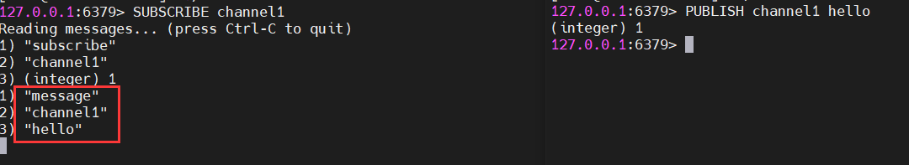
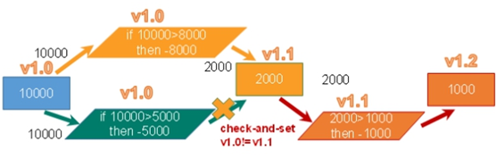

可以结合我之前写的几篇Redis的文章一起看。[点击这里](https://blog.csdn.net/a_helloword/category_7726785.html)

### 1、Redis介绍及安装

#### 1.1 Redis概述

（1）Redis是一个开源的key-value存储系统。

（2）和Memcached类似，它支持存储的value类型相对更多，包括string(字符串)、list(链表)、set(集合)、zset(sorted set--有序集合)和hash(哈希类型)。

（3）这些数据类型都支持push/pop、add/remove、取交集和差集等丰富的操作，而且这些操作都是原子性的。

（4）在此基础上，Redis支持各种不同方式的排序。

（5）与memcached一样，为了保证效率，数据都是缓存在内存中。

（6）区别是Redis会周期性的把更新的数据写入磁盘或者把修改操作写入追加的记录文件。

（7）在此基础上实现了master-slave(主从)同步。

#### 1.2 应用场景

（1）配合关系型数据库做高速缓存

- 缓存高频次、热门访问的数据，降低数据库IO
- 在分布式架构中，做session共享。

（2）多样的数据结构存储持久化数据

- 最新N个数据  => 通过List实现按自然时间排序的数据。
- 排行榜、top N => 利用zset(有序集合)
- 时效性的数据，比如手机验证码 => Expire过期
- 计数器、秒杀 => 原子性，自增方法INCR、DECR
- 去除大量数据中的重复数据 => 利用Set集合
- 构建队列 => 利用List集合
- 发布订阅消息系统 => pub/sub模式

#### 1.3 Redis安装

[官网](https://redis.io/download)

Redis 官方不建议在 windows 下使用 Redis，所以官网没有 windows 版本可以下载。还好微软团队维护了开源的 windows 版本，虽然只有 3.2 版本，对于普通测试使用足够了。[windows版redis下载链接](https://github.com/MicrosoftArchive/redis/releases)

这里我们下载Linux版本的，下载完成后，放到Linux服务器上进行解压安装即可。

```shell
# 查看系统是否安装gcc
gcc --version
gcc (GCC) 4.8.5 20150623 (Red Hat 4.8.5-44)
Copyright © 2015 Free Software Foundation, Inc.

# 没安装先安装gcc
yum install gcc

# 解压到指定文件夹
tar -zxvf redis-6.2.5.tar.gz -C /usr/local/redis/

# 进入redis文件夹
cd /usr/local/redis/redis-6.2.5

# 编译
make

# 安装
make install
```

安装完成后，进入安装目录`/usr/local/bin`


- redis-benchmark：性能测试工具，可以在自己电脑行运行，看看电脑性能如何。
- redis-check-aof：修复有问题的AOF文件。
- redis-check-rdb：修复有问题的dump.rdb文件。
- redis-sentinel：Redis集群使用。
- redis-cli：Redis客户端，操作入口。
- redis-server：Redis服务器启动命令。

直接执行redis-server，是前台启动，关闭窗口或者退出后就会断开连接，一般使用后台启动。修改解压目录下的redis.conf

```conf
daemonize no  => daemonize yes
```

```shell
# 连接时指定配置文件
./redis-server /usr/local/redis/redis-6.2.5/redis.conf

ps -ef | grep redis
```


#### 1.4 相关知识介绍

（1）Redis默认有16个数据库。下标从0开始，通过`select index`命令选择不同的数据库，默认使用0号数据库。

（2）所有库有相同的密码。

（3）Redis是单线程 + 多路IO复用技术。

多路复用是指使用一个线程来检查多个文件描述符（socket）的就绪状态，比如调用select和poll函数，传入多个文件描述符，如果有一个文件描述符就绪，则返回，否则阻塞直到超时。得到就绪状态后进行真正的操作可以在同一个线程里执行，也可以启动线程执行（比如使用线程池）。

串行 vs 多线程 + 锁（memcached） vs 单线程 + 多路IO复用（Redis）

与memcached三点不同：支持多数据类型、支持持久化、单线程 + IO多路复用


### 2、常用五大数据类型

#### 2.1 Redis键（key）

```shell
# 设置键值对
127.0.0.1:6379> set key 1
OK

# 查看当前库的所有key
127.0.0.1:6379> keys *
1) "key"

# 判断某个key是否存在
127.0.0.1:6379> exists key
(integer) 1

# 删除指定的key
127.0.0.1:6379> del key
(integer) 1

# 根据value选择非阻塞删除，仅将key从keyspace元数据删除，真正的删除会在后续异步执行
127.0.0.1:6379> unlink key
(integer) 1

# 给key设置过期时间，单位秒，到期后自动删除
127.0.0.1:6379> expire key 10
(integer) 1

# 查看键还有多少s过期，-1永不过期，-2已过期
127.0.0.1:6379> ttl key
(integer) -2

# 查看当前数据库的key的数量
127.0.0.1:6379> dbsize
(integer) 0

# 清空当前数据库
127.0.0.1:6379> flushdb
OK

# 清空所有库
127.0.0.1:6379> flushall
OK
```

#### 2.2 Redis字符串（string）

##### 2.2.1 简介

String是Redis最基本的类型，一个key对应一个value。

String类型是二进制安全的，意味着Redis的string可以包含任何数据，比如jpg图片或者序列化的对象。

String类型是Redis最基本的数据类型，一个Redis中字符串value最多可以是512M。

##### 2.2.2 常用命令

（1）**set key value**：添加键值对


*NX：当数据库中key不存在时，可以将key-value添加数据库。

*XX：当数据库中key存在时，可以将key-value添加数据库，与NX参数互斥。

*EX：key的超时秒数。

*PX：key的超时毫秒数，与EX互斥。

（2）**get key**：查询对应键值

（3）**append key value**：将给定的value追加到原值的末尾，返回新的value的长度

（4）**strlen key**：获得值的长度

（5）**setnx key value**：只有key不存在时，才设置key的值

（6）**incr key**：将key中存储的**数字**值自增1，只能对数字值操作，如果为空，新增值为1

（7）**decr key**：将key中存储的**数字**值减1，只能对数字值操作，如果为空，新增值为-1

（8）**incrby / decrby key 步长**：将key中存储的数字值增减自定义步长。 

INCR key等命令都是原子操作，这种操作一旦开始，就会一直运行到结束，中间不会有任何context switch（切换到另一个线程）。

**Redis单命令的原子性主要得益于Redis的单线程**。

（9）**mset key1 value1 key2 value2 ...**

同时设置一个或多个key-vaue对

（10）**mget key1 key2 key3** ...

同时获取一个或多个value

（11）**msetnx key1 value1 key2 value2 ...**

同时设置一个或多个key-value对，当且仅当所有给定的key都不存在。原子性，有一个存在则都失效。

（12）**getrange key 起始位置 结束位置**

获取值的范围，类似java的substring，包含起始和结束位置

（13）**setrange key 起始位置 value**

用value覆盖key所存储的字符串值，从起始位置开始（索引从0开始）

（14）**setex key 过期时间 value**

设置键值的同时，设置过期时间，单位秒

（15）**getset key value**

以旧换新，设置新值同时返回旧值

##### 2.2.3 数据结构

String的数据结构为简单动态字符串（Simple Dynamic String，SDS），是可以修改的字符串，内部结构实现上类似Java的ArrayList，采用预分配冗余空间的方式来减少内存的频繁分配。


如图所示，内部为当前字符串实际分配的空间capacity一般要高于实际字符串长度len，当字符串长度小于1M时，扩容都是加倍现有的空间，如果超过1M，扩容时一次只会多扩1M的空间。需要注意的是字符串最大长度为512M。

#### 2.3 Redis列表（List）

##### 2.3.1 简介

单键多值。

Redis列表是简单的字符串列表，按照插入顺序排序，你可以添加一个元素列表的头部（左边）或者尾部（右边）。

它的底层实际是个双向链表，对两端的操作性能很高，通过索引下标的操作中间的节点性能会较差。


##### 2.3.2 常用命令

（1）**lpush/rpush key value1 value2 value3 ...**

从左边/右边插入一个或多个值。

（2）**lpop/rpop key**

从左边/右边吐出一个值。值在键在，值光键亡。

（3）**rpoplpush key1 key2**

从key1列表右边吐出一个值插到key2列表左边。

（4）**lrange key start stop**

按照索引下标获得元素（从左到右）。0, -1表示获取所有

（5）**lindex key index**

按照索引下标获得元素（从左往右）

（6）**llen key**

获得列表长度

（7）**linsert key before value newvalue**

在value后面插入newvalue

（8）**lrem key n value**

从左边删除n个value（从左往右）

（9）**lset key index value**

将列表key下标为index的值替换为value

##### 2.3.3 数据结构

List的数据结构为快速链表quickList。

首先在列表元素较少的情况下会使用一块连续的内存存储，这个结构是ziplist，即压缩列表。它将所有的元素紧挨着一起存储，分配的是一块连续的内存。

当数据量比较多的时候才会改为quickList，因为普通的链表需要的附件指针空间太大，会比较浪费空间。比如这个列表里存的只是int类型的数据，结构上还需要两个额外的指针prev和next。


Redis将链表和ziplist结合起来组成了quicklist，也就是将多个ziplist使用双向指针串起来使用，这样既满足了快速的插入删除性能，又不会出现太大的空间冗余。

#### 2.4 Redis集合（Set）

##### 2.4.1 简介

Redis set对外提供的功能与list类似，是一个列表，特殊之处在于set是可以自动去重的。当你需要存储一个列表数据又不希望出现重复数据时，set是一个很好的选择。并且set提供了判断某个元素是否在一个set集合里的方法，这是list所没有的。

Redis的set是string类型的无序集合，它底层其实是一个value为null的hash表，所以添加、删除、查找的复杂度都是O(1)。

##### 2.4.2 常用命令

（1）**sadd key value1 value2 ...**

将一个或者多个member元素加入到集合key中，已经存在的member元素将被忽略。

（2）**smembers key**

取出该集合的所有值。

（3）**sismember key value**

判断集合key中是否还有该value值，有返回1，没有返回0。

（4）**scard key**

返回该集合的元素个数。

（5）**srem key value1 value2 ...**

删除集合中的某个元素。

（6）**spop key**

随机从该集合中吐出一个值。

（7）**srandmember key n**

随机从该集合中取出n个值，不会从集合中删除。

（8）**smove source destination value**

把集合中一个值从一个集合移动到另一个集合。

（9）**sinter key1 key2** 

返回两个集合的交集。

（10）**sunion key1 key2**

返回两个集合的并集。

（11）**sdiff key1 key2**

返回两个集合的差集。

##### 2.4.3 数据结构

set数据结构是dict字典，字典使用hash表实现的。

Java中的HashSet内部实现是使用HashMap，只不过所有的value都指向同一个对象。Redis的set结构也一样，他的内部也使用hash结构，所有的value都指向同一个内部值。

#### 2.5 Redis哈希（Hash）

##### 2.5.1 简介

Redis hash是一个键值对集合，String类型的field和value的映射表，特别适合存储对象，类似于Java里的Map<String, Object>。

##### 2.5.2 常用命令

（1）**hset key field:value**

给key集合中的field键赋值value。

（2）**hget key field**

从key集合中取出field的值。

（3）**hmset key field1 value1 field2 value2 ...**

批量设置hash的值。

（4）**hexists key field**

查看哈希表key中，给定filed是否存在。

（5）**hkeys key**

列出该hash集合中的所有field。

（6）**hvals key**

列表该hash集合中的所有value。

（7）**hincrby key field increment**

为哈希表key中的域field的值加上增加1

（8）**hsetnx key field value**

将哈希表key中的field的值设置为value，当且仅当域field不存在。

##### 2.5.3 数据结构

Hash类型对应的数据结构是两种：ziplist（压缩列表），hashtable（哈希表）。当field-value长度较短并且个数较少时，使用ziplist，否则使用hashtable。

#### 2.6 Redis有序集合（zset）

##### 2.6.1 简介

Redis有序集合zset和普通集合set非常相似，是一个**没有重复元素**的字符串集合。不同之处是有序集合的每个成员都关联了一个**评分（score）**，这个评分被用来按照从最低分到最高分的方式排序集合中的成员。集合中的成员是唯一的，但评分可以重复。

因为元素是有序的，所以可以很快的根据评分或者次序（position）来获取一个范围的元素。

访问有序集合的中间元素也是非常快的，因此你能够使用有序集合作为一个没有重复成员的智能列表。

##### 2.6.2 常用命令

（1）**zadd key score1 value1 score2 value2 ...**

将一个或多个member元素及其score值加入到有序集合key中。

（2）**zrange key start stop [withscores]**

返回有序集key中，下标在[start, stop]之间的元素，带上withscores，可以让分数和值一起返回。

（3）**zrangebyscore key min max [withscores] [limit offset count]**

返回有序集合key中，所有score值介于[min, max]之间的成员，有序集合成员按score值递增次序排列。

（4）**zrevrangebyscore key max min [withscores] [limit offset count]**

同上，但是从大到小排列。

（5）**zincrby key increment value**

为元素的score加上增量

（6）**zrem key value**

删除该集合下，指定值的元素

（7）**zcount key min max**

统计该集合，分数区间内的元素个数

（8）**zrank key value**

返回该值在集合中的排名，从0开始

##### 2.6.3 数据结构

SortedSet(zset)是Redis提供的一个非常特别的数据结构，一方面它等价于Java的数据结构Map<String, Double>，可以给每一个元素value赋予一个权重score，另一方面它又类似于TreeSet，内部的元素会按照权重score进行排序，可以得到每个元素的名次，还可以通过score的范围来获取元素的列表。

zset底层使用了两个数据结构

（1）hash。hash的作用就是关联元素value和权重score，保障元素value的唯一性，可以通过元素value找到对应的score值。

（2）跳跃表。跳跃表的目的在于给元素value排序，根据score的范围获取元素列表。

跳跃表效率堪比红黑树，但实现比红黑树简单。

比如我们要查询出51这个元素，对于有序链表


只能从第一个元素开始依次往后遍历，需要6次查找才能找到。

在跳跃表中


从第2层开始，1节点比51小，向后比较

21节点比51小，继续向后比较，后面为NULL，所以从21节点向下到第一层

在第1层，41节点比51小，继续往后找，61节点比51大，所以从41往下到第0层

在第0层，51节点为要查找的节点

共查找5次

### 3、Redis发布订阅

#### 3.1 什么是发布订阅

Redis发布订阅（pub/sub）是一种消息通信模式：发布者（pub）发布消息，订阅者（sub）接收消息。

Redis客户端可以订阅任意数量的频道。

#### 3.2 Redis的发布订阅

（1）客户端可以订阅频道


（2）当给这个频道发送消息后，消息就会发送给订阅的客户端


#### 3.3 Redis命令行实现发布订阅



发布的消息没有持久化，所以订阅一个通道后，只能收到该通道订阅后的消息，不能收到订阅之前的消息。

### 4、Redis新数据类型

#### 4.1 Bitmaps

##### 4.1.1 介绍

关于bitmap的介绍，可以看我的这篇文章，这里就不多说了，[点击链接](https://blog.csdn.net/a_helloword/article/details/117792734)

Redis提供了Bitmaps这个数据类型可以实现对位的操作：

（1）Bitmaps本身不是一种数据类型，实际上它就是字符串（key - value），但是它可以对字符串的位进行操作。

（2）Bitmaps单独提供了一套命令，所以在Redis中使用Bitmaps和使用字符串的方法不太相同。可以把Bitmaps想象成一个以位为单位的数组，数组的每个单元只能存储0和1，数组的下标在Bitmaps中叫做偏移量。


##### 4.1.2 常用命令

（1）**setbit key offset value**

设置bitmaps中某个偏移量的值（0或者1），偏移量从0开始。

比如记录每个独立用户是否访问过网站存放在Bitmaps中， 将访问的用户记做1， 没有访问的用户记做0， 用偏移量作为用户的id。

设置键的第offset个位的值（从0算起） ， 假设现在有20个用户，userid=1， 6， 11， 15， 19的用户对网站进行了访问， 那么当前Bitmaps初始化结果如图


unique:users:20210801代表2021-08-01这天的独立访问用户的Bitmaps

注意：很多应用的用户id以一个指定数字（例如10000） 开头， 直接将用户id和Bitmaps的偏移量对应势必会造成一定的浪费， 通常的做法是每次做setbit操作时将用户id减去这个指定数字。

在第一次初始化Bitmaps时， 假如偏移量非常大， 那么整个初始化过程执行会比较慢， 可能会造成Redis的阻塞。

（2）**getbit key offset**

获取Bitmaps中某个偏移量的值。从0来说算


（3）**bitcount key [start end]**

统计字符串从start**字节**到end**字节**比特值为1的数量。一般情况下，给定的整个字符串都会被进行计数，通过指定额外的 start 或 end 参数，可以让计数只在特定的位上进行。start 和 end 参数的设置，都可以使用负数值：比如 -1 表示最后一个位，而 -2 表示倒数第二个位，start、end 是指bit组的字节的下标数，二者皆包含。


 注意：redis的setbit设置或清除的是bit位置，而bitcount计算的是byte位置。

（4）**bitop and(or/not/xor) destkey [key…]**

bitop是一个复合操作， 它可以做多个Bitmaps的and（交集） 、 or（并集） 、 not（非） 、 xor（异或） 操作并将结果保存在destkey中。

##### 4.1.3 Bitmaps和set对比

假设网站有1亿用户， 每天独立访问的用户有5千万， 如果每天用集合类型和Bitmaps分别存储活跃用户可以得到表


很明显， 这种情况下使用Bitmaps能节省很多的内存空间， 尤其是随着时间推移节省的内存还是非常可观的


但Bitmaps并不是万金油， 假如该网站每天的独立访问用户很少， 例如只有10万（大量的僵尸用户） ， 那么两者的对比如下表所示， 很显然， 这时候使用Bitmaps就不太合适了， 因为基本上大部分位都是0。


#### 4.2 HyperLogLog

##### 4.2.1 简介

在工作当中，我们经常会遇到与统计相关的功能需求，比如统计网站PV（PageView页面访问量）,可以使用Redis的incr、incrby轻松实现。

但像UV（UniqueVisitor，独立访客）、独立IP数、搜索记录数等需要去重和计数的问题如何解决？这种求集合中不重复元素个数的问题称为基数问题。

解决基数问题有很多种方案：

（1）数据存储在MySQL表中，使用distinct count计算不重复个数

（2）使用Redis提供的hash、set、bitmaps等数据结构来处理

以上的方案结果精确，但随着数据不断增加，导致占用空间越来越大，对于非常大的数据集是不切实际的。

能否能够降低一定的精度来平衡存储空间？Redis推出了HyperLogLog

Redis HyperLogLog 是用来做基数统计的算法，HyperLogLog 的优点是，在输入元素的数量或者体积非常非常大时，计算基数所需的空间总是固定的、并且是很小的。

在 Redis 里面，每个 HyperLogLog 键只需要花费 12 KB 内存，就可以计算接近 2^64 个不同元素的基数。这和计算基数时，元素越多耗费内存就越多的集合形成鲜明对比。

但是，因为 HyperLogLog 只会根据输入元素来计算基数，而不会储存输入元素本身，所以 HyperLogLog 不能像集合那样，返回输入的各个元素。

什么是基数?

比如数据集 {1, 3, 5, 7, 5, 7, 8}， 那么这个数据集的基数集为 {1, 3, 5 ,7, 8}, 基数(不重复元素)为5。 基数估计就是在误差可接受的范围内，快速计算基数。

##### 4.2.2 相关命令

（1）**pfadd key element [element ...]**

添加指定元素到HyperLogLog中。


将所有元素添加到指定HyperLogLog数据结构中。如果执行命令后HLL估计的近似基数发生变化，则返回1，否则返回0。

（2）**pfcount key [key ...]**

计算HLL的近似基数。可以计算多个HLL，比如用HLL存储每天的UV，计算一周的UV可以使用7天的UV合并计算即可

（3）**pfmerge destkey sourcekey [sourcekey ...]**

将一个或多个HLL合并后的结果存储在另一个HLL中，比如每月活跃用户可以使用每天的活跃用户来合并计算可得

#### 4.3 Geospatial

##### 4.3.1 介绍

Redis 3.2 中增加了对GEO类型的支持。GEO，Geographic，地理信息的缩写。该类型，就是元素的2维坐标，在地图上就是经纬度。redis基于该类型，提供了经纬度设置，查询，范围查询，距离查询，经纬度Hash等常见操作。

##### 4.3.2 相关命令

（1）**geoadd key longitude latitude member [longitude latitude member...]**

添加地理位置（经度，纬度，名称）


两极无法直接添加，一般会下载城市数据，直接通过 Java 程序一次性导入。

有效的经度从 -180 度到 180 度。有效的纬度从 -85.05112878 度到 85.05112878 度。

当坐标位置超出指定范围时，该命令将会返回一个错误。

已经添加的数据，是无法再次往里面添加的。

（2）**geopos key member [member ...]**

获取指定地区的坐标值。


（3）**geodist key member1 member2 [m|km|ft|mi]**

获取两个位置之间的直线距离。


单位：

- m 表示单位为米[默认值]。
- km 表示单位为千米。
- mi 表示单位为英里。
- ft 表示单位为英尺。

如果用户没有显式地指定单位参数， 那么 GEODIST 默认使用米作为单位

（4）**georadius key longitude latitude radius m|km|ft|mi**

以给定的经纬度为中心，找出某一半径内的元素.


### 5、Redis事务

#### 5.1 定义

Redis事务是一个单独的隔离操作：事务中的所有命令都会序列化、按顺序地执行。事务在执行的过程中，不会被其他客户端发送来的命令请求所打断。

Redis事务的主要作用就是**串联多个命令防止别的命令插队**。

#### 5.2 相关命令

**Multi、Exec、discard**。

从输入Multi命令开始，输入的命令都会依次进入命令队列中，但不会执行，直到输入Exec后，Redis会将之前的命令队列中的命令依次执行。

组队的过程中可以通过discard来放弃组队。 


**组队**中某个命令出现了报告错误，**执行**时整个的所有队列都会被取消。


如果执行阶段某个命令报出了错误，则只有报错的命令不会被执行，而其他的命令都会执行，不会回滚。


#### 5.3 事务冲突问题

账户里有10000块钱，一个请求想给金额减8000，一个请求想给金额减5000，一个请求想给金额减1000


最后余额变成了负数。

（1）**悲观锁解决**


**悲观锁(Pessimistic Lock)**, 顾名思义，就是很悲观，每次去拿数据的时候都认为别人会修改，所以每次在拿数据的时候都会上锁，这样别人想拿这个数据就会block直到它拿到锁。**传统的关系型数据库里边就用到了很多这种锁机制**，比如**行锁**，**表锁**等，**读锁**，**写锁**等，都是在做操作之前先上锁。

（2）**乐观锁解决**



**乐观锁(Optimistic Lock),** 顾名思义，就是很乐观，每次去拿数据的时候都认为别人不会修改，所以不会上锁，但是在更新的时候会判断一下在此期间别人有没有去更新这个数据，可以使用版本号等机制。**乐观锁适用于多读的应用类型，这样可以提高吞吐量**。Redis就是利用这种check-and-set（CAS）机制实现事务的。

#### 5.4 乐观锁在Redis中的使用

通过`WATCH key [key ...]`实现。

在执行multi之前，先执行watch key1 [key2],可以监视一个(或多个) key ，如果在事务执行之前这个(或这些) key 被其他命令所改动，那么事务将被打断。


可以通过`unwatch`命令取消对key的监视，如果在执行 WATCH 命令之后，EXEC 命令或DISCARD 命令先被执行了的话，那么就不需要再执行UNWATCH 了。

#### 5.5 Redis事务三特性

（1）**单独的隔离操作** 

事务中的所有命令都会序列化、按顺序地执行。事务在执行的过程中，不会被其他客户端发送来的命令请求所打断。 

（2）**没有隔离级别的概念** 

队列中的命令没有提交之前都不会实际被执行，因为事务提交前任何指令都不会被实际执行

（3）**不保证原子性** 

事务中如果有一条命令执行失败，其后的命令仍然会被执行，没有回滚 

### 6、Redis结合秒杀案例

#### 6.1 代码准备

关于秒杀的代码，可以参考我之前写的，[点击这里](https://blog.csdn.net/a_helloword/category_7741603.html)

不同的是，我们这里把库存和秒杀成功的用户信息放在redis里。秒杀成功，库存-1，用户+1。


#### 6.2 模拟并发秒杀

使用apache bench(简称ab)模拟并发请求，关于ab工具，[点击这里](https://www.jianshu.com/p/43d04d8baaf7)

centos可以直接通过`yum install httpd-tools`命令进行安装，安装完成后，使用命令模拟并发

```shell
# 2000个请求，200的并发
ab -n 2000 -c 200 -k -p ~/postfile -T application/x-www-form-urlencoded http://ip:port/path
```

假设我们的商品数量为10，那么执行上面的命令后，再查看redis中商品的数量，已经变成负数了，这就是**超卖问题**。

多个请求同时访问，读取库存发现都还充足，于是发起库存-1请求，最后变成了负库存。


在并发过程中，可能还会出现jedis连接超时的请求，因为大量请求同时访问redis，可能需要等待连接，在这过程中出现连接超时的情况。

#### 6.3 并发带来的问题

（1）**jedis连接失败的问题**

对于jedis连接超时的问题，可以使用**连接池**解决。合理设置连接池的容量大小，循环使用jedis实例，节省资源。

```java
public class JedisPoolUtil {
    public static JedisPool getJedisPoolInstance() {
        if (null == jedisPool) {
            synchronized (JedisPoolUtil.class) {
                if (null == jedisPool) {
                    JedisPoolConfig	poolConfig = new JedisPoolConfig();
                    poolConfig.setMaxTotal(200);
                    poolConfig.setMaxIdle(32);
                    poolConfig.setMaxWaitMillis(100 * 1000);
                    poolCOnfig.setBlockWhenExhausted(true);
                    poolConfig.setTestOnBorrow(true);

                    JedisPool = new JedisPool(poolConfig, "120.0.0.1", 6379, 60000);
                }
            }
        }
        return jedisPool;
    }
}
```

链接池参数：

（1）MaxTotal：控制一个pool可分配多少个jedis实例，通过pool.getResource()来获取；如果赋值为-1，则表示不限制；如果pool已经分配了MaxTotal个jedis实例，则此时pool的状态为exhausted。

（2）maxIdle：控制一个pool最多有多少个状态为idle(空闲)的jedis实例；

（3）MaxWaitMillis：表示当borrow一个jedis实例时，最大的等待毫秒数，如果超过等待时间，则直接抛JedisConnectionException；

（4）testOnBorrow：获得一个jedis实例的时候是否检查连接可用性（ping()）；如果为true，则得到的jedis实例均是可用的；

使用的时候

```java
JedisPool jedisPool = JedisPoolUtil.getJedisPoolInstance();
Jedis jedis = jedisPool.getResource();
// ....
jedis.close();
```

（2）**超卖问题**

可以利用乐观锁淘汰用户，从而解决超卖问题。


前面已经讲过可以使用redis的`watch`命令监视key，这样在操作key的时候，就会检查版本号是否一致，如果不一致就不让执行操作。

体现在代码中

```java
//增加乐观锁
jedis.watch(qtkey);
 
//3.判断库存
String qtkeystr = jedis.get(qtkey);
if(qtkeystr == null || "".equals(qtkeystr.trim())) {
    System.out.println("未初始化库存");
    jedis.close();
    return false ;
}
 
int qt = Integer.parseInt(qtkeystr);
if(qt <= 0) {
    System.err.println("已经秒光");
    jedis.close();	
    return false;
}

//增加事务
Transaction multi = jedis.multi();
 
//4.减少库存
//jedis.decr(qtkey);
multi.decr(qtkey);
 
//5.加人
//jedis.sadd(usrkey, uid);
multi.sadd(usrkey, uid);
 
//执行事务
List<Object> list = multi.exec();
 
//判断事务提交是否失败
if(list == null || list.size() == 0) {
    System.out.println("秒杀失败");
    jedis.close();
    return false;
}
System.err.println("秒杀成功");
jedis.close();
```

（3）**乐观锁带来的库存遗留问题**

加大商品的库存，比如库存500个，然后使用ab模拟并发，2000个请求，300的并发，执行可能会出现库存还有剩余的情况。这就是乐观锁带来的库存遗留问题。

比如同时有多个请求读取库存500，版本号1.0，最终一个请求秒杀成功，库存-1，版本号+1，那么其他同时读取的请求都秒杀失败，这到最后就可能出现库存遗留。

这个问题可以使用Lua脚本来解决。如何使用可以看我这篇文章。[点击这里](https://blog.csdn.net/a_helloword/article/details/81878759)

Lua 是一个小巧的[脚本语言](http://baike.baidu.com/item/脚本语言)，Lua脚本可以很容易的被C/C++ 代码调用，也可以反过来调用C/C++的函数，Lua并没有提供强大的库，一个完整的Lua解释器不过200k，所以Lua不适合作为开发独立应用程序的语言，而是作为嵌入式脚本语言。很多应用程序、游戏使用LUA作为自己的嵌入式脚本语言，以此来实现可配置性、可扩展性。

将复杂的或者多步的redis操作，写为一个脚本，一次提交给redis执行，减少反复连接redis的次数。提升性能。LUA脚本是类似redis事务，有一定的原子性（**如果脚本内某条命令执行出错，前面执行的命令不会回滚**），不会被其他命令插队，可以完成一些redis事务性的操作。

但是注意redis的lua脚本功能，只有在Redis 2.6以上的版本才可以使用。

通过lua脚本解决**争抢问题**，实际上是**redis** **利用其单线程的特性，用任务队列的方式解决多任务并发问题**。


lua脚本如下

```lua
local userid=KEYS[1]; 
local prodid=KEYS[2];
local qtkey="sk:"..prodid..":qt";
local usersKey="sk:"..prodid.":usr'; 
local userExists=redis.call("sismember",usersKey,userid);
if tonumber(userExists)==1 then 
  return 2;
end
local num= redis.call("get" ,qtkey);
if tonumber(num)<=0 then 
  return 0; 
else 
  redis.call("decr",qtkey);
  redis.call("sadd",usersKey,userid);
end
return 1;
```

秒杀失败返回2，秒杀成功返回1，秒杀结束返回0，然后在代码中调用Lua脚本即可。

### 7、Redis持久化

#### 7.1 Redis持久化之RDB

##### 7.1.1 是什么

[官方文档](https://redis.io/topics/persistence)

RDB（Redis DataBase）在指定的时间间隔内将内存中的数据集快照写入磁盘， 也就是行话讲的Snapshot快照，它恢复时是将快照文件直接读到内存里。


##### 7.1.2 如何进行持久化

Redis会单独创建（fork）一个子进程来进行持久化，先将数据写入到一个临时文件中，等持久化过程结束了，再把这个临时文件替换上次持久化好的文件。整个过程中，**主进程**是不进行任何IO操作的。这就确保了极高的性能，如果需要进行大规模数据的恢复，并且对于数据恢复的完整性不是非常敏感，那么RDB方式比AOF方式更加高效。RDB的缺点是**最后一次持久化后的数据可能丢失**。


（1）fork的作用是复制一个与当前进程一样的进程，新进程的所有数据（变量、环境变量、程序计数器等）都和原进程一致，但是是一个全新的进程，并作为原进程的子进程。

（2）在Linux程序中，fork会产生一个和父进程完全相同的子进程，但子进程在此后多会exec系统调用，出于效率考虑，Linux引入**写时复制**（COW）技术

（3）一般情况父进程和子进程会共用同一段物理内存，只有进程空间各段的内容发生变化时，才会将父进程的内容复制一份给子进程。

##### 7.1.3 相关配置

安装目录下的`redis.conf`

（1）**dump.rdb文件**


在redis.conf中配置文件名称，默认为dump.rdb

（2）**配置文件的路径**


默认是启动客户端的当前路径

（3）**如何触发RDB快照**


- 格式：**save 秒钟 写操作次数**

- RDB是整个内存压缩过的Snapshot，RDB的数据结构，可以配置复合的快照触发条件。

- 默认是1分钟内修改了1万次，或5分钟内改了10次，或15分钟内改了1次，就会触发。

- 禁用：不设置save指令，或者给save指令传入空字符串。

- `save`命令 VS `bgsave`命令

`save`：只管保存，其他不管，全部阻塞。手动保存，不建议。

`bgsave`：Redis会在后台异步进行快照操作，快照同时还可以响应客户端请求。

可以通过`lastsave`命令获取最后一次成功执行快照的时间。

（4）**flushall命令**

执行`flushall`命令，也会产生`dump.rdb`文件，但里面是空的，无意义。

（5）**stop-writes-on-bgsave-error**


当Redis无法写入磁盘的时候，直接关闭Redis的写操作。推荐yes

（6）**rdbcompression压缩文件**


对于存储到磁盘中的快照，可以设置是否进行压缩存储。如果设置为yes，redis会采用LZF算法进行压缩。

如果不想消耗CPU来进行压缩的话，可以设置关闭此功能。推荐yes

（7）**rdbchecksum检查完整性**


存储快照后，还可以让redis使用CRC64算法来进行数据校验。但是这样做会增加大约10%的性能消耗，如果希望获得最大的性能提升，可以关掉此功能。推荐yes

##### 7.1.4 RDB文件使用

先通过`config get dir`查询rdb文件的目录，将*.rdb文件拷贝到别的地方。

rdb恢复：

- 关闭redis
- 先把备份的文件拷贝到工作目录下`cp dump2.rdb dump.rdb`
- 启动redis，备份数据会直接加载

##### 7.1.5 RDB的优劣势

（1）优势

- 适合大规模的数据恢复。
- 对数据完整性和一致性要求不高更适合使用。
- 节省磁盘空间。
- 恢复速度快。


（2）劣势

- fork的时候，内存中的数据被克隆了一份，大致2倍的膨胀性需要考虑。
- 虽然redis在fork时使用了写时拷贝技术，但如果数据庞大时还是比较消耗性能。
- 一定间隔时间做一次备份，如果redis意外down掉的话，会丢失最后一次快照后的所有修改。

##### 7.1.6 停止RDB持久化

动态停止：`redis-cli config set save ""`

##### 7.1.7 总结


#### 7.2 Redis持久化之AOF

##### 7.2.1 是什么

AOF（Append Only File），以日志的形式来记录每个写操作（增量保存），将Redis执行过的所有写指令记录下来（读操作不记录），只允许追加文件但不能改写文件。redis启动之初会读取该文件重新构建数据，换言之，redis重启的话就根据日志文件的内容写指令从前往后执行一次以完成数据的恢复工作。

##### 7.2.2 AOF持久化流程

（1）客户端的请求写命令会被append追加到AOF缓冲区内。

（2）AOF缓冲区根据AOF持久化策略[always, everysec, no]，将操作sync同步到磁盘的AOF文件中。

（3）AOF文件大小超过重写策略或手动重写时，会对AOF文件rewrite重写，压缩AOF文件的容量。

（4）Redis服务重启时，会重新load加载AOF文件中的写操作达到数据恢复的目的。


##### 7.2.3 AOF默认不开启

可以在`redis.conf`中配置文件的名称，默认为`appendonly.aof`。AOF文件的保存路径，和RDB的路径一样。

##### 7.2.4 AOF和RDB同时开启，redis听谁的

AOF和RDB同时开启，系统默认取AOF的数据。

##### 7.2.5 AOF启动/修复/恢复

AOF的备份机制和性能虽然和RDB不同，但是备份和恢复的操作同RDB一样，都是拷贝备份文件，需要恢复时再拷贝到Redis工作目录下，其实系统即加载。

（1）正常恢复

- 修改默认的appendonly no，改为yes
- 将有数据的aof文件复制一份保存到对应目录（查看目录：config get dir）
- 恢复：重启redis然后重新加载

（2）异常恢复

- 修改默认的appendonly no，改为yes
- 如果AOF文件被损坏，通过`redis-check-aof --fix appendonly.aof`进行恢复。`redis-check-aof`在安装小节说过，就在安装目录下。
- 备份被写坏的AOF文件
- 恢复：重启redis，然后重新加载

##### 7.2.6 AOF同步频率设置

（1）appendfsync always

始终同步，每次Redis的写入都会立刻计入日志，性能较差但数据完整性比较好。

（2）appendfsync everysec

每秒同步，每秒计入日志一次，如果宕机，本秒的数据可能丢失。

（3）appendfsync no

redis不主动进行同步，把同步时机交给操作系统。

##### 7.2.7 rewrite压缩

（1）**是什么**

AOF采用文件追加方式，文件会越来越大为避免出现此种情况，新增了重写机制, 当AOF文件的大小超过所设定的阈值时，Redis就会启动AOF文件的内容压缩， 只保留可以恢复数据的最小指令集，可以使用命令bgrewriteaof。

（2）**重写原理，如何实现重写**

AOF文件持续增长而过大时，会fork出一条新进程来将文件重写(也是先写临时文件最后再rename)，redis4.0版本后的重写，就是把rdb 的快照，以二级制的形式附在新的aof头部，作为已有的历史数据，替换掉原来的流水账操作。

如果 `no-appendfsync-on-rewrite=yes `,不写入aof文件只写入缓存，用户请求不会阻塞，但是在这段时间如果宕机会丢失这段时间的缓存数据。（降低数据安全性，提高性能）

如果 `no-appendfsync-on-rewrite=no`, 还是会把数据往磁盘里刷，但是遇到重写操作，可能会发生阻塞。（数据安全，但是性能降低）

（3）**触发机制，何时重写**

Redis会记录上次重写时的AOF大小，默认配置是当AOF文件大小是上次rewrite后大小的一倍且文件大于64M时触发。

重写虽然可以节约大量磁盘空间，减少恢复时间。但是每次重写还是有一定的负担的，因此设定Redis要满足一定条件才会进行重写。 

`auto-aof-rewrite-percentage`：设置重写的基准值，文件达到100%时开始重写（文件是原来重写后文件的2倍时触发）

`auto-aof-rewrite-min-size`：设置重写的基准值，最小文件64MB。达到这个值开始重写。

例如：文件达到70MB开始重写，降到50MB，下次什么时候开始重写？100MB

系统载入时或者上次重写完毕时，Redis会记录此时AOF大小，设为base_size,

如果Redis的AOF当前大小>= base_size +base_size*100% (默认)且当前大小>=64mb(默认)的情况下，Redis会对AOF进行重写。 

（4）**重写流程**

- bgrewriteaof触发重写，判断是否当前有bgsave或bgrewriteaof在运行，如果有，则等待该命令结束后再继续执行。
- 主进程fork出子进程执行重写操作，保证主进程不会阻塞。
- 子进程遍历redis内存中数据到临时文件，客户端的写请求同时写入aof_buf缓冲区和aof_rewrite_buf重写缓冲区保证原AOF文件完整以及新AOF文件生成期间的新的数据修改动作不会丢失。
- 1).子进程写完新的AOF文件后，向主进程发信号，父进程更新统计信息。2).主进程把aof_rewrite_buf中的数据写入到新的AOF文件。
- 使用新的AOF文件覆盖旧的AOF文件，完成AOF重写。


##### 7.2.8 优势和劣势

（1）优势


- 备份机制更稳健，丢失数据概率更低。
- 可读的日志文件，通过操作AOF稳健，可以处理误操作。

（2）劣势

- 比起rdb占用更多的磁盘空间。
- 恢复备份速度更慢。
- 每次读写都同步的话，有一定的性能压力。

##### 7.2.9 总结


#### 7.3 持久化总结

**用AOF还是RDB**

官方推荐两个都启用。如果对数据不敏感，可以选单独用RDB。不建议单独用 AOF，因为可能会出现Bug。如果只是做纯内存缓存，可以都不用。


- RDB持久化方式能够在指定的时间间隔对你的数据进行快照存储

- AOF持久化方式记录每次对服务器写的操作,当服务器重启的时候会重新执行这些命令来恢复原始的数据,AOF命令以redis协议追加保存每次写的操作到文件末尾. 
- Redis还能对AOF文件进行后台重写,使得AOF文件的体积不至于过大
- 只做缓存：如果你只希望你的数据在服务器运行的时候存在,你也可以不使用任何持久化方式.
- 同时开启两种持久化方式

在这种情况下,当redis重启的时候会优先载入AOF文件来恢复原始的数据, 因为在通常情况下AOF文件保存的数据集要比RDB文件保存的数据集要完整.

RDB的数据不实时，同时使用两者时服务器重启也只会找AOF文件。那要不要只使用AOF呢？ 

建议不要，因为RDB更适合用于备份数据库(AOF在不断变化不好备份)， 快速重启，而且不会有AOF可能潜在的bug，留着作为一个万一的手段。

- 性能建议

因为RDB文件只用作后备用途，建议只在Slave上持久化RDB文件，而且只要15分钟备份一次就够了，只保留save 900 1这条规则。如果使用AOF，好处是在最恶劣情况下也只会丢失不超过两秒数据，启动脚本较简单只load自己的AOF文件就可以了。  

代价，一是带来了持续的IO，二是AOF rewrite的最后将rewrite过程中产生的新数据写到新文件造成的阻塞几乎是不可避免的。只要硬盘许可，应该尽量减少AOF  rewrite的频率，AOF重写的基础大小默认值64M太小了，可以设到5G以上。  默认超过原大小100%大小时重写可以改到适当的数值。  

### 8、主从复制

参考：[Redis主从同步](https://blog.csdn.net/a_helloword/article/details/82119091)、[Redis哨兵（Sentinel）模式](https://blog.csdn.net/a_helloword/article/details/82155794)

#### 8.1 是什么

主机数据更新后根据配置和策略， 自动同步到备机的master/slaver机制，**Master以写为主，Slave以读为主**。


#### 8.2 能干啥

（1）读写分离，性能扩展。

（2）容灾快速恢复。

#### 8.3 怎么玩

（1）复制三份`redis.conf`，作为一主两从的配置文件。

（2）三份配置文件命名`redis6380.conf`，`redis6381.conf`，`redis6382.conf`，写入公共内容

```conf
# 引入默认配置文件
include /usr/local/redis/redis.conf
# 设置端口号
port xxxx
# 指定rdb文件名
dbfilename dumpxxxx.rdb
```

6380端口作为主，其他两个作为从

（3）**从机配置文件**

```conf
# 设置从机的优先级，值越小，优先级越高，用于选举主机时使用，默认100
slave-priority xx
# 主机地址
slaveof 127.0.0.1 6380
```

配置主机地址，也可以在连接redis-cli后，通过命令`slaveof 127.0.0.1 6380`进行设置，但关闭后重新连接配置又失效了，写入配置文件就可以持久。

（4）**启动三个redis服务**

```shell
redis-server redis6380.conf
redis-server redis6381.conf
redis-server redis6382.conf
```

（5）**启动客户端**

```shell
redis-cli -p 6380
redis-cli -p 6381
redis-cli -p 6382
```

启动客户端后，可以使用命令`info replication`命令查看主从复制的相关信息。

（6）**测试**

- 在主机上写入数据，在从机上可以读取到数据。
- 尝试在从机上写数据，报错，因为**从机只能读不能写**。
- 主机挂掉后，重启，一切如初。
- 从机挂掉后，重启，数据还在。

#### 8.4 常用三招

##### 8.4.1 一主两仆

切入点问题？slave1、slave2是从头开始复制还是从切入点开始复制?比如从k4进来，那之前的k1,k2,k3是否也可以复制？---**之前的也可以复制**

从机是否可以写？set可否？  ---**不可写**

主机shutdown后情况如何？从机是上位还是原地待命？ ---**原地待命**

主机又回来了后，主机新增记录，从机还能否顺利复制？   ---**能**

其中一台从机down后情况如何？依照原有它能跟上大部队吗？  ---**能**

看主从复制的过程和原理如下：


（1）无论何时都要先保证主服务器的开启，开启主服务器后，从服务器通过命令或者重启配置项就能同步到主服务器。

（2）当从服务器启动时，会根据配置决定是否使用当前数据响应客户端，然后发送SYNC命令。当主服务器接收到同步命令后，就使用bgsave命令备份数据，但并不会拒绝客户端的写，而是把客户端的写命令缓存在缓冲区，从服务器在没收到主服务器的快照文件前， 根据配置决定使用现有数据响应客户端或者拒绝。
（bgsave命令是一个异步命令，也就是系统将启动另一个进程，把Redis的数据保存到对应的数据文件中。它和save命令最大的不同是不会阻塞客户端的写入。默认情况下，如果Redis执行bgsave命令失败，Redis将停止接受写操作，这样能让用户知道数据不能正确持久化到磁盘。）

（3）bgsave命令被主服务器执行完后，开始向从服务器发送备份文件，这个时候从服务器会丢弃所有现有命令，开始载入发送的快照文件。

（4）当主服务器发送完备份文件后，从服务器就会执行这些写入命令，此时就会把bgsave执行之后的缓冲区内的写命令发送给从服务器，从服务器完成备份文件解析，就开始正常接收命令。

（5）缓存区的命令发送完毕后，主服务器每执行一条写命令，就向从服务器发送该条写命令，保证主从同步。

只是在主服务器同步到从服务器的过程中，需要备份文件，所以在配置的时候，一般需要预留一些内存空间给主服务器，用以腾出空间执行备份命令。

还有可能出现多个从服务器同时向主服务器发送SYNC命令


如果出现多台同步，可能会出现频繁等待和频繁操作bgsave命令的情况，导致主机在较长时间性能不佳，这个时候可以考虑主从链进行同步的机制，以减少这种可能。

##### 8.4.2 薪火相传

上一个Slave可以是下一个slave的Master，Slave同样可以接收其他 slaves的连接和同步请求，那么该slave作为了链条中下一个的master, 可以有效减轻master的写压力,去中心化降低风险。

用 `slaveof <ip> <port>`

中途变更转向:会清除之前的数据，重新建立拷贝最新的

风险是一旦某个slave宕机，后面的slave都没法备份

主机挂了，从机还是从机，无法写数据了

##### 8.4.3 反客为主

当一个master宕机后，后面的slave可以立刻升为master，其后面的slave不用做任何修改。

用 `slaveof no one`  将从机变为主机。

但是这样需要我们人工干预，不方便也不及时，一般是还有哨兵模式，关于哨兵模式，可以参考上面的文章链接，这里不赘述了。

哨兵选举新的主机时，会按照下面的优先级进行选取：

- **选择优先级靠前的**：优先级在redis.conf中默认：`replica-priority 100`（不同版本存在差异，之前叫`slave-priority 100`），值越小优先级越高
- **选择偏移量最大的**：偏移量是指获得原主机数据最全的
- **选择runid最小的从服务**：每个redis实例启动后都会随机生成一个40位的runid

### 9、Redis集群


### 10、Redis应用问题解决

#### 10.1 缓存穿透

##### 10.1. 什么是缓存穿透


key对应的数据在数据源并不存在，每次针对此key的请求从缓存获取不到，请求都会压到数据源，从而可能压垮数据源。比如用一个不存在的用户id获取用户信息，不论缓存还是数据库都没有，若黑客利用此漏洞进行攻击可能压垮数据库。

##### 10.2 解决方案

一个一定不存在缓存及查询不到的数据，由于缓存是不命中时被动写的，并且出于容错考虑，如果从存储层查不到数据则不写入缓存，这将导致这个不存在的数据每次请求都要到存储层去查询，失去了缓存的意义。

（1）  **对空值缓存：**如果一个查询返回的数据为空（不管是数据是否不存在），我们仍然把这个空结果（null）进行缓存，设置空结果的过期时间会很短，最长不超过五分钟

（2）  **设置可访问的名单（白名单）：**

使用bitmaps类型定义一个可以访问的名单，名单id作为bitmaps的偏移量，每次访问和bitmap里面的id进行比较，如果访问id不在bitmaps里面，进行拦截，不允许访问。

（3）  **采用布隆过滤器**：(布隆过滤器（Bloom Filter）是1970年由布隆提出的。它实际上是一个很长的二进制向量(位图)和一系列随机映射函数（哈希函数）。布隆过滤器可以用于检索一个元素是否在一个集合中。它的优点是空间效率和查询时间都远远超过一般的算法，缺点是有一定的误识别率和删除困难。)将所有可能存在的数据哈希到一个足够大的bitmaps中，一个一定不存在的数据会被 这个bitmaps拦截掉，从而避免了对底层存储系统的查询压力。

**（4）**  **进行实时监控：**当发现Redis的命中率开始急速降低，需要排查访问对象和访问的数据，和运维人员配合，可以设置黑名单限制服务

#### 10.2 缓存击穿

##### 10.2.1 什么是缓存击穿


key对应的数据存在，但在redis中过期，此时若有大量并发请求过来，这些请求发现缓存过期一般都会从后端DB加载数据并回设到缓存，这个时候大并发的请求可能会瞬间把后端DB压垮。

##### 10.2.2 解决方案

key可能会在某些时间点被超高并发地访问，是一种非常“热点”的数据。这个时候，需要考虑一个问题：缓存被“击穿”的问题。

（1）**预先设置热门数据**：在redis高峰访问之前，把一些热门数据提前存入到redis里面，加大这些热门数据key的时长

（2）**实时调整**：现场监控哪些数据热门，实时调整key的过期时长

（3）**使用锁**：

- 在缓存失效的时候（判断拿出来的值为空），不是立即去load db。
- 先使用缓存工具的某些带成功操作返回值的操作（比如Redis的SETNX）去set一个mutex key
- 当操作返回成功时，再进行load db的操作，并回设缓存,最后删除mutex key；
- 当操作返回失败，证明有线程在load db，当前线程睡眠一段时间再重试整个get缓存的方法。


#### 10.3 缓存雪崩

##### 10.3.1 什么是缓存雪崩

key对应的数据存在，但在redis中过期，此时若有大量并发请求过来，这些请求发现缓存过期一般都会从后端DB加载数据并回设到缓存，这个时候大并发的请求可能会瞬间把后端DB压垮。

缓存雪崩与缓存击穿的区别在于这里针对很多key缓存，前者则是某一个key。

正常访问


缓存失效瞬间


##### 10.3.2 解决方案

缓存失效时的雪崩效应对底层系统的冲击非常可怕！

解决方案：

（1）**构建多级缓存架构**：nginx缓存 + redis缓存 +其他缓存（ehcache等）

（2）**使用锁或队列**：用加锁或者队列的方式保证来保证不会有大量的线程对数据库一次性进行读写，从而避免失效时大量的并发请求落到底层存储系统上。不适用高并发情况

（3）**设置过期标志更新缓存**：记录缓存数据是否过期（设置提前量），如果过期会触发通知另外的线程在后台去更新实际key的缓存。

（4）**将缓存失效时间分散开**：比如我们可以在原有的失效时间基础上增加一个随机值，比如1-5分钟随机，这样每一个缓存的过期时间的重复率就会降低，就很难引发集体失效的事件。