我要跑vue项目，所以我要搞vue。

### 1、环境搭建

进入[node官网](https://nodejs.org/en/download/)下载对应版本的node，一步步安装即可。

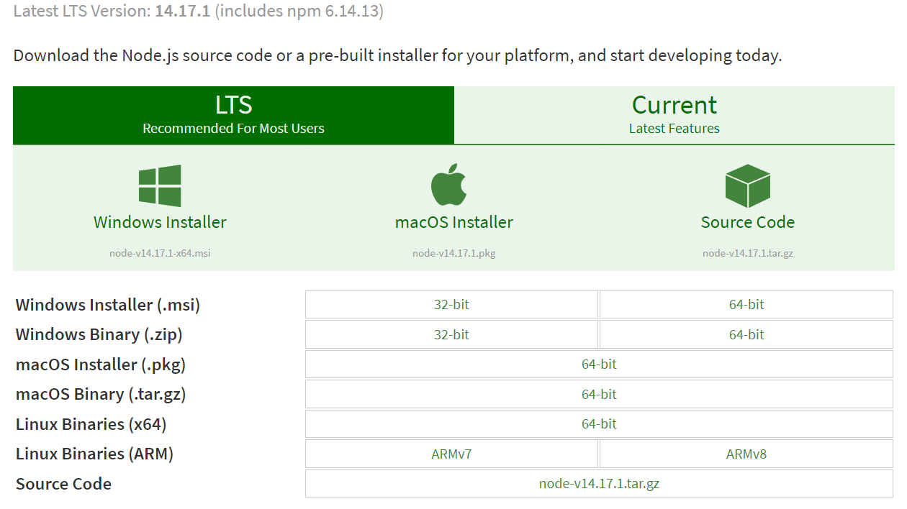

安装会自动配置路径和npm包管理环境，通过`node -v`进行验证

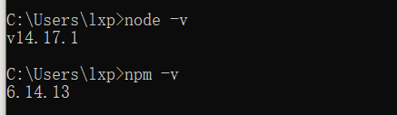

### 2、安装vue-cli脚手架

Vue CLI文档：https://cli.vuejs.org/zh/guide/

```cmd
# 卸载旧版本
npm uninstall vue-cli -g
# 指定地址安装，加快速度
npm install -g @vue/cli --registry=https://registry.npm.taobao.org
```

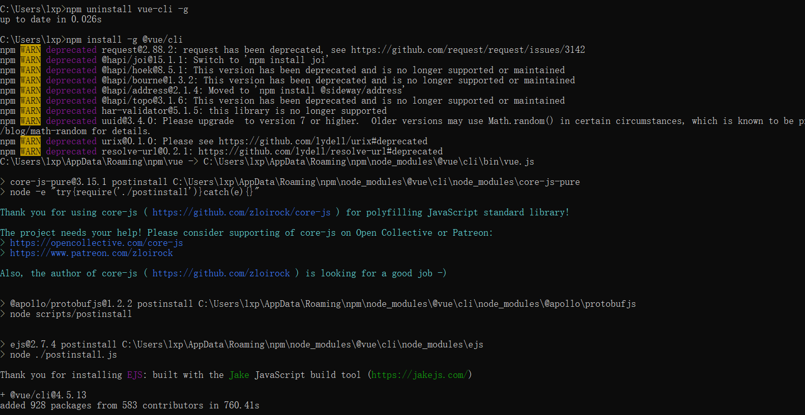

安装完成后，进行验证

```cmd
vue
vue --version
```

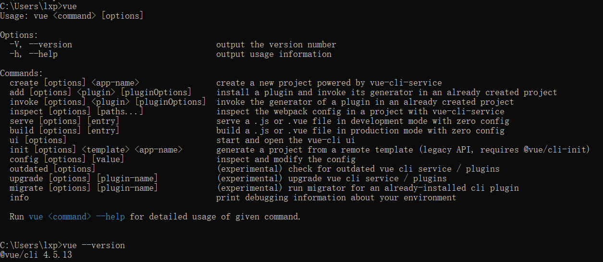

完成上面的步骤后，我们就可以使用vue-cli新建项目。

### 3、使用vue-cli新建项目

#### 3.1 图形化界面创建项目

使用`vue ui`命令，会打开一个网页

```cmd
C:\Users\lxp>vue ui
🚀  Starting GUI...
🌠  Ready on http://localhost:8000
```

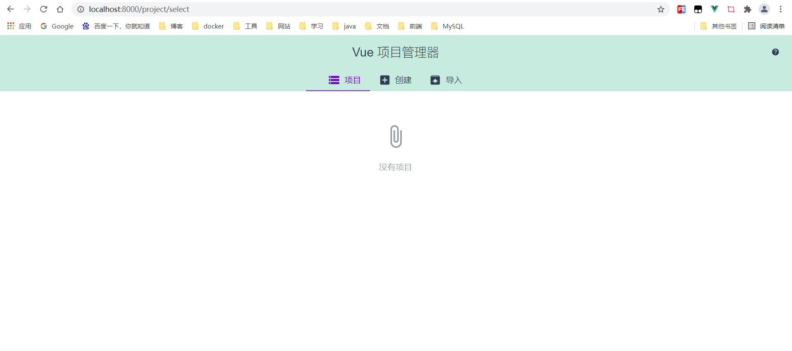

按提示走应该就可以了，下面试试命令行创建。

#### 3.2 命令行创建项目

运行以下命令来创建一个新项目：

```cmd
vue create 项目名
```

首先进入某个特定文件夹，输入创建命令，注意**项目名不能包含大写字母**

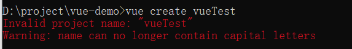

命令输入正确的情况下， 会让你选择创建vue-2还是vue-3的项目，根据需要选择，然后等待项目创建成功

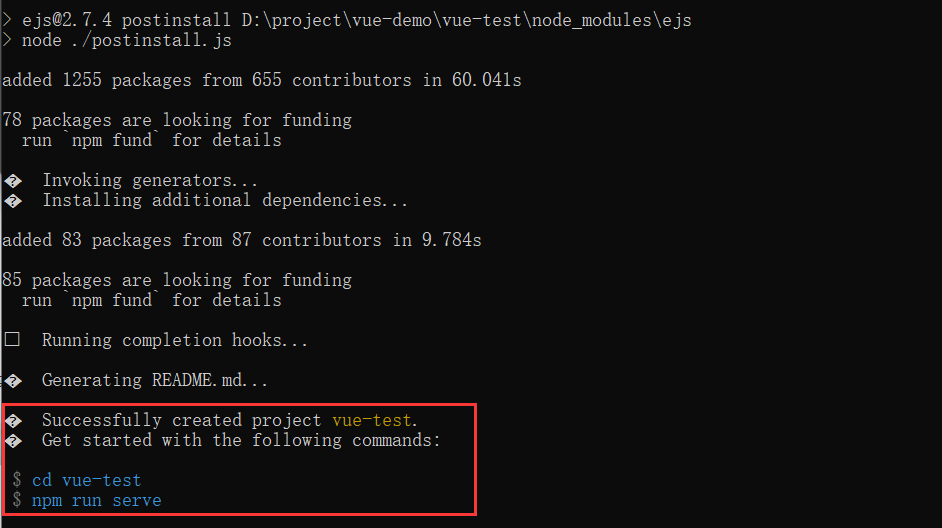

生成的项目结构如下

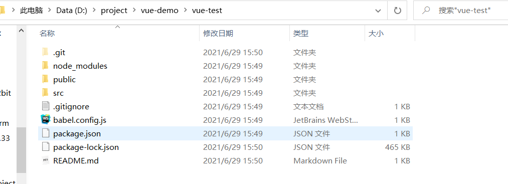

根据它的提示启动项目

```cmd
cd vue-test
# 等同于npm run dev
npm run serve
```

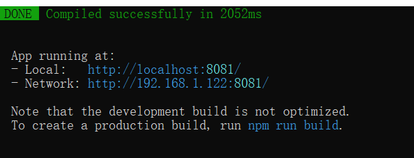

访问即可

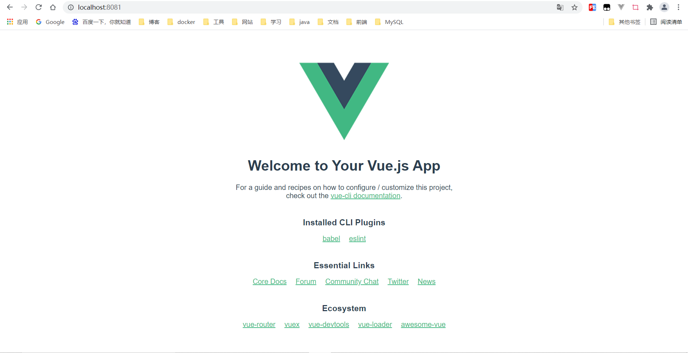

---

一般我们在创建项目的时候会手动选择配置


**space键选择自定义的配置**

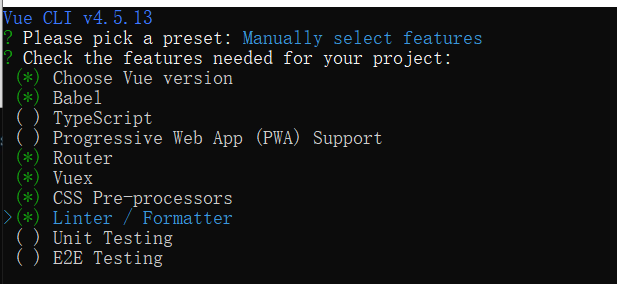

（1）**enter键继续，选择vue的版本**

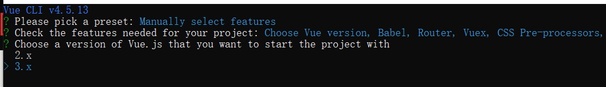

（2）**选择是否使用路由 history router**

**Y选择使用history，但需要对后端配置；n选择的是hash，即地址栏URL中的 # 符号，它会在url中加一个#，比如：[http://localhost](http://localhost/):8080/#/Global，这里我选择n**

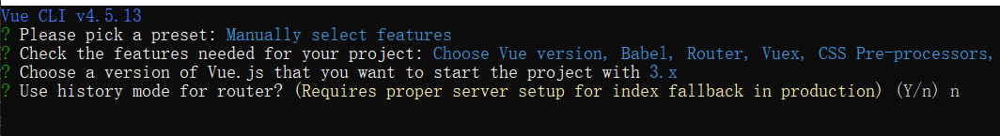

（3）**选择css 的预处理器**

**node-sass是实时自动编译的，dart-sass需要保存后才会编译**，我选 Sass/SCSS (with dart-sass)

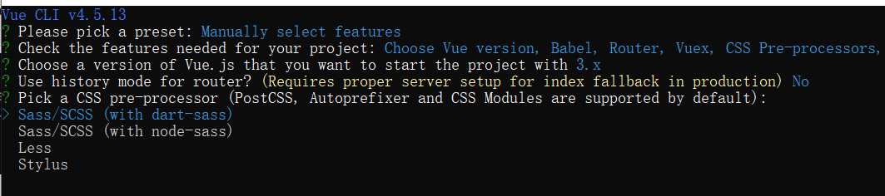

（4）**选择 ESLint 代码校验规则**

会提供一个插件化的javascript代码检测工具，ESLint + Prettier 是使用较多的

（5）**选择什么时候进行代码校验**

Lint on save 保存就检查，Lint and fix on commit 是当 fix 或 commit 时检查，我选择Lint on save

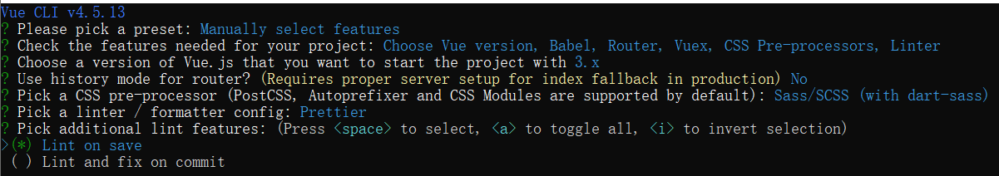

（6）**选择如何存放配置**

- **In dedicated config files 存放到config独立文件中**
- **In package.json 存放到 package.json 中**

这里选择In package.json

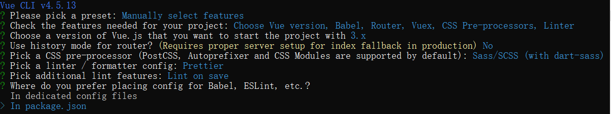

（7）**是否保存当前的配置**

N 不记录，如果选择 Y 需要输入保存名字，我选择N不记录

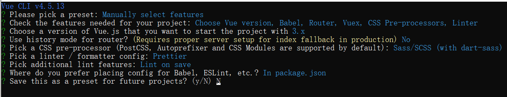

（8）**等待项目创建**

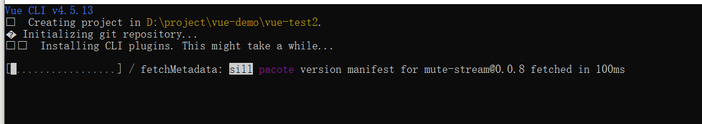