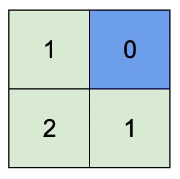

#### 1765. 地图中的最高点

#### 2022-01-29 LeetCode每日一题

链接：https://leetcode-cn.com/problems/map-of-highest-peak/

标签：**广度优先搜索、数组、矩阵**

> 题目

给你一个大小为 m x n 的整数矩阵 isWater ，它代表了一个由 陆地 和 水域 单元格组成的地图。

- 如果 isWater[i][j] == 0 ，格子 (i, j) 是一个 陆地 格子。
- 如果 isWater[i][j] == 1 ，格子 (i, j) 是一个 水域 格子。

你需要按照如下规则给每个单元格安排高度：

- 每个格子的高度都必须是非负的。
- 如果一个格子是是 水域 ，那么它的高度必须为 0 。
- 任意相邻的格子高度差 至多 为 1 。当两个格子在正东、南、西、北方向上相互紧挨着，就称它们为相邻的格子。（也就是说它们有一条公共边）

找到一种安排高度的方案，使得矩阵中的最高高度值 最大 。

请你返回一个大小为 m x n 的整数矩阵 height ，其中 height[i][j] 是格子 (i, j) 的高度。如果有多种解法，请返回 任意一个 。

示例 1：



```java
输入：isWater = [[0,1],[0,0]]
输出：[[1,0],[2,1]]
解释：上图展示了给各个格子安排的高度。
蓝色格子是水域格，绿色格子是陆地格。
```

示例 2：


```java
输入：isWater = [[0,0,1],[1,0,0],[0,0,0]]
输出：[[1,1,0],[0,1,1],[1,2,2]]
解释：所有安排方案中，最高可行高度为 2 。
任意安排方案中，只要最高高度为 2 且符合上述规则的，都为可行方案。
```


提示：

- m == isWater.length
- n == isWater[i].length
- 1 <= m, n <= 1000
- isWater[i][j] 要么是 0 ，要么是 1 。
- 至少有 1 个水域格子。

> 分析

根据题意，水域的高度必须为0。

可以使用一个二维数组height记录水域的高度，高度全部初始化为-1。先把所有的水域赋值为0，并且把相关坐标放入队列。之后从队列中取出元素，并且更新该元素相邻节点的高度（只更新高度为-1的节点），并且把更新节点的坐标加入队列中。当队列为空的时候，此时的height就是一种方案。

> 编码

```java
class Solution {
    public int[][] highestPeak(int[][] isWater) {
        int m = isWater.length, n = isWater[0].length;
        int[][] heights = new int[m][n];
        // 当前点的4个相邻点坐标移动
        int[] x = {0, 0, -1, 1};
        int[] y = {-1, 1, 0, 0};
        Queue<int[]> queue = new LinkedList<>();

        for (int i = 0; i < m; i++) {
            for (int j = 0; j < n; j++) {
                // 初始化为-1
                heights[i][j] = -1;
                // 水域，高度必须为1
                if (isWater[i][j] == 1) {
                    heights[i][j] = 0;
                    // 加入队列
                    queue.offer(new int[]{i, j});
                }
            }
        }

        while (!queue.isEmpty()) {
            int[] node = queue.poll();
            // 以node点为中心，计算相邻格子的高度
            for (int i = 0; i < 4; i++) {
                int tx = node[0] + x[i];
                int ty = node[1] + y[i];
                if (tx < 0 || tx >= m || ty < 0 || ty >= n || heights[tx][ty] != -1) {
                    continue;
                }
                heights[tx][ty] = heights[node[0]][node[1]] + 1;
                queue.offer(new int[]{tx, ty});
            }
        }

        return heights;
    }
}
```

