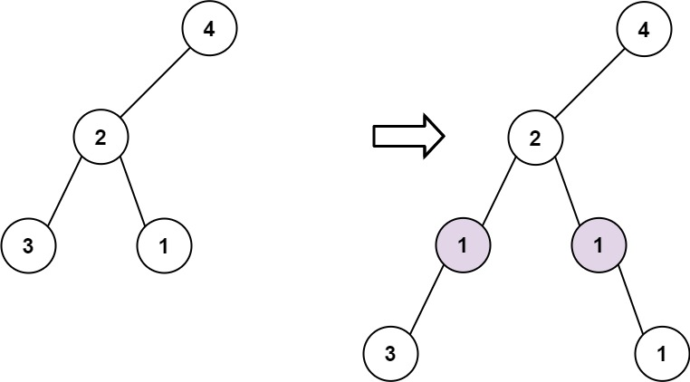

#### 623. 在二叉树中增加一行

#### 2022-08-05 LeetCode每日一题

链接：https://leetcode.cn/problems/add-one-row-to-tree/

标签：**二叉树、深度优先搜索、广度优先搜索**

> 题目

给定一个二叉树的根 root 和两个整数 val 和 depth ，在给定的深度 depth 处添加一个值为 val 的节点行。

注意，根节点 root 位于深度 1 。

加法规则如下:

- 给定整数 depth，对于深度为 depth - 1 的每个非空树节点 cur ，创建两个值为 val 的树节点作为 cur 的左子树根和右子树根。
- cur 原来的左子树应该是新的左子树根的左子树。
- cur 原来的右子树应该是新的右子树根的右子树。
- 如果 depth == 1 意味着 depth - 1 根本没有深度，那么创建一个树节点，值 val 作为整个原始树的新根，而原始树就是新根的左子树。


示例 1:


```java
输入: root = [4,2,6,3,1,5], val = 1, depth = 2
输出: [4,1,1,2,null,null,6,3,1,5]
```

示例 2:



```java
输入: root = [4,2,null,3,1], val = 1, depth = 3
输出:  [4,2,null,1,1,3,null,null,1]
```


提示:

- 节点数在 [1, 10 ^ 4] 范围内
- 树的深度在 [1, 10 ^ 4]范围内
- -100 <= Node.val <= 100
- -10 ^ 5 <= val <= 10 ^ 5
- 1 <= depth <= the depth of tree + 1

> 分析

思路比较简单，只需要在第depth - 1层和depth层之间插入一行即可。遍历到第depth - 1层时，对于该层的每一个节点node，新生成一个左节点left和右节点right，`left.left = node.left; node.left = left; right.right = node.right; node.right = right;`

可以使用DFS或BFS。

> 编码

```java
/**
 * Definition for a binary tree node.
 * public class TreeNode {
 *     int val;
 *     TreeNode left;
 *     TreeNode right;
 *     TreeNode() {}
 *     TreeNode(int val) { this.val = val; }
 *     TreeNode(int val, TreeNode left, TreeNode right) {
 *         this.val = val;
 *         this.left = left;
 *         this.right = right;
 *     }
 * }
 */
class Solution {
    public TreeNode addOneRow(TreeNode root, int val, int depth) {
        if (depth == 1) {
            TreeNode node = new TreeNode(val);
            node.left = root;
            return node;
        }

        Queue<TreeNode> queue = new LinkedList<>();
        queue.offer(root);
        int level = 1;
        while (level < depth && !queue.isEmpty()) {
            int len = queue.size();
            if (level == depth - 1) {
                for (int i = 0; i < len; i++) {
                    TreeNode node = queue.poll();
                    TreeNode left = new TreeNode(val);
                    left.left = node.left;
                    node.left = left;
                    TreeNode right = new TreeNode(val);
                    right.right = node.right;
                    node.right = right;
                }
                break;
            }

            for (int i = 0; i < len; i++) {
                TreeNode node = queue.poll();
                if (node.left != null) {
                    queue.offer(node.left);
                }
                if (node.right != null) {
                    queue.offer(node.right);
                }
            }
            level++;
        }

        return root;
    }
}
```


```java
/**
 * Definition for a binary tree node.
 * public class TreeNode {
 *     int val;
 *     TreeNode left;
 *     TreeNode right;
 *     TreeNode() {}
 *     TreeNode(int val) { this.val = val; }
 *     TreeNode(int val, TreeNode left, TreeNode right) {
 *         this.val = val;
 *         this.left = left;
 *         this.right = right;
 *     }
 * }
 */
class Solution {
    public TreeNode addOneRow(TreeNode root, int val, int depth) {
        if (depth == 1) {
            return new TreeNode(val, root, null);
        }
    
        dfs(root, val, depth, 1);
        return root;
    }

    private void dfs(TreeNode root, int val, int depth, int curDepth) {
        if (root == null) {
            return;
        }

        if (curDepth == depth - 1) {
            root.left = new TreeNode(val, root.left, null);
            root.right = new TreeNode(val, null, root.right);
        }

        dfs(root.left, val, depth, curDepth + 1);
        dfs(root.right, val, depth, curDepth + 1);
    }
}
```

