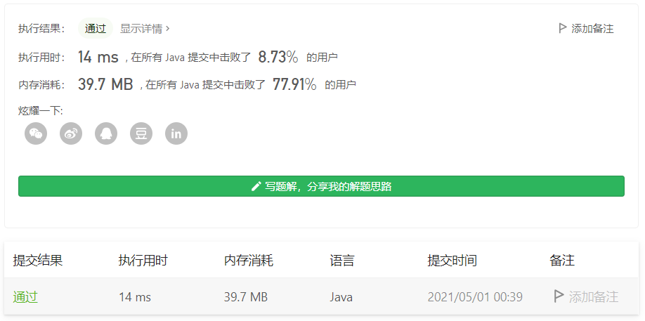

#### 690. 员工的重要性

链接：https://leetcode-cn.com/problems/employee-importance/

```java
/*
// Definition for Employee.
class Employee {
    public int id;
    public int importance;
    public List<Integer> subordinates;
};
*/

class Solution {
    public int getImportance(List<Employee> employees, int id) {
        int res = 0;
        Queue<Employee> queue = new LinkedList<>();
        queue.offer(getEmployee(employees, id));

        while (!queue.isEmpty()) {
            int len = queue.size();
            for (int i = 0; i < len; i++) {
                Employee employee = queue.poll();
                res += employee.importance;

                for (Integer childId : employee.subordinates) {
                    queue.offer(getEmployee(employees, childId));
                }
            }
        }

        return res;
    }

    private Employee getEmployee(List<Employee> employees, int id) {
        for (Employee e : employees) {
            if (e.id == id) {
               return e;
            }
        }

        return null;
    }
}
```

