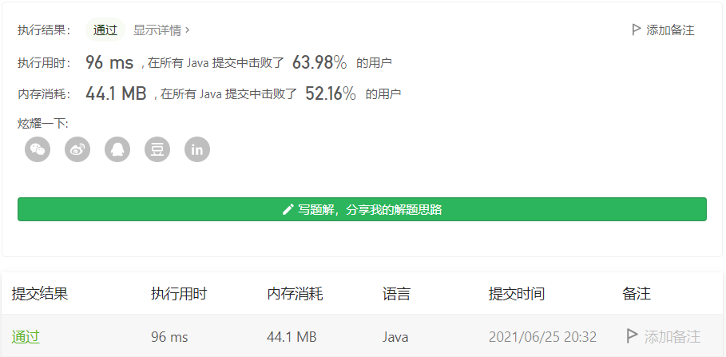
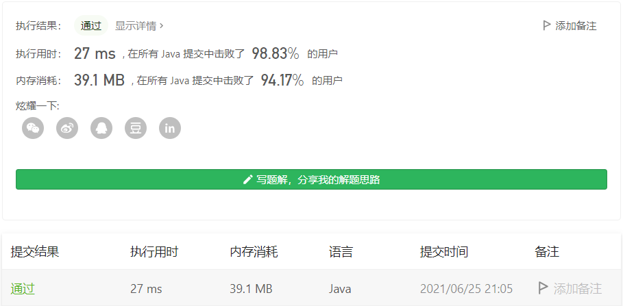

#### 752. 打开转盘锁

#### 2021-06-25 LeetCode每日一题

链接：https://leetcode-cn.com/problems/open-the-lock/

标签：**广度优先搜索、数组、哈希表、字符串**

> 题目

你有一个带有四个圆形拨轮的转盘锁。每个拨轮都有10个数字： '0', '1', '2', '3', '4', '5', '6', '7', '8', '9' 。每个拨轮可以自由旋转：例如把 '9' 变为 '0'，'0' 变为 '9' 。每次旋转都只能旋转一个拨轮的一位数字。

锁的初始数字为 '0000' ，一个代表四个拨轮的数字的字符串。

列表 deadends 包含了一组死亡数字，一旦拨轮的数字和列表里的任何一个元素相同，这个锁将会被永久锁定，无法再被旋转。

字符串 target 代表可以解锁的数字，你需要给出解锁需要的最小旋转次数，如果无论如何不能解锁，返回 -1 。

```java
输入：deadends = ["0201","0101","0102","1212","2002"], target = "0202"
输出：6
解释：
可能的移动序列为 "0000" -> "1000" -> "1100" -> "1200" -> "1201" -> "1202" -> "0202"。
注意 "0000" -> "0001" -> "0002" -> "0102" -> "0202" 这样的序列是不能解锁的，
因为当拨动到 "0102" 时这个锁就会被锁定。

输入: deadends = ["8888"], target = "0009"
输出：1
解释：
把最后一位反向旋转一次即可 "0000" -> "0009"。

输入: deadends = ["8887","8889","8878","8898","8788","8988","7888","9888"], target = "8888"
输出：-1
解释：
无法旋转到目标数字且不被锁定。

输入: deadends = ["0000"], target = "8888"
输出：-1
```

提示：

- 1 <= deadends.length <= 500
- deadends[i].length == 4
- target.length == 4
- target 不在 deadends 之中
- target 和 deadends[i] 仅由若干位数字组成

> 分析

最短路问题，通常使用BFS求解。BFS就不用多说了，树的层序遍历就是使用BFS，这里可以把初始状态0000作为树的根节点，而0000的下一可能状态就是它的子节点，这就相当于一棵树的层序遍历了。每遍历一层，则旋转次数加1，找到题目给定的target时，所在的那层即需要旋转的最小次数。

如果在数据量大的情况下，可能一层就会有几万几十万个节点，一般BFS解法，可能会空间爆炸。这种情况可以使用**双向BFS**解决，**同时从两个方向开始搜索，一旦搜索到相同的值，意味着找到了一条联通起点和终点的最短路径**。

「双向 BFS」的基本实现思路如下：

- 创建「两个队列」分别用于两个方向的搜索；
- 创建「两个哈希表」用于「解决相同节点重复搜索」和「记录转换次数」；
- 为了尽可能让两个搜索方向“平均”，每次从队列中取值进行扩展时，先判断哪个队列容量较少；
- 如果在搜索过程中「搜索到对方搜索过的节点」，说明找到了最短路径。

「双向 BFS」基本思路对应的伪代码大致如下：

```java
d1、d2 为两个方向的队列
m1、m2 为两个方向的哈希表，记录每个节点距离起点的
    
// 只有两个队列都不空，才有必要继续往下搜索
// 如果其中一个队列空了，说明从某个方向搜到底都搜不到该方向的目标节点
while(!d1.isEmpty() && !d2.isEmpty()) {
    if (d1.size() < d2.size()) {
        update(d1, m1, m2);
    } else {
        update(d2, m2, m1);
    }
}

// update 为从队列 d 中取出一个元素进行「一次完整扩展」的逻辑
void update(Deque d, Map cur, Map other) {}
```

参考：https://leetcode-cn.com/problems/open-the-lock/solution/gong-shui-san-xie-yi-ti-shuang-jie-shuan-wyr9/

> 编码

**一般BFS**：

```java
class Solution {
    // 转盘向上拨动一次
    private String upOne(String str, int index) {
        char[] chs = str.toCharArray();
        if (chs[index] == '9') {
            chs[index] = '0';
        } else {
            chs[index] += 1;
        }
        
        return new String(chs);
    }

    // 转盘向下拨动一次
    private String downOne(String str, int index) {
        char[] chs = str.toCharArray();
        if (chs[index] == '0') {
            chs[index] = '9';
        } else {
            chs[index] -= 1;
        }
        
        return new String(chs);
    }

    public int openLock(String[] deadends, String target) {
        // 死亡数字
        Set<String> deadLock = new HashSet<>();
        // 已经转过的数字
        Set<String> visited = new HashSet<>();
        for (String str : deadends) {
            deadLock.add(str);
        }

        Queue<String> res = new LinkedList<>();
        res.offer("0000");
        visited.add("0000");
        int step = 0;

        while (!res.isEmpty()) {
            int len = res.size();

            // 当前队列中的所有节点向周围扩散
            for (int i = 0; i < len; i++) {
                String cur = res.poll();
                // 如果是死亡数字，则退出这次循环
                if (deadLock.contains(cur)) {
                    continue;
                }

                // 转到target，直接返回step即为最小旋转次数
                if (cur.equals(target)) {
                    return step;
                }

                // 对于当前节点，每个拨轮进行向上和向下转动
                for (int j = 0; j < 4; j++) {
                    String next = upOne(cur, j);
                    if (!visited.contains(next)) {
                        res.offer(next);
                        visited.add(next);
                    }

                    next = downOne(cur, j);
                    if (!visited.contains(next)) {
                        res.offer(next);
                        visited.add(next);
                    }
                }
            }

            // 增加步数
            step++;
        }

        // 如果穷举完还没有找到目标，则说明无法解锁
        return -1;
    }
}
```



**双向BFS**：

```java
class Solution {
    String t, s;
    Set<String> set = new HashSet<>();
    public int openLock(String[] _ds, String _t) {
        s = "0000";
        t = _t;
        if (s.equals(t)) return 0;
        for (String d : _ds) set.add(d);
        if (set.contains(s)) return -1;
        int ans = bfs();
        return ans;
    }
    int bfs() {
        // d1 代表从起点 s 开始搜索（正向）
        // d2 代表从结尾 t 开始搜索（反向）
        Deque<String> d1 = new ArrayDeque<>(), d2 = new ArrayDeque<>();
        /*
         * m1 和 m2 分别记录两个方向出现的状态是经过多少次转换而来
         * e.g.
         * m1 = {"1000":1} 代表 "1000" 由 s="0000" 旋转 1 次而来
         * m2 = {"9999":3} 代表 "9999" 由 t="9996" 旋转 3 次而来
         */
        Map<String, Integer> m1 = new HashMap<>(), m2 = new HashMap<>();
        d1.addLast(s);
        m1.put(s, 0);
        d2.addLast(t);
        m2.put(t, 0);

        /*
         * 只有两个队列都不空，才有必要继续往下搜索
         * 如果其中一个队列空了，说明从某个方向搜到底都搜不到该方向的目标节点
         * e.g. 
         * 例如，如果 d1 为空了，说明从 s 搜索到底都搜索不到 t，反向搜索也没必要进行了
         */
        while (!d1.isEmpty() && !d2.isEmpty()) {
            int t = -1;
            if (d1.size() <= d2.size()) {
                t = update(d1, m1, m2);
            } else {
                t = update(d2, m2, m1);
            }
            if (t != -1) return t;
        }
        return -1;       
    }
    int update(Deque<String> deque, Map<String, Integer> cur, Map<String, Integer> other) {
        String poll = deque.pollFirst();
        char[] pcs = poll.toCharArray();
        int step = cur.get(poll);
        // 枚举替换哪个字符
        for (int i = 0; i < 4; i++) {
            // 能「正向转」也能「反向转」，这里直接枚举偏移量 [-1,1] 然后跳过 0
            for (int j = -1; j <= 1; j++) {
                if (j == 0) continue;

                // 求得替换字符串 str
                int origin = pcs[i] - '0';
                int next = (origin + j) % 10;
                if (next == -1) next = 9;

                char[] clone = pcs.clone();
                clone[i] = (char)(next + '0');
                String str = String.valueOf(clone);

                if (set.contains(str)) continue;
                if (cur.containsKey(str)) continue;

                // 如果在「另一方向」找到过，说明找到了最短路，否则加入队列
                if (other.containsKey(str)) { 
                    return step + 1 + other.get(str);
                } else {
                    deque.addLast(str);
                    cur.put(str, step + 1);
                }
            }
        }
        return -1;
    }
}
```

