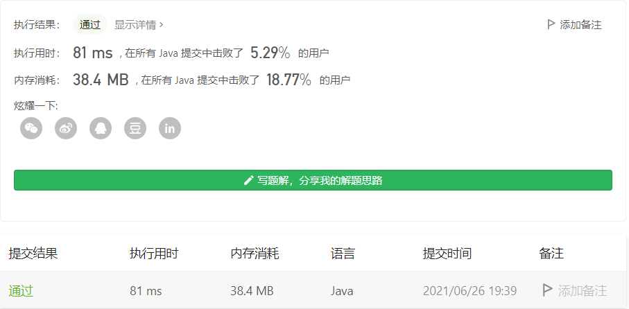

#### 773. 滑动谜题

#### 2021-06-26 LeetCode每日一题

链接：https://leetcode-cn.com/problems/sliding-puzzle/

标签：**广度优先搜索、数组、哈希表**

> 题目

在一个 2 x 3 的板上（board）有 5 块砖瓦，用数字 1~5 来表示, 以及一块空缺用 0 来表示.

一次移动定义为选择 0 与一个相邻的数字（上下左右）进行交换.

最终当板 board 的结果是 [[1,2,3],[4,5,0]] 谜板被解开。

给出一个谜板的初始状态，返回最少可以通过多少次移动解开谜板，如果不能解开谜板，则返回 -1 。

```java
输入：board = [[1,2,3],[4,0,5]]
输出：1
解释：交换 0 和 5 ，1 步完成
    
输入：board = [[1,2,3],[5,4,0]]
输出：-1
解释：没有办法完成谜板
    
输入：board = [[4,1,2],[5,0,3]]
输出：5
解释：
最少完成谜板的最少移动次数是 5 ，
一种移动路径:
尚未移动: [[4,1,2],[5,0,3]]
移动 1 次: [[4,1,2],[0,5,3]]
移动 2 次: [[0,1,2],[4,5,3]]
移动 3 次: [[1,0,2],[4,5,3]]
移动 4 次: [[1,2,0],[4,5,3]]
移动 5 次: [[1,2,3],[4,5,0]]

输入：board = [[3,2,4],[1,5,0]]
输出：14
```

**提示：**

- `board` 是一个如上所述的 2 x 3 的数组.
- `board[i][j]` 是一个 `[0, 1, 2, 3, 4, 5]` 的排列.

> 分析

最短路问题，通常使用BFS求解。BFS就不用多说了，树的层序遍历就是使用BFS，这里可以把输入值作为树的根节点，而根节点的下一可能状态（上下左右交换）就是它的子节点，这就相当于一棵树的层序遍历了。每遍历一层，则移动次数加1，找到题目给定的target（即[[1,2,3],[4,5,0]]）时，所在的那层即需要移动的最小次数。

这题如果单单要做出来是不难的，很平常的BFS就可以做出来，作为hard题来说不说太hard。但看到这100多行代码和5%的击败率时，不禁黯然泪下。


这题让我纠结的一个地方是二维数组转为一维数组还是字符串。

> 编码

```java
class Solution {
    public int slidingPuzzle(int[][] board) {
        Queue<String> queue = new LinkedList<>();
        // 记录已经访问过的组合
        List<String> visited = new LinkedList<>();
        String source = arrayToString(board);
        queue.offer(source);
        visited.add(source);
        String target = "1,2,3,4,5,0";
        int step = 0;

        while (!queue.isEmpty()) {
            if (queue.contains(target)) {
                return step;
            }
            int len = queue.size();
            for (int i = 0; i < len; i++) {
                String cur = queue.poll();
                // 将cur进行移动
                int[][] tempArr = stringToArray(cur);
                int[] index = getZeroIndex(tempArr);
                int x = index[0], y = index[1];
                // 向上移动
                if (x == 1) {
                    int temp = tempArr[x][y];
                    tempArr[x][y] = tempArr[x - 1][y];
                    tempArr[x - 1][y] = temp;
                    String tempString = arrayToString(tempArr);
                    if (!visited.contains(tempString)) {
                        queue.offer(tempString);
                        visited.add(tempString);
                    }
                }
                // 重新获取==
                tempArr = stringToArray(cur);
                // 向下移动
                if (x == 0) {
                    int temp = tempArr[x][y];
                    tempArr[x][y] = tempArr[x + 1][y];
                    tempArr[x + 1][y] = temp;
                    String tempString = arrayToString(tempArr);
                    if (!visited.contains(tempString)) {
                        queue.offer(tempString);
                        visited.add(tempString);
                    }
                }
                // 重新获取==
                tempArr = stringToArray(cur);
                // 向左移动
                if (y > 0) {
                    int temp = tempArr[x][y];
                    tempArr[x][y] = tempArr[x][y - 1];
                    tempArr[x][y - 1] = temp;
                    String tempString = arrayToString(tempArr);
                    if (!visited.contains(tempString)) {
                        queue.offer(tempString);
                        visited.add(tempString);
                    }
                }
                // 重新获取==
                tempArr = stringToArray(cur);
                // 向右移动
                if (y < 2) {
                    int temp = tempArr[x][y];
                    tempArr[x][y] = tempArr[x][y + 1];
                    tempArr[x][y + 1] = temp;
                   String tempString = arrayToString(tempArr);
                    if (!visited.contains(tempString)) {
                        queue.offer(tempString);
                        visited.add(tempString);
                    }
                }
            }

            step++;
        }

        return -1;
    }

    /**
     * 二维数组转为字符串
     */
    private String arrayToString(int[][] nums) {
        StringBuilder sb = new StringBuilder();
        for (int i = 0; i < nums.length; i++) {
            for (int j = 0; j < nums[0].length; j++) {
                sb.append(nums[i][j]).append(",");
            }
        }

        return sb.substring(0, sb.length() - 1).toString();
    }

    /**
     * 字符串转为二维数组
     */
    private int[][] stringToArray(String str) {
        int[][] arr = new int[2][3];
        String[] s = str.split(",");
        for (int i = 0; i < 2; i++) {
            for (int j = 0; j < 3; j++) {
                arr[i][j] = Integer.parseInt(s[i * 3 + j]);
            }
        }
        return arr;
    }

    /**
     * 获取0的位置
     */
    private int[] getZeroIndex(int[][] nums) {
        int[] res = new int[2];
        for (int i = 0; i < 2; i++) {
            for (int j = 0; j < 3; j++) {
                if (nums[i][j] == 0) {
                    res[0] = i;
                    res[1] = j;
                    return res;
                }
            }
        }
        return null;
    }
}
```

