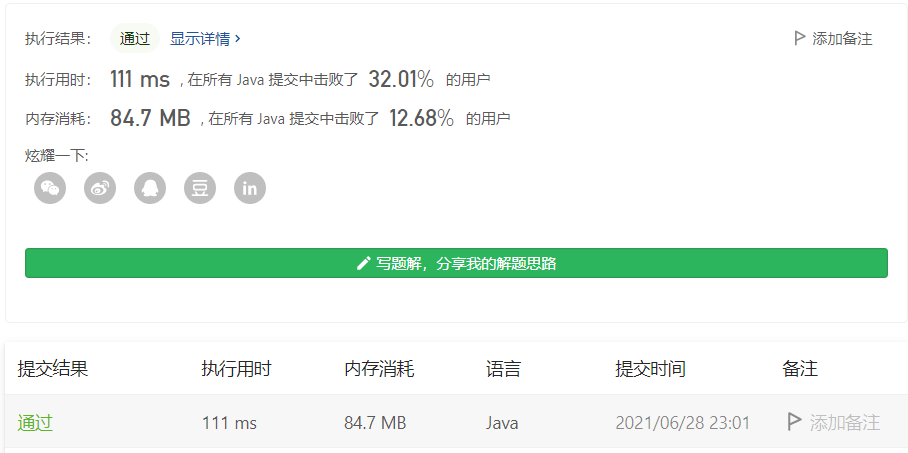

#### 815. 公交路线

#### 2021-06-28 LeetCode每日一题

链接：https://leetcode-cn.com/problems/bus-routes/

标签：**广度优先搜索、数组、哈希表**

> 题目

给你一个数组 routes ，表示一系列公交线路，其中每个 routes[i] 表示一条公交线路，第 i 辆公交车将会在上面循环行驶。

例如，路线 routes[0] = [1, 5, 7] 表示第 0 辆公交车会一直按序列 1 -> 5 -> 7 -> 1 -> 5 -> 7 -> 1 -> ... 这样的车站路线行驶。
现在从 source 车站出发（初始时不在公交车上），要前往 target 车站。 期间仅可乘坐公交车。

求出 最少乘坐的公交车数量 。如果不可能到达终点车站，返回 -1 。

```java
输入：routes = [[1,2,7],[3,6,7]], source = 1, target = 6
输出：2
解释：最优策略是先乘坐第一辆公交车到达车站 7 , 然后换乘第二辆公交车到车站 6 。 

输入：routes = [[7,12],[4,5,15],[6],[15,19],[9,12,13]], source = 15, target = 12
输出：-1
```

提示：

- 1 <= routes.length <= 500.
- 1 <= routes[i].length <= 105
- routes[i] 中的所有值 互不相同
- sum(routes[i].length) <= 105
- 0 <= routes[i][j] < 106
- 0 <= source, target < 10

> 分析

这依然是一道用BFS求解的问题。按照常规的思路，找到出发站所在的路线（一个站可能对应多条路线），把路线中的所有点加入队列，然后再找队列中每个点所在的路线，把路线中的点加入队列.....重复下去，知道找到终点站或者返回-1。

按照这个思路写出代码来并不困难，但其实会超时的，大概卡在最后三个用例了。耗时点在于对于队列中每个车站，都要去找对应的路线，然后又把路线中的点加入队列，尽管进行了剪枝，但依然非常耗时。

所以我们要避免对于每个站点都去查找它对应的路线，而且这里我们记录已经访问过的元素，应该是基于路线层面而不是车站层面，这样可以去掉大量的重复节点。

基于以上分析，我们可以先用哈希表记录下每个车站能够到达哪些路线（即二维数组的横坐标），并且在队列中存放路线，每次弹出队列中的元素时，通过该元素值可以快速拿到该路线有哪些站点，然后判断是否包含目标站点即可。

> 编码

```java
class Solution {
    public int numBusesToDestination(int[][] routes, int source, int target) {
        // 特殊情况。。
        if (source == target) {
            return 0;
        }
        
        int step = 1;
        // 记录每个车站可以达到哪几条线路
        Map<Integer, HashSet<Integer>> map = new HashMap<>();
        for (int i = 0; i < routes.length; i++) {
            int[] stops = routes[i];
            for (int j = 0; j < stops.length; j++) {
                HashSet set = map.getOrDefault(stops[j], new HashSet<>());
                set.add(i);
                map.put(stops[j], set);
            }
        }

        Queue<Integer> queue = new LinkedList<>(map.get(source));
        // 记录已经走过的线路
        Set<Integer> visited = new HashSet<>(map.get(source));

        while (!queue.isEmpty()) {
            int len = queue.size();
            for (int i = 0; i < len; i++) {
                int num = queue.poll();
    
                // 该线路有哪些站点
                int[] stations = routes[num];
                for (int station : stations) {
                    // 包含目标站点
                    if (station == target) {
                        return step;
                    }
                    // 该站点可以到哪些路线
                    for (int r : map.get(station)) {
                        // 没有访问该线路
                        if (!visited.contains(r)) {
                            queue.offer(r);
                            visited.add(r);
                        }
                    }
                }
            }
            step++;
        }

        return -1;
    }
}
```

