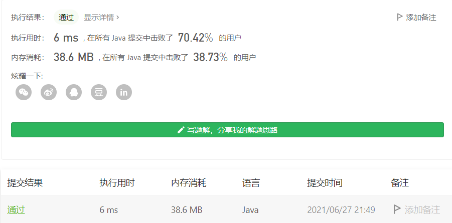

#### 909. 蛇梯棋

#### 2021-06-27 LeetCode每日一题

链接：https://leetcode-cn.com/problems/snakes-and-ladders/

标签：**广度优先搜索、数组、矩阵**

> 题目

N x N 的棋盘 board 上，按从 1 到 N*N 的数字给方格编号，编号 从左下角开始，每一行交替方向。

例如，一块 6 x 6 大小的棋盘，编号如下：


r 行 c 列的棋盘，按前述方法编号，棋盘格中可能存在 “蛇” 或 “梯子”；如果 board[r][c] != -1，那个蛇或梯子的目的地将会是 board[r][c]。

玩家从棋盘上的方格 1 （总是在最后一行、第一列）开始出发。

每一回合，玩家需要从当前方格 x 开始出发，按下述要求前进：

- 选定目标方格：选择从编号 x+1，x+2，x+3，x+4，x+5，或者 x+6 的方格中选出一个目标方格 s ，目标方格的编号 <= N*N。
- 该选择模拟了掷骰子的情景，无论棋盘大小如何，你的目的地范围也只能处于区间 [x+1, x+6] 之间。
  传送玩家：如果目标方格 S 处存在蛇或梯子，那么玩家会传送到蛇或梯子的目的地。否则，玩家传送到目标方格 S。 

注意，玩家在每回合的前进过程中最多只能爬过蛇或梯子一次：就算目的地是另一条蛇或梯子的起点，你也不会继续移动。

返回达到方格 N*N 所需的最少移动次数，如果不可能，则返回 -1。

```java
输入：[
[-1,-1,-1,-1,-1,-1],
[-1,-1,-1,-1,-1,-1],
[-1,-1,-1,-1,-1,-1],
[-1,35,-1,-1,13,-1],
[-1,-1,-1,-1,-1,-1],
[-1,15,-1,-1,-1,-1]]
输出：4
解释：
首先，从方格 1 [第 5 行，第 0 列] 开始。
你决定移动到方格 2，并必须爬过梯子移动到到方格 15。
然后你决定移动到方格 17 [第 3 行，第 5 列]，必须爬过蛇到方格 13。
然后你决定移动到方格 14，且必须通过梯子移动到方格 35。
然后你决定移动到方格 36, 游戏结束。
可以证明你需要至少 4 次移动才能到达第 N*N 个方格，所以答案是 4。
```

提示：

- 2 <= board.length = board[0].length <= 20
- board[i][j] 介于 1 和 N*N 之间或者等于 -1。*
- *编号为 1 的方格上没有蛇或梯子。*
- *编号为 N*N 的方格上没有蛇或梯子。

> 分析

这题目看了我好久才看明白。

- 对于它给定的二维数组，从左下角开始为起点，右上角或者左上角是终点。
- 每个坐标上的数值，如果不等于-1，则直接跳到该数对应的下标。
- 每个坐标x可以选择走到编号 x+1，x+2，x+3，x+4，x+5，或者 x+6。
- 求最少走几步可以到终点。

求这种最短路的问题，BFS又来了。还是那句话，抽象成一棵树，然后层序遍历就完事了。这里其实我们对于某个坐标上的数值是多少并不关心，我们只需要知道坐标是多少就可以了。因为通过坐标我们可以直接拿到坐标对应的值，如果该值等于-1，那么我们把后面6个位置的坐标记录下来，如果不等于-1，该坐标的值就作为新的坐标存入队列。

同时我们需要在计算过程中进行剪枝，记录已经走过的下标，不然就会超时或者进入死循环。记录已经走过的下标，可以直接使用一个boolean数组即可。

> 编码

```java
class Solution {
    public int snakesAndLadders(int[][] board) {
        int total = board.length * board.length;
        int[] nums = new int[total];
        int count = 0, row = 0;
        // board转为一维数组
        for (int i = board.length - 1; i >= 0; --i) {
            for (int j = 0; j < board[i].length; j++) {
                if (row % 2 == 0) {
                    nums[count++] = board[i][j];
                } else {
                    nums[count++] = board[i][board[i].length - j - 1];
                }
            }
            row++;
        }

        Queue<Integer> queue = new LinkedList<>();
        // 记录已经访问过的下标
        boolean[] visited = new boolean[401];
        queue.offer(0);
        visited[0] = true;
        int step = 0;
        while (!queue.isEmpty()) {
            int len = queue.size();
            
            for (int i = 0; i < len; i++) {
                Integer cur = queue.poll();
                // 到了终点坐标
                if (cur == total - 1) {
                    return step;
                }
                
                // 最多可以选择6个数
                for (int j = 1; j <= 6; j++) {
                    if (cur + j >= nums.length) {
                        break;
                    }
       
                    if (nums[cur + j] != -1) {
                        if (!visited[nums[cur + j] - 1]) {
                            queue.offer(nums[cur + j] - 1);
                            visited[nums[cur + j] - 1] = true;
                        }
                    } else {
                        if (!visited[cur + j]) {
                            queue.offer(cur + j);
                            visited[cur + j] = true;
                        }
                    }
                }
            }

            step++;
        }

        return -1;
    }
}
```

