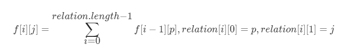

#### LCP 07. 传递信息

#### 2021-07-01 LeetCode每日一题

链接：https://leetcode-cn.com/problems/chuan-di-xin-xi/

标签：**深度优先搜索、广度优先搜索、图、动态规划**

> 题目

小朋友 A 在和 ta 的小伙伴们玩传信息游戏，游戏规则如下：

（1）有 n 名玩家，所有玩家编号分别为 0 ～ n-1，其中小朋友 A 的编号为 0
（2）每个玩家都有固定的若干个可传信息的其他玩家（也可能没有）。传信息的关系是单向的（比如 A 可以向 B 传信息，但 B 不能向 A 传信息）。
（3）每轮信息必须需要传递给另一个人，且信息可重复经过同一个人

给定总玩家数 n，以及按 [玩家编号,对应可传递玩家编号] 关系组成的二维数组 relation。返回信息从小 A (编号 0 ) 经过 k 轮传递到编号为 n-1 的小伙伴处的方案数；若不能到达，返回 0。

示例 1：

```java
输入：n = 5, relation = [[0,2],[2,1],[3,4],[2,3],[1,4],[2,0],[0,4]], k = 3

输出：3

解释：信息从小 A 编号 0 处开始，经 3 轮传递，到达编号 4。共有 3 种方案，分别是 0->2->0->4， 0->2->1->4， 0->2->3->4。
```

示例 2：

```java
输入：n = 3, relation = [[0,2],[2,1]], k = 2

输出：0

解释：信息不能从小 A 处经过 2 轮传递到编号 2
```

限制：

- 2 <= n <= 10
- 1 <= k <= 5
- 1 <= relation.length <= 90, 且 relation[i].length == 2
- 0 <= relation[i][0],relation[i][1] < n 且 relation[i][0] != relation[i][1]

> 分析

此题难度为简单。仔细想想就能用BFS/DFS做出来，因为数据量也不是很大，所以不用剪枝也可以通过。把起点0加入队列，然后遍历二维数组，把能够传递到的玩家编号加入队列，直到遍历k次，此时看看队列里包含几个n - 1即有几种方案。

如果使用动态规划，定义dp[i] [j]表示走了i轮，到达编号j的方案数，则dp[0] [0] = 1，对于任意dp[i] [j]，其值等于所有能够到达编号j的p点的总和。即



> 编码

**BFS版本**

```java
class Solution {
    public int numWays(int n, int[][] relation, int k) {
        int res = 0;
        Queue<Integer> queue = new LinkedList<>();
        queue.offer(0);

        while (!queue.isEmpty()) {
            int len = queue.size();
            for (int i = 0; i < len; i++) {
                int num = queue.poll();
                if (k == 0) {
                    if (num == n - 1) {
                        res++;
                    }
                    continue;
                }

                for (int j = 0; j < relation.length; j++) {
                    if (num == relation[j][0]) {
                        queue.offer(relation[j][1]);
                    }
                }
            }
            k--;
        }
        return res;
    }
}
```


**动态规划版本**

```java
class Solution {
    public int numWays(int n, int[][] relation, int k) {
        int[][] dp = new int[k + 1][n];
        dp[0][0] = 1;
        for (int i = 1; i <= k; i++) {
            for (int[] vals : relation) {
                int a = vals[0], b = vals[1];
                dp[i][b] += dp[i - 1][a];
            }
        }
        return dp[k][n - 1];
    }
}
```

