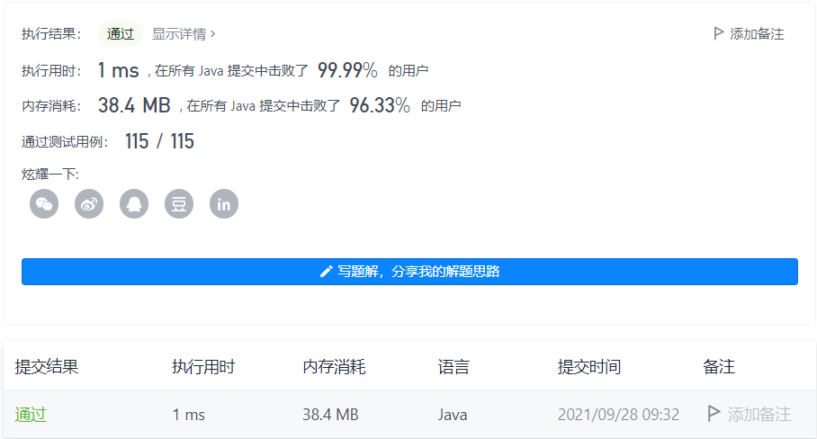

#### 113. 路径总和 II

链接：https://leetcode-cn.com/problems/path-sum-ii/

标签：**树、深度优先搜索、回溯**

> 题目

给你二叉树的根节点 root 和一个整数目标和 targetSum ，找出所有 从根节点到叶子节点 路径总和等于给定目标和的路径。

叶子节点 是指没有子节点的节点。

示例 1：


```java
输入：root = [5,4,8,11,null,13,4,7,2,null,null,5,1], targetSum = 22
输出：[[5,4,11,2],[5,8,4,5]]
```

示例 2：


```java
输入：root = [1,2,3], targetSum = 5
输出：[]
```

示例 3：

```java
输入：root = [1,2], targetSum = 0
输出：[]
```


提示：

- 树中节点总数在范围 [0, 5000] 内
- -1000 <= Node.val <= 1000
- -1000 <= targetSum <= 1000

> 分析

在112题的基础上，递归过程中需要记录节点的值，并且在到达叶子节点后，需要回溯，把最后一个加入的节点移除。

需要注意的是，在把一条符合条件的路径加入列表的时候，需要重新拷贝一份，不能直接把原对象加入列表，因为该对象递归到最后就是一个空列表。

> 编码

```java
/**
 * Definition for a binary tree node.
 * public class TreeNode {
 *     int val;
 *     TreeNode left;
 *     TreeNode right;
 *     TreeNode() {}
 *     TreeNode(int val) { this.val = val; }
 *     TreeNode(int val, TreeNode left, TreeNode right) {
 *         this.val = val;
 *         this.left = left;
 *         this.right = right;
 *     }
 * }
 */
class Solution {
    List<List<Integer>> res = new ArrayList<>();
    public List<List<Integer>> pathSum(TreeNode root, int targetSum) {
        LinkedList<Integer> list = new LinkedList<>();
        dfs(root, targetSum, list);
        return res;
    }

    private void dfs(TreeNode root, int targetSum, LinkedList<Integer> list) {
        if (root == null) {
            return;
        }

        list.add(root.val);
        if (root.left == null && root.right == null && targetSum == root.val) {
            // 这里如果直接res.add(list)，是将list对象加入了res，递归到最后list最终会变成空列表
            // 所以这里需要new一个新的ArrayList，初始化元素为list里的所有元素。
            res.add(new ArrayList(list));
        }

        dfs(root.left, targetSum - root.val, list);
        dfs(root.right, targetSum - root.val, list);
        // 移除最后一个元素
        list.removeLast();
    }
}
```



时间复杂度O(N * N)。N为树的节点数，最坏情况，二叉树退化成链表并且符合条件，那么遍历二叉树的时间复杂度为O(N)，`res.add(new ArrayList(list))`的时间复杂度为O(N)，所以总的时间复杂度为O(N * N)。

空间复杂度O(N)。N为树的节点数，空间复杂度主要取决于栈空间的开销，栈中的元素个数不会超过N。