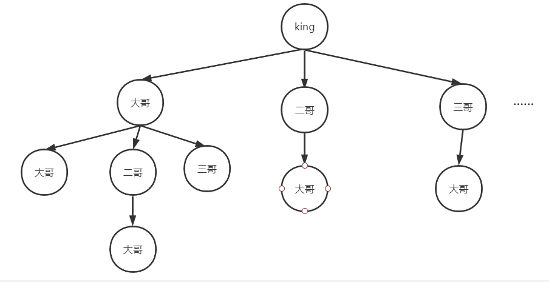

#### 1600. 皇位继承顺序

#### 2021-06-20 LeetCode每日一题

链接：https://leetcode-cn.com/problems/throne-inheritance/

标签：**树、先序遍历**

> 题目

一个王国里住着国王、他的孩子们、他的孙子们等等。每一个时间点，这个家庭里有人出生也有人死亡。

这个王国有一个明确规定的皇位继承顺序，第一继承人总是国王自己。我们定义递归函数 Successor(x, curOrder) ，给定一个人 x 和当前的继承顺序，该函数返回 x 的下一继承人。

```txt
Successor(x, curOrder):
    如果 x 没有孩子或者所有 x 的孩子都在 curOrder 中：
        如果 x 是国王，那么返回 null
        否则，返回 Successor(x 的父亲, curOrder)
    否则，返回 x 不在 curOrder 中最年长的孩子
```

比方说，假设王国由国王，他的孩子 Alice 和 Bob （Alice 比 Bob 年长）和 Alice 的孩子 Jack 组成。

1、一开始， curOrder 为 ["king"].
2、调用 Successor(king, curOrder) ，返回 Alice ，所以我们将 Alice 放入 curOrder 中，得到 ["king", "Alice"] 。
3、调用 Successor(Alice, curOrder) ，返回 Jack ，所以我们将 Jack 放入 curOrder 中，得到 ["king", "Alice", "Jack"] 。
4、调用 Successor(Jack, curOrder) ，返回 Bob ，所以我们将 Bob 放入 curOrder 中，得到 ["king", "Alice", "Jack", "Bob"] 。
5、调用 Successor(Bob, curOrder) ，返回 null 。最终得到继承顺序为 ["king", "Alice", "Jack", "Bob"] 。

通过以上的函数，我们总是能得到一个唯一的继承顺序。

请你实现 ThroneInheritance 类：

- ThroneInheritance(string kingName) 初始化一个 ThroneInheritance 类的对象。国王的名字作为构造函数的参数传入。
- void birth(string parentName, string childName) 表示 parentName 新拥有了一个名为 childName 的孩子。
- void death(string name) 表示名为 name 的人死亡。一个人的死亡不会影响 Successor 函数，也不会影响当前的继承顺序。你可以只将这个人标记为死亡状态。
- string[] getInheritanceOrder() 返回 除去 死亡人员的当前继承顺序列表。

```java
输入：
["ThroneInheritance", "birth", "birth", "birth", "birth", "birth", "birth", "getInheritanceOrder", "death", "getInheritanceOrder"]
[["king"], ["king", "andy"], ["king", "bob"], ["king", "catherine"], ["andy", "matthew"], ["bob", "alex"], ["bob", "asha"], [null], ["bob"], [null]]
输出：
[null, null, null, null, null, null, null, ["king", "andy", "matthew", "bob", "alex", "asha", "catherine"], null, ["king", "andy", "matthew", "alex", "asha", "catherine"]]

解释：
ThroneInheritance t= new ThroneInheritance("king"); // 继承顺序：king
t.birth("king", "andy"); // 继承顺序：king > andy
t.birth("king", "bob"); // 继承顺序：king > andy > bob
t.birth("king", "catherine"); // 继承顺序：king > andy > bob > catherine
t.birth("andy", "matthew"); // 继承顺序：king > andy > matthew > bob > catherine
t.birth("bob", "alex"); // 继承顺序：king > andy > matthew > bob > alex > catherine
t.birth("bob", "asha"); // 继承顺序：king > andy > matthew > bob > alex > asha > catherine
t.getInheritanceOrder(); // 返回 ["king", "andy", "matthew", "bob", "alex", "asha", "catherine"]
t.death("bob"); // 继承顺序：king > andy > matthew > bob（已经去世）> alex > asha > catherine
t.getInheritanceOrder(); // 返回 ["king", "andy", "matthew", "alex", "asha", "catherine"]
```

提示：

- 1 <= kingName.length, parentName.length, childName.length, name.length <= 15
- kingName，parentName， childName 和 name 仅包含小写英文字母。
- 所有的参数 childName 和 kingName 互不相同。
- 所有 death 函数中的死亡名字 name 要么是国王，要么是已经出生了的人员名字。
- 每次调用 birth(parentName, childName) 时，测试用例都保证 parentName 对应的人员是活着的。
- 最多调用 105 次birth 和 death 。
- 最多调用 10 次 getInheritanceOrder 。

> 分析

这题题目又臭又长，得多读几遍才行。最后就是浓缩成了一颗多叉树，顶点就是king，king有好多孩子，长子、二弟、三弟、四弟。。。长子又有很多儿子，二弟也有很多儿子，根据题目的意思，把这颗多叉树先序遍历输出就是继承顺序。



> 编码

使用Map + Set模拟树

```java
class ThroneInheritance {

    private Map<String, List<String>> map;
    private Set<String> set;
    private String kingName;

    public ThroneInheritance(String kingName) {
        map = new HashMap<>();
        set = new HashSet<>();
        this.kingName = kingName;
        map.put(kingName, new ArrayList<>());
    }
    
    public void birth(String parentName, String childName) {
        map.get(parentName).add(childName);
        map.put(childName, new ArrayList<>());
    }
    
    public void death(String name) {
        set.add(name);
    }
    
    public List<String> getInheritanceOrder() {
        List<String> list = new ArrayList<>();
        dfs(list, kingName);
        return list;
    }

    private void dfs(List<String> list, String name) {
        if (!set.contains(name)) {
            list.add(name);
        }

        // 递归获取孩子
        for (String subName : map.get(name)) {
            dfs(list, subName);
        }
    }
}

/**
 * Your ThroneInheritance object will be instantiated and called as such:
 * ThroneInheritance obj = new ThroneInheritance(kingName);
 * obj.birth(parentName,childName);
 * obj.death(name);
 * List<String> param_3 = obj.getInheritanceOrder();
 */
```


自定义类表示树

```java
class ThroneInheritance {

    class Node {
        List<Node> childs = new ArrayList<>();
        String name;
        boolean isAlive = true;
        Node(String name) {
            this.name = name;
        }
    }
    private Map<String, Node> map;
    String king;

    public ThroneInheritance(String kingName) {
        king = kingName;
        map = new HashMap<>();
        Node node = new Node(kingName);
        map.put(kingName, node);
    }
    
    public void birth(String parentName, String childName) {
        Node node = new Node(childName);
        map.get(parentName).childs.add(node);
        map.put(childName, node);
    }
    
    public void death(String name) {
        map.get(name).isAlive = false;
    }
    
    public List<String> getInheritanceOrder() {
        List<String> list = new ArrayList<>();
        preList(list, map.get(king));
        return list;
    }

    private void preList(List<String> list, Node node) {
        if (node == null) {
            return;
        }

        if (node.isAlive) {
            list.add(node.name);
        }

        for (Node root : node.childs) {
            preList(list, root);
        }
    }
}

/**
 * Your ThroneInheritance object will be instantiated and called as such:
 * ThroneInheritance obj = new ThroneInheritance(kingName);
 * obj.birth(parentName,childName);
 * obj.death(name);
 * List<String> param_3 = obj.getInheritanceOrder();
 */
```

