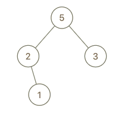

#### 998. 最大二叉树 II

#### 2022-08-30 LeetCode每日一题

链接：https://leetcode.cn/problems/maximum-binary-tree-ii/

标签：**二叉树**

> 题目

最大树 定义：一棵树，并满足：其中每个节点的值都大于其子树中的任何其他值。

给你最大树的根节点 root 和一个整数 val 。

就像 之前的问题 那样，给定的树是利用 Construct(a) 例程从列表 a（root = Construct(a)）递归地构建的：

- 如果 a 为空，返回 null 。
- 否则，令 a[i] 作为 a 的最大元素。创建一个值为 a[i] 的根节点 root 。
- root 的左子树将被构建为 Construct([a[0], a[1], ..., a[i - 1]]) 。
- root 的右子树将被构建为 Construct([a[i + 1], a[i + 2], ..., a[a.length - 1]]) 。
- 返回 root 。

请注意，题目没有直接给出 a ，只是给出一个根节点 root = Construct(a) 。

假设 b 是 a 的副本，并在末尾附加值 val。题目数据保证 b 中的值互不相同。

返回 Construct(b) 。

示例 1：


```java
输入：root = [4,1,3,null,null,2], val = 5
输出：[5,4,null,1,3,null,null,2]
解释：a = [1,4,2,3], b = [1,4,2,3,5]
```

示例 2：


```java
输入：root = [5,2,4,null,1], val = 3
输出：[5,2,4,null,1,null,3]
解释：a = [2,1,5,4], b = [2,1,5,4,3]
```

示例 3：



```java
输入：root = [5,2,3,null,1], val = 4
输出：[5,2,4,null,1,3]
解释：a = [2,1,5,3], b = [2,1,5,3,4]
```


提示：

- 树中节点数目在范围 [1, 100] 内
- 1 <= Node.val <= 100
- 树中的所有值 互不相同
- 1 <= val <= 100

> 分析

题目的意思是，假设组成root数的数组为[n1, n2, n3, n4, ...., nn]，把val加入到组成root的数组的最后面[n1, n2, n3, n4, ...., nn, val]，然后对这个新数组使用规则进行递归构建。

因为root的值是最大的，所以

- 如果val的值大于root的值，则val作为根，root作为val的左子树。即划分成[n1, n2, n3, n4, ...., nn]和[val]。
- 如果val的值不大于root的值，则val就在root的右子树的某个位置。

> 编码

```java
/**
 * Definition for a binary tree node.
 * public class TreeNode {
 *     int val;
 *     TreeNode left;
 *     TreeNode right;
 *     TreeNode() {}
 *     TreeNode(int val) { this.val = val; }
 *     TreeNode(int val, TreeNode left, TreeNode right) {
 *         this.val = val;
 *         this.left = left;
 *         this.right = right;
 *     }
 * }
 */
class Solution {
    public TreeNode insertIntoMaxTree(TreeNode root, int val) {
        if (root == null) {
            return new TreeNode(val);
        }
        if (val > root.val) {
            TreeNode node = new TreeNode(val);
            node.left = root;
            return node;
        } else {
            root.right = insertIntoMaxTree(root.right, val);
        }

        return root;
    }
}
```


```java
/**
 * Definition for a binary tree node.
 * public class TreeNode {
 *     int val;
 *     TreeNode left;
 *     TreeNode right;
 *     TreeNode() {}
 *     TreeNode(int val) { this.val = val; }
 *     TreeNode(int val, TreeNode left, TreeNode right) {
 *         this.val = val;
 *         this.left = left;
 *         this.right = right;
 *     }
 * }
 */
class Solution {
    public TreeNode insertIntoMaxTree(TreeNode root, int val) {
        TreeNode node = new TreeNode(val);
        if (root == null) {
            return node;
        }
        if (val > root.val) {
            node.left = root;
            return node;
        }

        TreeNode t = root;
        while (t != null) {
            if (t.right == null) {
                t.right = node;
                return root;
            } else if (val > t.right.val) {
                node.left = t.right;
                t.right = node;
                return root;
            } else if (val < t.right.val) {
                t = t.right;
            }
        }

        return root;
    }
}
```

