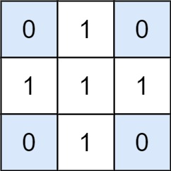

#### 1074. 元素和为目标值的子矩阵数量

链接：https://leetcode-cn.com/problems/number-of-submatrices-that-sum-to-target/

标签：**数组、动态规划、滑动窗口**

> 题目

给出矩阵 matrix 和目标值 target，返回元素总和等于目标值的非空子矩阵的数量。

子矩阵 x1, y1, x2, y2 是满足 x1 <= x <= x2 且 y1 <= y <= y2 的所有单元 matrix[x][y] 的集合。

如果 (x1, y1, x2, y2) 和 (x1', y1', x2', y2') 两个子矩阵中部分坐标不同（如：x1 != x1'），那么这两个子矩阵也不同。



```java

输入：matrix = [[0,1,0],[1,1,1],[0,1,0]], target = 0
输出：4
解释：四个只含 0 的 1x1 子矩阵。
    
输入：matrix = [[1,-1],[-1,1]], target = 0
输出：5
解释：两个 1x2 子矩阵，加上两个 2x1 子矩阵，再加上一个 2x2 子矩阵。

输入：matrix = [[904]], target = 0
输出：0
    
1 <= matrix.length <= 100
1 <= matrix[0].length <= 100
-1000 <= matrix[i] <= 1000
-10^8 <= target <= 10^8
```

> 分析

这题其实可以借鉴一下[304. 二维区域和检索 - 矩阵不可变](https://leetcode-cn.com/problems/range-sum-query-2d-immutable/)。利用dp + 前缀和求得矩阵的区域和，然后遍历。但这里如果暴力的话，需要四层循环。

> 编码

```java
class Solution {
    public int numSubmatrixSumTarget(int[][] matrix, int target) {
        int res = 0;
        // matrix可能是空数组
        int m = matrix.length, n = (m == 0) ? 0 : matrix[0].length;
        // 横竖长度都在matrix的基础上+1，这样循环时下标可以从1开始，避免判断i - 1，j - 1越界的情况
        int[][] sum = new int[m + 1][n + 1];
        for (int i = 1; i <= m; i++) {
            for (int j = 1; j <= n; j++) {
                sum[i][j] = sum[i][j - 1] + sum[i - 1][j] - sum[i - 1][j - 1] + matrix[i - 1][j - 1];
            }
        }

        for (int i = 1; i <= m; i++) {
            for (int j = 1; j <= n; j++) {
                for (int p = 1; p <=i; p++) {
                    for (int q = 1; q <= j; q++) {
                        int s = sum[i][j] - sum[p - 1][j] - sum[i][q - 1] + sum[p - 1][q - 1];
                        if (s == target) {
                            res++;
                        }
                    }
                }
            }
        }

        return res;
    }
}
```

