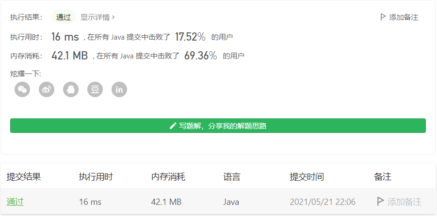

#### 1143. 最长公共子序列

链接：https://leetcode-cn.com/problems/longest-common-subsequence/

标签：**动态规划、LCS**

> 题目

给定两个字符串 text1 和 text2，返回这两个字符串的最长 公共子序列 的长度。如果不存在 公共子序列 ，返回 0 。

一个字符串的 子序列 是指这样一个新的字符串：它是由原字符串在不改变字符的相对顺序的情况下删除某些字符（也可以不删除任何字符）后组成的新字符串。

例如，"ace" 是 "abcde" 的子序列，但 "aec" 不是 "abcde" 的子序列。
两个字符串的 公共子序列 是这两个字符串所共同拥有的子序列。

```java
输入：text1 = "abcde", text2 = "ace" 
输出：3  
解释：最长公共子序列是 "ace" ，它的长度为 3 。
    
输入：text1 = "abc", text2 = "abc"
输出：3
解释：最长公共子序列是 "abc" ，它的长度为 3 。
    
输入：text1 = "abc", text2 = "def"
输出：0
解释：两个字符串没有公共子序列，返回 0 。
    
1 <= text1.length, text2.length <= 1000
text1 和 text2 仅由小写英文字符组成。
```

> 分析

这是一道最长公共子序列(LCS，Longest Common SubSequence)的裸题。看到这种求最优解得题目，我第一时间就想到动态规划（DP，Dynamic Programming）。一开始刷动态规划题目的时候，一直摸不着头脑，一通乱写，越写越乱。刷过几道之后，脑子里就会有一些大致的流程：

（1）**先确定要使用动态规划**。

（2）**明确dp数组**。dp数组是使用一维数组还是二维数组？比如此题，最直观的想法就是使用二维数组dp[i] [j]去表示。

（3）**明确dp数组每一项代表的含义**。知道如何表示dp数组，那么还得知道每一项代表什么含义，不然没法往下推。比如此题，**dp[i] [j]就表示字符串text1的前i项和字符串text2的前j项最长公共子序列的长度**。注意，这里说的是最优解。

（4）**确定base case**。即确定基础用例，一般就得dp[0] [0] = 0这种常见的。

（5）**确定状态转移方程**。这步是核心，也是最难的，一般都卡在这步，要么推导不出来，要么推导的情况不全。关于如何推导的又快又准，那就是刷题。

上面就是我刷了一些题目之后的一些想法。现在来看看这道题的状态转移方程是什么。

对于任意i, j，可知dp[i] [j]的值有以下情况：

- text1[i] == text2[j]。此时dp[i] [j] = dp[i - 1] [j - 1] + 1。
- text1[i] != text2[j]。此时dp[i] [j] = max(dp[i - 1] [j], dp[i] [j - 1])。

确定了状态转移方程，代码就好写了。

> 编码

```java
class Solution {
    public int longestCommonSubsequence(String text1, String text2) {
        int len1 = text1.length(), len2 = text2.length();
        int[][] dp = new int[len1 + 1][len2 + 1];

        for (int i = 1; i <= len1; i++) {
            for (int j = 1; j <= len2; j++) {
                if (text1.charAt(i - 1) == text2.charAt(j - 1)) {
                    dp[i][j] = dp[i - 1][j - 1] + 1;
                } else {
                    dp[i][j] = Math.max(dp[i - 1][j], dp[i][j - 1]);
                }
            }
        }

        return dp[len1][len2];
    }
}
```



时间复杂度O(m * n)，空间复杂度O(m * n)