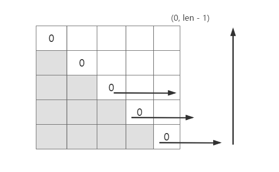
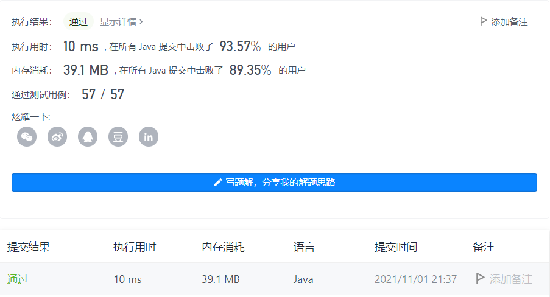

#### 1312. 让字符串成为回文串的最少插入次数

链接：https://leetcode-cn.com/problems/minimum-insertion-steps-to-make-a-string-palindrome/

标签：**字符串、动态规划**

> 题目

给你一个字符串 s ，每一次操作你都可以在字符串的任意位置插入任意字符。

请你返回让 s 成为回文串的 最少操作次数 。

「回文串」是正读和反读都相同的字符串。

示例 1：

```java
输入：s = "zzazz"
输出：0
解释：字符串 "zzazz" 已经是回文串了，所以不需要做任何插入操作。
```

示例 2：

```java
输入：s = "mbadm"
输出：2
解释：字符串可变为 "mbdadbm" 或者 "mdbabdm" 。
```

示例 3：

```java
输入：s = "leetcode"
输出：5
解释：插入 5 个字符后字符串变为 "leetcodocteel" 。
```

示例 4：

```java
输入：s = "g"
输出：0
```

示例 5：

```java
输入：s = "no"
输出：1
```


提示：

- 1 <= s.length <= 500
- s 中所有字符都是小写字母。

> 分析

穷举暴力是不现实的。可以从字符串最中间开始往外扩散判断。使用动态规划。具体分析在代码中。关于遍历的方向为何是从下往上，从左往右



> 编码

```java
class Solution {
    public int minInsertions(String s) {
        int len = s.length();
        char[] chs = s.toCharArray();
        // dp[i][j]表示[i, j]之间表示的字符串为回文串的最小操作次数
        int[][] dp = new int[len][len];

        /**
         * 通过下面的分析可知，dp[i][j]依赖dp[i + 1][j - 1]、dp[i + 1][j]、dp[i][j - 1]
         * 所以需要从下往上，从左往右遍历
         */
        for (int i = len - 2; i >= 0; --i) {
            for (int j = i + 1; j < len; j++) {
                /**
                 * a  b  cc  b   a
                 * i i+1    j-1  j
                 * 如果chs[i] == chs[j]，则dp[i][j] = dp[i + 1][j - 1];
                 */
                if (chs[i] == chs[j]) {
                    dp[i][j] = dp[i + 1][j - 1];
                } else {
                    /**
                     * (1)、
                     * c  b  cc  b   a
                     * i i+1    j-1  j
                     * 如果chs[i] != chs[j]，此时在i右边插入j，j右边插入i，[i, j]肯定是回文串
                     * dp[i][j] = dp[i + 1][j - 1] + 2
                     * (2)、
                     * 但有的情况只需要插入一次即可，比如
                     * c  b  bb  b   b
                     * i i+1    j-1  j
                     * 这种只需要在j右边插入i即可。dp[i][j] = dp[i + 1][j] + 1
                     * (3)、
                     * 此时又比如
                     * b  b  bb  b   c
                     * i i+1    j-1  j
                     * 这种只需要在i左边插入j即可。dp[i][j] = dp[i][j - 1] + 1
                     * 综上，dp[i][j] = Math.min(dp[i + 1][j], dp[i][j - 1]) + 1
                     */
                    dp[i][j] = Math.min(dp[i + 1][j], dp[i][j - 1]) + 1;
                }
            }
        }

        return dp[0][len - 1];
    }
}
```

