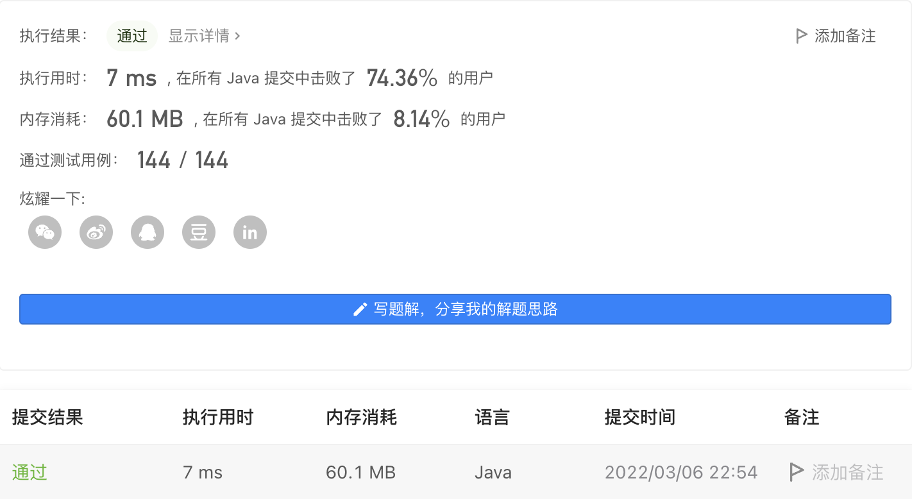

#### 2100. 适合打劫银行的日子

#### 2022-03-06 LeetCode每日一题

链接：https://leetcode-cn.com/problems/find-good-days-to-rob-the-bank/

标签：**数组、前缀和、动态规划**

> 题目

你和一群强盗准备打劫银行。给你一个下标从 0 开始的整数数组 security ，其中 security[i] 是第 i 天执勤警卫的数量。日子从 0 开始编号。同时给你一个整数 time 。

如果第 i 天满足以下所有条件，我们称它为一个适合打劫银行的日子：

- 第 i 天前和后都分别至少有 time 天。
- 第 i 天前连续 time 天警卫数目都是非递增的。
- 第 i 天后连续 time 天警卫数目都是非递减的。

更正式的，第 i 天是一个合适打劫银行的日子当且仅当：security[i - time] >= security[i - time + 1] >= ... >= security[i] <= ... <= security[i + time - 1] <= security[i + time].

请你返回一个数组，包含 所有 适合打劫银行的日子（下标从 0 开始）。返回的日子可以 任意 顺序排列。

示例 1：

```java
输入：security = [5,3,3,3,5,6,2], time = 2
输出：[2,3]
解释：
第 2 天，我们有 security[0] >= security[1] >= security[2] <= security[3] <= security[4] 。
第 3 天，我们有 security[1] >= security[2] >= security[3] <= security[4] <= security[5] 。
没有其他日子符合这个条件，所以日子 2 和 3 是适合打劫银行的日子。
```

示例 2：

```java
输入：security = [1,1,1,1,1], time = 0
输出：[0,1,2,3,4]
解释：
因为 time 等于 0 ，所以每一天都是适合打劫银行的日子，所以返回每一天。
```

示例 3：

```java
输入：security = [1,2,3,4,5,6], time = 2
输出：[]
解释：
没有任何一天的前 2 天警卫数目是非递增的。
所以没有适合打劫银行的日子，返回空数组。
```

示例 4：

```java
输入：security = [1], time = 5
输出：[]
解释：
没有日子前面和后面有 5 天时间。
所以没有适合打劫银行的日子，返回空数组。
```


提示：

- 1 <= security.length <= 10 ^ 5
- 0 <= security[i], time <= 10 ^ 5

> 分析

可以定义两个数组pre和after，其实pre[i]表示以下标i结尾的子数组（[0, i]）存在几个连续非递增的数，after[i]表示以下标i开始的子数组（[i, len - 1]）存在几个连续非递减的数。

这样在判断第i天是否适合打劫时，只需要知道以该天结束时是否存在至少time天非递增，即`pre[i] >= time`是否成立。同样的，以该天开始时是否存在至少time天非递减，即`after[i] >= time`是否成立。

> 编码

```java
class Solution {
    public List<Integer> goodDaysToRobBank(int[] security, int time) {
        List<Integer> ans = new ArrayList<>();
        int len = security.length;
        
        // pre[i]表示以下标i结尾存在几个连续非递增的数
        int[] pre = new int[len];
        // after[i]表示以下标i开始存在几个连续非递减的数
        int[] after = new int[len];

        for (int i = 1; i < len; i++) {
            if (security[i] <= security[i - 1]) {
                pre[i] = pre[i - 1] + 1;
            }
        }
        for (int i = len - 1; i > 0; i--) {
            if (security[i] >= security[i - 1]) {
                after[i - 1] = after[i] + 1;
            }
        }

        for (int i = 0; i < len; i++) {
            if (pre[i] >= time && after[i] >= time) {
                ans.add(i);
            }
        }

        return ans;
    }
}
```



```go
func goodDaysToRobBank(security []int, time int) []int {
    var ans []int
    pre := make([]int, len(security))
    after := make([]int, len(security))

    for i := 1; i < len(security); i++ {
        if security[i] <= security[i - 1] {
            pre[i] = pre[i - 1] + 1
        }
    }

    for i := len(security) - 1; i > 0; i-- {
        if security[i] >= security[i - 1] {
            after[i - 1] = after[i] + 1;
        }
    }

    for i := 0; i < len(security); i++ {
        if pre[i] >= time && after[i] >= time {
            ans = append(ans, i)
        }
    }

    return ans
}
```

