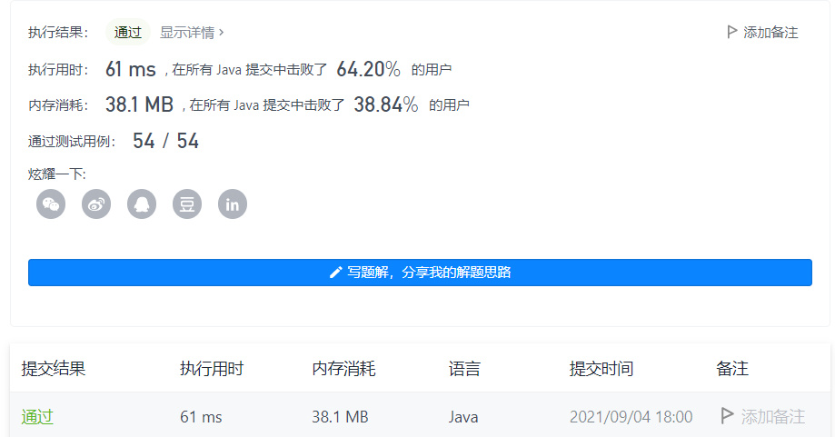

#### 300. 最长递增子序列

链接：https://leetcode-cn.com/problems/longest-increasing-subsequence/

标签：**数组、二分查找、动态规划**

> 题目

给你一个整数数组 nums ，找到其中最长严格递增子序列的长度。

子序列是由数组派生而来的序列，删除（或不删除）数组中的元素而不改变其余元素的顺序。例如，[3,6,2,7] 是数组 [0,3,1,6,2,2,7] 的子序列。


示例 1：

```java
输入：nums = [10,9,2,5,3,7,101,18]
输出：4
解释：最长递增子序列是 [2,3,7,101]，因此长度为 4 。
```

示例 2：

```java
输入：nums = [0,1,0,3,2,3]
输出：4
```

示例 3：

```java
输入：nums = [7,7,7,7,7,7,7]
输出：1
```


提示：

- 1 <= nums.length <= 2500
- -10 ^ 4 <= nums[i] <= 10 ^ 4


进阶：

- 你可以设计时间复杂度为 O(n2) 的解决方案吗？
- 你能将算法的时间复杂度降低到 O(n log(n)) 吗?

> 分析

定义dp[i]表示前i个数的最长递增子序列的个数。可知初始化时，每项的值都为1，因为单个元素也是一个递增子序列。已知dp[i]的值，那么对于dp[i +1]，如果num[i + 1]大于num[i]，那么就把num[i + 1]放到num[i]后面，长度变为dp[i] + 1

对于任意的i，我们拿到[0, i]中最大的dp[index]作为dp[i]的值即可。

> 编码

```java
class Solution {
    public int lengthOfLIS(int[] nums) {
        // dp[i]表示前i个元素的最长递增子序列
        int[] dp = new int[nums.length];
        // 所有元素初始化为1，本身就是一个递增子序列
        Arrays.fill(dp, 1);
        int res = 0;

        for (int i = 0; i < nums.length; i++) {
            for (int j = 0; j < i; j++) {
                // 把nums[i]放到num[j]后面，所以 dp[j] + 1，再和目前的dp[i]比较取较大的那个
                if (nums[i] > nums[j]) {
                    dp[i] = Math.max(dp[i], dp[j] + 1);
                }
            }
      
            if (dp[i] > res) {
                res = dp[i];
            }
        }

        return res;
    }
}
```

