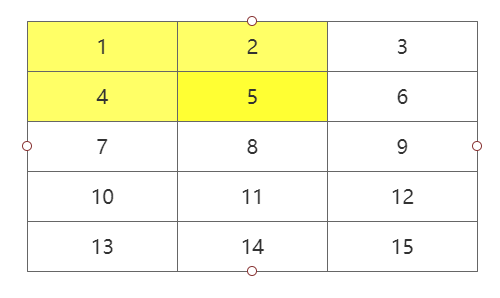
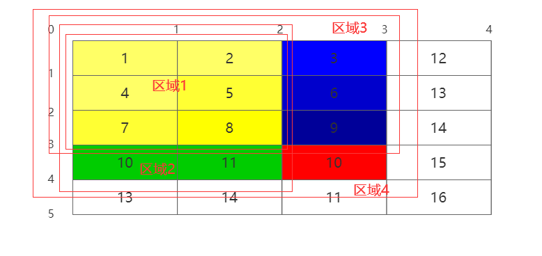
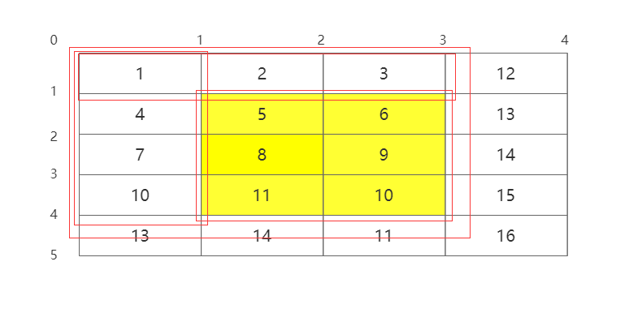

#### 304. 二维区域和检索 - 矩阵不可变

链接：https://leetcode-cn.com/problems/range-sum-query-2d-immutable/

使用暴力解法，没想到竟然过了。


```java
class NumMatrix {
    int[][] matrix;
    public NumMatrix(int[][] matrix) {
        this.matrix = matrix;
    }
    
    public int sumRegion(int row1, int col1, int row2, int col2) {
        int sum = 0;
        for (int i = row1; i <= row2; i++) {
            for (int j = col1; j <= col2; j++) {
                sum += matrix[i][j];
            }
        }

        return sum;
    }
}

/**
 * Your NumMatrix object will be instantiated and called as such:
 * NumMatrix obj = new NumMatrix(matrix);
 * int param_1 = obj.sumRegion(row1,col1,row2,col2);
 */
```

注意题目说**会多次调用sumRegion方法**，所以暴力解法指不定就超时了。

这里可以使用动态规划求解。假设
$$
f(i, j) 表示矩阵中以(i, j)为右下脚顶点的左上方矩阵的区域和
$$


如上图，就表示f(1, 1)的值。那么可知，对于任意f(i, j)，计算公式如下
$$
f(i,j) = f(i,j-1) + f(i-1,j) - f(i-1,j-1) + matrix[i][j]
$$


区域4：f(i, j)

区域3：f(i - 1, j)

区域2：f(i, j - 1)

区域1：f(i - 1, j - 1)

所以：区域4 = 区域3 + 区域2 - 区域1 + 10（matrix [i] [j]）

有了上面的公式就好办了，对于任意的两个点(row1, col1)、(row2, col2)都可以围成一个矩形区域，假设其区域和为sum：
$$
sum = f(row2, col2) - f(row2, col1 - 1) - f(row1 - 1, col2)  + f(row1 - 1, col1 - 1)
$$


也是划分成了4个区域进行求解。代码如下

```java
class NumMatrix {
    int[][] sum;
    public NumMatrix(int[][] matrix) {
        // matrix可能是空数组
        int m = matrix.length, n = (m == 0) ? 0 : matrix[0].length;
        // 横竖长度都在matrix的基础上+1，这样循环时下标可以从1开始，避免判断i - 1，j - 1越界的情况
        sum = new int[m + 1][n + 1];
        for (int i = 1; i <= m; i++) {
            for (int j = 1; j <= n; j++) {
                sum[i][j] = sum[i][j - 1] + sum[i - 1][j] - sum[i - 1][j - 1] + matrix[i - 1][j - 1];
            }
        }
    }
    
    public int sumRegion(int row1, int col1, int row2, int col2) {
        // 因为前面横竖都+1，所以这里也要+1
        row1++;
        col1++;
        row2++;
        col2++;
        return sum[row2][col2] - sum[row2][col1 - 1] - sum[row1 - 1][col2] + sum[row1 - 1][col1 - 1];
    }
}
```

时间复杂度O(n * m)，空间复杂度O(n * m)


这个击败率。。。。在`sumRegion`函数中其实还可以进行一些特殊情况的判断，从而提前返回。