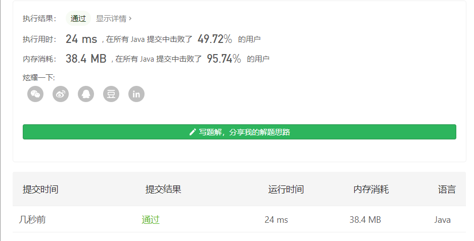

#### 368. 最大整除子集

链接：https://leetcode-cn.com/problems/largest-divisible-subset/

**由于存在「整除子集」中任意两个值必然存在倍数/约数关系的性质，我们自然会想到对 nums 进行排序，然后从集合 nums 中从大到小进行取数，每次取数只考虑当前决策的数是否与「整除子集」中的最后一个数成倍数关系即可。**

没啥想法，首先给数组排序。一开始的想法时，使用nums[i]与nums[i - 1]相除，如果能整除，则dp[i] = dp[i - 1] + 1，不能整除则抛弃nums[i]。一想还挺有道理的。

比如[1, 2, 4, 8]，最后出来的结果就是[1, 2, 4, 8]，和标准结果没差。

遍历到数字 1，此时「整除子集」为空，加到「整除子集」中；
遍历到数字 2，与「整除子集」的最后一个元素（1）成倍数关系，加到「整除子集」中；
遍历到数字 4，与「整除子集」的最后一个元素（2）成倍数关系，自然也与 2 之前的元素成倍数关系，加到「整除子集」中；
遍历到数字 8，与「整除子集」的最后一个元素（4）成倍数关系，自然也与 4 之前的元素成倍数关系，加到「整除子集」中。

**但这样的做法只能够确保得到「合法解」，无法确保得到的是「最长整除子集」**。

比如[9,18,54,90,108,180,360,540,720]，如果按照我们上述逻辑，我们得到的是 [9,18,54,108,540] 答案（长度为 5），但事实上存在更长的「整除子集」： [9,18,90,180,360,720]（长度为 6）。

**其本质是因为同一个数的不同倍数之间不存在必然的「倍数/约数关系」，而只存在「具有公约数」的性质，这会导致我们「模拟解法」错过最优解。**

比如54 & 90 和 18 存在倍数关系，但两者本身不存在倍数关系。

因此当我们决策到某一个数 nums[i] 时（nums 已排好序），我们无法直接将 nums[i] 直接接在符合「约数关系」的、最靠近位置 i 的数后面，**而是要检查位置 i 前面的所有符合「约数关系」的位置，找一个已经形成「整除子集」长度最大的数**。

**换句话说，当我们对 nums 排好序并从前往后处理时，在处理到 nums[i] 时，我们希望知道位置 i 之前的下标已经形成的「整除子集」长度是多少，然后从中选一个最长的「整除子集」，将 nums[i] 接在后面（前提是符合「倍数关系」）。**

基于以上分析，可以发现这是一个**序列dp问题**：某个状态的转移依赖于与前一个状态的关系。即 nums[i] 能否接在 nums[j] 后面，取决于是否满足 nums[i] % nums[j] == 0 条件。

定义dp[i]表示数组下标为i的最大整除子集长度。我们不失一般性的考虑任意位置 i，存在两种情况：

- 如果在 i 之前找不到符合条件 nums[i] % nums[j] == 0 的位置 j，那么 nums[i] 不能接在位置 i 之前的任何数的后面，只能自己独立作为「整除子集」的第一个数，此时状态转移方程为 f[i] =1；
- 如果在 i 之前能够找到符合条件的位置 j，则取所有符合条件的 f[j] 的最大值，代表如果希望找到以 nums[i] 为结尾的最长「整除子集」，需要将 nums[i] 接到符合条件的最长的 nums[j] 后面，此时状态转移方程为 f[i] = f[j] + 1。

同时由于我们需要输出具体方案，需要额外**使用 g[] 数组来记录每个状态是由哪个状态转移而来**。

定义 g[i]为记录 f[i] 是由哪个下标的状态转移而来，如果 f[i] = f[j] + 1, 则有 g[i] = j。

**对于求方案数的题目，多开一个数组来记录状态从何转移而来是最常见的手段。**

当我们求得所有的状态值之后，可以对 f[] 数组进行遍历，取得具体的最长「整除子集」长度和对应下标，然后使用 g[] 数组进行回溯，取得答案。

```java
class Solution {
    public List<Integer> largestDivisibleSubset(int[] nums) {
        Arrays.sort(nums);
        List<Integer> res = new ArrayList<>();
        int len = nums.length;
        // dp[i]表示任意下标位置的最大整除子集的长度
        int[] dp = new int[len];
        // 记录dp[i]是由哪个状态转移过来的
        int[] origin = new int[len];

        for (int i = 0; i < len; i++) {
            // 至少包含自身一个数，由自身转移而来
            int num = 1, prev = i;
            for (int j = 0; j < i; j++) {
                if ((nums[i] % nums[j] == 0) && (dp[j] + 1 > num)) {
                    prev = j;
                    num = dp[j] + 1;
                }
            }

            dp[i] = num;
            origin[i] = prev;
        }

        // 求出dp数组的最大值
        int max = -1, index = -1;
        for (int i = 0; i < len; i++) {
            if (dp[i] > max) {
                max = dp[i];
                index = i;
            }
        }

        while (max-- > 0) {
            res.add(nums[index]);
            index = origin[index];
        }

        return res;
    }
}
```

时间复杂度：O(n * n)，空间复杂度：O(n)

