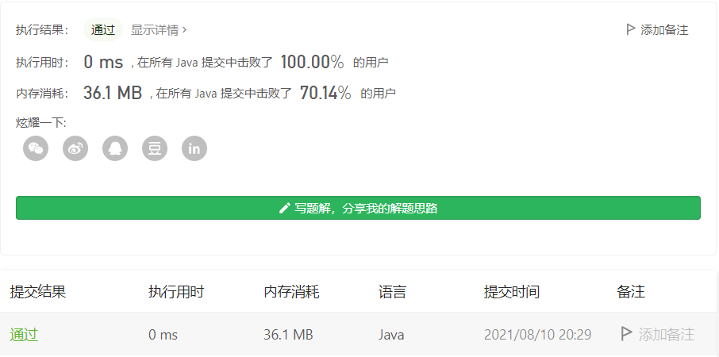

#### 413. 等差数列划分

#### 2021-08-10 LeetCode每日一题

链接：https://leetcode-cn.com/problems/arithmetic-slices/

标签：**数组、动态规划**

> 题目

如果一个数列 至少有三个元素 ，并且任意两个相邻元素之差相同，则称该数列为等差数列。

- 例如，[1,3,5,7,9]、[7,7,7,7] 和 [3,-1,-5,-9] 都是等差数列。

给你一个整数数组 nums ，返回数组 nums 中所有为等差数组的 子数组 个数。

子数组 是数组中的一个连续序列。

示例 1：

```java
输入：nums = [1,2,3,4]
输出：3
解释：nums 中有三个子等差数组：[1, 2, 3]、[2, 3, 4] 和 [1,2,3,4] 自身。
```

示例 2：

```java
输入：nums = [1]
输出：0
```


提示：

- 1 <= nums.length <= 5000
- -1000 <= nums[i] <= 1000

> 分析

**子数组是一个连续序列**。

- [1, 2, 3]是一个等差数列，此时count为1，数量sum为1。
- [1, 2, 3, 4]是一个等差数列，此时count为2，数量sum为3。[1, 2, 3]、[2, 3, 4]、[1, 2, 3, 4]
- [1, 2, 3, 4, 5]是一个等差数列，此时count为3，数量sum为6。
- [1, 2, 3, 4, 5, 6]是一个等差数列，此时count为4，数量sum为10。
- ......

首先数组元素个数必须3个以上，不然构成不了等差数列。其次通过上面的规律，我们可以写出状态转移方程，假设dp[i]表示前(i + 2)个元素可以组成等差数列的子数组的数量。可知dp[0] = 0，对于任意dp[i]，dp[i] = dp[i - 1] + count。其中i >= 1。

> 编码

```java
class Solution {
    public int numberOfArithmeticSlices(int[] nums) {
        int len = nums.length;
        if (len < 3) {
            return 0;
        }
        int[] dp = new int[len];
        int count = 0, sub = nums[1] - nums[0];
        for (int i = 2; i < len; i++) {
            int temp = nums[i] - nums[i - 1];
            if (temp == sub) {
                count++;
            } else {
                sub = temp;
                count = 0;
            }
            
            dp[i - 1] = dp[i - 2] + count;
        }

        return dp[len - 2];
    }
}
```

