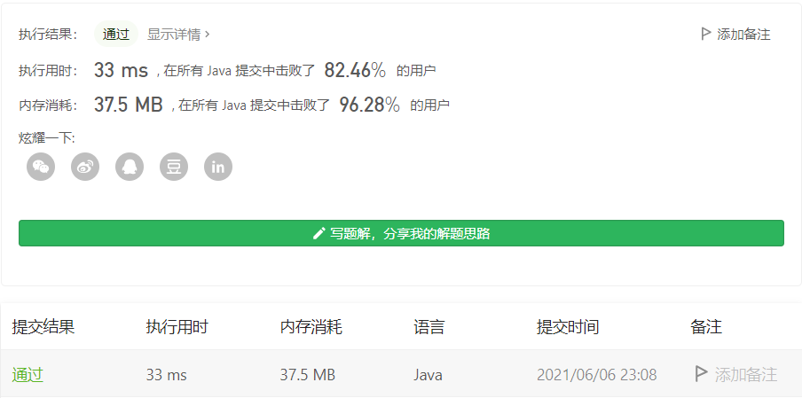

#### 474. 一和零

#### 2021-06-06 LeetCode每日一题

链接：https://leetcode-cn.com/problems/ones-and-zeroes/

标签：**动态规划、01背包问题**

> 题目

给你一个二进制字符串数组 strs 和两个整数 m 和 n 。

请你找出并返回 strs 的最大子集的大小，该子集中 最多 有 m 个 0 和 n 个 1 。

如果 x 的所有元素也是 y 的元素，集合 x 是集合 y 的 子集 。

```java
输入：strs = ["10", "0001", "111001", "1", "0"], m = 5, n = 3
输出：4
解释：最多有 5 个 0 和 3 个 1 的最大子集是 {"10","0001","1","0"} ，因此答案是 4 。
其他满足题意但较小的子集包括 {"0001","1"} 和 {"10","1","0"} 。{"111001"} 不满足题意，因为它含 4 个 1 ，大于 n 的值 3 。

输入：strs = ["10", "0", "1"], m = 1, n = 1
输出：2
解释：最大的子集是 {"0", "1"} ，所以答案是 2 。
    
1 <= strs.length <= 600
1 <= strs[i].length <= 100
strs[i] 仅由 '0' 和 '1' 组成
1 <= m, n <= 100
```

> 分析

思路：把总共的 0 和 1 的个数视为背包的容量，每一个字符串视为装进背包的物品。这道题就可以使用 0-1 背包问题的思路完成，这里的目标值是能放进背包的字符串的数量。

动态规划的思路是：物品一个一个尝试，容量一点一点尝试，每个物品分类讨论的标准是：选与不选。

**定义状态**：尝试题目问啥，就把啥定义成状态。dp[i] [j] [k] 表示输入字符串在子区间 [0, i] 能够使用 j 个 0 和 k 个 1 的字符串的最大数量。

**状态转移方程**：

- dp[i] [j] [k] = dp[i - 1] [j] [k]    不选择当前的字符串
- dp[i] [j] [k] = dp[i - 1] [j - 当前字符串包含0的个数] [k - 当前字符串包含1的个数]     选择当前字符串

**初始化**：为了避免分类讨论，通常多设置一行。这里可以认为，第 0 个字符串是空串。第 0 行默认初始化为 0。

**输出**：输出是最后一个状态，即：dp[len] [m] [n]。

> 编码

```java
class Solution {
    public int findMaxForm(String[] strs, int m, int n) {
        int len = strs.length;
        // dp[i][j][k]表示前i个字符能使用j个0和k个1时，最大子集的大小
        int[][][] dp = new int[len + 1][m + 1][n + 1];

        for (int i = 1; i <= len; i++) {
            int[] res = getZeroAndOne(strs[i - 1]);
            for (int j = 0; j <= m; j++) {
                for (int k = 0; k <= n; k++) {
                    int zero = res[0];
                    int one = res[1];
                    if (j >= zero && k >= one) {
                        dp[i][j][k] = Math.max(dp[i - 1][j][k], dp[i - 1][j - zero][k - one] + 1);
                    } else {
                        dp[i][j][k] = dp[i - 1][j][k];
                    }
                }
            }
        }

        return dp[len][m][n];
    }

    // 计算字符串str中0和1的个数
    private int[] getZeroAndOne(String str) {
        int[] res = new int[2];
        for (char c : str.toCharArray()) {
            res[c - '0']++;
        }

        return res;
    }
}
```


因为当前行只参考了上一行的值，因此可以使用「滚动数组」，也可以「从后向前赋值」。

这里选用「从后向前赋值」

```java
public class Solution {
    public int findMaxForm(String[] strs, int m, int n) {
        int[][] dp = new int[m + 1][n + 1];
        dp[0][0] = 0;
        for (String s : strs) {
            int[] res = getZeroAndOne(s);
            int zero = res[0];
            int one = res[1];
            // 倒序
            for (int i = m; i >= zero; i--) {
                for (int j = n; j >= one; j--) {
                    dp[i][j] = Math.max(dp[i][j], dp[i - zero][j - one] + 1);
                }
            }
        }
        return dp[m][n];
    }

    // 计算字符串str中0和1的个数
    private int[] getZeroAndOne(String str) {
        int[] res = new int[2];
        for (char c : str.toCharArray()) {
            res[c - '0']++;
        }

        return res;
    }
}
```

