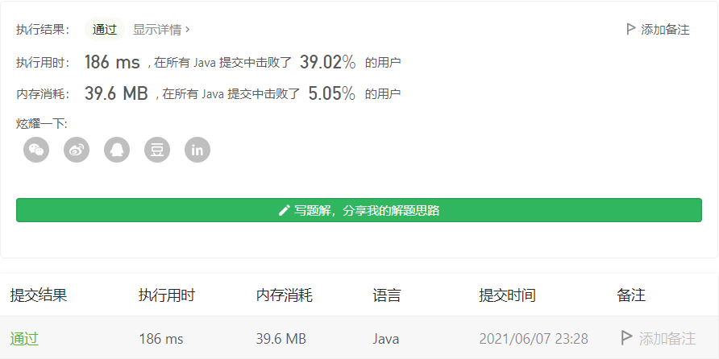

#### 494. 目标和

#### 2021-06-07 LeetCode每日一题

链接：https://leetcode-cn.com/problems/target-sum/

标签：**动态规划、深度优先搜索、广度优先搜索**

> 题目

给你一个整数数组 nums 和一个整数 target 。

向数组中的每个整数前添加 '+' 或 '-' ，然后串联起所有整数，可以构造一个 表达式 ：

例如，nums = [2, 1] ，可以在 2 之前添加 '+' ，在 1 之前添加 '-' ，然后串联起来得到表达式 "+2-1" 。
返回可以通过上述方法构造的、运算结果等于 target 的不同 表达式 的数目。

```java
输入：nums = [1,1,1,1,1], target = 3
输出：5
解释：一共有 5 种方法让最终目标和为 3 。
-1 + 1 + 1 + 1 + 1 = 3
+1 - 1 + 1 + 1 + 1 = 3
+1 + 1 - 1 + 1 + 1 = 3
+1 + 1 + 1 - 1 + 1 = 3
+1 + 1 + 1 + 1 - 1 = 3

输入：nums = [1], target = 1
输出：1
    
1 <= nums.length <= 20
0 <= nums[i] <= 1000
0 <= sum(nums[i]) <= 1000
-1000 <= target <= 100
```

> 分析

（1）这题我想着用bfs应该也能做的，没想到第71/138个用例的时候就挂了，实在没想到还有哪里可以优化（计算过程中重复的值可以不用记录，避免重复计算，但需要记下出现了几次），但这里数据结构使用的是队列，无法记录出现的次数，无奈放弃。

换个map竟然能过，服了。。虽然使用了不同的数据结构，但思路也跟bfs一样。队列是每层用完之后，都会把元素清掉，存入新的元素，但插入和删除费时；map是元素每一层的结果都存着，但相对比较省时。

（2）使用dfs

（3）转化为01背包问题，使用dp求解

> 编码

bfs使用队列超时版

```java
class Solution {
    public int findTargetSumWays(int[] nums, int target) {
        int len = nums.length, res = 0;
        if (len == 1) {
            if (nums[0] == target) {
                res++;
            }
            if (-nums[0] == target) {
                res++;
            }
            return res;
        }

        Queue<Integer> queue = new LinkedList<>();
        queue.offer(nums[0]);
        queue.offer(-nums[0]);
        int count = 1;

        while(count < len) {
            int size = queue.size();
            int index = 0;
            while (index++ < size) {
                Integer value = queue.poll();
                // 最后一个数，不存进队列里，直接判断
                if (count == len - 1) {
                    if (value + nums[count] == target) {
                        res++;
                    }

                    if (value - nums[count] == target) {
                        res++;
                    }
                } else {
                    queue.offer(value + nums[count]);
                    queue.offer(value - nums[count]);
                }
            }
            count++;
        }

        return res;
    }
}
```

bfs使用Map

```java
class Solution {
    public int findTargetSumWays(int[] nums, int target) {
        int len = nums.length;
        Map<Integer, Integer>[] maps = new Map[len];
        for (int i = 0; i < len; i++) {
            // maps[i]key存放计算的值，value存放该值出现的次数，防止重复计算
            maps[i] = new HashMap<>();
        }
        maps[0].put(nums[0], 1);
        maps[0].put(-nums[0], maps[0].getOrDefault(-nums[0], 0) + 1);

        for (int i = 1; i < len; i++) {
            Set<Map.Entry<Integer, Integer>> entries = maps[i - 1].entrySet();
            for (Map.Entry<Integer, Integer> entry : entries) {
                Integer key = entry.getKey();
                Integer value = entry.getValue();
                maps[i].put(key + nums[i], maps[i].getOrDefault(key + nums[i], 0) + value);
                maps[i].put(key - nums[i], maps[i].getOrDefault(key - nums[i], 0) + value);
            } 
        }

        return maps[len - 1].getOrDefault(target, 0);
    }
}
```


dfs：

```java
class Solution {
    int count = 0;
    public int findTargetSumWays(int[] nums, int target) {
        dfs(nums, target, 0);
        return count;
    }

    private void dfs(int[] nums, int target, int index) {
        if (index == nums.length) {
           count += (target == 0 ? 1 : 0);
           return;
        }

        dfs(nums, target + nums[index], index + 1);
        dfs(nums, target - nums[index], index + 1);
    }
}
```


dfs + 记忆化搜索

```java
class Solution {
    Map<String, Integer> map = new HashMap<>();
    public int findTargetSumWays(int[] nums, int target) {
        return dfs(nums, target, 0);
    }

    private int dfs(int[] nums, int target, int index) {
        String key = index + "_" + target;
        if (map.containsKey(key)) {
            return map.get(key);
        }
        if (index == nums.length) {
           map.put(key, target == 0 ? 1 : 0);
           return map.get(key);
        }

        int left = dfs(nums, target + nums[index], index + 1);
        int right = dfs(nums, target - nums[index], index + 1);
        map.put(key, left + right);
        return map.get(key);
    }
}
```

