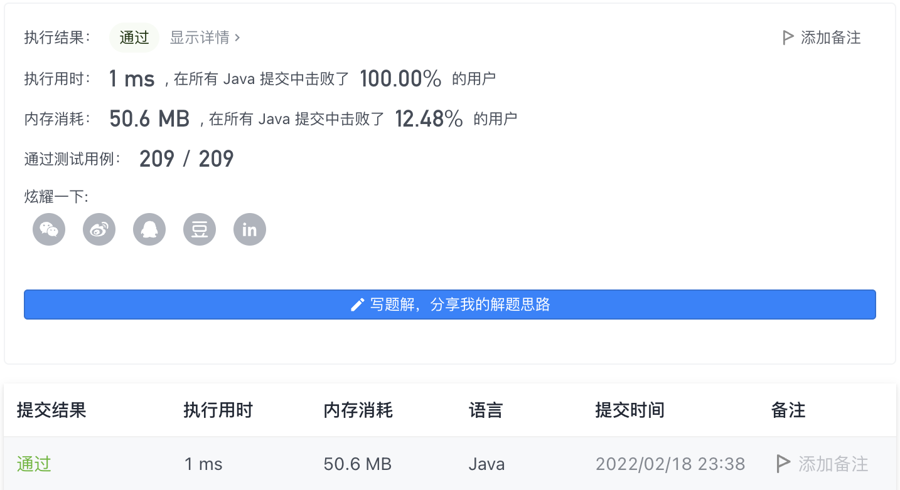
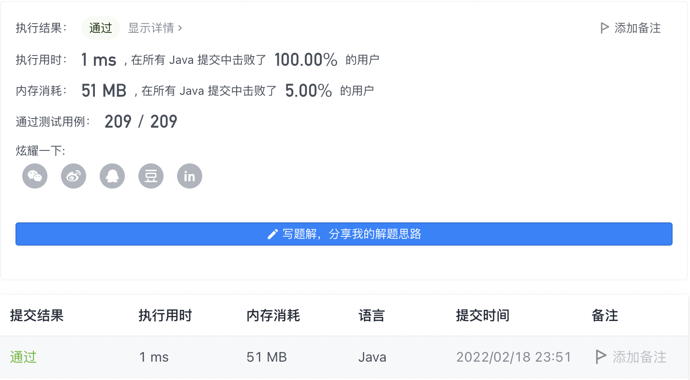

#### 53. 最大子数组和

链接：https://leetcode-cn.com/problems/maximum-subarray/

标签：**数组、分治、动态规划**

> 题目

给你一个整数数组 nums ，请你找出一个具有最大和的连续子数组（子数组最少包含一个元素），返回其最大和。

子数组 是数组中的一个连续部分。

示例 1：

```java
输入：nums = [-2,1,-3,4,-1,2,1,-5,4]
输出：6
解释：连续子数组 [4,-1,2,1] 的和最大，为 6 。
```

示例 2：

```java
输入：nums = [1]
输出：1
```

示例 3：

```java
输入：nums = [5,4,-1,7,8]
输出：23
```

提示

- 1 <= nums.length <= 10 ^ 5
- -104 <= nums[i] <= 10 ^ 4


进阶：如果你已经实现复杂度为 O(n) 的解法，尝试使用更为精妙的 分治法 求解

> 分析

解法1：循环遍历，使用一个变量sum记录累加和，如果比当前最大和max大，则max = sum。如果累加和sum <= 0，则sum = 0重新开始累加。

解法2：使用动态规划求解。定义dp[i]表示**以nums[i]结尾的连续子数组的最大和**。如果nums[i]都为正数，那么dp[i] = d[i - 1] + nums[i]。这里因为nums[i]可能为负数，所以分类讨论

- 当dp[i - 1] > 0时，dp[i] = dp[i - 1] + nums[i]。因为一个数num加上一个正数肯定要大于num。
- 当dp[i - 1] <= 0时，dp[i] = nums[i]。从nums[i]开始

> 编码

解法1:

```java
class Solution {
    public int maxSubArray(int[] nums) {
        int ans = Integer.MIN_VALUE;
        int sum = 0;
        for (int num : nums) {
            sum += num;
            if (sum > ans) {
                ans = sum;
            }

            if (sum <= 0) {
                sum = 0;
            }
        }

        return ans;
    }
}
```



解法2:

```java
class Solution {
    public int maxSubArray(int[] nums) {
        int ans = nums[0];
        int[] dp = new int[nums.length];
        dp[0] = nums[0];

        for (int i = 1; i < nums.length; i++) {
            if (dp[i - 1] > 0) {
                dp[i] = dp[i - 1] + nums[i];
            } else {
                dp[i] = nums[i];
            }

            ans = Math.max(ans, dp[i]);
        }

        return ans;
    }
}
```

