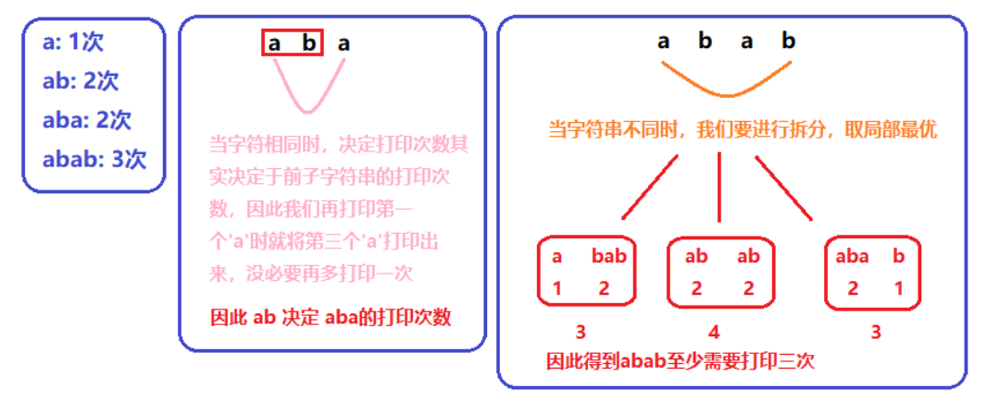

#### 664. 奇怪的打印机

#### 2021-05-24 LeetCode每日一题

链接：https://leetcode-cn.com/problems/strange-printer/

标签：**动态规划**

> 题目

有台奇怪的打印机有以下两个特殊要求：

- 打印机每次只能打印由 同一个字符 组成的序列。
- 每次可以在任意起始和结束位置打印新字符，并且会覆盖掉原来已有的字符。

给你一个字符串 s ，你的任务是计算这个打印机打印它需要的最少打印次数。

```java
输入：s = "aaabbb"
输出：2
解释：首先打印 "aaa" 然后打印 "bbb"。
    
输入：s = "aba"
输出：2
解释：首先打印 "aaa" 然后在第二个位置打印 "b" 覆盖掉原来的字符 'a'。
    
1 <= s.length <= 100
s 由小写英文字母组成
```

> 分析

这题使用动态规划求解。

##### 缩小问题规模

对于以下情况的打印次数:

- 只有一个字符a: 一次(最基本的情况)
- 打印两个字符ab: 打印两次. 在1的基础上多打印一次
- 打印aba: 还是两次, 同2的打印方式相同, 但需要在打印第一个a时将第三个a也打印出来
- 打印abab: 三次, 有多种打印方式, 可以在打印aba的基础上再打印b,或者在打印bab的基础上再打印a. 无论那种方式,最少也需要三次才能打印出来.

通过以上的事实我们得到两点：

- 我们知道当区间的两边字符相同时(aba), 它的打印次数可以从它的更小一层的子区间的打印次数而来
- 当区间两边字符不同时(abab)，它的打印次数会取其子区间中的最优解，这一部分我们需要枚举所有的可能性



由以上的思路我们知道本题可以使用自低向上的动态规划解法。我们首先要定义对于dp[i] [j]的含义。**dp[i] [j]代表的是字符串在区间[i,j]中需要最少的打印次数**。

1、打印一个字符串的次数为1，因此dp[i] [i] = 1
2、当字符串长度大于等于2时，判断是否两边区间字符相等s[i] == s[j]?

- 如果相等，打印次数可以从子区间的打印次数转移而来dp[i] [j] = dp[i] [j-1];。例如aba的打印次数由ab的打印次数决定。
- 如果不相等，则枚举所有的可能组合，然后取其最优解。

dp[i] [j]的计算需要用到dp[i] [k]和dp[k +1] [j]，所以对于i需要从大到小遍历，j要从小到大遍历，这样可以保证在计算dp[i] [j]的时候，dp[i] [k]和dp[k +1] [j]的值都已经计算。

> 编码

```java
class Solution {
    public int strangePrinter(String s) {
        int n = s.length();
        int[][] dp = new int[n][n];
        for (int i = n - 1; i >= 0; --i) {
            dp[i][i] = 1;
            for (int j = i + 1; j < n; j++) {
                if (s.charAt(i) == s.charAt(j)) {
                    dp[i][j] = dp[i][j - 1];
                } else {
                    int min = Integer.MAX_VALUE;
                    for (int m = i; m < j; m++) {
                        min = Math.min(min, dp[i][m] + dp[m + 1][j]);
                    }
                    dp[i][j] = min;
                }
            }
        }

        return dp[0][n - 1];
    }
}
```

