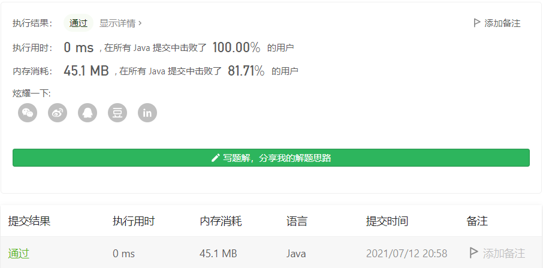

#### 275. H 指数 II

#### 2021-07-12 LeetCode每日一题

链接：https://leetcode-cn.com/problems/h-index-ii/

标签：**数组、二分查找**

> 题目

给定一位研究者论文被引用次数的数组（被引用次数是非负整数），数组已经按照 升序排列 。编写一个方法，计算出研究者的 h 指数。

h 指数的定义: “h 代表“高引用次数”（high citations），一名科研人员的 h 指数是指他（她）的 （N 篇论文中）总共有 h 篇论文分别被引用了至少 h 次。（其余的 N - h 篇论文每篇被引用次数不多于 h 次。）"

示例:

```java
输入: citations = [0,1,3,5,6]
输出: 3 
解释: 给定数组表示研究者总共有 5 篇论文，每篇论文相应的被引用了 0, 1, 3, 5, 6 次。
     由于研究者有 3 篇论文每篇至少被引用了 3 次，其余两篇论文每篇被引用不多于 3 次，所以她的 h 指数是 3。
```

说明：如果 h 有多有种可能的值 ，h 指数是其中最大的那个。

进阶：

- 这是 H 指数 的延伸题目，本题中的 citations 数组是保证有序的。
- 你可以优化你的算法到对数时间复杂度吗？

> 分析

其实“h指数”可以转换为，在某个位置的这个数不小于它所在的下标，求符合这个条件的数的最大个数。因为题目给定的数组有序，所以我们可以直接使用二分查找解决。

> 编码

```java
class Solution {
    public int hIndex(int[] citations) {
        int len = citations.length, max = 0;
        int left = 0, right = len - 1;
        while (left <= right) {
            int mid = left + (right - left) / 2;
            // 说明左边的都不符合，找右边的
            if (citations[mid] < (len - mid)) {
                left = mid + 1;
            } else {
                // [mid, right]之间的数都符合
                max += (right - mid + 1);
                right = mid - 1;
            }
        }

        return max;
    }
}
```

