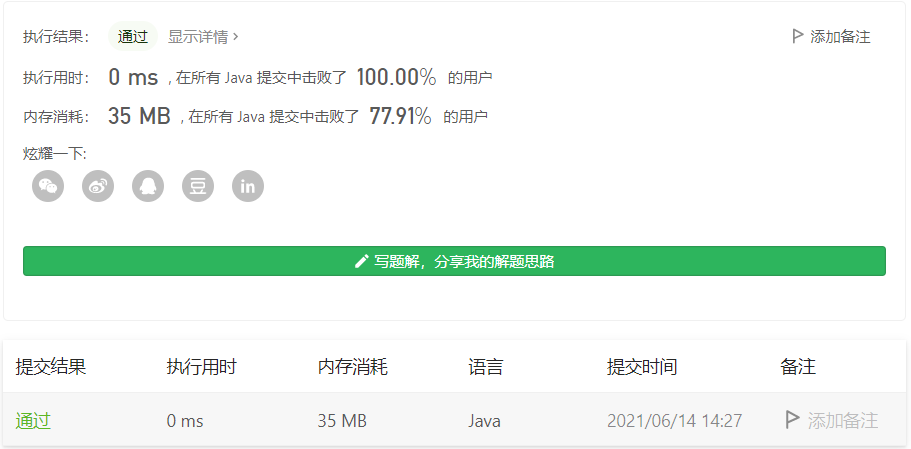

#### 374. 猜数字大小

#### 2021-06-14 LeetCode每日一题

链接：https://leetcode-cn.com/problems/guess-number-higher-or-lower/

标签：**二分查找**

> 题目

猜数字游戏的规则如下：

每轮游戏，我都会从 1 到 n 随机选择一个数字。 请你猜选出的是哪个数字。
如果你猜错了，我会告诉你，你猜测的数字比我选出的数字是大了还是小了。
你可以通过调用一个预先定义好的接口 int guess(int num) 来获取猜测结果，返回值一共有 3 种可能的情况（-1，1 或 0）：

-1：我选出的数字比你猜的数字小 pick < num
1：我选出的数字比你猜的数字大 pick > num
0：我选出的数字和你猜的数字一样。恭喜！你猜对了！pick == num
返回我选出的数字。

```java
输入：n = 10, pick = 6
输出：6
    
输入：n = 1, pick = 1
输出：1
  
输入：n = 2, pick = 1
输出：1
    
输入：n = 2, pick = 2
输出：2
    
1 <= n <= 231 - 1
1 <= pick <= n
```

> 分析

官方比较贴心，知道这两天过端午，来两道简单的二分查找让大家开心的过节。


> 编码

```java
/** 
 * Forward declaration of guess API.
 * @param  num   your guess
 * @return 	     -1 if num is lower than the guess number
 *			      1 if num is higher than the guess number
 *               otherwise return 0
 * int guess(int num);
 */

public class Solution extends GuessGame {
    public int guessNumber(int n) {
        int left = 1, right = n;
        while (left <= right) {
            int mid = left + (right - left) / 2;
            if (guess(mid) == 0) {
                return mid;
            } else if (guess(mid) == -1) {
                right = mid - 1;
            } else if (guess(mid) == 1) {
                left = mid + 1;
            }
        }

        return -1;
    }
}
```

