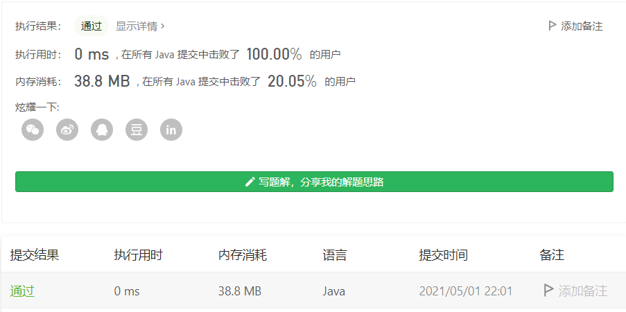

#### 540. 有序数组中的单一元素

链接：https://leetcode-cn.com/problems/single-element-in-a-sorted-array/

此题和https://leetcode-cn.com/problems/single-number/类似，但此题中的数组是有序的，并且题目要求O(log n)时间复杂度和 O(1)空间复杂度。

所以自然而然的想到使用二分来做。

```java
class Solution {
    public int singleNonDuplicate(int[] nums) {
        int left = 0, right = nums.length - 1;
        while (left < right) {
            int mid = left + (right - left) / 2;
            if (nums[mid] == nums[mid + 1]) {
                // [mid + 1, right]个数为偶数，则说明唯一的数存在mid右边
                if ((right - mid) % 2 == 0) {
                    left = mid + 2;
                } else {
                    right = mid - 1;
                }
            } else if (nums[mid] == nums[mid - 1]) {
                // [left, mid]个数为偶数，则说明唯一的数存在mid左边
                if ((mid - left) % 2 == 0) {
                    right = mid - 2;
                } else {
                    left = mid + 1;
                }
            } else {
                return nums[mid];
            }
        }

        return nums[right];
    }
}
```

